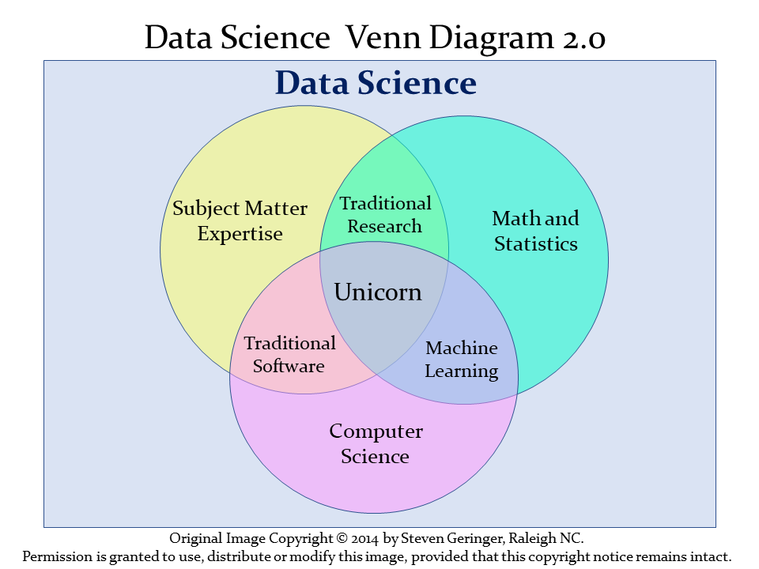
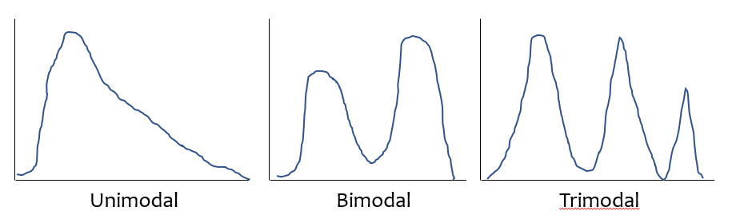
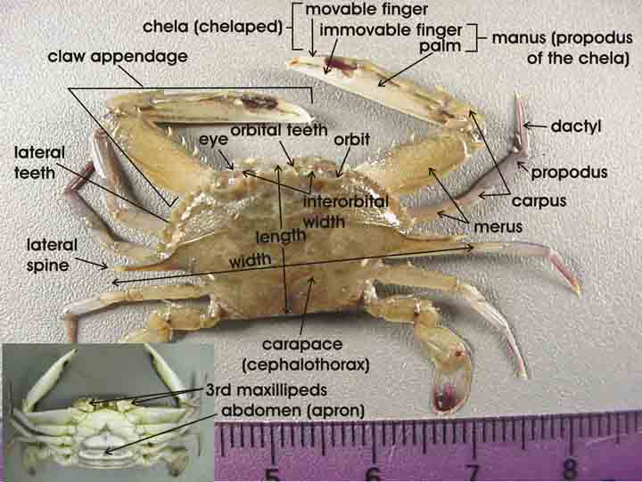

--- 
title: "Data Science for Biological, Medical and Health Research: Notes for PQHS/CRSP/MPHP 431"
author: "Thomas E. Love"
date: "`r Sys.Date()`"
site: bookdown::bookdown_site
output: bookdown::gitbook
documentclass: book
bibliography: [book.bib, packages.bib]
biblio-style: apalike
link-citations: yes
github-repo: thomaselove/431-book
description: "This book describes some fundamental approaches to doing biostatistical and data science in research."
---

# Working with These Notes {-}

1. This document is broken down into multiple chapters. Use the table of contents on the left side of the screen to navigate, and use the hamburger icon (horizontal bars) at the top of the document to open or close the table of contents.
2. At the top of the document, you'll see additional icons which you can click to
    - search the document,
    - change the size, font or color scheme of the page, and
    - download a PDF or EPUB (Kindle-readable) version of the entire document.
3. The document will be updated (unpredictably) throughout the semester.

## The 431 Course online {-}

The **main web page** for the 431 course in Fall 2020 is https://thomaselove.github.io/431/. Go there for all information related to the course.

```{r iconlogo-fig, echo = FALSE, fig.align = "center", out.width = '80%'}
knitr::include_graphics("figures/431_foot2.PNG")
```

## What You'll Find Here {-}

These Notes provide a series of examples using R to work through issues that are likely to come up in PQHS/CRSP/MPHP 431. What you will mostly find are brief explanations of a key idea or summary, accompanied (most of the time) by R code and a demonstration of the results of applying that code. 

While these Notes share some of the features of a textbook, they are neither comprehensive nor completely original. The main purpose is to give 431 students a set of common materials on which to draw during the course. In class, we will sometimes:

- reiterate points made in this document, 
- amplify what is here,
- simplify the presentation of things done here,
- use new examples to show some of the same techniques,
- refer to issues not mentioned in this document,

but what we don't do is follow these notes very precisely. We assume instead that you will read the materials and try to learn from them, just as you will attend classes and try to learn from them. We welcome feedback of all kinds on this document or anything else.

Everything you see here is available to you as HTML or PDF. You will also have access to the R Markdown files, which contain the code which generates everything in the document, including all of the R results. We will demonstrate the use of R Markdown (this document is generated with the additional help of an R package called `bookdown`) and RStudio (the "program" we use to interface with the R language) in class. 

All data and R code related to these notes are also available to you.

## Setting Up R {-}

These Notes make extensive use of 

- the statistical software language R, and
- the development environment R Studio,

both of which are free, and you'll need to install them on your machine. Instructions for doing so are in found in the course syllabus.

If you need an even gentler introduction, or if you're just new to R and RStudio and need to learn about them, we encourage you to take a look at http://moderndive.com/, which provides an introduction to statistical and data sciences via R at @ModernDive.

These notes were written using R Markdown. R Markdown, like R and R Studio, is free and open source.

R Markdown is described as an *authoring framework* for data science, which lets you

- save and execute R code
- generate high-quality reports that can be shared with an audience

This description comes from http://rmarkdown.rstudio.com/lesson-1.html which you can visit to get an overview and quick tour of what's possible with R Markdown.

Another excellent resource to learn more about R Markdown tools is the Communicate section (especially the R Markdown chapter) of @R4DS.

## Initial Setup of R Packages {-}

To start, I'll present a series of commands I run at the beginning of these Notes. These particular commands set up the output so it will look nice as either an HTML or PDF file, and also set up R to use several packages (libraries) of functions that expand its capabilities. A chunk of code like this will occur near the top of any R Markdown work.

```{r setup, message=FALSE}
knitr::opts_chunk$set(comment = NA)

library(knitr)
library(magrittr)
library(janitor)
library(NHANES)
library(palmerpenguins)
library(patchwork)
library(rms)
library(mosaic)
library(Epi)
library(tidymodels) # note: tidymodels includes the broom package
library(tidyverse) # note: tidyverse includes the dplyr and ggplot2 packages

theme_set(theme_bw())
```

I have deliberately set up this list of loaded packages to be relatively small, and will add some others later in these Notes. You only need to install a package once, but you need to reload it every time you start a new session.

## The `Love-boost.R` script {-}

Starting in October, we'll make use of a few scripts I've gathered for you.

```{r}
source("data/Love-boost.R")
```

## Additional R Packages installed for this book {-}

Some packages need to be installed on the user's system, but do not need to be loaded by R in order to run the code presented in this set of notes until later. These additional packages include the following.

```
boot
car
GGally
gt
psych
modelsummary
naniar
visdat
```


<!--chapter:end:index.Rmd-->

# Data Science 

The definition of **data science** can be a little slippery. One current view of data science, is exemplified by Steven Geringer's 2014 Venn diagram.

```{r datasci-fig, echo = FALSE, out.width = '80%', fig.cap = "Data Science Venn Diagram from Steven Geringer"}

```

- The field encompasses ideas from mathematics and statistics and from computer science, but with a heavy reliance on subject-matter knowledge. In our case, this includes clinical, health-related, medical or biological knowledge. 
- As @Gelman-Nolan suggest, the experience and intuition necessary for good statistical practice are hard to obtain, and teaching data science provides an excellent opportunity to reinforce statistical thinking skills across the full cycle of a data analysis project.
- The principal form in which computer science (coding/programming) play a role in this course is to provide a form of communication. You'll need to learn how to express your ideas not just orally and in writing, but also through your code.

Data Science is a **team** activity. Everyone working in data science brings some part of the necessary skillset, but no one person can cover all three areas alone for excellent projects.  

> [The individual who is truly expert in all three key areas (mathematics/statistics, computer science and subject-matter knowledge) is] a mythical beast with magical powers who's rumored to exist but is never actually seen in the wild.
> 
> http://www.kdnuggets.com/2016/10/battle-data-science-venn-diagrams.html

## Data Science Project Cycle

A typical data science project can be modeled as follows, which comes from the introduction to the amazing book **R for Data Science**, by Garrett Grolemund and Hadley Wickham, which is a key text for this course [@R4DS].

```{r cycle-fig, echo = FALSE, out.width='95%', fig.cap = "Source: R for Data Science: Introduction"}
knitr::include_graphics("figures/data-science-cycle.png")
```

This diagram is sometimes referred to as the Krebs Cycle of Data Science. For more on the steps of a data science project, we encourage you to read the Introduction of @R4DS.

## Data Science and the 431 Course

We'll discuss each of these elements in the 431 course, focusing at the start on understanding our data through transformation, modeling and (especially in the early stages) visualization. In 431, we learn how to get things done. 

- We get people working with R and R Studio and R Markdown, even if they are completely new to coding. A gentle introduction is provided at @ModernDive
- We learn how to use the `tidyverse` (http://www.tidyverse.org/), an array of tools in R (mostly developed by Hadley Wickham and his colleagues at R Studio) which share an underlying philosophy to make data science faster, easier, more reproducible and more fun. A critical text for understanding the tidyverse is @R4DS. Tidyverse tools facilitate:
    + **importing** data into R, which can be the source of intense pain for some things, but is really quite easy 95% of the time with the right tool.
    + **tidying** data, that is, storing it in a format that includes one row per observation and one column per variable. This is harder, and more important, than you might think.
    + **transforming** data, perhaps by identifying specific subgroups of interest, creating new variables based on existing ones, or calculating summaries.
    + **visualizing** data to generate actual knowledge and identify questions about the data - this is an area where R really shines, and we'll start with it in class.
    + **modeling** data, taking the approach that modeling is complementary to visualization, and allows us to answer questions that visualization helps us identify.
    + and last, but definitely not least, **communicating** results, models and visualizations to others, in a way that is reproducible and effective.
- Some programming/coding is an inevitable requirement to accomplish all of these aims. If you are leery of coding, you'll need to get past that, with the help of this course and our stellar teaching assistants. Getting started is always the most challenging part, but our experience is that most of the pain of developing these new skills evaporates by early October.

## What The Course Is and Isn't

The 431 course is about **getting things done**. In developing this course, we adopt a modern approach that places data at the center of our work. Our goal is to teach you how to do truly reproducible research with modern tools. We want you to be able to collect and use data effectively to address questions of interest.

The curriculum includes more on several topics than you might expect from a standard graduate introduction to biostatistics.

- data gathering
- data wrangling
- exploratory data analysis and visualization
- multivariate modeling
- communication

It also nearly completely avoids formalism and is extremely applied - this is absolutely **not** a course in theoretical or mathematical statistics, and these Notes reflect that approach.

There's very little of the mathematical underpinnings here:

$$
f(x) = \frac{e^{-(x - \mu)^{2}/(2\sigma^{2})}}{\sigma{\sqrt{2 \pi }}} 
$$

Instead, these notes (and the course) focus on how we get R to do the things we want to do, and how we interpret the results of our work. Our next Chapter provides a first example.


<!--chapter:end:01-datascience.Rmd-->

# (PART\*) Part A. Exploring Data {-}

# Looking at the Palmer Penguins

The data in the `palmerpenguins` package in R include size measurements, clutch observations, and blood isotope ratios for adult foraging Adélie, Chinstrap, and Gentoo penguins observed on islands in the Palmer Archipelago near Palmer Station, Antarctica. The data were collected and made available by Dr. Kristen Gorman and the Palmer Station Long Term Ecological Research (LTER) Program.  

For more on the `palmerpenguins` package, visit https://allisonhorst.github.io/palmerpenguins/.

## Package Loading, then Dealing with Missing Data

To start, let's load up the necessary R packages to manage the data and summarize it in a small table, and a plot. We've actually done this previously, but we'll repeat the steps here, because it's worth seeing what R is doing.

In this case, we'll load up five packages.

```{r, message = FALSE}
library(palmerpenguins)  # source for the data set
library(janitor)         # some utilities for cleanup and simple tables
library(magrittr)        # provides us with the pipe %>% for code management
library(dplyr)           # part of the tidyverse: data management tools
library(ggplot2)         # part of the tidyverse: tools for plotting data
```

It's worth remembering that everything after the `#` on each line above is just a comment for the reader, and is ignored by R. We'll see later that the loading of a single package (called `tidyverse`) gives us both the `dplyr` and `ggplot2` packages, as well as several other useful things.

Next, let's take the `penguins` data from the `palmerpenguins` package, and identify those observations which have complete data (so, no missing values) in four variables of interest. We'll store that result in a new data frame (think of this as a data set) called `new_penguins` and then take a look at that result using the following code.

```{r}
new_penguins <- penguins %>%
    filter(complete.cases(flipper_length_mm, body_mass_g, species, sex))

new_penguins
```

## Counting Things and Making Tables

So, how many penguins are in our `new_penguins` data? When we printed out the result, we got an answer, but (as with many things in R) there are many ways to get the same result.

```{r}
nrow(new_penguins)
```

How do our `new_penguins` data break down by sex and species?

```{r}
new_penguins %>% 
    tabyl(sex, species) # tabyl comes from the janitor package
```

Note the strange spelling of `tabyl` here. The output is reasonably clear, but could we make that table a little prettier, and while we're at it, can we add the row and column totals to it?

```{r}
new_penguins %>% 
    tabyl(sex, species) %>%
    adorn_totals(where = c("row", "col")) %>% # add row, column totals
    kable  # one convenient way to make the table prettier
```

## Visualizing the Data in a Graph (or a few...)

Now, let's look at the other two variables of interest. Let's create a graph showing the association of body mass with flipper length across the complete set of `r nrow(new_penguins)` penguins.

```{r}
ggplot(new_penguins, aes(x = body_mass_g, y = flipper_length_mm)) +
    geom_point() 
```

Some of you may want to include a straight-line model (fit by a classical linear regression) to this plot. One way to do that in R involves the addition of a single line of code, like this:

```{r, message = FALSE}
ggplot(new_penguins, aes(x = body_mass_g, y = flipper_length_mm)) +
    geom_point() +
    geom_smooth(method = "lm", col = "red", se = FALSE)
```

Whenever we build a graph for ourselves, these default choices may be sufficient. But I'd like to see a prettier version if I was going to show it to someone else. So, I might use a different color for each species, and I might neaten up the theme (to get rid of the default grey background) and add a title, like this.

```{r}
ggplot(new_penguins, aes(x = body_mass_g, y = flipper_length_mm, col = species)) +
    geom_point() + 
    theme_bw() + 
    labs(title = "Flipper Length and Body Mass for 333 of the Palmer Penguins")
```

## Six Ways To "Improve" This Graph

Now, let's build a new graph. Here, I want to:

1. plot the relationship between body mass and flipper length in light of both Sex and Species
2. increase the size of the points and add a little transparency so we can see if points overlap, 
3. add some smooth curves to summarize the relationships between the two quantities (body mass and flipper length) within each combination of species and sex,
4. split the graph into two "facets" (one for each sex),
5. improve the axis labels,
6. improve the titles by adding a subtitle, and also adding in some code to count the penguins (rather than hard-coding in the total number.)

```{r, message = FALSE}
ggplot(new_penguins, aes(x = body_mass_g, y = flipper_length_mm, 
                         col = species)) +
    geom_point(size = 2, alpha = 0.5) + 
    geom_smooth(method = "loess", se = FALSE, size = 1.5) +
    facet_grid(~ sex) +
    theme_bw() + 
    labs(title = "Flipper Length and Body Mass, by Sex & Species",
         subtitle = paste0(nrow(new_penguins), " of the Palmer Penguins"),
         x = "Body Mass (g)", 
         y = "Flipper Length (mm)")
```

## A Little Reflection

What can we learn from these plots and their construction? In particular, 

- What do these plots suggest about the center of the distribution of each quantity (body mass and flipper length) overall, and within each combination of Sex and Species?
- What does the final plot suggest about the spread of the distribution of each of those quantities in each combination of Sex and Species?
- What do the plots suggest about the association of body mass and flipper length across the complete set of penguins? 
- How does the shape and nature of this body mass - flipper length relationship change based on Sex and Species?
- Do you think it would be helpful to plot a straight-line relationship (rather than a smooth curve) within each combination of Sex and Species in the final plot? Why or why not? (Also, what would we have to do to the code to accomplish this?)
- How was the R code for the plot revised to accomplish each of the six "wants" specified above?


<!--chapter:end:02-penguins.Rmd-->

# NHANES: Initial Exploring {#dataviz} 

We'll start by visualizing some data from the US National Health and Nutrition Examination Survey, or NHANES. We'll display R code as we go, but we'll return to all of the key coding ideas involved later in the Notes.

## The NHANES data: Collecting a Sample

To begin, we'll gather a random sample of 1,000 subjects participating in NHANES, and then identify several variables of interest about those subjects^[For more on the NHANES data available in the NHANES package, type ?NHANES in the Console in R Studio.]. Some of the motivation for this example came from a Figure in @BaumerKaplanHorton.

```{r create_nh_dat1}
# library(NHANES) # already loaded NHANES package/library of functions, data

set.seed(431001) 
# use set.seed to ensure that we all get the same random sample 
# of 1,000 NHANES subjects in our nh_data collection

nh_dat1 <- sample_n(NHANES, size = 1000) %>%
    select(ID, Gender, Age, Height) 

nh_dat1
```

We have `r nrow(nh_dat1)` rows (observations) and `r ncol(nh_dat1)` columns (variables) that describe the subjects listed in the rows. 

## Age and Height

Suppose we want to visualize the relationship of Height and Age in our 1,000 NHANES observations. The best choice is likely to be a scatterplot.

```{r nh_dat1_heightbyage1-fig}
ggplot(data = nh_dat1, aes(x = Age, y = Height)) +
    geom_point()
```

We note several interesting results here.

1. As a warning, R tells us that it has "Removed `r 1000 - sum(!is.na(nh_dat1$Age) & !is.na(nh_dat1$Height))` rows containing missing values (geom_point)." Only `r sum(!is.na(nh_dat1$Age) & !is.na(nh_dat1$Height))` subjects plotted here, because the remaining `r 1000 - sum(!is.na(nh_dat1$Age) & !is.na(nh_dat1$Height))` people have missing (NA) values for either Height, Age or both. 
2. Unsurprisingly, the measured Heights of subjects grow from Age `r min(nh_dat1$Age)` to Age 20 or so, and we see that a typical Height increases rapidly across these Ages. The middle of the distribution at later Ages is pretty consistent at at a Height somewhere between 150 and 175. The units aren't specified, but we expect they must be centimeters. The Ages are clearly reported in Years.
3. No Age is reported over 80, and it appears that there is a large cluster of Ages at 80. This may be due to a requirement that Ages 80 and above be reported at 80 so as to help mask the identity of those individuals.^[If you visit the NHANES help file with ?NHANES, you will see that subjects 80 years or older were indeed recorded as 80.]

As in this case, we're going to build most of our visualizations using tools from the `ggplot2` package, which is part of the `tidyverse` series of packages. You'll see similar coding structures throughout this Chapter, most of which are covered as well in Chapter 3 of @R4DS.


## Subset of Subjects with Known Age and Height

Before we move on, let's manipulate the data set a bit, to focus on only those subjects who have complete data on both Age and Height. This will help us avoid that warning message.

```{r create_nh_dat2_attempt1}
nh_dat2 <- nh_dat1 %>%
    filter(complete.cases(Age, Height)) 

summary(nh_dat2)
```

Note that the units and explanations for these variables are contained in the NHANES help file, available via typing `?NHANES` in the Console of R Studio, or by typing `NHANES` into the Search bar in R Studio's Help window.

### The Distinction between `Gender` and `Sex`

The `Gender` variable here is a mistake. These data refer to the biological status of these subjects, which is their `Sex`, and not the social construct of `Gender` which can be quite different. In our effort to avoid further confusion, we'll rename the variable `Gender` to instead more accurately describe what is actually measured here. 

To do this, we can use this approach...

```{r create_nhdat2_corrected}
nh_dat2 <- nh_dat1 %>%
    rename(Sex = Gender) %>%
    filter(complete.cases(Age, Height)) 

summary(nh_dat2)
```

That's better. How many observations do we have now? We could use `dim` to find out the number of rows and columns in this new data set.

```{r}
dim(nh_dat2)
```

Or, we could simply list the data set and read off the result.

```{r}
nh_dat2
```

## Age-Height and Sex?

Let's add Sex to the plot using color, and also adjust the y axis label to incorporate the units of measurement. 

```{r nh_dat2_heightbyageandsex1-fig}
ggplot(data = nh_dat2, aes(x = Age, y = Height, color = Sex)) +
    geom_point() +
    labs(title = "Height-Age Relationship in NHANES sample", 
         y = "Height in cm.")
```

### Can we show the Female and Male relationships in separate panels?

Sure.

```{r nh_dat2_heightbyageandsex2-fig}
ggplot(data = nh_dat2, aes(x = Age, y = Height, color = Sex)) +
    geom_point() + 
    labs(title = "Height-Age Relationship in NHANES sample", 
         y = "Height in cm.") +
    facet_wrap(~ Sex)
```

### Can we add a smooth curve to show the relationship in each plot?

Yep, and let's change the theme of the graph to remove the gray background, too.

```{r nh_dat2_heightbyageandsex3-fig}
ggplot(data = nh_dat2, aes(x = Age, y = Height, color = Sex)) +
    geom_point() + 
    geom_smooth(method = "loess") +
    labs(title = "Height-Age Relationship in NHANES sample", 
         y = "Height in cm.") +
    theme_bw() +
    facet_wrap(~ Sex)
```


### What if we want to assume straight line relationships?

We could look at a linear model in the plot. Does this make sense here?

```{r nh_dat2_heightbyageandsex4-fig}
ggplot(data = nh_dat2, aes(x = Age, y = Height, color = Sex)) +
    geom_point() + 
    geom_smooth(method = "lm") +
    labs(title = "Height-Age Relationship in NHANES sample", 
         y = "Height in cm.") +
    theme_bw() +
    facet_wrap(~ Sex)
```

## Creating A New Subset: Ages 21-79

Suppose we wanted to look only at those observations (subjects) whose Age is at least 21 and at most 79. Suppose also that we want to look at some of the additional variables available in NHANES. To start, we'll do the following:

1. Set the same seed for random sampling that we used earlier, so that we start with the original sample of 1000 people we built earlier. Draw that same sample of 1,000 people.
2. Filter the sample to only those people whose age is more than 20 and less than 80 years.
3. Select the variables we will use in the rest of this chapter:
    - `Age` as we've seen before, in years.
    - `Height` as we've seen before, in centimeters.
    - `Gender` which we'll rename as `Sex` again.
    - `Pulse` = 60 second pulse rate (in beats per minute).
    - `BPSysAve` = Systolic Blood Pressure, in mm Hg (and we'll rename this `SBP`).
    - `SleepTrouble` = Yes means the subject has told a health professional that they had trouble sleeping.
    - `PhysActive` = Yes means the subject does moderate or vigorous-intensity sports, fitness or recreational activity.
    - `MaritalStatus` = one of Married, Widowed, Divorced, Separated, NeverMarried or LivePartner (living with partner.)
    - `HealthGen` = self-reported rating of general health, one of Excellent, Vgood (Very Good), Good, Fair or Poor.
5. Rename `Gender` as `Sex`, to more accurately describe what is being measured.
6. Omit subjects with any missingness on *any* of the variables we've selected. 

Can you see how the code below accomplishes these tasks?

```{r identify nh_data subjects ages 21-79}
set.seed(431001) # again, this will ensure the same sample

nh_dat3 <- sample_n(NHANES, size = 1000) %>%
    filter(Age > 20 & Age < 80) %>%
    select(ID, Gender, Age, Height, 
           Pulse, BPSysAve, SleepTrouble, PhysActive,
           MaritalStatus, HealthGen) %>%
    rename(Sex = Gender, SBP = BPSysAve) %>%
    na.omit

nh_dat3
```

## Distribution of Heights

What is the distribution of height in this new sample?

```{r nh_dat3_heighthistogram-fig}
ggplot(data = nh_dat3, aes(x = Height)) + 
    geom_histogram() 
```

We can do several things to clean this up. 

1. We'll change the color of the lines for each bar of the histogram.
2. We'll change the fill inside each bar to make them stand out a bit more.
3. We'll add a title and relabel the horizontal (x) axis to include the units of measurement.
4. We'll avoid the warning by selecting a number of bins (we'll use 25 here) into which we'll group the heights before drawing the histogram.

```{r nh_dat3_heighthistogram2-fig}
ggplot(data = nh_dat3, aes(x = Height)) + 
    geom_histogram(bins = 25, col = "yellow", fill = "blue") + 
    labs(title = "Height of NHANES subjects ages 21-79",
         x = "Height in cm.")
```

### Changing a Histogram's Fill and Color

The CWRU color guide (https://case.edu/umc/our-brand/visual-guidelines/) lists the HTML color schemes for CWRU blue and CWRU gray. Let's match that color scheme.

```{r nh_dat3_histogramwithCWRUscheme-fig}
cwru.blue <- '#0a304e'
cwru.gray <- '#626262'

ggplot(data = nh_dat3, aes(x = Height)) + 
    geom_histogram(binwidth = 2, col = cwru.gray, fill = cwru.blue) + 
    labs(title = "Height of NHANES subjects ages 21-79",
         x = "Height in cm.") +
    theme_bw()
```

Note the other changes to the graph above.

1. We changed the theme to replace the gray background.
2. We changed the bins for the histogram, to gather observations into groups of 2 cm. each.


## Height and Sex

```{r nh_dat3_heightbysex1-fig}
ggplot(data = nh_dat3, aes(x = Sex, y = Height, color = Sex)) + 
    geom_point() + 
    labs(title = "Height by Sex for NHANES subjects ages 21-79",
         y = "Height in cm.")
```

This plot isn't so useful. We can improve things a little by jittering the points horizontally, so that the overlap is reduced.

```{r nh_dat3_heightbysex2-fig}
ggplot(data = nh_dat3, aes(x = Sex, y = Height, color = Sex)) + 
    geom_jitter(width = 0.2) + 
    labs(title = "Height by Sex (jittered) for NHANES subjects ages 21-79",
         y = "Height in cm.")
```

Perhaps it might be better to summarise the distribution in a different way. We might consider a boxplot of the data.

### A Boxplot of Height by Sex

```{r nh_dat3_heightbysexbox-fig}
ggplot(data = nh_dat3, aes(x = Sex, y = Height, fill = Sex)) + 
    geom_boxplot() + 
    labs(title = "Boxplot of Height by Sex for NHANES subjects ages 21-79",
         y = "Height in cm.")
```

Or perhaps we'd like to see a pair of histograms?

### Histograms of Height by Sex

```{r nh_dat3_heightbysexhist-fig}
ggplot(data = nh_dat3, aes(x = Height, fill = Sex)) + 
    geom_histogram(color = "white", bins = 20) + 
    labs(title = "Histogram of Height by Sex for NHANES subjects ages 21-79",
         x = "Height in cm.") + 
    facet_wrap(~ Sex)
```

Can we redraw these histograms so that they are a little more comparable, and to get rid of the unnecessary legend?

```{r nh_dat3_heightbysexhist2-fig}
ggplot(data = nh_dat3, aes(x = Height, fill = Sex)) + 
    geom_histogram(color = "white", bins = 20) + 
    labs(title = "Histogram of Height by Sex for NHANES subjects ages 21-79 (Revised)",
         x = "Height in cm.") + 
    guides(fill = FALSE) +
    facet_grid(Sex ~ .)
```

## Looking at Pulse Rate

Let's look at a different outcome, the *pulse rate* for our subjects.

Here's a histogram, again with CWRU colors, for the pulse rates in our sample.

```{r nh_dat3_pulse_histbin1-fig}
ggplot(data = nh_dat3, aes(x = Pulse)) + 
    geom_histogram(binwidth = 1, fill = cwru.blue, col = cwru.gray) + 
    labs(title = "Histogram of Pulse Rate: NHANES subjects ages 21-79",
         x = "Pulse Rate (beats per minute)")
```

Suppose we instead bin up groups of 5 beats per minute together as we plot the Pulse rates. 

```{r nh_dat3_pulse_histbin5-fig}
ggplot(data = nh_dat3, aes(x = Pulse)) + 
    geom_histogram(binwidth = 5, fill = cwru.blue, col = cwru.gray) + 
    labs(title = "Histogram of Pulse Rate: NHANES subjects ages 21-79",
         x = "Pulse Rate (beats per minute)")
```

Which is the more useful representation will depend a lot on what questions you're trying to answer.

### Pulse Rate and Physical Activity

We can also split up our data into groups based on whether the subjects are physically active. Let's try a boxplot.

```{r nh_dat3_pulse_by_activity_box-fig}
ggplot(data = nh_dat3, aes(y = Pulse, x = PhysActive, fill = PhysActive)) + 
    geom_boxplot() + 
    labs(title = "Pulse Rate by Physical Activity Status for NHANES ages 21-79")
```

As an accompanying numerical summary, we might ask how many people fall into each of these `PhysActive` categories, and what is their "average" `Pulse` rate.

```{r}
nh_dat3 %>%
    group_by(PhysActive) %>%
    summarise(count = n(), mean(Pulse), median(Pulse)) %>%
    knitr::kable(digits = 2) 
```

The `knitr::kable(digits = 2)` piece of this command tells R Markdown to generate a table with some attractive formatting, and rounding any decimals to two figures.

### Pulse by Sleeping Trouble

```{r nh_dat3_pulse_by_sleep_histbin1-fig}
ggplot(data = nh_dat3, aes(x = Pulse, fill = SleepTrouble)) + 
    geom_histogram(color = "white", bins = 20) + 
    labs(title = "Histogram of Pulse Rate by Sleep Trouble for NHANES subjects ages 21-79",
         x = "Pulse Rate (beats per minute)") + 
    guides(fill = FALSE) +
    facet_grid(SleepTrouble ~ ., labeller = "label_both")
```


How many people fall into each of these `SleepTrouble` categories, and what is their "average" Pulse rate?

```{r, include = TRUE}
nh_dat3 %>%
    group_by(SleepTrouble) %>%
    summarise(count = n(), mean(Pulse), median(Pulse)) %>%
    knitr::kable(digits = 2) 
```


### Pulse and HealthGen

We can compare the distribution of Pulse rate across groups by the subject's self-reported overall health (`HealthGen`), as well.

```{r nh_dat3_pulsebyhealthgen1-fig}
ggplot(data = nh_dat3, aes(x = HealthGen, y = Pulse, fill = HealthGen)) + 
    geom_boxplot() +
    labs(title = "Pulse by Self-Reported Overall Health for NHANES ages 21-79",
         x = "Self-Reported Overall Health", y = "Pulse Rate") + 
    guides(fill = FALSE) 
```    

How many people fall into each of these `HealthGen` categories, and what is their "average" Pulse rate?

```{r}
nh_dat3 %>%
    group_by(HealthGen) %>%
    summarise(count = n(), mean(Pulse), median(Pulse)) %>%
    knitr::kable(digits = 2) 
```

### Pulse Rate and Systolic Blood Pressure

```{r nh_dat3_pulsevssbp-fig}
ggplot(data = nh_dat3, aes(x = SBP, y = Pulse)) +
    geom_point() +
    geom_smooth(method = "loess") +
    labs(title = "Pulse Rate vs. SBP for NHANES subjects, ages 21-79")
```


### Sleep Trouble vs. No Sleep Trouble?

Could we see whether subjects who have described `SleepTrouble` show different SBP-pulse rate patterns than the subjects who haven't? 

- Let's try doing this by changing the shape *and* the color of the points based on `SleepTrouble`.

```{r nh_dat3_sbpvspulsewithsleep-fig}
ggplot(data = nh_dat3, 
       aes(x = SBP, y = Pulse, 
           color = SleepTrouble, shape = SleepTrouble)) +
    geom_point() +
    geom_smooth(method = "loess") +
    labs(title = "Pulse Rate vs. SBP for NHANES subjects, ages 21-79")
```

This plot might be easier to interpret if we faceted by `SleepTrouble`, as well.

```{r nh_dat3_sbpvspulsewithsleepfacets-fig}
ggplot(data = nh_dat3, 
       aes(x = SBP, y = Pulse, 
           color = SleepTrouble, shape = SleepTrouble)) +
    geom_point() +
    geom_smooth(method = "loess") +
    labs(title = "Pulse Rate vs. SBP for NHANES subjects, ages 21-79") +
    facet_wrap(~ SleepTrouble, labeller = "label_both")
```

## General Health Status

Here's a Table of the General Health Status results. Again, this is a self-reported rating of each subject's health on a five point scale (Excellent, Very Good, Good, Fair, Poor.) 

```{r table_HealthGen1}
nh_dat3 %>%
    select(HealthGen) %>%
    table()
```

The HealthGen data are categorical, which means that summarizing them with averages isn't as appealing as looking at percentages, proportions and rates.

Another, somewhat simpler way to get a table of this sort of information uses the `tabyl` function from the `janitor` package in R.


```{r tabyl_HealthGen2}
# tabyl is part of the janitor package
# already loaded: library(janitor)

nh_dat3 %>%
    tabyl(HealthGen) 
```

I don't actually like the title of `percent` here, as it's really a proportion, but that can be adjusted, and we can add a total.

```{r tabyl_HealthGen3}
nh_dat3 %>%
    tabyl(HealthGen) %>%
    adorn_totals() %>%
    adorn_pct_formatting()
```

When working with an unordered categorical variable, like `MaritalStatus`, the same approach can work.

```{r tabyl_MaritalStatus1}
nh_dat3 %>%
    tabyl(MaritalStatus) %>%
    adorn_totals() %>%
    adorn_pct_formatting()
```

### Bar Chart for Categorical Data

Usually, a **bar chart** is the best choice for a graphing a variable made up of categories.

```{r HealthGengraph1-fig}
ggplot(data = nh_dat3, aes(x = HealthGen)) + 
    geom_bar()
```

There are lots of things we can do to make this plot fancier.

```{r HealthGengraph2-fig}
ggplot(data = nh_dat3, aes(x = HealthGen, fill = HealthGen)) + 
    geom_bar() + 
    guides(fill = FALSE) +
    labs(x = "Self-Reported Health Status",
         y = "Number of NHANES subjects",
         title = "Self-Reported Health Status in NHANES subjects ages 21-79")
```

Or, we can really go crazy...

```{r HealthGengraph3-fig}
nh_dat3 %>%
    count(HealthGen) %>%
    mutate(pct = round(prop.table(n) * 100, 1)) %>%
    ggplot(aes(x = HealthGen, y = pct, fill = HealthGen)) + 
    geom_bar(stat = "identity", position = "dodge") +
    scale_fill_viridis_d() +
    guides(fill = FALSE) +
    geom_text(aes(y = pct + 1,    # nudge above top of bar
                  label = paste0(pct, '%')),  # prettify
              position = position_dodge(width = .9), 
              size = 4) +
    labs(x = "Self-Reported Health Status",
         y = "Percentage of NHANES subjects",
         title = "Self-Reported Health Status in NHANES subjects ages 21-79") +
    theme_bw()
```


### Working with Tables

We can add both row and column marginal totals, and compare subjects by Sex, as follows...

```{r tabHealthSex2nokable-tab}
nh_dat3 %>%
    tabyl(Sex, HealthGen) %>%
    adorn_totals(c("row", "col")) 
```

If we like, we can make this look a little more polished with the `knitr::kable` function...

```{r tabHealthSex2nokable-tab2}
nh_dat3 %>%
    tabyl(Sex, HealthGen) %>%
    adorn_totals(c("row", "col")) %>%
    knitr::kable()
```

Or, we can get a complete cross-tabulation, including (in this case) the percentages of people within each Sex that fall in each HealthGen category (percentages within each row) like this.

```{r tabHealthSex2nokable-tab3}
nh_dat3 %>%
    tabyl(Sex, HealthGen) %>%
    adorn_totals("row") %>%
    adorn_percentages("row") %>%
    adorn_pct_formatting() %>%
    adorn_ns() %>%
    knitr::kable()
```

And, if we wanted the column percentages, to determine which sex had the higher rate of each HealthGen status level, we can get that by changing the adorn_percentages to describe results at the column level:

```{r tabHealthSex2nokable-tab4}
nh_dat3 %>%
    tabyl(Sex, HealthGen) %>%
    adorn_totals("col") %>%
    adorn_percentages("col") %>%
    adorn_pct_formatting() %>%
    adorn_ns() %>%
    knitr::kable()
```

### SBP by General Health Status

Let's consider now the relationship between self-reported overall health and systolic blood pressure.

```{r nh_dat3_sbpbyhealth-fig}
ggplot(data = nh_dat3, aes(x = HealthGen, y = SBP, fill = HealthGen)) + 
    geom_boxplot() + 
    labs(title = "SBP by Health Status, Overall Health for NHANES ages 21-79",
         y = "Systolic Blood Pressure", x = "Self-Reported Overall Health") + 
    guides(fill = FALSE) 
```

We can see that not too many people self-identify with the "Poor" health category.

```{r}
nh_dat3 %>%
    group_by(HealthGen) %>%
    summarise(count = n(), mean(SBP), median(SBP)) %>%
    knitr::kable() 
```

### SBP by Physical Activity and General Health Status

We'll build a panel of boxplots to try to understand the relationships between Systolic Blood Pressure, General Health Status and Physical Activity. Note the use of `coord_flip` to rotate the graph 90 degrees, and the use of `labeller` within `facet_wrap` to include both the name of the (Physical Activity) variable and its value.

```{r}
ggplot(data = nh_dat3, aes(x = HealthGen, y = SBP, fill = HealthGen)) + 
    geom_boxplot() + 
    labs(title = "SBP by Health Status, Overall Health for NHANES ages 21-79",
         y = "Systolic BP", x = "Self-Reported Overall Health") + 
    guides(fill = FALSE) +
    facet_wrap(~ PhysActive, labeller = "label_both") + 
    coord_flip()
```

### SBP by Sleep Trouble and General Health Status

Here's a plot of faceted histograms, which might be used to address similar questions related to the relationship between Overall Health, Systolic Blood Pressure and Sex.

```{r}
ggplot(data = nh_dat3, aes(x = SBP, fill = Sex)) + 
    geom_histogram(color = "white", bins = 20) + 
    labs(title = "SBP by Sex, Overall Health for NHANES ages 21-79",
         x = "Systolic BP") + 
    guides(fill = FALSE) +
    facet_grid(HealthGen ~ Sex)
```

## Conclusions

This is just a small piece of the toolbox for visualizations that we'll create in this class. Many additional tools are on the way, but the main idea won't change. Using the `ggplot2` package, we can accomplish several critical tasks in creating a visualization, including:

- Identifying (and labeling) the axes and titles
- Identifying a type of `geom` to use, like a point, bar or histogram
- Changing fill, color, shape, size to facilitate comparisons
- Building "small multiples" of plots with faceting

Good data visualizations make it easy to see the data, and `ggplot2`'s tools make it relatively difficult to make a really bad graph.

<!--chapter:end:03-nhanes.Rmd-->

# Data Structures and Types of Variables 

## Data require structure and context

**Descriptive statistics** are concerned with the presentation, organization and summary of data, as suggested in @Norman-Streiner. This includes various methods of organizing and graphing data to get an idea of what those data can tell us. 

As @Vittinghoff suggest, the nature of the measurement determines how best to describe it statistically, and the main distinction is between **numerical** and **categorical** variables. Even this is a little tricky - plenty of data can have values that look like numerical values, but are just numerals serving as labels. 

As @BockVD point out, the truly critical notion, of course, is that data values, no matter what kind, are useless without their contexts. The Five W's (Who, What [and in what units], When, Where, Why, and often How) are just as useful for establishing the context of data as they are in journalism. If you can't answer Who and What, in particular, you don't have any useful information.

In general, each row of a data frame corresponds to an individual (respondent, experimental unit, record, or observation) about whom some characteristics are gathered in columns (and these characteristics may be called variables, factors or data elements.) Every column / variable should have a name that indicates *what* it is measuring, and every row / observation should have a name that indicates *who* is being measured.

## A New NHANES Adult Sample {#newNHANES} 

In Chapter \@ref(dataviz), we spent some time with a sample from the National Health and Nutrition Examination. Now, by changing the value of the `set.seed` function which determines the starting place for the random sampling, and changing some other specifications, we'll generate a new sample describing 500 adult subjects who completed the 2011-12 version of the survey when they were between the ages of 21 and 64.

Note also that what is listed in the NHANES data frame as `Gender` should be more correctly referred to as `sex`. `Sex` is a biological feature of an individual, while `Gender` is a social construct. This is an important distinction, so I'll change the name of the variable. I'm also changing the names of three other variables, to create `Race`, `SBP` and `DBP`.

```{r create new NHANES adult sample}
# library(NHANES) # NHANES package/library of functions, data

nh_temp <- NHANES %>%
    filter(SurveyYr == "2011_12") %>%
    filter(Age >= 21 & Age < 65) %>%
    mutate(Sex = Gender, Race = Race3, SBP = BPSysAve, DBP = BPDiaAve) %>%
    select(ID, Sex, Age, Race, Education, BMI, SBP, DBP, 
           Pulse, PhysActive, Smoke100, SleepTrouble, 
           MaritalStatus, HealthGen)

set.seed(431002) 
# use set.seed to ensure that we all get the same random sample 

nh_adults <- sample_n(nh_temp, size = 500) 

nh_adults
```

The data consist of 500 rows (observations) on 13 variables (columns). Essentially, we have 13 pieces of information on each of 500 adult NHANES subjects who were included in the 2011-12 panel.

### Summarizing the Data's Structure

We can identify the number of rows and columns in a data frame or tibble with the `dim` function.

```{r}
dim(nh_adults)
```


The `str` function provides a lot of information about the structure of a data frame or tibble.

```{r}
str(nh_adults)
```

To see the first few observations, use `head`, and to see the last few, try `tail`...

```{r}
tail(nh_adults, 5) # shows the last five observations in the data set
```

### What are the variables?

We can use the `glimpse` function to get a short preview of the data.

```{r}
glimpse(nh_adults)
```

The variables we have collected are described in the brief table below^[Descriptions are adapted from the ?NHANES help file. Remember that what NHANES lists as Gender is captured here as Sex, and similarly Race3, BPSysAve and BPDiaAve from NHANES are here listed as Race, SBP and DBP.].

Variable | Description | Sample Values
----------:  | ------------------------------------------ | -------------
ID           | a numerical code identifying the subject   | 64427, 63788
Sex          | sex of subject (2 levels)                  | male, female
Age          | age (years) at screening of subject        | 37, 40
Race         | reported race of subject (6 levels)        | White, Asian
Education    | educational level of subject (5 levels)    | College Grad, High School
BMI          | body-mass index, in kg/m^2^                | 36.5, 18.2
SBP          | systolic blood pressure in mm Hg           | 111, 115
DBP          | diastolic blood pressure in mm Hg          | 72, 74
Pulse        | 60 second pulse rate in beats per minute   | 56, 102
PhysActive   | Moderate or vigorous-intensity sports?     | Yes, No
Smoke100     | Smoked at least 100 cigarettes lifetime?   | Yes, No
SleepTrouble | Told a doctor they have trouble sleeping?  | Yes, No
MaritalStatus | Marital Status    | Married, Divorced
HealthGen    | Self-report general health rating (5 lev.) | Vgood, Good

The levels for the multi-categorical variables are:

- **Race**: Mexican, Hispanic, White, Black, Asian, or Other.
- **Education**: 8th Grade, 9 - 11th Grade, High School, Some College, or College Grad.
- **MaritalStatus**: Married, Widowed, Divorced, Separated, NeverMarried or LivePartner (living with partner).
- **HealthGen**: Excellent, Vgood, Good, Fair or Poor.

Some details can be obtained using the `summary` function.

```{r}
summary(nh_adults)
```

Note the appearance of `NA's` (indicating missing values) in some columns, and that some variables are summarized by a list of their (categorical) values and some (quantitative/numeric) variables are summarized with a minimum, quartiles and mean.

## Quantitative Variables

Variables recorded in numbers that we use as numbers are called **quantitative**. Familiar examples include incomes, heights, weights, ages, distances, times, and counts. All quantitative variables have measurement units, which tell you how the quantitative variable was measured. Without units (like miles per hour, angstroms, yen or degrees Celsius) the values of a quantitative variable have no meaning. 

- It does little good to be promised a salary of 80,000 a year if you don't know whether it will be paid in Euros, dollars, yen or Estonian kroon. 

- You might be surprised to see someone whose age is 72 listed in a database on childhood diseases until you find out that age is measured in months.

- Often just seeking the units can reveal a variable whose definition is challenging - just how do we measure "friendliness", or "success," for example.

- Quantitative variables may also be classified by whether they are **continuous** or can only take on a **discrete** set of values. Continuous data may take on any value, within a defined range. Suppose we are measuring height. While height is really continuous, our measuring stick usually only lets us measure with a certain degree of precision. If our measurements are only trustworthy to the nearest centimeter with the ruler we have, we might describe them as discrete measures. But we could always get a more precise ruler. The measurement divisions we make in moving from a continuous concept to a discrete measurement are usually fairly arbitrary. Another way to think of this, if you enjoy music, is that, as suggested in @Norman-Streiner, a piano is a *discrete* instrument, but a violin is a *continuous* one, enabling finer distinctions between notes than the piano is capable of making. Sometimes the distinction between continuous and discrete is important, but usually, it's not.

    + The `nh_adults` data includes several quantitative variables, specifically `Age`, `BMI`, `SBP`, `DBP` and `Pulse`.
    + We know these are quantitative because they have units: `Age` in years, `BMI` in kg/m^2^, the `BP` measurements in mm Hg, and `Pulse` in beats per minute.
    + Depending on the context, we would likely treat most of these as *discrete* given that are measurements are fairly crude (this is certainly true for `Age`, measured in years) although BMI is probably *continuous* in most settings, even though it is a function of two other measures (`Height` and `Weight`) which are rounded off to integer numbers of centimeters and kilograms, respectively.

- It is also possible to separate out quantitative variables into **ratio** variables or **interval** variables. An interval variable has equal distances between values, but the zero point is arbitrary. A ratio variable has equal intervals between values, and a meaningful zero point. For example, weight is an example of a ratio variable, while IQ is an example of an interval variable. We all know what zero weight is. An intelligence score like IQ is a different matter. We say that the average IQ is 100, but that's only by convention. We could just as easily have decided to add 400 to every IQ value and make the average 500 instead. Because IQ's intervals are equal, the difference between and IQ of 70 and an IQ of 80 is the same as the difference between 120 and 130. However, an IQ of 100 is not twice as high as an IQ of 50. The point is that if the zero point is artificial and moveable, then the differences between numbers are meaningful but the ratios between them are not. On the other hand, most lab test values are ratio variables, as are physical characteristics like height and weight. A person who weighs 100 kg is twice as heavy as one who weighs 50 kg; even when we convert kg to pounds, this is still true. For the most part, we can treat and analyze interval or ratio variables the same way.

    + Each of the quantitative variables in our `nh_adults` data can be thought of as ratio variables.

- Quantitative variables lend themselves to many of the summaries we will discuss, like means, quantiles, and our various measures of spread, like the standard deviation or inter-quartile range. They also have at least a chance to follow the Normal distribution.

### A look at BMI (Body-Mass Index)

The definition of BMI (*body-mass index*) for adult subjects (which is expressed in units of kg/m^2^) is:

$$
\mbox{Body Mass Index} = \frac{\mbox{weight in kg}}{(\mbox{height in meters})^2} = 703 \times \frac{\mbox{weight in pounds}}{(\mbox{height in inches})^2}
$$

> [BMI is essentially] ... a measure of a person's *thinness* or *thickness*... BMI was designed for use as a simple means of classifying average sedentary (physically inactive) populations, with an average body composition. For these individuals, the current value recommendations are as follow: a BMI from 18.5 up to 25 may indicate optimal weight, a BMI lower than 18.5 suggests the person is underweight, a number from 25 up to 30 may indicate the person is overweight, and a number from 30 upwards suggests the person is obese.
> 
> Wikipedia, https://en.wikipedia.org/wiki/Body_mass_index

## Qualitative (Categorical) Variables

**Qualitative** or categorical variables consist of names of categories. These names may be numerical, but the numbers (or names) are simply codes to identify the groups or categories into which the individuals are divided. Categorical variables with two categories, like yes or no, up or down, or, more generally, 1 and 0, are called **binary** variables. Those with more than two-categories are sometimes called **multi-categorical** variables. 

- When the categories included in a variable are merely names, and come in no particular order, we sometimes call them **nominal** variables. The most important summary of such a variable is usually a table of frequencies, and the mode becomes an important single summary, while the mean and median are essentially useless.

    + In the nh_adults data, `Race` is a nominal variable with multiple unordered categories. So is `MaritalStatus`.

- The alternative categorical variable (where order matters) is called **ordinal**, and includes variables that are sometimes thought of as falling right in between quantitative and qualitative variables. 

    + Examples of ordinal multi-categorical variables in the `nh_adults` data include the Education and HealthGen variables.
    + Answers to questions like "How is your overall physical health?" with available responses Excellent, Very Good, Good, Fair or Poor, which are often coded as 1-5, certainly provide a perceived *order*, but a group of people with average health status 4 (Very Good) is not necessarily twice as healthy as a group with average health status of 2 (Fair). 

- Sometimes we treat the values from ordinal variables as sufficiently scaled to permit us to use quantitative approaches like means, quantiles, and standard deviations to summarize and model the results, and at other times, we'll treat ordinal variables as if they were nominal, with tables and percentages our primary tools.

- Note that all binary variables may be treated as ordinal, or nominal.

    + Binary variables in the `nh_adults` data include `Sex`, `PhysActive`, `Smoke100`, `SleepTrouble`. Each can be thought of as either ordinal or nominal.

Lots of variables may be treated as either quantitative or qualitative, depending on how we use them. For instance, we usually think of age as a quantitative variable, but if we simply use age to make the distinction between "child" and "adult" then we are using it to describe categorical information. Just because your variable's values are numbers, don't assume that the information provided is quantitative.


<!--chapter:end:04-data_types.Rmd-->

# Summarizing Quantitative Variables {#summarizing_quantities}

Most numerical summaries that might be new to you are applied most appropriately to quantitative variables. The measures that will interest us relate to:

- the **center** of our distribution,
- the **spread** of our distribution, and
- the **shape** of our distribution.

## The `summary` function for Quantitative data

R provides a small sampling of numerical summaries with the `summary` function, for instance.

```{r nh-ad-summ1}
nh_adults %>%
  select(Age, BMI, SBP, DBP, Pulse) %>%
  summary()
```

This basic summary includes a set of five **quantiles**^[The quantiles (sometimes referred to as percentiles) can also be summarised with a boxplot.], plus the sample's **mean**.

- `Min.` = the **minimum** value for each variable, so, for example, the youngest subject's Age was `r min(nh_adults$Age)`.
- `1st Qu.` = the **first quartile** (25^th^ percentile) for each variable - for example, 25% of the subjects were Age `r quantile(nh_adults$Age, 0.25)` or younger.
- `Median` = the **median** (50^th^ percentile) - half of the subjects were Age `r quantile(nh_adults$Age, 0.5)` or younger.
- `Mean` = the **mean**, usually what one means by an *average* - the sum of the Ages divided by `r nrow(nh_adults)` is `r round(mean(nh_adults$Age, ),1)`,
- `3rd Qu.` = the **third quartile** (75^th^ percentile) - 25% of the subjects were Age `r quantile(nh_adults$Age, 0.75)` or older.
- `Max.` = the **maximum** value for each variable, so the oldest subject was Age `r max(nh_adults$Age)`.

The summary also specifies the number of missing values for each variable. Here, we are missing `r sum(is.na(nh_adults$BMI))` of the BMI values, for example.

## Measuring the Center of a Distribution

### The Mean and The Median

The **mean** and **median** are the most commonly used measures of the center of a distribution for a quantitative variable. The median is the more generally useful value, as it is relevant even if the data have a shape that is not symmetric. We might also collect the **sum** of the observations, and the **count** of the number of observations, usually symbolized with *n*. 

For variables without missing values, like `Age`, this is pretty straightforward.

```{r meanandmedianofnh_adults_Age}
nh_adults %>%
    summarise(n = n(), Mean = mean(Age), Median = median(Age), Sum = sum(Age))
```

And again, the Mean is just the Sum (`r sum(nh_adults$Age)`), divided by the number of non-missing values of Age (`r sum(!is.na(nh_adults$Age))`), or `r mean(nh_adults$Age)`.

The Median is the middle value when the data are sorted in order. When we have an odd number of values, this is sufficient. When we have an even number, as in this case, we take the mean of the two middle values. We could sort and list all 500 Ages, if we wanted to do so.

```{r sort_nh_adults_byAge}
nh_adults %>% select(Age) %>% 
    arrange(Age)
```

But this data set figures we don't want to output more than 10 observations to a table like this.

If we really want to see all of the data, we can use `View(nh_adults)` to get a spreadsheet-style presentation, or use the `sort` command...

```{r sort_nh_adults_by_Age}
sort(nh_adults$Age)
```

Again, to find the median, we would take the mean of the middle two observations in this sorted data set. That would be the 250^th^ and 251^st^ largest Ages.

```{r}
sort(nh_adults$Age)[250:251]
```

### Dealing with Missingness

When calculating a mean, you may be tempted to try something like this...

```{r mean_nh_adults_Pulse}
nh_adults %>%
    summarise(mean(Pulse), median(Pulse))
```

This fails because we have some missing values in the Pulse data. We can address this by either omitting the data with missing values before we run the summarise function, or tell the mean and median summary functions to remove missing values^[We could also use `!is.na` in place of `complete.cases` to accomplish the same thing.].

```{r mean_nh_adults_withoutNA1_Pulse}
nh_adults %>%
    filter(complete.cases(Pulse)) %>%
    summarise(count = n(), mean(Pulse), median(Pulse))
```

Or, we could tell the summary functions themselves to remove NA values.

```{r mean_nh_adults_withoutNA2_Pulse}
nh_adults %>%
    summarise(mean(Pulse, na.rm=TRUE), median(Pulse, na.rm=TRUE))
```

While we eventually discuss the importance of **imputation** when dealing with missing data, this doesn't apply to providing descriptive summaries of actual, observed values.

### The Mode of a Quantitative Variable

One other less common measure of the center of a quantitative variable's distribution is its most frequently observed value, referred to as the **mode**. This measure is only appropriate for discrete variables, be they quantitative or categorical. To find the mode, we usually tabulate the data, and then sort by the counts of the numbers of observations.

```{r mode_nh_adults_Age}
nh_adults %>%
    group_by(Age) %>%
    summarise(count = n()) %>%
    arrange(desc(count)) 
```

Note the use of three different "verbs" in our function there - for more explanation of this strategy, visit @R4DS.

As an alternative, the `modeest` package's `mfv` function calculates the sample mode (or most frequent value) ^[See the documentation for the `modeest` package's `mlv` function to look at other definitions of the mode.].

## Measuring the Spread of a Distribution

Statistics is all about variation, so spread or dispersion is an important fundamental concept in statistics. Measures of spread like the inter-quartile range and range (maximum - minimum) can help us understand and compare data sets. If the values in the data are close to the center, the spread will be small. If many of the values in the data are scattered far away from the center, the spread will be large.

### The Range and the Interquartile Range (IQR) {#rangeandiqr}

The **range** of a quantitative variable is sometimes interpreted as the difference between the maximum and the minimum, even though R presents the actual minimum and maximum values when you ask for a range...

```{r range_for_nh_adults_Age}
nh_adults %>% 
    select(Age) %>% 
    range()
```

And, for a variable with missing values, we can use...

```{r range_for_nh_adults_BMI}
nh_adults %>% 
    select(BMI) %>% 
    range(., na.rm=TRUE)
```

A more interesting and useful statistic is the **inter-quartile range**, or IQR, which is the range of the middle half of the distribution, calculated by subtracting the 25^th^ percentile value from the 75^th^ percentile value.

```{r interquartilerange_for_nh_adults_Age}
nh_adults %>%
    summarise(IQR(Age), quantile(Age, 0.25), quantile(Age, 0.75))
```

We can calculate the range and IQR nicely from the summary information on quantiles, of course:

```{r summary_for_nh_adults_Quant2}
nh_adults %>%
    select(Age, BMI, SBP, DBP, Pulse) %>%
    summary()
```

### The Variance and the Standard Deviation

The IQR is always a reasonable summary of spread, just as the median is always a reasonable summary of the center of a distribution. Yet, most people are inclined to summarise a batch of data using two numbers: the **mean** and the **standard deviation**.  This is really only a sensible thing to do if you are willing to assume the data follow a Normal distribution: a bell-shaped, symmetric distribution without substantial outliers. 

But **most data do not (even approximately) follow a Normal distribution**. Summarizing by the median and quartiles (25th and 75th percentiles) is much more robust, explaining R's emphasis on them.  

### Obtaining the Variance and Standard Deviation in R

Here are the variances of the quantitative variables in the `nh_adults` data. Note the need to include `na.rm = TRUE` to deal with the missing values in some variables.

```{r getvarianceandsd1_nh_adult}
nh_adults %>%
    select(Age, BMI, SBP, DBP, Pulse) %>%
    summarise_all(var, na.rm = TRUE)
```

And here are the standard deviations of those same variables.

```{r getvarianceandsd2_nh_adult}
nh_adults %>%
    select(Age, BMI, SBP, DBP, Pulse) %>%
    summarise_all(sd, na.rm = TRUE)
```

### Defining the Variance and Standard Deviation

@BockVD have lots of useful thoughts here, which are lightly edited here. 

In thinking about spread, we might consider how far each data value is from the mean. Such a difference is called a *deviation*. We could just average the deviations, but the positive and negative differences always cancel out, leaving an average deviation of zero, so that's not helpful. Instead, we *square* each deviation to obtain non-negative values, and to emphasize larger differences. When we add up these squared deviations and find their mean (almost), this yields the **variance**.

$$
\mbox{Variance} = s^2 = \frac{\Sigma (y - \bar{y})^2}{n-1}
$$

Why almost? It would be the mean of the squared deviations only if we divided the sum by $n$, but instead we divide by $n-1$ because doing so produces an estimate of the true (population) variance that is *unbiased*^[When we divide by n-1 as we calculate the sample variance, the average of the sample variances for all possible samples is equal to the population variance. If we instead divided by n, the average sample variance across all possible samples would be a little smaller than the population variance.]. If you're looking for a more intuitive explanation, [this Stack Exchange link](http://stats.stackexchange.com/questions/3931/intuitive-explanation-for-dividing-by-n-1-when-calculating-standard-deviation) awaits your attention. 

- To return to the original units of measurement, we take the square root of $s^2$, and instead work with $s$, the **standard deviation**, also abbreviated SD.

$$
\mbox{Standard Deviation} = s = \sqrt{\frac{\Sigma (y - \bar{y})^2}{n-1}}
$$

### Interpreting the SD when the data are Normally distributed

For a set of measurements that follow a Normal distribution, the interval:

* Mean $\pm$ Standard Deviation contains approximately 68% of the measurements;
* Mean $\pm$ 2(Standard Deviation) contains approximately 95% of the measurements;
* Mean $\pm$ 3(Standard Deviation) contains approximately all (99.7%) of the measurements.

We often refer to the population or process mean of a distribution with $\mu$ and the standard deviation with $\sigma$, leading to the Figure below.

```{r EmpRule-fig1, echo = FALSE, out.width = '90%', fig.cap = "The Normal Distribution and the Empirical Rule"}
knitr::include_graphics("figures/Empirical_Rule.PNG")
```

But if the data are not from an approximately Normal distribution, then this Empirical Rule is less helpful.

### Chebyshev's Inequality: One Interpretation of the Standard Deviation

Chebyshev's Inequality tells us that for any distribution, regardless of its relationship to a Normal distribution, no more than 1/k^2^ of the distribution's values can lie more than k standard deviations from the mean. This implies, for instance, that for **any** distribution, at least 75% of the values must lie within two standard deviations of the mean, and at least 89% must lie within three standard deviations of the mean.

Again, most data sets do not follow a Normal distribution. We'll return to this notion soon. But first, let's try to draw some pictures that let us get a better understanding of the distribution of our data.

## Measuring the Shape of a Distribution

When considering the shape of a distribution, one is often interested in three key points.

- The number of modes in the distribution, which I always assess through plotting the data.
- The **skewness**, or symmetry that is present, which I typically assess by looking at a plot of the distribution of the data, but if required to, will summarise with a non-parametric measure of **skewness**.
- The **kurtosis**, or heavy-tailedness (outlier-proneness) that is present, usually in comparison to a Normal distribution. Again, this is something I nearly inevitably assess graphically, but there are measures.  

A Normal distribution has a single mode, is symmetric and, naturally, is neither heavy-tailed nor light-tailed as compared to a Normal distribution (we call this mesokurtic).

### Multimodal vs. Unimodal distributions

A unimodal distribution, on some level, is straightforward. It is a distribution with a single mode, or "peak" in the distribution. Such a distribution may be skewed or symmetric, light-tailed or heavy-tailed. We usually describe as multimodal distributions like the two on the right below, which have multiple local maxima, even though they have just a single global maximum peak.

```{r modality-fig, echo = FALSE, out.width = '90%', fig.cap = "Unimodal and Multimodal Sketches"}

```

Truly multimodal distributions are usually described that way in terms of shape. For unimodal distributions, skewness and kurtosis become useful ideas.

### Skew

Whether or not a distribution is approximately symmetric is an important consideration in describing its shape. Graphical assessments are always most useful in this setting, particularly for unimodal data. My favorite measure of skew, or skewness if the data have a single mode, is:

$$
skew_1 = \frac{\mbox{mean} - \mbox{median}}{\mbox{standard deviation}}
$$

- Symmetric distributions generally show values of $skew_1$ near zero. If the distribution is actually symmetric, the mean should be equal to the median.
- Distributions with $skew_1$ values above 0.2 in absolute value generally indicate meaningful skew.
- Positive skew (mean > median if the data are unimodal) is also referred to as *right skew*.
- Negative skew (mean < median if the data are unimodal) is referred to as *left skew*.

```{r negandposskew-fig, echo = FALSE, out.width = '90%', fig.cap = "Negative (Left) Skew and Positive (Right) Skew"}
knitr::include_graphics("figures/negandposskew.PNG")
```


### Kurtosis

When we have a unimodal distribution that is symmetric, we will often be interested in the behavior of the tails of the distribution, as compared to a Normal distribution with the same mean and standard deviation. High values of kurtosis measures (and there are several) indicate data which has extreme outliers, or is heavy-tailed.

- A mesokurtic distribution has similar tail behavior to what we would expect from a Normal distribution.
- A leptokurtic distribution is a thinner, more slender distribution, with heavier tails than we'd expect from a Normal distribution. One example is the t distribution.
- A platykurtic distribution is a broader, flatter distribution, with thinner tails than we'd expect from a Normal distribution. One example is a uniform distribution.

```{r}
set.seed(431)
sims_kurt <- tibble(meso = rnorm(n = 300, mean = 0, sd = 1),
                    lepto = rt(n = 300, df = 4),
                    platy = runif(n = 300, min = -2, max = 2))

p1 <- ggplot(sims_kurt, aes(x = meso)) +
  geom_histogram(aes(y = stat(density)), 
                 bins = 25, fill = "royalblue", col = "white") +
  stat_function(fun = dnorm, 
                args = list(mean = mean(sims_kurt$meso), 
                            sd = sd(sims_kurt$meso)),
                col = "red") +
  labs(title = "Normal (mesokurtic)")

p1a <- ggplot(sims_kurt, aes(x = meso, y = "")) +
  geom_violin() +
  geom_boxplot(fill = "royalblue", outlier.color = "royalblue", width = 0.3)

p2 <- ggplot(sims_kurt, aes(x = lepto)) +
  geom_histogram(aes(y = stat(density)), 
                 bins = 25, fill = "tomato", col = "white") +
  stat_function(fun = dnorm, 
                args = list(mean = mean(sims_kurt$lepto), 
                            sd = sd(sims_kurt$lepto)),
                col = "royalblue") +
  labs(title = "t (leptokurtic)")

p2a <- ggplot(sims_kurt, aes(x = lepto, y = "")) +
  geom_violin() +
  geom_boxplot(fill = "tomato", outlier.color = "tomato", width = 0.3) +
  labs(y = "", x = "t (slender with heavy tails)")

p3 <- ggplot(sims_kurt, aes(x = platy)) +
  geom_histogram(aes(y = stat(density)), 
                 bins = 25, fill = "yellow", col = "black") +
  stat_function(fun = dnorm, 
                args = list(mean = mean(sims_kurt$platy), 
                            sd = sd(sims_kurt$platy)),
                col = "royalblue", lwd = 1.5) +
  xlim(-3, 3) +
  labs(title = "Uniform (platykurtic)")

p3a <- ggplot(sims_kurt, aes(x = platy, y = "")) +
  geom_violin() +
  geom_boxplot(fill = "yellow", width = 0.3) + 
  xlim(-3, 3) +
  labs(y = "", x = "Uniform (broad with thin tails)")


(p1 + p2 + p3) / (p1a + p2a + p3a) + 
  plot_layout(heights = c(3, 1))
```

Graphical tools are in most cases the best way to identify issues related to kurtosis. 

## Numerical Summaries for Quantitative Variables

### `favstats` in the `mosaic` package

The `favstats` function adds the standard deviation, and counts of overall and missing observations to our usual `summary` for a continuous variable. Let's look at systolic blood pressure, because we haven't yet.

```{r favstats_for_nh_adults_SBP}
mosaic::favstats(~ SBP, data = nh_adults)
```

We could, of course, duplicate these results with a rather lengthy set of `summarise` pieces...

```{r favstatsforSBP3viadplyr}
nh_adults %>%
    filter(complete.cases(SBP)) %>%
    summarise(min = min(SBP), Q1 = quantile(SBP, 0.25), median = median(SBP), 
              Q3 = quantile(SBP, 0.75), max = max(SBP),  
              mean = mean(SBP), sd = sd(SBP), n = n(), missing = sum(is.na(SBP)))
```

The somewhat unusual structure of `favstats` (complete with an easy to forget `~`) is actually helpful. It allows you to look at some interesting grouping approaches, like this:

```{r favstats_for_nh_adults_SBP2}
mosaic::favstats(SBP ~ Education, data = nh_adults)
```

Of course, we could accomplish the same comparison with `dplyr` commands, too, but the `favstats` approach has much to offer.

```{r favstatsforSBPbyeducation1viadplyr}
nh_adults %>%
    filter(complete.cases(SBP, Education)) %>%
    group_by(Education) %>%
    summarise(min = min(SBP), Q1 = quantile(SBP, 0.25), median = median(SBP), 
              Q3 = quantile(SBP, 0.75), max = max(SBP),  
              mean = mean(SBP), sd = sd(SBP), n = n(), missing = sum(is.na(SBP)))
```

### `describe` in the `psych` package

The `psych` package has a more detailed list of numerical summaries for quantitative variables that lets us look at a group of observations at once.

```{r psych_describe_nh_adults_DBP}
psych::describe(nh_adults %>% select(Age, BMI, SBP, DBP, Pulse))
```

The additional statistics presented here are:

- `trimmed` = a trimmed mean (by default in this function, this removes the top and bottom 10% from the data, then computes the mean of the remaining values - the middle 80% of the full data set.)
- `mad` = the median absolute deviation (from the median), which can be used in a manner similar to the standard deviation or IQR to measure spread. 
    + If the data are $Y_1, Y_2, ..., Y_n$, then the `mad` is defined as $median(|Y_i - median(Y_i)|)$. 
    + To find the `mad` for a set of numbers, find the median, subtract the median from each value and find the absolute value of that difference, and then find the median of those absolute differences.
    + For non-normal data with a skewed shape but tails well approximated by the Normal, the `mad` is likely to be a better (more robust) estimate of the spread than is the standard deviation.
- a measure of `skew`, which refers to how much asymmetry is present in the shape of the distribution. The measure is not the same as the *nonparametric skew* measure that we will usually prefer. The [Wikipedia page on skewness][https://en.wikipedia.org/wiki/Skewness] is very detailed.
- a measure of excess `kurtosis`, which refers to how outlier-prone, or heavy-tailed the shape of the distribution is, as compared to a Normal distribution. 
- `se` = the standard error of the sample mean, equal to the sample sd divided by the square root of the sample size.

### The `Hmisc` package's version of `describe`

```{r Hmisc-describe-nh_adults}
Hmisc::describe(nh_adults %>% select(Age, BMI, SBP, DBP, Pulse))
```

The `Hmisc` package's version of `describe` for a distribution of data presents three new ideas, in addition to a more comprehensive list of quartiles (the 5^th^, 10^th^, 25^th^, 50^th^, 75^th^, 90^th^ and 95^th^ are shown) and the lowest and highest few observations. These are:

- `distinct` - the number of different values observed in the data. 
- `Info` - a measure of how "continuous" the variable is, related to how many "ties" there are in the data, with Info taking a higher value (closer to its maximum of one) if the data are more continuous.
- `Gmd` - the Gini mean difference - a robust measure of spread that is calculated as the mean absolute difference between any pairs of observations. Larger values of Gmd indicate more spread-out distributions.

### Other options

The package [`summarytools` has a function called `dfSummary`](https://cran.r-project.org/web/packages/summarytools/vignettes/Introduction.html) which I like and Dominic Comtois has also published [Recommendations for Using summarytools with R Markdown](https://cran.r-project.org/web/packages/summarytools/vignettes/Recommendations-rmarkdown.html). Note that this isn't really for Word documents.

The [`naniar` package](http://naniar.njtierney.com/) is helpful for wrangling and visualizing missing values, and checking imputations.

[`DataExplorer`](https://boxuancui.github.io/DataExplorer/) can be used for more automated exploratory data analyses (and some people also like [`skimr`](https://github.com/ropensci/skimr)) and [`visdat`](http://visdat.njtierney.com/), as well.

The `df_stats` function available when the `mosaic` package is loaded allows you to run `favstats` for multiple outcome variables simultaneously.


<!--chapter:end:05-summarizing_quantities.Rmd-->

# Summarizing Categorical Variables

Summarizing categorical variables numerically is mostly about building tables, and calculating percentages or proportions. We'll save our discussion of modeling categorical data for later. Recall that in the `nh_adults` data set we built in Section \@ref(newNHANES) we had the following categorical variables. The number of levels indicates the number of possible categories for each categorical variable.

Variable     | Description                  | Levels | Type
----------:  | ---------------------------- | - | ---------
Sex          | sex of subject               | 2 | binary
Race         | subject's race               | 6 | nominal
Education    | subject's educational level  | 5 | ordinal
PhysActive   | Participates in sports?      | 2 | binary
Smoke100     | Smoked 100+ cigarettes?      | 2 | binary
SleepTrouble | Trouble sleeping?            | 2 | binary
HealthGen    | Self-report health           | 5 | ordinal

## The `summary` function for Categorical data

When R recognizes a variable as categorical, it stores it as a *factor*. Such variables get special treatment from the `summary` function, in particular a table of available values (so long as there aren't too many.)

```{r nh-adultscategorical-summ1}
nh_adults %>%
  select(Sex, Race, Education, PhysActive, Smoke100, 
         SleepTrouble, HealthGen, MaritalStatus) %>%
  summary()
```

## Tables to describe One Categorical Variable

Suppose we build a table (using the `tabyl` function from the `janitor` package) to describe the `HealthGen` distribution.

```{r nh_adults_HealthGen_counts}
nh_adults %>%
    tabyl(HealthGen) %>%
    adorn_pct_formatting()
```

Note how the missing (`<NA>`) values are not included in the `valid_percent` calculation, but are in the `percent` calculation. Note also the use of percentage formatting. 

What if we want to add a total count, sometimes called the *marginal* total?

```{r nh_adults_HealthGen_countsandmargins}
nh_adults %>%
    tabyl(HealthGen) %>%
    adorn_totals() %>%
    adorn_pct_formatting()
```

What about marital status, which has no missing data in our sample?

```{r nh_adults_MaritalStatus_countsandmargins}
nh_adults %>%
    tabyl(MaritalStatus) %>%
    adorn_totals() %>%
    adorn_pct_formatting()
```

## The Mode of a Categorical Variable

A common measure applied to a categorical variable is to identify the mode, the most frequently observed value. To find the mode for variables with lots of categories (so that the `summary` may not be sufficient), we usually tabulate the data, and then sort by the counts of the numbers of observations, as we did with discrete quantitative variables.

```{r mode_nh_adults_HealthGen}
nh_adults %>%
    group_by(HealthGen) %>%
    summarise(count = n()) %>%
    arrange(desc(count)) 
```

## `describe` in the `Hmisc` package

```{r Hmisc-describe-nh_adults_categorical}
Hmisc::describe(nh_adults %>% 
                    select(Sex, Race, Education, PhysActive, 
                           Smoke100, SleepTrouble, 
                           HealthGen, MaritalStatus))
```

## Cross-Tabulations 

It is very common for us to want to describe the association of one categorical variable with another. For instance, is there a relationship between Education and SleepTrouble in these data?

```{r crosstab1-nh_adults_education_sleep}
nh_adults %>%
    tabyl(Education, SleepTrouble) %>%
    adorn_totals(where = c("row", "col")) 
```

Note the use of `adorn_totals` to get the marginal counts, and how we specify that we want both the row and column totals. We can add a title for the columns with...

```{r crosstab1-nh_adults_education_sleep_titled}
nh_adults %>%
    tabyl(Education, SleepTrouble) %>%
    adorn_totals(where = c("row", "col")) %>%
    adorn_title(placement = "combined")
```

Often, we'll want to show percentages in a cross-tabulation like this. To get row percentages so that we can directly see the probability of `SleepTrouble = Yes` for each level of `Education`, we can use:

```{r crosstab1-nh_adults_education_sleep2}
nh_adults %>%
    tabyl(Education, SleepTrouble) %>%
    adorn_totals(where = "row") %>%
    adorn_percentages(denominator = "row") %>%
    adorn_pct_formatting() %>%
    adorn_title(placement = "combined")
```

If we want to compare the distribution of `Education` between the two levels of `SleepTrouble` with column percentages, we can use the following...

```{r crosstab1-nh_adults_education_sleep3}
nh_adults %>%
    tabyl(Education, SleepTrouble) %>%
    adorn_totals(where = "col") %>%
    adorn_percentages(denominator = "col") %>%
    adorn_pct_formatting() %>%
    adorn_title(placement = "combined") 
```

If we want overall percentages in the cells of the table, so that the total across all combinations of `Education` and `SleepTrouble` is 100%, we can use:

```{r crosstab1-nh_adults_education_sleep4}
nh_adults %>%
    tabyl(Education, SleepTrouble) %>%
    adorn_totals(where = c("row", "col")) %>%
    adorn_percentages(denominator = "all") %>%
    adorn_pct_formatting() %>%
    adorn_title(placement = "combined") 
```

Another common approach is to include both counts and percentages in a cross-tabulation. Let's look at the breakdown of `HealthGen` by `MaritalStatus`.

```{r}
nh_adults %>%
    tabyl(MaritalStatus, HealthGen) %>%
    adorn_totals(where = c("row")) %>%
    adorn_percentages(denominator = "row") %>%
    adorn_pct_formatting() %>%
    adorn_ns(position = "front") %>%
    adorn_title(placement = "combined") %>%
    knitr::kable()
```

What if we wanted to ignore the missing `HealthGen` values? Most often, I filter down to the complete observations.

```{r}
nh_adults %>%
    filter(complete.cases(MaritalStatus, HealthGen)) %>%
    tabyl(MaritalStatus, HealthGen) %>%
    adorn_totals(where = c("row")) %>%
    adorn_percentages(denominator = "row") %>%
    adorn_pct_formatting() %>%
    adorn_ns(position = "front") %>%
    adorn_title(placement = "combined")
```

For more on working with `tabyls`, see the vignette in the `janitor` package. There you'll find a complete list of all of the `adorn` functions, for example.

Here's another approach, to look at the cross-classification of Race and HealthGen:

```{r crosstab2-nh_adults_race_healthgen}
xtabs(~ Race + HealthGen, data = nh_adults)
```

### Cross-Classifying Three Categorical Variables

Suppose we are interested in `Smoke100` and its relationship to `PhysActive` and `SleepTrouble`.

```{r}
nh_adults %>%
    tabyl(Smoke100, PhysActive, SleepTrouble) %>%
    adorn_title(placement = "top")
```

The result here is a tabyl of `Smoke100` (rows) by `PhysActive` (columns), split into a list by `SleepTrouble`. Another approach to get the same table is:


```{r nh_adults_crosstab-3ways1}
xtabs(~ Smoke100 + PhysActive + SleepTrouble, data = nh_adults)
```

We can also build a **flat** version of this table, as follows:

```{r nh_adults_crosstab-3ways2}
ftable(Smoke100 ~ PhysActive + SleepTrouble, data = nh_adults)
```


And we can do this with `dplyr` functions, as well, for example...

```{r nh_adults_crosstab-3ways3}
nh_adults %>%
    select(Smoke100, PhysActive, SleepTrouble) %>%
    table() 
```

## Constructing Tables Well

The prolific Howard Wainer is responsible for many interesting books on visualization and related issues, including @HW_GraphicDiscovery and @HW_MedicalIlluminations. These rules come from Chapter 10 of @HW_VisualRevelations.

1. Order the rows and columns in a way that makes sense.
2. Round, a lot!
3. ALL is different and important

### Alabama First!

Which of these Tables is more useful to you?
    
2013 Percent of Students in grades 9-12 who are obese

State | % Obese | 95% CI | Sample Size
:----- | :-------: | :------: | :-----------:
Alabama | 17.1 | (14.6 - 19.9) | 1,499
Alaska | 12.4 | (10.5-14.6)	| 1,167
Arizona |	10.7 |	(8.3-13.6)	| 1,520
Arkansas |	17.8	| (15.7-20.1)	| 1,470
Connecticut |	12.3 |	(10.2-14.7)	| 2,270
Delaware |	14.2 |	(12.9-15.6) |	2,475
Florida |	11.6	| (10.5-12.8)	| 5,491
... | | | 
Wisconsin |	11.6 | 	(9.7-13.9)	| 2,771
Wyoming	| 10.7 |	(9.4-12.2)	| 2,910

or ...

State | % Obese | 95% CI | Sample Size
:----- | :-------: | :------: | :-----------:
Kentucky | 18.0 | (15.7 - 20.6) | 1,537
Arkansas | 17.8 | (15.7 - 20.1) | 1,470
Alabama | 17.1 | (14.6 - 19.9) | 1,499
Tennessee | 16.9 | (15.1 - 18.8) | 1,831
Texas | 15.7 | (13.9 - 17.6) | 3,039
... | | |
Massachusetts | 10.2 | (8.5 - 12.1) | 2,547
Idaho | 9.6 | (8.2 - 11.1) | 1,841
Montana | 9.4 | (8.4 - 10.5) | 4,679
New Jersey | 8.7 | (6.8 - 11.2) | 1,644
Utah | 6.4 | (4.8 - 8.5) | 2,136

It is a rare event when Alabama first is the best choice.

### Order rows and columns sensibly

- Alabama First!
    + Size places - put the largest first. We often look most carefully at the top.
- Order time from the past to the future to help the viewer.
- If there is a clear predictor-outcome relationship, put the predictors in the rows and the outcomes in the columns.

### Round - a lot!

- Humans cannot understand more than two digits very easily.
- We almost never care about accuracy of more than two digits.
- We can almost never justify more than two digits of accuracy statistically.
- It's also helpful to remember that we are almost invariably publishing progress to date, rather than a truly final answer.

Suppose, for instance, we report a correlation coefficient of 0.25. How many observations do you think you would need to justify such a choice?

- To report 0.25 meaningfully, we want to be sure that the second digit isn't 4 or 6.
- That requires a standard error less than 0.005
- The *standard error* of any statistic is proportional to 1 over the square root of the sample size, *n*.

So $\frac{1}{\sqrt{n}}$ ~ 0.005, but that means $\sqrt{n} = \frac{1}{0.005} = 200$. If $\sqrt{n} = 200$, then *n* = (200)^2^ = 40,000. 

Do we usually have 40,000 observations?

### ALL is different and important

Summaries of rows and columns provide a measure of what is typical or usual. Sometimes a sum is helpful, at other times, consider presenting a median or other summary. The ALL category, as @HW_VisualRevelations suggests, should be both visually different from the individual entries and set spatially apart.

On the whole, it's *far* easier to fall into a good graph in R (at least if you have some ggplot2 skills) than to produce a good table.

## Gaining Control over Tables in R: the `gt` package

With the `gt` package, anyone can make wonderful-looking tables using the R programming language. The `gt` package is described in substantial detail at https://gt.rstudio.com/ and we'll get started with it soon.


<!--chapter:end:06-summarizing_categories.Rmd-->

# NHANES National Youth Fitness Survey (`nnyfs`) {#NYFS-Study}

The `nnyfs.csv` and the `nnyfs.Rds` data files were built by Professor Love using data from the [2012 National Youth Fitness Survey](http://www.cdc.gov/Nchs/Nnyfs.htm). 

> The NHANES National Youth Fitness Survey (NNYFS) was conducted in 2012 to collect data on physical activity and fitness levels in order to provide an evaluation of the health and fitness of children in the U.S. ages 3 to 15. The NNYFS collected data on physical activity and fitness levels of our youth through interviews and fitness tests.

In the `nnyfs` data file (either `.csv` or `.Rds`), I'm only providing a modest fraction of the available information. More on the NNYFS (including information I'm not using) is available at https://wwwn.cdc.gov/nchs/nhanes/search/nnyfs12.aspx.

The data elements I'm using fall into four main groups, or components:

- [Demographics](https://wwwn.cdc.gov/nchs/nhanes/search/nnyfsdata.aspx?Component=Demographics)
- [Dietary](https://wwwn.cdc.gov/nchs/nhanes/search/nnyfsdata.aspx?Component=Dietary)
- [Examination](http://wwwn.cdc.gov/nchs/nhanes/search/nnyfsdata.aspx?Component=Examination) and
- [Questionnaire](https://wwwn.cdc.gov/nchs/nhanes/search/nnyfsdata.aspx?Component=Questionnaire)

What I did was merge a few elements from each of the available components of the NHANES National Youth Fitness Survey, reformulated (and in some cases simplified) some variables, and restricted the sample to kids who had completed elements of each of the four components.

## The Variables included in `nnyfs`

This section tells you where the data come from, and briefly describe what is collected.

### From the [NNYFS Demographic Component](https://wwwn.cdc.gov/nchs/nhanes/search/nnyfsdata.aspx?Component=Demographics)

All of these come from the `Y_DEMO` file.

In `nnyfs` | In `Y_DEMO` | Description 
-------------: | ----------: | :--------------------------------------
`SEQN` | `SEQN` | Subject ID, connects all of the files
`sex` | `RIAGENDR` | Really, this is sex, not gender
`age_child` | `RIDAGEYR` | Age in years at screening
`race_eth` | `RIDRETH1` | Race/Hispanic origin (collapsed to 4 levels)
`educ_child` | `DMDEDUC3` | Education Level (for children ages 6-15). 0 = Kindergarten, 9 = Ninth grade or higher
`language` | `SIALANG` | Language in which the interview was conducted
`sampling_wt` | `WTMEC` | Full-sample MEC exam weight (for inference)
`income_pov` | `INDFMPIR` | Ratio of family income to poverty (ceiling is 5.0)
`age_adult` | `DMDHRAGE` | Age of adult who brought child to interview
`educ_adult` | `DMDHREDU` | Education level of adult who brought child

### From the [NNYFS Dietary Component](https://wwwn.cdc.gov/nchs/nhanes/search/nnyfsdata.aspx?Component=Dietary)

From the `Y_DR1TOT` file, we have a number of variables related to the child's diet, with the following summaries mostly describing consumption "yesterday" in a dietary recall questionnaire.

In `nnyfs` | In `Y_DR1TOT` | Description 
-------------: | ----------: | :-------------------------------------
`respondent` | `DR1MNRSP` | who responded to interview (child, Mom, someone else)
`salt_used` | `DBQ095Z` | uses salt, lite salt or salt substitute at the table
`energy` | `DR1TKCAL` | energy consumed (kcal)
`protein` | `DR1TPROT` | protein consumed (g)
`sugar` | `DR1TSUGR` | total sugar consumed (g)
`fat` | `DR1TTFAT` | total fat consumed (g)
`diet_yesterday` | `DR1_300` | compare food consumed yesterday to usual amount
`water` | `DR1_320Z` | total plain water drank (g)

### From the [NNYFS Examination Component](https://wwwn.cdc.gov/nchs/nhanes/search/nnyfsdata.aspx?Component=Examination)

From the `Y_BMX` file of Body Measures:

In `nnyfs` | In `Y_BMX` | Description 
-------------: | ----------: | :-------------------------------------
`height` | BMXHT | standing height (cm)
`weight` | BMXWT | weight (kg)
`bmi` | BMXBMI | body mass index ($kg/m^2$)
`bmi_cat` | BMDBMIC | BMI category (4 levels)
`arm_length` | BMXARML | Upper arm length (cm)
`waist` | BMXWAIST | Waist circumference (cm)
`arm_circ` | BMXARMC | Arm circumference (cm)
`calf_circ` | BMXCALF | Maximal calf circumference (cm)
`calf_skinfold` | BMXCALFF | Calf skinfold (mm)
`triceps_skinfold` | BMXTRI | Triceps skinfold (mm)
`subscapular_skinfold` | BMXSUB | Subscapular skinfold (mm)

From the `Y_PLX` file of Plank test results:

In `nnyfs` | In `Y_PLX` | Description 
-------------: | ----------: | :-------------------------------------
`plank_time` | MPXPLANK | # of seconds plank position is held

### From the [NNYFS Questionnaire Component](https://wwwn.cdc.gov/nchs/nhanes/search/nnyfsdata.aspx?Component=Questionnaire)

From the `Y_PAQ` file of Physical Activity questions:

In `nnyfs` | In `Y_PAQ` | Description 
-------------: | ----------: | :-------------------------------------
`active_days` | PAQ706 | Days physically active ($\geq 60$ min.) in past week
`tv_hours` | PAQ710 | Average hours watching TV/videos past 30d
`computer_hours` | PAQ715 | Average hours on computer past 30d
`physical_last_week` | PAQ722 | Any physical activity outside of school past week
`enjoy_recess` | PAQ750 | Enjoy participating in PE/recess

From the `Y_DBQ` file of Diet Behavior and Nutrition questions:

In `nnyfs` | In `Y_DBQ` | Description 
-------------: | ----------: | :--------------------------------------
`meals_out` | DBD895 | # meals not home-prepared in past 7 days

From the `Y_HIQ` file of Health Insurance questions:

In `nnyfs` | In `Y_HIQ` | Description 
-------------: | -----------: | :-------------------------------------
`insured` | HIQ011 | Covered by Health Insurance?
`insurance` | HIQ031 | Type of Health Insurance coverage

From the `Y_HUQ` file of Access to Care questions:

In `nnyfs` | In `Y_HUQ` | Description 
-------------: | ----------: | :-------------------------------------
`phys_health` | HUQ010 | Generall health condition (Excellent - Poor)
`access_to_care` | HUQ030 | Routine place to get care?
`care_source` | HUQ040 | Type of place most often goes to for care

From the `Y_MCQ` file of Medical Conditions questions:

In `nnyfs` | In `Y_MCQ` | Description 
-------------: | ----------: | :-------------------------------------
`asthma_ever` | MCQ010 | Ever told you have asthma?
`asthma_now` | MCQ035 | Still have asthma?

From the `Y_RXQ_RX` file of Prescription Medication questions:

In `nnyfs` | In `Y_RXQ_RX` | Description 
-------------: | ----------: | :-------------------------------------
`med_use` | RXDUSE | Taken prescription medication in last month?
`med_count` | RXDCOUNT | # of prescription meds taken in past month


## Looking over A Few Variables

Now, I'll take a look at the `nnyfs` data, which I've made available in a comma-separated version (`nnyfs.csv`), if you prefer, as well as in an R data set (`nnyfs.Rds`) which loads a bit faster. After loading the file, let's get a handle on its size and contents. In my R Project for these notes, the data are contained in a separate `data` subdirectory.

```{r nnyfs_read}
nnyfs <- readRDS("data/nnyfs.Rds") %>% as_tibble()

## size of the tibble
dim(nnyfs)
```

There are `r dim(nnyfs)[1]` rows (subjects) and `r dim(nnyfs)[2]` columns (variables), by which I mean that there are `r length(nnyfs$SEQN)` kids in the `nnyfs` data frame, and we have `r dim(nnyfs)[2]` pieces of information on each subject. 
So, what do we have, exactly?

```{r nnyfs_tibble}
nnyfs # this is a tibble, has some nice features in a print-out like this
```

Tibbles are a modern reimagining of the main way in which people have stored data in R, called a data frame. Tibbles were developed to keep what time has proven to be effective, and throwing out what is not. We can learn something about the structure of the tibble from such functions as `str` or `glimpse`.

```{r nnyfs_structure}
str(nnyfs)
```

There are a lot of variables here. Let's run through the first few in a little detail.

### `SEQN`

The first variable, `SEQN` is just a (numerical) identifying code attributable to a given subject of the survey. This is *nominal* data, which will be of little interest down the line. On some occasions, as in this case, the ID numbers are sequential, in the sense that subject 71919 was included in the data base after subject 71918, but this fact isn't particularly interesting here, because the protocol remained unchanged throughout the study.

### `sex`

The second variable, `sex`, is listed as a character variable (R uses **factor** and **character** to refer to categorical, especially non-numeric information). Here, as we can see below, we have two levels,  *Female* and *Male*.

```{r nnyfs_sextable}
nnyfs %>%
  tabyl(sex) %>%
  adorn_totals() %>%
  adorn_pct_formatting()
```

### `age_child`

The third variable, `age_child`, is the age of the child at the time of their screening to be in the study, measured in years. Note that age is a continuous concept, but the measure used here (number of full years alive) is a common discrete approach to measurement. Age, of course, has a meaningful zero point, so this can be thought of as a ratio variable; a child who is 6 is half as old as one who is 12. We can tabulate the observed values, since there are only a dozen or so.

```{r nnyfs_ageexamtable}
nnyfs %>% tabyl(age_child) %>%
  adorn_pct_formatting()
```

At the time of initial screening, these children should have been between 3 and 15 years of age, so things look reasonable. Since this is a meaningful quantitative variable, we may be interested in a more descriptive summary.

```{r nnyfs_ageexamsummary}
nnyfs %>% select(age_child) %>% 
  summary()
```

These six numbers provide a nice, if incomplete, look at the ages.

* `Min.` = the minimum, or youngest age at the examination was `r min(nnyfs$age_child)` years old.
* `1st Qu.` = the first quartile (25th percentile) of the ages was `r quantile(nnyfs$age_child, 0.25)`. This means that 25 percent of the subjects were age `r quantile(nnyfs$age_child, 0.25)` or less.
* `Median` = the second quartile (50th percentile) of the ages was `r median(nnyfs$age_child)`. This is often used to describe the center of the data. Half of the subjects were age `r median(nnyfs$age_child)` or less.
* `3rd Qu.` = the third quartile (75th percentile) of the ages was `r quantile(nnyfs$age_child, 0.75)`
* `Max.` = the maximum, or oldest age at the examination was `r max(nnyfs$age_child)` years.

We could get the standard deviation and a count of missing and non-missing observations with `favstats` from the `mosaic` package.

```{r}
mosaic::favstats(~ age_child, data = nnyfs) %>%
  kable(digits = 1)
```

### `race_eth`

The fourth variable in the data set is `race_eth`, which is a multi-categorical variable describing the child's race and ethnicity.

```{r}
nnyfs %>% tabyl(race_eth) %>% 
  adorn_pct_formatting() %>%
  knitr::kable()
```

And now, we get the idea of looking at whether our numerical summaries of the children's ages varies by their race/ethnicity...

```{r}
mosaic::favstats(age_child ~ race_eth, data = nnyfs)
```

### `income_pov`

Skipping down a bit, let's look at the family income as a multiple of the poverty level. Here's the summary.

```{r}
nnyfs %>% select(income_pov) %>% summary()
```

We see there is some missing data here. Let's ignore that for the moment and concentrate on interpreting the results for the children with actual data. We should start with a picture.

```{r}
ggplot(nnyfs, aes(x = income_pov)) +
  geom_histogram(bins = 30, fill = "white", col = "blue")
```

The histogram shows us that the values are truncated at 5, so that children whose actual family income is above 5 times the poverty line are listed as 5. We also see a message reminding us that some of the data are missing for this variable.

Is there a relationship between `income_pov` and `race_eth` in these data?

```{r}
mosaic::favstats(income_pov ~ race_eth, data = nnyfs) %>%
  kable(digits = 1)
```

This deserves a picture. Let's try a boxplot.

```{r}
ggplot(nnyfs, aes(x = race_eth, y = income_pov)) +
  geom_boxplot()
```

### `bmi`

Moving into the body measurement data, `bmi` is the body-mass index of the child. The BMI is a person's weight in kilograms divided by his or her height in meters squared. Symbolically, BMI = weight in kg / (height in m)^2^. This is a continuous concept, measured to as many decimal places as you like, and it has a meaningful zero point, so it's a ratio variable.

```{r nnyfs_bmisummary}
nnyfs %>% select(bmi) %>% summary()
```

Why would a table of these BMI values not be a great idea, for these data? A hint is that R represents this variable as `num` or numeric in its depiction of the data structure, and this implies that R has some decimal values stored. Here, I'll use the `head()` function and the `tail()` function to show the first few and the last few values of what would prove to be a very long table of `bmi` values.

```{r nnyfs_bmitable_start}
nnyfs %>% tabyl(bmi) %>% 
  adorn_pct_formatting() %>% 
  head()
```

```{r nnyfs_bmitable_finish}
nnyfs %>% tabyl(bmi) %>% 
  adorn_pct_formatting() %>% 
  tail()
```

### `bmi_cat`

Next I'll look at the `bmi_cat` information. This is a four-category ordinal variable, which divides the sample according to BMI into four groups. The BMI categories use sex-specific 2000 BMI-for-age (in months) growth charts prepared by the Centers for Disease Control for the US. We can get the breakdown from a table of the variable's values. 

```{r nnyfs_bmicattable}
nnyfs %>% tabyl(bmi_cat) %>% adorn_pct_formatting()
```

In terms of percentiles by age and sex from the growth charts, the meanings of the categories are:

* Underweight (BMI < 5th percentile)
* Normal weight (BMI 5th to < 85th percentile)
* Overweight (BMI 85th to < 95th percentile)
* Obese (BMI $\geq$ 95th percentile) 

Note how I've used labels in the `bmi_cat` variable that include a number at the start so that the table results are sorted in a rational way. R sorts tables alphabetically, in general. We'll use the `forcats` package to work with categorical variables that we store as *factors* eventually, but for now, we'll keep things relatively simple.

Note that the `bmi_cat` data don't completely separate out the raw `bmi` data, because the calculation of percentiles requires different tables for each combination of `age` and `sex`.

```{r}
mosaic::favstats(bmi ~ bmi_cat, data = nnyfs) %>%
  kable(digits = 1)
```

### `waist`

Let's also look briefly at `waist`, which is the circumference of the child's waist, in centimeters. Again, this is a numeric variable, so perhaps we'll stick to the simple summary, rather than obtaining a table of observed values.

```{r nnyfs_waistsummary}
mosaic::favstats(~ waist, data = nnyfs) 
```

Here's a histogram of the waist circumference data.

```{r}
ggplot(nnyfs, aes(x = waist)) +
  geom_histogram(bins = 25, fill = "tomato", color = "cyan")
```

### `triceps_skinfold`

The last variable I'll look at for now is `triceps_skinfold`, which is measured in millimeters. This is one of several common locations used for the assessment of body fat using skinfold calipers, and is a frequent part of growth assessments in children. Again, this is a numeric variable according to R.

```{r nnyfs_triceps_skinfold_summary}
mosaic::favstats(~ triceps_skinfold, data = nnyfs)
```

And here's a histogram of the triceps skinfold data, with the fill and color flipped from what we saw in the plot of the waist circumference data a moment ago.

```{r}
ggplot(nnyfs, aes(x = triceps_skinfold)) +
  geom_histogram(bins = 25, fill = "cyan", color = "tomato")
```

OK. We've seen a few variables, and we'll move on now to look more seriously at the data.

## Additional Numeric Summaries

### The Five Number Summary, Quantiles and IQR

The **five number summary** is most famous when used to form a box plot - it's the minimum, 25th percentile, median, 75th percentile and maximum.  For numerical and integer variables, the `summary` function produces the five number summary, plus the mean, and a count of any missing values (NA's). 

```{r}
nnyfs %>% 
  select(waist, energy, sugar) %>%
  summary()
```

As an alternative, we can use the `$` notation to indicate the variable we wish to study inside a data set, and we can use the `fivenum` function to get the five numbers used in developing a box plot. We'll focus for a little while on the number of kilocalories consumed by each child, according to the dietary recall questionnaire. That's the `energy` variable.

```{r nnyfs_summary3}
fivenum(nnyfs$energy)
```

- As mentioned in \@ref(rangeandiqr), the **inter-quartile range**, or IQR, is sometimes used as a competitor for the standard deviation. It's the difference between the 75th percentile and the 25th percentile. The 25th percentile, median, and 75th percentile are referred to as the quartiles of the data set, because, together, they split the data into quarters.

```{r nnyfs_iqr}
IQR(nnyfs$energy)
```

We can obtain **quantiles** (percentiles) as we like - here, I'm asking for the 1st and 99th:

```{r nnyfs_quantiles}
quantile(nnyfs$energy, probs=c(0.01, 0.99))
```

## Additional Summaries from `favstats`

If we're focusing on a single variable, the `favstats` function in the `mosaic` package can be very helpful. Rather than calling up the entire `mosaic` library here, I'll just specify the function within the library.

```{r nnyfs_favstatsbmi}
mosaic::favstats(~ energy, data = nnyfs)
```

This adds three useful results to the base summary - the standard deviation, the sample size and the number of missing observations.

## The Histogram

As we saw in \@ref(dataviz), obtaining a basic **histogram** of, for example, the energy (kilocalories consumed) in the `nnyfs` data is pretty straightforward. 

```{r nnyfs_energyhist-fig}
ggplot(data = nnyfs, aes(x = energy)) +
    geom_histogram(binwidth = 100, col = "white")
```

### Freedman-Diaconis Rule to select bin width

If we like, we can suggest a particular number of cells for the histogram, instead of accepting the defaults. In this case, we have $n$ = `r length(nnyfs$energy)` observations. The **Freedman-Diaconis rule** can be helpful here. That rule suggests that we set the bin-width to

\[
h = \frac{2*IQR}{n^{1/3}}
\]

so that the number of bins is equal to the range of the data set (maximum - minimum) divided by $h$. 

For the `energy` data in the `nnyfs` tibble, we have 

- IQR of `r IQR(nnyfs$energy)`, $n$ = `r length(nnyfs$energy)` and range = `r diff(range(nnyfs$energy))`
- Thus, by the Freedman-Diaconis rule, the optimal binwidth $h$ is `r 2 * IQR(nnyfs$energy) / length(nnyfs$energy)^(1/3)`, or, realistically, `r round(2 * IQR(nnyfs$energy) / length(nnyfs$energy)^(1/3),0)`. 
- And so the number of bins would be `r diff(range(nnyfs$energy)) / (2 * IQR(nnyfs$energy) / length(nnyfs$energy)^(1/3))`, or, realistically `r round(diff(range(nnyfs$energy)) / (2 * IQR(nnyfs$energy) / length(nnyfs$energy)^(1/3)),0)`.

Here, we'll draw the graph again, using the Freedman-Diaconis rule to identify the number of bins, and also play around a bit with the fill and color of the bars.

```{r nnyfs_energyhist2-fig}
bw <- 2 * IQR(nnyfs$energy) / length(nnyfs$energy)^(1/3)
ggplot(data = nnyfs, aes(x = energy)) +
    geom_histogram(binwidth=bw, color = "white", fill = "black")
```

This is a nice start, but it is by no means a finished graph. 

Let's improve the axis labels, add a title, and fill in the bars with a distinctive blue and use a black outline around each bar. I'll just use 25 bars, because I like how that looks in this case, and optimizing the number of bins is rarely important.

```{r nnyfs_energyhist3-fig}
ggplot(data = nnyfs, aes(x = energy)) +
    geom_histogram(bins=25, color = "black", fill = "dodgerblue") + 
    labs(title = "Histogram of Body-Mass Index Results in the nnyfs data",
         x = "Energy Consumed (kcal)", y = "# of Subjects")
```

### A Note on Colors

The simplest way to specify a color is with its name, enclosed in parentheses. My favorite list of R colors is http://www.stat.columbia.edu/~tzheng/files/Rcolor.pdf. In a pinch, you can usually find it by googling **Colors in R**. You can also type `colors()` in the R console to obtain a list of the names of the same 657 colors.

When using colors to make comparisons, you may be interested in using a scale that has some nice properties. The [viridis package vignette](https://cran.r-project.org/web/packages/viridis/vignettes/intro-to-viridis.html) describes four color scales (viridis, magma, plasma and inferno) that are designed to be colorful, robust to colorblindness and gray scale printing, and perceptually uniform, which means (as the package authors describe it) that values close to each other have similar-appearing colors and values far away from each other have more different-appearing colors, consistently across the range of values. We can apply these colors with special functions within `ggplot`. 

Here's a comparison of several histograms, looking at `energy` consumed as a function of whether yesterday was typical in terms of food consumption.

```{r}
ggplot(data = nnyfs, aes(x = energy, fill = diet_yesterday)) +
  geom_histogram(bins = 20, col = "white") +
  scale_fill_viridis_d() +
  facet_wrap(~ diet_yesterday)
```

We don't really need the legend here, and perhaps we should restrict the plot to participants who responded to the `diet_yesterday` question, and put in a title and better axis labels?

```{r}
nnyfs %>% filter(complete.cases(energy, diet_yesterday)) %>%
  ggplot(data = ., aes(x = energy, fill = diet_yesterday)) +
  geom_histogram(bins = 20, col = "white") +
  scale_fill_viridis_d() +
  guides(fill = FALSE) +
  facet_wrap(~ diet_yesterday) +
  labs(x = "Energy consumed, in kcal",
       title = "Energy Consumption and How Typical Was Yesterday's Eating",
       subtitle = "NHANES National Youth Fitness Survey, no survey weighting")

```

## The Dot Plot to display a distribution

We can plot the distribution of a single continuous variable using the `dotplot` geom:

```{r nnyfs_bmidotplot-fig}
ggplot(data = nnyfs, aes(x = energy)) +
    geom_dotplot(dotsize = 0.05, binwidth=150) + 
    scale_y_continuous(NULL, breaks = NULL) + # hides y-axis since it is meaningless
    labs(title = "Dotplot of nnyfs Kilocalories consumed",
         x = "Energy, in kcal")
```


## The Frequency Polygon

We can plot the distribution of a single continuous variable using the `freqpoly` geom:

```{r nnyfs_bmifreqpoly-fig}
ggplot(data = nnyfs, aes(x = energy)) +
    geom_freqpoly(binwidth = 150, color = "dodgerblue") + 
    labs(title = "Frequency Polygon of nnyfs Energy data",
         x = "Energy (kcal)", y = "# of Patients")
```


## Plotting the Probability Density Function

We can also produce a density function, which has the effect of smoothing out the bumps in a histogram or frequency polygon, while also changing what is plotted on the y-axis.

```{r nnyfs_bmidensity-fig}
ggplot(data = nnyfs, aes(x = energy)) +
    geom_density(kernel = "gaussian", color = "dodgerblue") + 
    labs(title = "Density of nnyfs Energy data",
         x = "Energy (kcal)", y = "Probability Density function")
```

So, what's a density function?

- A probability density function is a function of a continuous variable, x, that represents the probability of x falling within a given range. Specifically, the integral over the interval (a,b) of the density function gives the probability that the value of x is within (a,b).
- If you're interested in exploring more on the notion of density functions for continuous (and discrete) random variables, some nice elementary material is available at [Khan Academy](https://www.khanacademy.org/math/statistics-probability/random-variables-stats-library/discrete-and-continuous-random-variables/v/probability-density-functions).

## The Boxplot

Sometimes, it's helpful to picture the five-number summary of the data in such a way as to get a general sense of the distribution. One approach is a **boxplot**, sometimes called a box-and-whisker plot.

### Drawing a Boxplot for One Variable in `ggplot2`

The `ggplot2` library easily handles comparison boxplots for multiple distributions, as we'll see in a moment. However, building a boxplot for a single distribution requires a little trickiness.

```{r nnyfs_boxplot2-fig, fig.height = 3}
ggplot(nnyfs, aes(x = 1, y = energy)) + 
    geom_boxplot(fill = "deepskyblue") + 
    coord_flip() + 
    labs(title = "Boxplot of Energy for kids in the NNYFS",
         y = "Energy (kcal)",
         x = "") +
    theme(axis.text.y = element_blank(),
          axis.ticks.y = element_blank())
```

### About the Boxplot

The boxplot is another John Tukey invention. 

- R draws the box (here in yellow) so that its edges of the box fall at the 25^th^ and 75^th^ percentiles of the data, and the thick line inside the box falls at the median (50^th^ percentile). 
- The whiskers then extend out to the largest and smallest values that are not classified by the plot as candidate *outliers*. 
- An outlier is an unusual point, far from the center of a distribution. 
- Note that I've used the `horizontal` option to show this boxplot in this direction. Most comparison boxplots, as we'll see below, are oriented vertically.

The boxplot's **whiskers** that are drawn from the first and third quartiles (i.e. the 25^th^ and 75^th^ percentiles) out to the most extreme points in the data that do not meet the standard of ``candidate outliers.'' An outlier is simply a point that is far away from the center of the data - which may be due to any number of reasons, and generally indicates a need for further investigation. 

Most software, including R, uses a standard proposed by Tukey which describes a ``candidate outlier'' as any point above the ***upper fence*** or below the ***lower fence***. The definitions of the fences are based on the inter-quartile range (IQR).

If IQR = 75th percentile - 25th percentile, then the upper fence is 75th percentile + 1.5 IQR, and the lower fence is 25th percentile - 1.5 IQR.

So for these `energy` data,

- the upper fence is located at `r fivenum(nnyfs$energy)[4]` + 1.5(`r IQR(nnyfs$energy)`) = `r fivenum(nnyfs$energy)[4] + 1.5*IQR(nnyfs$energy)`
- the lower fence is located at `r fivenum(nnyfs$energy)[2]` - 1.5(`r IQR(nnyfs$energy)`) = `r fivenum(nnyfs$energy)[2] - 1.5*IQR(nnyfs$energy)`

In this case, we see no points identified as outliers in the low part of the distribution, but quite a few identified that way on the high side. This tends to identify about 5\% of the data as a candidate outlier, *if* the data follow a Normal distribution. 

- This plot is indicating clearly that there is some asymmetry (skew) in the data, specifically right skew.
- The standard R uses is to indicate as outliers any points that are more than 1.5 inter-quartile ranges away from the edges of the box. 

The horizontal orientation I've chosen here clarifies the relationship of direction of skew to the plot. A plot like this, with multiple outliers on the right side is indicative of a long right tail in the distribution, and hence, positive or right skew - with the mean being larger than the median. Other indications of skew include having one side of the box being substantially wider than the other, or one side of the whiskers being substantially longer than the other. More on skew later.

## A Simple Comparison Boxplot

Boxplots are most often used for comparison. We can build boxplots using `ggplot2`, as well, and we'll discuss that in detail later. For now, here's a boxplot built to compare the `energy` results by the subject's race/ethnicity.

```{r nnyfs_boxplot3-fig}
ggplot(nnyfs, aes(x = factor(race_eth), y = energy, fill=factor(race_eth))) +
  geom_boxplot() + 
  guides(fill = FALSE) +
  labs(y = "Energy consumed (kcal)", x = "Race/Ethnicity")
```

Let's look at the comparison of observed `energy` levels across the five categories in our `phys_health` variable, now making use of the `viridis` color scheme. 

```{r nnyfs_boxplot4-fig}
ggplot(nnyfs, aes(x = factor(phys_health), y = energy, fill = factor(phys_health))) +
  geom_boxplot() + 
  scale_fill_viridis_d() + 
  labs(title = "Energy by Self-Reported Physical Health, in nnyfs data")
```

As a graph, that's not bad, but what if we want to improve it further?

Let's turn the boxes in the horizontal direction, and get rid of the perhaps unnecessary `phys_health` labels.

```{r nnyfs_boxplot5-fig}
ggplot(nnyfs, aes(x = factor(phys_health), y = energy, fill = factor(phys_health))) +
    geom_boxplot() + 
    scale_fill_viridis_d() + 
    coord_flip() + 
    guides(fill=FALSE) +
    labs(title = "Energy Consumed by Self-Reported Physical Health", 
         subtitle = "NHANES National Youth Fitness Survey, unweighted", 
         x = "")
```

## Using `describe` in the `psych` library

For additional numerical summaries, one option would be to consider using the `describe` function from the `psych` library.

```{r nnyfs_psych_describe_energy, message=FALSE}
psych::describe(nnyfs$energy)
```

This package provides, in order, the following...

- `n` = the sample size
- `mean` = the sample mean
- `sd` = the sample standard deviation
- `median` = the median, or 50th percentile
- `trimmed` = mean of the middle 80\% of the data
- `mad` = median absolute deviation
- `min` = minimum value in the sample
- `max` = maximum value in the sample
- `range` = max - min
- `skew` = skewness measure, described below (indicates degree of asymmetry)
- `kurtosis` = kurtosis measure, described below (indicates heaviness of tails, degree of outlier-proneness)
- `se` = standard error of the sample mean = sd / square root of sample size, useful in inference

### The Trimmed Mean

The **trimmed mean** trim value in R indicates proportion of observations to be trimmed from each end of the outcome distribution before the mean is calculated. The `trimmed` value provided by the `psych::describe` package describes what this particular package calls a 20\% trimmed mean (bottom and top 10\% of `energy` values are removed before taking the mean - it's the mean of the middle 80\% of the data.) I might call that a 10\% trimmed mean in some settings, but that's just me.

```{r nnyfs_energy_trimmedmean}
mean(nnyfs$energy, trim=.1) 
```

### The Median Absolute Deviation

An alternative to the IQR that is fancier, and a bit more robust, is the **median absolute deviation**, which, in large sample sizes, for data that follow a Normal distribution, will be (in expectation) equal to the standard deviation. The MAD is the median of the absolute deviations from the median, multiplied by a constant (1.4826) to yield asymptotically normal consistency.

```{r nnyfs_energy_mad}
mad(nnyfs$energy)
```

## Assessing Skew

A relatively common idea is to assess **skewness**, several measures of which are available. Many models assume a Normal distribution, where, among other things, the data are symmetric around the mean. 

Skewness measures asymmetry in the distribution, where left skew (mean < median) is indicated by negative skewness values, while right skew (mean > median) is indicated by positive values. The skew value will be near zero for data that follow a symmetric distribution. 

### Non-parametric Skewness

A simpler measure of skew, sometimes called the **nonparametric skew** and closely related to Pearson's notion of median skewness, falls between -1 and +1 for any distribution. It is just the difference between the mean and the median, divided by the standard deviation. 

- Values greater than +0.2 are sometimes taken to indicate fairly substantial right skew, while values below -0.2 indicate fairly substantial left skew.

```{r nnyfs_skew1_energy}
(mean(nnyfs$energy) - median(nnyfs$energy))/sd(nnyfs$energy)
```

[The Wikipedia page on skewness](https://en.wikipedia.org/wiki/Skewness), from which some of this material is derived, provides definitions for several other skewness measures.

## Assessing Kurtosis (Heavy-Tailedness)

Another measure of a distribution's shape that can be found in the `psych` library is the **kurtosis**. Kurtosis is an indicator of whether the distribution is heavy-tailed or light-tailed as compared to a Normal distribution. Positive kurtosis means more of the variance is due to outliers - unusual points far away from the mean relative to what we might expect from a Normally distributed data set with the same standard deviation.

- A Normal distribution will have a kurtosis value near 0, a distribution with similar tail behavior to what we would expect from a Normal is said to be *mesokurtic*
- Higher kurtosis values (meaningfully higher than 0) indicate that, as compared to a Normal distribution, the observed variance is more the result of extreme outliers (i.e. heavy tails) as opposed to being the result of more modest sized deviations from the mean. These heavy-tailed, or outlier prone, distributions are sometimes called *leptokurtic*.
- Kurtosis values meaningfully lower than 0 indicate light-tailed data, with fewer outliers than we'd expect in a Normal distribution. Such distributions are sometimes referred to as *platykurtic*, and include distributions without outliers, like the Uniform distribution.

Here's a table:

Fewer outliers than a Normal | Approximately Normal | More outliers than a Normal
:--------------------------: | :------------------: | :-------------------------:
Light-tailed | "Normalish" | Heavy-tailed
*platykurtic* (kurtosis < 0) | *mesokurtic* (kurtosis = 0) | *leptokurtic* (kurtosis > 0)

```{r nnyfs_energy_kurtosis}
psych::kurtosi(nnyfs$energy)
```

### The Standard Error of the Sample Mean

The **standard error** of the sample mean, which is the standard deviation divided by the square root of the sample size:

```{r nnyfs_energy_se}
sd(nnyfs$energy)/sqrt(length(nnyfs$energy))
```


## The `describe` function in the `Hmisc` package

The `Hmisc` package has lots of useful functions. It's named for its main developer, Frank Harrell. The `describe` function in `Hmisc` knows enough to separate numerical from categorical variables, and give you separate (and detailed) summaries for each.

- For a categorical variable, it provides counts of total observations (n), the number of missing values, and the number of unique categories, along with counts and percentages falling in each category.
- For a numerical variable, it provides:
+ counts of total observations (n), the number of missing values, and the number of unique values
+ an Info value for the data, which indicates how continuous the variable is (a score of 1 is generally indicative of a completely continuous variable with no ties, while scores near 0 indicate lots of ties, and very few unique values)
+ the sample Mean
+ Gini's mean difference, which is a robust measure of spread, with larger values indicating greater dispersion in the data. It is defined as the mean absolute difference between any pairs of observations.
+ many sample percentiles (quantiles) of the data, specifically (5, 10, 25, 50, 75, 90, 95, 99)
+ either a complete table of all observed values, with counts and percentages (if there are a modest number of unique values), or
+ a table of the five smallest and five largest values in the data set, which is useful for range checking

```{r Hmisc_nnyfs_num_describe}
nnyfs %>% 
  select(waist, energy, bmi) %>%
  Hmisc::describe()
```

More on the `Info` value in Hmisc::describe is [available here](https://cran.r-project.org/web/packages/Hmisc/Hmisc.pdf#page=67)


## What Summaries to Report

It is usually helpful to focus on the shape, center and spread of a distribution. Bock, Velleman and DeVeaux provide some useful advice:
    
- If the data are skewed, report the median and IQR (or the three middle quantiles). You may want to include the mean and standard deviation, but you should point out why the mean and median differ. The fact that the mean and median do not agree is a sign that the distribution may be skewed. A histogram will help you make that point.
- If the data are symmetric, report the mean and standard deviation, and possibly the median and IQR as well.
- If there are clear outliers and you are reporting the mean and standard deviation, report them with the outliers present and with the outliers removed. The differences may be revealing. The median and IQR are not likely to be seriously affected by outliers.

<!--chapter:end:07_nnyfs_foundations.Rmd-->

# Assessing Normality

Data are well approximated by a Normal distribution if the shape of the data's distribution is a good match for a Normal distribution with mean and standard deviation equal to the sample statistics.

- the data are symmetrically distributed about a single peak, located at the sample mean
- the spread of the distribution is well characterized by a Normal distribution with standard deviation equal to the sample standard deviation
- the data show outlying values (both in number of candidate outliers, and size of the distance between the outliers and the center of the distribution) that are  similar to what would be predicted by a Normal model.

We have several tools for assessing Normality of a single batch of data, including:

- a histogram with superimposed Normal distribution
- histogram variants (like the boxplot) which provide information on the center, spread and shape of a distribution
- the Empirical Rule for interpretation of a standard deviation
- a specialized *normal Q-Q plot* (also called a normal probability plot or normal quantile-quantile plot) designed to reveal differences between a sample distribution and what we might expect from a normal distribution of a similar number of values with the same mean and standard deviation

## Empirical Rule Interpretation of the Standard Deviation

For a set of measurements that follows a Normal distribution, the interval:

* Mean $\pm$ Standard Deviation contains approximately 68\% of the measurements;
* Mean $\pm$ 2(Standard Deviation) contains approximately 95\% of the measurements;
* Mean $\pm$ 3(Standard Deviation) contains approximately all (99.7\%) of the measurements.

Again, most data sets do not follow a Normal distribution. We will occasionally think about transforming or re-expressing our data to obtain results which are better approximated by a Normal distribution, in part so that a standard deviation can be more meaningful.

For the energy data we have been studying, here again are some summary statistics...

```{r favstats-energy, message=FALSE}
mosaic::favstats(nnyfs$energy)
```

The mean is `r round(mean(nnyfs$energy))` and the standard deviation is `r round(sd(nnyfs$energy))`, so if the data really were Normally distributed, we'd expect to see:
    
- About 68\% of the data in the range (`r round(mean(nnyfs$energy) - sd(nnyfs$energy))`, `r round(mean(nnyfs$energy) + sd(nnyfs$energy))`). In fact, `r length(nnyfs$energy[nnyfs$energy > mean(nnyfs$energy) - sd(nnyfs$energy) & nnyfs$energy < mean (nnyfs$energy) + sd(nnyfs$energy)])` of the `r length(nnyfs$energy)` energy values are in this range, or `r round(100*length(nnyfs$energy[nnyfs$energy > mean(nnyfs$energy) - sd(nnyfs$energy) & nnyfs$energy < mean (nnyfs$energy) + sd(nnyfs$energy)])/length(nnyfs$energy),1)`\%.
- About 95\% of the data in the range (`r round(mean(nnyfs$energy) - 2*sd(nnyfs$energy))`, `r round(mean(nnyfs$energy) + 2*sd(nnyfs$energy))`). In fact, `r length(nnyfs$energy[nnyfs$energy > mean(nnyfs$energy) - 2*sd(nnyfs$energy) & nnyfs$energy < mean (nnyfs$energy) + 2*sd(nnyfs$energy)])` of the `r length(nnyfs$energy)` energy values are in this range, or `r round(100*length(nnyfs$energy[nnyfs$energy > mean(nnyfs$energy) - 2*sd(nnyfs$energy) & nnyfs$energy < mean (nnyfs$energy) + 2*sd(nnyfs$energy)]) / length(nnyfs$energy),1)`\%.
- About 99.7\% of the data in the range (`r round(mean(nnyfs$energy) - 3*sd(nnyfs$energy))`, `r round(mean(nnyfs$energy) + 3*sd(nnyfs$energy))`). In fact, `r length(nnyfs$energy[nnyfs$energy > mean(nnyfs$energy) - 3*sd(nnyfs$energy) & nnyfs$energy < mean (nnyfs$energy) + 3*sd(nnyfs$energy)])` of the `r length(nnyfs$energy)` energy values are in this range, or `r round(100*length(nnyfs$energy[nnyfs$energy > mean(nnyfs$energy) - 3*sd(nnyfs$energy) & nnyfs$energy < mean (nnyfs$energy) + 3*sd(nnyfs$energy)]) / length(nnyfs$energy),1)`\%.

So, based on this Empirical Rule approximation, do the energy data seem to be well approximated by a Normal distribution?
    
## Describing Outlying Values with Z Scores
    
The maximum energy consumption value here is `r max(nnyfs$energy)`. One way to gauge how extreme this is (or how much of an outlier it is) uses that observation's **Z score**, the number of standard deviations away from the mean that the observation falls. 

Here, the maximum value, `r max(nnyfs$energy)` is `r round((max(nnyfs$energy)-mean(nnyfs$energy))/sd(nnyfs$energy), 2)` standard deviations above the mean, and thus has a Z score of `r round((max(nnyfs$energy)-mean(nnyfs$energy))/sd(nnyfs$energy), 1)`.

A negative Z score would indicate a point below the mean, while a positive Z score indicates, as we've seen, a point above the mean. The minimum body-mass index, `r min(nnyfs$energy)` is `r round((mean(nnyfs$energy)-min(nnyfs$energy))/sd(nnyfs$energy), 2)` standard deviations *below* the mean, so it has a Z score of `r round((min(nnyfs$energy)-mean(nnyfs$energy))/sd(nnyfs$energy), 1)`. 

Recall that the Empirical Rule suggests that if a variable follows a Normal distribution, it would have approximately 95% of its observations falling inside a Z score of (-2, 2), and 99.74% falling inside a Z score range of (-3, 3). 

### Fences and Z Scores

Note the relationship between the fences (Tukey's approach to identifying points which fall within the whiskers of a boxplot, as compared to candidate outliers) and the Z scores. 
                                          
The upper inner fence in this case falls at `r quantile(nnyfs$energy, 0.75) + 1.5*IQR(nnyfs$energy)`, which indicates a Z score of `r round(((quantile(nnyfs$energy, 0.75) + 1.5*IQR(nnyfs$energy))-mean(nnyfs$energy))/sd(nnyfs$energy), 1)`, while the lower inner fence falls at `r quantile(nnyfs$energy, 0.25) - 1.5*IQR(nnyfs$energy)`, which indicates a Z score of `r round(((quantile(nnyfs$energy, 0.25) - 1.5*IQR(nnyfs$energy))-mean(nnyfs$energy))/sd(nnyfs$energy), 1)`. It is neither unusual nor inevitable for the inner fences to fall at Z scores near -2.0 and +2.0.

## Comparing a Histogram to a Normal Distribution

Most of the time, when we want to understand whether our data are well approximated by a Normal distribution, we will use a graph to aid in the decision.

One option is to build a histogram with a Normal density function (with the same mean and standard deviation as our data) superimposed. This is one way to help visualize deviations between our data and what might be expected from a Normal distribution.

```{r nnyfs_energyhistvsNormal-fig}
res <- mosaic::favstats(~ energy, data = nnyfs)
bin_w <- 50 # specify binwidth

ggplot(nnyfs, aes(x=energy)) +
    geom_histogram(aes(y = ..density..), binwidth = bin_w, 
                   fill = "papayawhip", color = "seagreen") +
    stat_function(fun = dnorm, 
                  args = list(mean = res$mean, sd = res$sd), 
                  lwd = 1.5, col = "blue") +
    geom_text(aes(label = paste("Mean", round(res$mean,1), 
                                ", SD", round(res$sd,1))),
              x = 4000, y = 0.0006, 
              color="blue", fontface = "italic") + 
    labs(title = "nnyfs energy values with Normal Density Superimposed", 
         x = "Energy (kcal)", y = "Probability Density Function")
```

Does it seem as though the Normal model (as shown in the blue density curve) is an effective approximation to the observed distribution shown in the bars of the histogram? 

We'll return shortly to the questions:
    
- Does a Normal distribution model fit our data well? *and*
- If the data aren't Normal, but we want to use a Normal model anyway, what should we do?

### Histogram of `energy` with Normal model (with Counts)

But first, we'll demonstrate an approach to building a histogram of counts (rather than a probability density) and then superimposing a Normal model.

```{r}
res <- mosaic::favstats(~ energy, data = nnyfs)
bin_w <- 50 # specify binwidth

ggplot(nnyfs, aes(x = energy)) +
  geom_histogram(binwidth = bin_w, 
                 fill = "papayawhip", 
                 col = "navy") +
  theme_bw() +
  stat_function(
    fun = function(x) dnorm(x, mean = res$mean, 
                            sd = res$sd) * res$n * bin_w,
    col = "blue", size = 2) +
    geom_text(aes(label = paste("Mean", round(res$mean,1), 
                                ", SD", round(res$sd,1))),
              x = 4000, y = 50, 
              color="blue", fontface = "italic") + 
    labs(title = "Histogram of energy, with Normal Model", 
         x = "Energy consumed (kcal)", y = "# of subjects")
```

## Does a Normal model work well for the `waist` circumference?
                                          
Now, suppose we instead look at the `waist` data, remembering to filter the data to the complete cases before plotting. Do these data appear to follow a Normal distribution?

```{r}
res <- mosaic::favstats(~ waist, data = nnyfs)
bin_w <- 5 # specify binwidth

nnyfs %>% filter(complete.cases(waist)) %>%
    ggplot(., aes(x = waist)) +
    geom_histogram(binwidth = bin_w, 
                   fill = "antiquewhite", 
                   col = "navy") +
    theme_bw() +
    stat_function(
        fun = function(x) dnorm(x, mean = res$mean, 
                                sd = res$sd) * 
            res$n * bin_w,
        col = "darkred", size = 2) +
    geom_text(aes(label = paste("Mean", round(res$mean,1), 
                                ", SD", round(res$sd,1))),
              x = 100, y = 200, 
              color="darkred", fontface = "italic") + 
    labs(title = "Histogram of waist, with Normal Model", 
         x = "Waist Circumference (cm)", y = "# of subjects")
```

```{r nnyfs_waist_favstats}
mosaic::favstats(~ waist, data = nnyfs)
```

```{r, echo = FALSE}
nnyfs_noNA <- nnyfs %>% filter(complete.cases(waist))
```
                                          
The mean is `r round(mean(nnyfs_noNA$waist),2)` and the standard deviation is `r round(sd(nnyfs_noNA$waist),2)` so if the `waist` data really were Normally distributed, we'd expect to see:

- About 68\% of the data in the range (`r round(mean(nnyfs_noNA$waist) - sd(nnyfs_noNA$waist),2)`, `r round(mean(nnyfs_noNA$waist) + sd(nnyfs_noNA$waist),2)`). In fact, `r length(nnyfs_noNA$waist[nnyfs_noNA$waist > mean(nnyfs_noNA$waist) - sd(nnyfs_noNA$waist) & nnyfs_noNA$waist < mean (nnyfs_noNA$waist) + sd(nnyfs_noNA$waist)])` of the `r length(nnyfs_noNA$waist)` Age values are in this range, or `r round(100*length(nnyfs_noNA$waist[nnyfs_noNA$waist > mean(nnyfs_noNA$waist) - sd(nnyfs_noNA$waist) & nnyfs_noNA$waist < mean (nnyfs_noNA$waist) + sd(nnyfs_noNA$waist)])/length(nnyfs_noNA$waist),1)`\%.

- About 95\% of the data in the range (`r round(mean(nnyfs_noNA$waist) - 2*sd(nnyfs_noNA$waist),2)`, `r round(mean(nnyfs_noNA$waist) + 2*sd(nnyfs_noNA$waist),2)`). In fact, `r length(nnyfs_noNA$waist[nnyfs_noNA$waist > mean(nnyfs_noNA$waist) - 2*sd(nnyfs_noNA$waist) & nnyfs_noNA$waist < mean (nnyfs_noNA$waist) + 2*sd(nnyfs_noNA$waist)])` of the `r length(nnyfs_noNA$waist)` Age values are in this range, or `r round(100*length(nnyfs_noNA$waist[nnyfs_noNA$waist > mean(nnyfs_noNA$waist) - 2*sd(nnyfs_noNA$waist) & nnyfs_noNA$waist < mean (nnyfs_noNA$waist) + 2*sd(nnyfs_noNA$waist)]) / length(nnyfs_noNA$waist),1)`\%.

- About 99.7\% of the data in the range (`r round(mean(nnyfs_noNA$waist) - 3*sd(nnyfs_noNA$waist),2)`, `r round(mean(nnyfs_noNA$waist) + 3*sd(nnyfs_noNA$waist),2)`). In fact, `r length(nnyfs_noNA$waist[nnyfs_noNA$waist > mean(nnyfs_noNA$waist) - 3*sd(nnyfs_noNA$waist) & nnyfs_noNA$waist < mean (nnyfs_noNA$waist) + 3*sd(nnyfs_noNA$waist)])` of the `r length(nnyfs_noNA$waist)` Age values are in this range, or `r round(100*length(nnyfs_noNA$waist[nnyfs_noNA$waist > mean(nnyfs_noNA$waist) - 3*sd(nnyfs_noNA$waist) & nnyfs_noNA$waist < mean (nnyfs_noNA$waist) + 3*sd(nnyfs_noNA$waist)]) / length(nnyfs_noNA$waist),1)`\%.
                                          
How does the Normal approximation work for waist circumference, according to the Empirical Rule?

## The Normal Q-Q Plot
                                              
A normal probability plot (or normal quantile-quantile plot) of the energy results from the `nnyfs` data, developed using `ggplot2` is shown below. In this case, this is a picture of `r length(nnyfs$energy)` energy consumption assessments. The idea of a normal Q-Q plot is that it plots the observed sample values (on the vertical axis) and then, on the horizontal, the expected or theoretical quantiles that would be observed in a standard normal distribution (a Normal distribution with mean 0 and standard deviation 1) with the same number of observations.
                                          
A Normal Q-Q plot will follow a straight line when the data are (approximately) Normally distributed. When the data have a different shape, the plot will reflect that.

```{r nnyfs_qqenergy-fig}
ggplot(nnyfs, aes(sample = energy)) +
    geom_qq() + geom_qq_line(col = "red") +
    theme_light() +
    labs(title = "Normal Q-Q plot for energy data")
```

## Interpreting the Normal Q-Q Plot
                                          
The purpose of a Normal Q-Q plot is to help point out distinctions from a Normal distribution. A Normal distribution is symmetric and has certain expectations regarding its tails. The Normal Q-Q plot can help us identify data as well approximated by a Normal distribution, or not, because of:

- skew (including distinguishing between right skew and left skew)
- behavior in the tails (which could be heavy-tailed [more outliers than expected] or light-tailed)

### Data from a Normal distribution shows up as a straight line in a Normal Q-Q plot
                                          
We'll demonstrate the looks that we can obtain from a Normal Q-Q plot in some simulations. First, here is an example of a Normal Q-Q plot, and its associated histogram, for a sample of 200 observations simulated from a Normal distribution.
                                          
```{r simnormal1plots-fig}
set.seed(123431) # so the results can be replicated
                                          
# simulate 200 observations from a Normal(20, 5) distribution and place them 
# in the d variable within the temp.1 data frame
temp.1 <- data.frame(d = rnorm(200, mean = 20, sd = 5)) 
                                          
# left plot - basic Normal Q-Q plot of simulated data
p1 <- ggplot(temp.1, aes(sample = d)) +
    geom_qq() + geom_qq_line(col = "red") +
    theme_light() +
    labs(y = "Ordered Simulated Sample Data")

# right plot - histogram with superimposed normal distribution
res <- mosaic::favstats(~ d, data = temp.1)
bin_w <- 2 # specify binwidth

p2 <- ggplot(temp.1, aes(x = d)) +
    geom_histogram(binwidth = bin_w, 
                   fill = "papayawhip", 
                   col = "seagreen") +
    theme_bw() +
    stat_function(
        fun = function(x) dnorm(x, mean = res$mean, 
                                sd = res$sd) * 
            res$n * bin_w,
        col = "blue", size = 1.5) +
    geom_text(aes(label = paste("Mean", round(res$mean,1), 
                                ", SD", round(res$sd,1))),
              x = 25, y = 35, 
              color="blue", fontface = "italic") + 
    labs(x = "Simulated Sample Data", y = "")

p1 + p2 + 
  plot_annotation(title = "200 observations from a simulated Normal distribution") 

# uses patchwork package to combine plots
```

These simulated data appear to be well-modeled by the Normal distribution, because the points on the Normal Q-Q plot follow the diagonal reference line. In particular,

- there is no substantial curve (such as we'd see with data that were skewed)
- there is no particularly surprising behavior (curves away from the line) at either tail, so there's no obvious problem with outliers

### Skew is indicated by monotonic curves in the Normal Q-Q plot

Data that come from a skewed distribution appear to curve away from a straight line in the Q-Q plot.

```{r sim2plot1-fig}
set.seed(123431) # so the results can be replicated

# simulate 200 observations from a beta(5, 2) distribution into the e1 variable
# simulate 200 observations from a beta(1, 5) distribution into the e2 variable
temp.2 <- data.frame(e1 = rbeta(200, 5, 2), e2 = rbeta(200, 1, 5)) 

p1 <- ggplot(temp.2, aes(sample = e1)) +
    geom_qq(col = "orchid") + geom_qq_line(col = "blue") +
    theme_light() +
    labs(y = "Ordered Sample e1",
         title = "Beta(5, 2) sample: Left Skewed")

p2 <- ggplot(temp.2, aes(sample = e2)) +
    geom_qq(col = "darkorange") + geom_qq_line(col = "blue") +
    theme_light() +
    labs(y = "Ordered Sample e2",
         title = "Beta(1, 5) sample: Right Skewed")

p1 + p2 + plot_annotation(title = "200 observations from simulated Beta distributions")
```

Note the bends away from a straight line in each sample. The non-Normality may be easier to see in a histogram.

```{r sim2hist-fig}

res1 <- mosaic::favstats(~ e1, data = temp.2)
bin_w1 <- 0.025 # specify binwidth

p1 <- ggplot(temp.2, aes(x = e1)) +
    geom_histogram(binwidth = bin_w1, 
                   fill = "orchid", 
                   col = "black") +
    theme_bw() +
    stat_function(
        fun = function(x) dnorm(x, mean = res1$mean, 
                                sd = res1$sd) * 
            res1$n * bin_w1,
        col = "blue", size = 1.5) +
labs(x = "Sample e1", y = "",
     title = "Beta(5,2) sample: Left Skew")

res2 <- mosaic::favstats(~ e2, data = temp.2)
bin_w2 <- 0.025 # specify binwidth

p2 <- ggplot(temp.2, aes(x = e2)) +
    geom_histogram(binwidth = bin_w2, 
                   fill = "darkorange", 
                   col = "black") +
    theme_bw() +
    stat_function(
        fun = function(x) dnorm(x, mean = res2$mean, 
                                sd = res2$sd) * 
            res2$n * bin_w2,
        col = "blue", size = 1.5) +
labs(x = "Sample e1", y = "",
     title = "Beta(1,5) sample: Right Skew")

p1 + p2 + plot_annotation(caption = "Histograms with Normal curve superimposed")
```

### Direction of Skew

In each of these pairs of plots, we see the same basic result.

- The left plot (for data e1) shows left skew, with a longer tail on the left hand side and more clustered data at the right end of the distribution.
- The right plot (for data e2) shows right skew, with a longer tail on the right hand side, the mean larger than the median, and more clustered data at the left end of the distribution.

### Outlier-proneness is indicated by "s-shaped" curves in a Normal Q-Q plot

- Heavy-tailed but symmetric distributions are indicated by reverse "S"-shapes, as shown on the left below.
- Light-tailed but symmetric distributions are indicated by "S" shapes in the plot, as shown on the right below.

```{r sim3qqplots-fig}
set.seed(4311) # so the results can be replicated

# sample 200 observations from each of two probability distributions
temp.3 <- data.frame(s1 = rcauchy(200, location=10, scale = 1),
                     s2 = runif(200, -30, 30)) 

p1 <- ggplot(temp.3, aes(sample = s1)) +
    geom_qq(col = "slateblue") + geom_qq_line(col = "black") +
    theme_light() +
    labs(y = "Ordered Sample s1",
         title = "Heavy-Tailed Symmetric Sample s1")

p2 <- ggplot(temp.3, aes(sample = s2)) +
    geom_qq(col = "dodgerblue") + geom_qq_line(col = "black") +
    theme_light() +
    labs(y = "Ordered Sample s2",
         title = "Light-Tailed Symmetric Sample s2")

p1 + p2 + plot_annotation(title = "200 observations from simulated distributions")
```

And, we can also visualize these simulations with histograms, although they're less helpful for understanding tail behavior than they are for skew.

```{r sim3hist-fig}
res1 <- mosaic::favstats(~ s1, data = temp.3)
bin_w1 <- 20 # specify binwidth

p1 <- ggplot(temp.3, aes(x = s1)) +
    geom_histogram(binwidth = bin_w1, 
                   fill = "slateblue", 
                   col = "white") +
    theme_bw() +
    stat_function(
        fun = function(x) dnorm(x, mean = res1$mean, 
                                sd = res1$sd) * 
            res1$n * bin_w1,
        col = "blue") +
labs(x = "Sample s1", y = "",
     title = "Cauchy sample: Heavy Tails")

res2 <- mosaic::favstats(~ s2, data = temp.3)
bin_w2 <- 2 # specify binwidth

p2 <- ggplot(temp.3, aes(x = s2)) +
    geom_histogram(binwidth = bin_w2, 
                   fill = "dodgerblue", 
                   col = "white") +
    theme_bw() +
    stat_function(
        fun = function(x) dnorm(x, mean = res2$mean, 
                                sd = res2$sd) * 
            res2$n * bin_w2,
        col = "blue") +
labs(x = "Sample s2", y = "",
     title = "Uniform sample: Light Tails")

p1 + p2 + plot_annotation(caption = "Histograms with Normal curve superimposed")
```

Instead, boxplots (here augmented with violin plots) can be more helpful when thinking about light-tailed vs. heavy-tailed distributions.

```{r sim3boxviolinplots-fig}
p1 <- ggplot(temp.3, aes(x = "s1", y = s1)) +
    geom_violin(col = "slateblue") + 
    geom_boxplot(fill = "slateblue", width = 0.2) +
    theme_light() +
    coord_flip() +
    labs(y = "Ordered Sample s1", x = "",
         title = "Heavy-Tailed Symmetric Sample s1")

p2 <- ggplot(temp.3, aes(x = "s2", y = s2)) +
    geom_violin(col = "dodgerblue") + 
    geom_boxplot(fill = "dodgerblue", width = 0.2) +
    theme_light() +
    coord_flip() +
    labs(y = "Ordered Sample s2", x = "",
         title = "Light-Tailed Symmetric Sample s2")

p1 + p2 + plot_annotation(title = "200 observations from simulated distributions")
```

```{r cleaning up extra values no longer needed}
rm(temp.1, temp.2, temp.3, p1, p2, res, res1, res2, bin_w, bin_w1, bin_w2) # cleaning up
```

## Can a Normal Distribution Fit the `nnyfs` `energy` data Well?

The `energy` data we've been studying shows meaningful signs of right skew.

```{r}
p1 <- ggplot(nnyfs, aes(sample = energy)) +
    geom_qq(col = "coral", size = 2) + 
    geom_qq_line(col = "blue") +
    theme_light() +
    labs(title = "Energy Consumed",
         y = "Sorted Energy data")

res <- mosaic::favstats(~ energy, data = nnyfs)
bin_w <- 250 # specify binwidth

p2 <- ggplot(nnyfs, aes(x = energy)) +
    geom_histogram(binwidth = bin_w, 
                   fill = "coral", 
                   col = "white") +
    theme_bw() +
    stat_function(
        fun = function(x) dnorm(x, mean = res$mean, 
                                sd = res$sd) * 
            res$n * bin_w,
        col = "blue", size = 1.5) +
labs(x = "Energy (kcal consumed)", y = "",
     title = "Energy Consumed")


p1 + p2

```

- Skewness is indicated by the curve in the Normal Q-Q plot. Curving up and away from the line in both tails suggests right skew, as does the histogram.

What if we plotted not the original `energy` values (all of which are positive) but instead plotted the square roots of the `energy` values?

- Compare these two plots - the left describes the distribution of the original energy data from the NNYFS data frame, and the right plot shows the distribution of the square root of those values. 

```{r}
p1 <- ggplot(nnyfs, aes(sample = energy)) +
    geom_qq(col = "coral", size = 2) + 
    geom_qq_line(col = "blue") +
    theme_light() +
    labs(title = "Energy Consumed",
         y = "Sorted Energy data")

p2 <- ggplot(nnyfs, aes(sample = sqrt(energy))) +
    geom_qq(col = "darkcyan", size = 2) + 
    geom_qq_line(col = "blue") +
    theme_light() +
    labs(title = "Square Root of Energy",
         y = "Sorted Square Root of Energy")

p1 + p2

```

- The left plot shows substantial **right** or *positive* skew
- The right plot shows there's much less skew after the square root has been taken.

Our conclusion is that a Normal model is a far better fit to the square root of the energy values than it is to the raw energy values.

The effect of taking the square root may be clearer from the histograms below, with Normal models superimposed.

```{r}
res <- mosaic::favstats(~ energy, data = nnyfs)
bin_w <- 250 # specify binwidth

p1 <- ggplot(nnyfs, aes(x = energy)) +
    geom_histogram(binwidth = bin_w, 
                   fill = "coral", 
                   col = "white") +
    theme_bw() +
    stat_function(
        fun = function(x) dnorm(x, mean = res$mean, 
                                sd = res$sd) * 
            res$n * bin_w,
        col = "black", size = 1.5) +
labs(x = "Energy (kcal consumed)", y = "",
     title = "Energy Consumed")


res2 <- mosaic::favstats(~ sqrt(energy), data = nnyfs)
bin_w2 <- 5 # specify binwidth

p2 <- ggplot(nnyfs, aes(x = sqrt(energy))) +
    geom_histogram(binwidth = bin_w2, 
                   fill = "darkcyan", 
                   col = "white") +
    theme_bw() +
    stat_function(
        fun = function(x) dnorm(x, mean = res2$mean, 
                                sd = res2$sd) * 
            res2$n * bin_w2,
        col = "black", size = 1.5) +
labs(x = "Square Root of Energy", y = "",
     title = "Square Root of Energy")


p1 + p2 + plot_annotation(title = "Comparing energy to sqrt(energy)")

rm(p1, p2, bin_w, bin_w2, res, res2) # cleanup
```

When we are confronted with a variable that is not Normally distributed but that we wish was Normally distributed, it is sometimes useful to consider whether working with a **transformation** of the data will yield a more helpful result, as the square root does in this instance. 

The next Chapter provides some guidance about choosing from a class of power transformations that can reduce the impact of non-Normality in unimodal data.


<!--chapter:end:08_assessingnormality.Rmd-->

# Using Transformations to "Normalize" Distributions

- When we are confronted with a variable that is not Normally distributed but that we wish was Normally distributed, it is sometimes useful to consider whether working with a transformation of the data will yield a more helpful result. 
- Many statistical methods, including t tests and analyses of variance, assume Normal distributions. 
- We'll discuss using R to assess a range of what are called Box-Cox power transformations, via plots, mainly. 

## The Ladder of Power Transformations

The key notion in re-expression of a single variable to obtain a distribution better approximated by the Normal or re-expression of an outcome in a simple regression model is that of a **ladder of power transformations**, which applies to any unimodal data. 

Power | Transformation
:-----: | :----------:
3 | x^3^
2 | x^2^
1 | x (unchanged)
0.5 | x^0.5^ = $\sqrt{x}$
0 | ln x
-0.5 | x^-0.5^ = 1/$\sqrt{x}$
-1 | x^-1^ = 1/x
-2 | x^-2^ = 1/x^2^

## Using the Ladder

As we move further away from the *identity* function (power = 1) we change the shape more and more in the same general direction. 

- For instance, if we try a logarithm, and this seems like too much of a change, we might try a square root instead. 
- Note that this ladder (which like many other things is due to John Tukey) uses the logarithm for the "power zero" transformation rather than the constant, which is what x^0^ actually is. 
- If the variable x can take on negative values, we might take a different approach. If x is a count of something that could be zero, we often simply add 1 to x before transformation. 

The ladder of power transformations is particularly helpful when we are confronted with data that shows skew. 

- To handle right skew (where the mean exceeds the median) we usually apply powers below 1.
- To handle left skew (where the median exceeds the mean) we usually apply powers greater than 1.

The most common transformations are the square (power 2), the square root (power 1/2), the logarithm (power 0) and the inverse (power -1), and I usually restrict myself to those options in practical work.

## Protein Consumption in the NNYFS data

Here are the protein consumption (in grams) results from the NNYFS data. 

```{r}
mosaic::favstats(~ protein, data = nnyfs)
```

```{r}
p1 <- ggplot(nnyfs, aes(x = "Protein", y = protein)) +
    geom_violin() +
    geom_boxplot(width = 0.2, fill = "salmon", 
                 outlier.color = "red") +
    theme_light() +
    labs(title = "NNYFS Protein consumption",
         x = "", y = "Protein Consumption (g)")

p2 <- ggplot(nnyfs, aes(sample = protein)) +
    geom_qq(col = "salmon") + 
    geom_qq_line(col = "black") +
    theme_light() +
    labs(title = "NNYFS Protein Consumption",
         y = "Protein Consumption (g)")

p1 + p2

```

The key point here is that we see several signs of meaningful right skew, and we'll want to consider a transformation that might make a Normal model more plausible.

### Using `patchwork` to compose plots

For me, the slickest approach to composing how a series of plots are placed together is available in the `patchwork` package. Here's another example.

```{r}
res <- mosaic::favstats(~ protein, data = nnyfs)
bin_w <- 5 # specify binwidth

p1 <- ggplot(nnyfs, aes(x = protein)) +
    geom_histogram(binwidth = bin_w, 
                   fill = "salmon", 
                   col = "white") +
    theme_light() +
    stat_function(
        fun = function(x) dnorm(x, mean = res$mean, 
                                sd = res$sd) * 
            res$n * bin_w,
        col = "darkred", size = 2) +
    labs(title = "Histogram with Normal fit", 
         x = "Protein Consumption (g)", y = "# of subjects")


p2 <- ggplot(nnyfs, aes(sample = protein)) +
    geom_qq(col = "salmon") + 
    geom_qq_line(col = "black") +
    theme_light() +
    labs(title = "Normal Q-Q plot",
         y = "Protein Consumption (g)")

p3 <- ggplot(nnyfs, aes(x = "", y = protein)) +
    geom_violin() +
    geom_boxplot(width = 0.2, fill = "salmon", 
                 outlier.color = "red") +
    theme_light() +
    coord_flip() +
    labs(title = "Boxplot with Violin",
         x = "", y = "Protein Consumption (g)")

p1 + p2 - p3 + plot_layout(ncol = 1, height = c(3, 1)) +
    plot_annotation(title = "NNYFS Protein Consumption")
```

For more on the `patchwork` package, check out its repository at https://github.com/thomasp85/patchwork.

## Can we transform the `protein` data?

As we've seen, the `protein` data are right skewed, and all of the values are strictly positive. If we want to use the tools of the Normal distribution to describe these data, we might try taking a step "down" our ladder from power 1 (raw data) to lower powers. 

### The Square Root

Would a square root applied to the protein data help alleviate that right skew?

```{r}
res <- mosaic::favstats(~ sqrt(protein), data = nnyfs)
bin_w <- 1 # specify binwidth

p1 <- ggplot(nnyfs, aes(x = sqrt(protein))) +
    geom_histogram(binwidth = bin_w, 
                   fill = "salmon", 
                   col = "white") +
    theme_light() +
    stat_function(
        fun = function(x) dnorm(x, mean = res$mean, 
                                sd = res$sd) * 
            res$n * bin_w,
        col = "darkred", size = 2) +
    labs(title = "Histogram with Normal fit", 
         x = "Square Root of Protein Consumption (g)", y = "# of subjects")


p2 <- ggplot(nnyfs, aes(sample = sqrt(protein))) +
    geom_qq(col = "salmon") + 
    geom_qq_line(col = "black") +
    theme_light() +
    labs(title = "Normal Q-Q plot",
         y = "Square Root of Protein Consumption (g)")

p3 <- ggplot(nnyfs, aes(x = "", y = sqrt(protein))) +
    geom_violin() +
    geom_boxplot(width = 0.2, fill = "salmon", 
                 outlier.color = "red") +
    theme_light() +
    coord_flip() +
    labs(title = "Boxplot with Violin",
         x = "", y = "Square Root of Protein Consumption (g)")

p1 + p2 - p3 + plot_layout(ncol = 1, height = c(3, 1)) +
    plot_annotation(title = "Square Root of NNYFS Protein Consumption")
```

That looks like a more symmetric distribution, certainly, although we still have some outliers on the right side of the distribution. Should we take another step down the ladder?

### The Logarithm

We might also try a logarithm of the energy circumference data. We can use either the natural logarithm (log, in R) or the base-10 logarithm (log10, in R) - either will have the same impact on skew.

```{r}
res <- mosaic::favstats(~ log(protein), data = nnyfs)
bin_w <- 0.5 # specify binwidth

p1 <- ggplot(nnyfs, aes(x = log(protein))) +
    geom_histogram(binwidth = bin_w, 
                   fill = "salmon", 
                   col = "white") +
    theme_light() +
    stat_function(
        fun = function(x) dnorm(x, mean = res$mean, 
                                sd = res$sd) * 
            res$n * bin_w,
        col = "darkred", size = 2) +
    labs(title = "Histogram with Normal fit", 
         x = "Log of Protein Consumption (g)", y = "# of subjects")


p2 <- ggplot(nnyfs, aes(sample = log(protein))) +
    geom_qq(col = "salmon") + 
    geom_qq_line(col = "black") +
    theme_light() +
    labs(title = "Normal Q-Q plot",
         y = "Log of Protein Consumption (g)")

p3 <- ggplot(nnyfs, aes(x = "", y = log(protein))) +
    geom_violin() +
    geom_boxplot(width = 0.2, fill = "salmon", 
                 outlier.color = "red") +
    theme_light() +
    coord_flip() +
    labs(title = "Boxplot with Violin",
         x = "", y = "Log of Protein Consumption (g)")

p1 + p2 - p3 + plot_layout(ncol = 1, height = c(3, 1)) +
    plot_annotation(title = "Logarithm of NNYFS Protein Consumption")
```

Now, it looks like we may have gone too far in the other direction. It looks like the square root is a sensible choice to try to improve the fit of a Normal model to the protein consumption data.

### This course uses Natural Logarithms, unless otherwise specified

In this course, we will assume the use of natural logarithms unless we specify otherwise. Following R's convention, we will use `log` for natural logarithms.

## What if we considered all 9 available transformations?

```{r, fig.height = 7}
p1 <- ggplot(nnyfs, aes(sample = protein^3)) +
    geom_qq(col = "salmon") + 
    geom_qq_line(col = "black") +
    theme_light() +
    labs(title = "Cube (power 3)",
         y = "Protein, Cubed")

p2 <- ggplot(nnyfs, aes(sample = protein^2)) +
    geom_qq(col = "salmon") + 
    geom_qq_line(col = "black") +
    theme_light() +
    labs(title = "Square (power 2)",
         y = "Protein, Squared")

p3 <- ggplot(nnyfs, aes(sample = protein)) +
    geom_qq(col = "salmon") + 
    geom_qq_line(col = "black") +
    theme_light() +
    labs(title = "Original Data",
         y = "Protein (g)")


p4 <- ggplot(nnyfs, aes(sample = sqrt(protein))) +
    geom_qq(col = "salmon") + 
    geom_qq_line(col = "black") +
    theme_light() +
    labs(title = "sqrt (power 0.5)",
         y = "Square Root of Protein")

p5 <- ggplot(nnyfs, aes(sample = log(protein))) +
    geom_qq(col = "salmon") + 
    geom_qq_line(col = "black") +
    theme_light() +
    labs(title = "log (power 0)",
         y = "Natural Log of Protein")

p6 <- ggplot(nnyfs, aes(sample = protein^(-0.5))) +
    geom_qq(col = "salmon") + 
    geom_qq_line(col = "black") +
    theme_light() +
    labs(title = "1/sqrt (power -0.5)",
         y = "1/Square Root(Protein)")


p7 <- ggplot(nnyfs, aes(sample = 1/protein)) +
    geom_qq(col = "salmon") + 
    geom_qq_line(col = "black") +
    theme_light() +
    labs(title = "Inverse (power -1)",
         y = "1/Protein")

p8 <- ggplot(nnyfs, aes(sample = 1/(protein^2))) +
    geom_qq(col = "salmon") + 
    geom_qq_line(col = "black") +
    theme_light() +
    labs(title = "1/Square (power -2)",
         y = "1 /(Protein squared)")

p9 <- ggplot(nnyfs, aes(sample = 1/(protein^3))) +
    geom_qq(col = "salmon") + 
    geom_qq_line(col = "black") +
    theme_light() +
    labs(title = "1/Cube (power -3)",
         y = "1/(Protein cubed)")


p1 + p2 + p3 + p4 + p5 + p6 + p7 + p8 + p9 +
    plot_layout(nrow = 3) +
    plot_annotation(title = "Transformations of NNYFS Protein Consumption")
```

The square root still appears to be the best choice of transformation here, even after we consider all 8 transformation of the raw data.

## A Simulated Data Set

```{r}
set.seed(431); 
data2 <- data.frame(sample2 = 100*rbeta(n = 125, shape1 = 5, shape2 = 2))
```

If we'd like to transform these data so as to better approximate a Normal distribution, where should we start? What transformation do you suggest?

```{r}
res <- mosaic::favstats(~ sample2, data = data2)
bin_w <- 4 # specify binwidth

p1 <- ggplot(data2, aes(x = sample2)) +
    geom_histogram(binwidth = bin_w, 
                   fill = "royalblue", 
                   col = "white") +
    theme_light() +
    stat_function(
        fun = function(x) dnorm(x, mean = res$mean, 
                                sd = res$sd) * 
            res$n * bin_w,
        col = "darkred", size = 2) +
    labs(title = "Histogram with Normal fit", 
         x = "Simulated Data", y = "# of subjects")


p2 <- ggplot(data2, aes(sample = sample2)) +
    geom_qq(col = "royalblue") + 
    geom_qq_line(col = "black") +
    theme_light() +
    labs(title = "Normal Q-Q plot",
         y = "Simulated Data")

p3 <- ggplot(data2, aes(x = "", y = sample2)) +
    geom_violin() +
    geom_boxplot(width = 0.3, fill = "royalblue", 
                 outlier.color = "royalblue") +
    theme_light() +
    coord_flip() +
    labs(title = "Boxplot with Violin",
         x = "", y = "Simulated Data")

p1 + p2 - p3 + plot_layout(ncol = 1, height = c(3, 1)) +
    plot_annotation(title = "Simulated Data")
```

Given the left skew in the data, it looks like a step up in the ladder is warranted, perhaps by looking at the square of the data?

```{r}
res <- mosaic::favstats(~ sample2^2, data = data2)
bin_w <- 600 # specify binwidth

p1 <- ggplot(data2, aes(x = sample2^2)) +
    geom_histogram(binwidth = bin_w, 
                   fill = "royalblue", 
                   col = "white") +
    theme_light() +
    stat_function(
        fun = function(x) dnorm(x, mean = res$mean, 
                                sd = res$sd) * 
            res$n * bin_w,
        col = "darkred", size = 2) +
    labs(title = "Histogram with Normal fit", 
         x = "Squared Simulated Data", y = "# of subjects")


p2 <- ggplot(data2, aes(sample = sample2^2)) +
    geom_qq(col = "royalblue") + 
    geom_qq_line(col = "black") +
    theme_light() +
    labs(title = "Normal Q-Q plot",
         y = "Squared Simulated Data")

p3 <- ggplot(data2, aes(x = "", y = sample2^2)) +
    geom_violin() +
    geom_boxplot(width = 0.3, fill = "royalblue", 
                 outlier.color = "royalblue") +
    theme_light() +
    coord_flip() +
    labs(title = "Boxplot with Violin",
         x = "", y = "Squared Simulated Data")

p1 + p2 - p3 + plot_layout(ncol = 1, height = c(3, 1)) +
    plot_annotation(title = "Squared Simulated Data")
```

Looks like at best a modest improvement. How about cubing the data, instead?

```{r}
res <- mosaic::favstats(~ sample2^3, data = data2)
bin_w <- 100000 # specify binwidth

p1 <- ggplot(data2, aes(x = sample2^3)) +
    geom_histogram(binwidth = bin_w, 
                   fill = "royalblue", 
                   col = "white") +
    theme_light() +
    stat_function(
        fun = function(x) dnorm(x, mean = res$mean, 
                                sd = res$sd) * 
            res$n * bin_w,
        col = "darkred", size = 2) +
    labs(title = "Histogram with Normal fit", 
         x = "Cubed Simulated Data", y = "# of subjects")


p2 <- ggplot(data2, aes(sample = sample2^3)) +
    geom_qq(col = "royalblue") + 
    geom_qq_line(col = "black") +
    theme_light() +
    labs(title = "Normal Q-Q plot",
         y = "Cubed Simulated Data")

p3 <- ggplot(data2, aes(x = "", y = sample2^3)) +
    geom_violin() +
    geom_boxplot(width = 0.3, fill = "royalblue", 
                 outlier.color = "royalblue") +
    theme_light() +
    coord_flip() +
    labs(title = "Boxplot with Violin",
         x = "", y = "Cubed Simulated Data")

p1 + p2 - p3 + plot_layout(ncol = 1, height = c(3, 1)) +
    plot_annotation(title = "Cubed Simulated Data")
```

The newly transformed (cube of the) data appears more symmetric, although somewhat light-tailed. Perhaps a Normal model would be more appropriate now, although the standard deviation is likely to overstate the variation we see in the data due to the light tails. Again, I wouldn't be thrilled using a cube in practical work, as it is so hard to interpret, but it does look like a reasonable choice here.

## What if we considered all 9 available transformations?

```{r, fig.height = 7}
p1 <- ggplot(data2, aes(sample = sample2^3)) +
    geom_qq(col = "royalblue") + 
    geom_qq_line(col = "black") +
    theme_light() +
    labs(title = "Cube (power 3)")

p2 <- ggplot(data2, aes(sample = sample2^2)) +
    geom_qq(col = "royalblue") + 
    geom_qq_line(col = "black") +
    theme_light() +
    labs(title = "Square (power 2)")

p3 <- ggplot(data2, aes(sample = sample2)) +
    geom_qq(col = "royalblue") + 
    geom_qq_line(col = "black") +
    theme_light() +
    labs(title = "Original Data")

p4 <- ggplot(data2, aes(sample = sqrt(sample2))) +
    geom_qq(col = "royalblue") + 
    geom_qq_line(col = "black") +
    theme_light() +
    labs(title = "sqrt (power 0.5)")

p5 <- ggplot(data2, aes(sample = log(sample2))) +
    geom_qq(col = "royalblue") + 
    geom_qq_line(col = "black") +
    theme_light() +
    labs(title = "log (power 0)")

p6 <- ggplot(data2, aes(sample = sample2^(0.5))) +
    geom_qq(col = "royalblue") + 
    geom_qq_line(col = "black") +
    theme_light() +
    labs(title = "1/sqrt (power -0.5)")

p7 <- ggplot(data2, aes(sample = 1/sample2)) +
    geom_qq(col = "royalblue") + 
    geom_qq_line(col = "black") +
    theme_light() +
    labs(title = "Inverse (power -1)")

p8 <- ggplot(data2, aes(sample = 1/(sample2^2))) +
    geom_qq(col = "royalblue") + 
    geom_qq_line(col = "black") +
    theme_light() +
    labs(title = "1/Square (power -2)")

p9 <- ggplot(data2, aes(sample = 1/(sample2^3))) +
    geom_qq(col = "royalblue") + 
    geom_qq_line(col = "black") +
    theme_light() +
    labs(title = "1/Cube (power -3)")


p1 + p2 + p3 + p4 + p5 + p6 + p7 + p8 + p9 +
    plot_layout(nrow = 3) +
    plot_annotation(title = "Transformations of Simulated Sample")
```

Again, either the cube or the square looks like best choice here, in terms of creating a more symmetric (albeit light-tailed) distribution.


```{r}
rm(p1, p2, p3, p4, p5, p6, p7, p8, p9, res, bin_w, data2)
```

<!--chapter:end:09_transformations.Rmd-->

# Summarizing data within subgroups

## Using dplyr and summarise to build a tibble of summary information

Suppose we want to understand how the subjects whose diet involved consuming much more than usual yesterday compare to those who consumer their usual amount, or to those who consumed much less than usual, in terms of the energy they consumed, as well as the protein. We might start by looking at the medians and means.

```{r}
nnyfs %>%
    group_by(diet_yesterday) %>%
    select(diet_yesterday, energy, protein) %>%
    summarise_all(list(median = median, mean = mean))
```

Perhaps we should restrict ourselves to the people who were not missing the `diet_yesterday` category, and look now at their `sugar` and `water` consumption.

```{r}
nnyfs %>%
    filter(complete.cases(diet_yesterday)) %>%
    group_by(diet_yesterday) %>%
    select(diet_yesterday, energy, protein, sugar, water) %>%
    summarise_all(list(median))
```

It looks like the children in the "Much more than usual" category consumed more energy, protein, sugar and water than the children in the other two categories. Let's draw a picture of this.

```{r}
temp_dat <- nnyfs %>%
    filter(complete.cases(diet_yesterday)) %>%
    mutate(diet_yesterday = fct_recode(diet_yesterday,
        "Much more" = "1_Much more than usual",
        "Usual diet" = "2_Usual",
        "Much less" = "3_Much less than usual"))

p1 <- ggplot(temp_dat, aes(x = diet_yesterday, y = energy)) +
    geom_violin() +
    geom_boxplot(aes(fill = diet_yesterday), width = 0.2) +
    theme_light() + 
    scale_fill_viridis_d() +
    guides(fill = FALSE) +
    labs(title = "Energy Comparison")

p2 <- ggplot(temp_dat, aes(x = diet_yesterday, y = protein)) +
    geom_violin() +
    geom_boxplot(aes(fill = diet_yesterday), width = 0.2) +
    theme_light() + 
    scale_fill_viridis_d() +
    guides(fill = FALSE) +
    labs(title = "Protein Comparison")

p3 <- ggplot(temp_dat, aes(x = diet_yesterday, y = sugar)) +
    geom_violin() +
    geom_boxplot(aes(fill = diet_yesterday), width = 0.2) +
    theme_light() + 
    scale_fill_viridis_d() +
    guides(fill = FALSE) +
    labs(title = "Sugar Comparison")

p4 <- ggplot(temp_dat, aes(x = diet_yesterday, y = water)) +
    geom_violin() +
    geom_boxplot(aes(fill = diet_yesterday), width = 0.2) +
    theme_light() + 
    scale_fill_viridis_d() +
    guides(fill = FALSE) +
    labs(title = "Water Comparison")

p1 + p2 + p3 + p4
```

We can see that there is considerable overlap in these distributions, regardless of what we're measuring.

## Another Example

Suppose now that we ask a different question. Do kids in larger categories of BMI have larger waist circumferences?

```{r}
nnyfs %>%
    group_by(bmi_cat) %>%
    summarise(mean = mean(waist), sd = sd(waist), 
              median = median(waist), 
              skew_1 = round((mean(waist) - median(waist)) / 
                                 sd(waist),2))
```

Oops. Looks like we need to filter for cases with complete data on both BMI category and waist circumference in order to get meaningful results. We should add a count, too.

```{r}
nnyfs %>%
    filter(complete.cases(bmi_cat, waist)) %>%
    group_by(bmi_cat) %>%
    summarise(count = n(), mean = mean(waist), 
              sd = sd(waist), median = median(waist), 
       skew_1 = 
         round((mean(waist) - median(waist)) / sd(waist),2))
```

Or, we could use something like `favstats` from the `mosaic` package, which automatically accounts for missing data, and omits it when calculating summary statistics within each group.

```{r}
mosaic::favstats(waist ~ bmi_cat, data = nnyfs) %>%
    kable(digits = 1)
```

While patients in the heavier groups generally had higher waist circumferences, the standard deviations suggest there may be some meaningful overlap. Let's draw the picture, in this case a comparison boxplot accompanying a violin plot.

```{r}
nnyfs %>%
    filter(complete.cases(bmi_cat, waist)) %>%
    ggplot(., aes(x = bmi_cat, y = waist)) +
    geom_violin() +
    geom_boxplot(aes(fill = bmi_cat), width = 0.2) +
    theme_light() + 
    scale_fill_viridis_d() +
    guides(fill = FALSE) +
    labs(title = "Waist Circumference by BMI Category")
```

The data transformation with dplyr cheat sheet found under the Help menu in RStudio is a great resource. And, of course, for more details, visit @R4DS.

## Boxplots to Relate an Outcome to a Categorical Predictor

Boxplots are much more useful when comparing samples of data. For instance, consider this comparison boxplot describing the triceps skinfold results across the four levels of BMI category.

```{r}
ggplot(nnyfs, aes(x = bmi_cat, y = triceps_skinfold,
                  fill = bmi_cat)) +
    geom_boxplot() +
    scale_fill_viridis_d() +
    theme_light()
```

Again, we probably want to omit those missing values (both in `bmi_cat` and `triceps_skinfold`) and also eliminate the repetitive legend (guides) on the right.

```{r}
nnyfs %>% 
    filter(complete.cases(bmi_cat, triceps_skinfold)) %>%
    ggplot(., aes(x = bmi_cat, y = triceps_skinfold,
                  fill = bmi_cat)) +
    geom_boxplot() +
    scale_fill_viridis_d() +
    guides(fill = FALSE) +
    theme_light() +
    labs(x = "BMI Category", y = "Triceps Skinfold in mm",
         title = "Triceps Skinfold increases with BMI category",
         subtitle = "NNYFS children")
```

As always, the boxplot shows the five-number summary (minimum, 25th percentile, median, 75th percentile and maximum) in addition to highlighting candidate outliers. 

### Augmenting the Boxplot with the Sample Mean

Often, we want to augment such a plot, perhaps by adding a little diamond to show the **sample mean** within each category, so as to highlight skew (in terms of whether the mean is meaningfully different from the median.)

```{r}
nnyfs %>% 
    filter(complete.cases(bmi_cat, triceps_skinfold)) %>%
    ggplot(., aes(x = bmi_cat, y = triceps_skinfold,
                  fill = bmi_cat)) +
    geom_boxplot() +
    stat_summary(fun="mean", geom="point", 
                 shape=23, size=3, fill="white") +
    scale_fill_viridis_d() +
    guides(fill = FALSE) +
    theme_light() +
    labs(x = "BMI Category", y = "Triceps Skinfold in mm",
         title = "Triceps Skinfold increases with BMI category",
         subtitle = "NNYFS children")
```

### Building a Violin Plot

There are a number of other plots which compare distributions of data sets. An interesting one is called a **violin plot**. A violin plot is a kernel density estimate, mirrored to form a symmetrical shape. 

```{r}
nnyfs %>%
    filter(complete.cases(triceps_skinfold, bmi_cat)) %>%
    ggplot(., aes(x=bmi_cat, y=triceps_skinfold, 
                  fill = bmi_cat)) + 
    geom_violin(trim=FALSE) +
    scale_fill_viridis_d() +
    guides(fill = "none") +
    labs(title = "Triceps Skinfold by BMI Category")
```

Traditionally, these plots are shown with overlaid boxplots and a white dot at the median, like this example, now looking at waist circumference again.

```{r}
nnyfs %>%
    filter(complete.cases(waist, bmi_cat)) %>%
    ggplot(., aes(x = bmi_cat, y = waist, 
                  fill = bmi_cat)) + 
    geom_violin(trim=FALSE) +
    geom_boxplot(width=.1, outlier.colour=NA, 
                 color = c(rep("white",2), rep("black",2))) +
    stat_summary(fun=median, geom="point", 
                 fill="white", shape=21, size=3) + 
    scale_fill_viridis_d() +
    guides(fill = "none") +
    labs(title = "Waist Circumference by BMI Category")
```


### Adding Notches to a Boxplot

**Notches** are used in boxplots to help visually assess whether the medians of the distributions across the various groups actually differ to a statistically detectable extent. Think of them as confidence regions around the medians. If the notches do not overlap, as in this situation, this provides some evidence that the medians in the populations represented by these samples may be different.

```{r}
nnyfs %>% 
    filter(complete.cases(bmi_cat, triceps_skinfold)) %>%
    ggplot(., aes(x = bmi_cat, y = triceps_skinfold)) +
    geom_violin() +
    geom_boxplot(aes(fill = bmi_cat), width = 0.3, notch = TRUE) +
    scale_fill_viridis_d() +
    guides(fill = FALSE) +
    theme_light() +
    labs(x = "BMI Category", y = "Triceps Skinfold in mm",
         title = "Triceps Skinfold increases with BMI category",
         subtitle = "NNYFS children")
```

There is no overlap between the notches for each of the four categories, so we might reasonably conclude that the true median triceps skinfold values across the four categories are statistically significantly different. 

For an example where the notches do overlap, consider the comparison of plank times by BMI category. 

```{r}
nnyfs %>% 
    filter(complete.cases(bmi_cat, plank_time)) %>%
    ggplot(., aes(x=bmi_cat, y=plank_time)) +
    geom_violin(aes(fill = bmi_cat)) +
    geom_boxplot(width = 0.3, notch=TRUE) +
    scale_fill_viridis_d() +
    guides(fill = "none") + 
    theme_light() +
    labs(title = "Plank Times by BMI category", 
         x = "", y = "Plank Time (in seconds)")
```

The overlap in the notches (for instance between Underweight and Normal) suggests that the median plank times in the population of interest don't necessarily differ in a meaningful way by BMI category, other than perhaps the Obese group which may have a shorter time.

These data are somewhat right skewed. Would a logarithmic transformation in the plot help us see the patterns more clearly?

```{r}
nnyfs %>% 
    filter(complete.cases(bmi_cat, plank_time)) %>%
    ggplot(., aes(x=bmi_cat, y = log(plank_time))) +
    geom_violin() +
    geom_boxplot(aes(fill = bmi_cat), width = 0.3, notch=TRUE) +
    scale_fill_viridis_d() +
    guides(fill = "none") + 
    theme_light() +
    labs(title = "log(Plank Times) by BMI category", 
         x = "", y = "Natural Log of Plank Time")
```

## Using Multiple Histograms to Make Comparisons

We can make an array of histograms to describe multiple groups of data, using `ggplot2` and the notion of **faceting** our plot.

```{r}
nnyfs %>% 
    filter(complete.cases(triceps_skinfold, bmi_cat)) %>%
    ggplot(., aes(x=triceps_skinfold, fill = bmi_cat)) +
    geom_histogram(binwidth = 2, color = "black") + 
    facet_wrap(~ bmi_cat) +
    scale_fill_viridis_d() +
    guides(fill = "none") +
    labs(title = "Triceps Skinfold by BMI Category")
```

## Using Multiple Density Plots to Make Comparisons

Or, we can make a series of density plots to describe multiple groups of data.

```{r}
nnyfs %>% 
    filter(complete.cases(triceps_skinfold, bmi_cat)) %>%
    ggplot(., aes(x=triceps_skinfold, fill = bmi_cat)) +
    geom_density(color = "black") + 
    facet_wrap(~ bmi_cat) +
    scale_fill_viridis_d() +
    guides(fill = "none") +
    labs(title = "Triceps Skinfold by BMI Category")
```

Or, we can plot all of the densities on top of each other with semi-transparent fills.

```{r}
nnyfs %>% 
    filter(complete.cases(triceps_skinfold, bmi_cat)) %>%
    ggplot(., aes(x=triceps_skinfold, fill = bmi_cat)) +
    geom_density(alpha=0.3) + 
    scale_fill_viridis_d() + 
    labs(title = "Triceps Skinfold by BMI Category")
```

This really works better when we are comparing only two groups, like females to males.

```{r}
nnyfs %>% 
    filter(complete.cases(triceps_skinfold, sex)) %>%
    ggplot(., aes(x=triceps_skinfold, fill = sex)) +
    geom_density(alpha=0.5) + 
    labs(title = "Triceps Skinfold by Sex")
```


## A Ridgeline Plot

Some people don't like violin plots - for example, see https://simplystatistics.org/2017/07/13/the-joy-of-no-more-violin-plots/. A relatively new alternative plot is available. This shows the distribution of several groups simultaneously, especially when you have lots of subgroup categories, and is called a **ridgeline plot**.

```{r}
nnyfs %>% 
    filter(complete.cases(waist, bmi_cat)) %>%
    ggplot(., aes(x = waist, y = bmi_cat, height = ..density..)) +
    ggridges::geom_density_ridges(scale = 0.85) + 
    theme_light() +
    labs(title = "Ridgeline Plot of Waist Circumference by BMI category (nnyfs)",
         x = "Waist Circumference", y = "BMI Category")
```

And here's a ridgeline plot for the triceps skinfolds. We'll start by sorting the subgroups by the median value of our outcome (triceps skinfold) in this case, though it turns out not to matter. We'll also add some color.

```{r}
nnyfs %>%
    filter(complete.cases(bmi_cat, triceps_skinfold)) %>%
    mutate(bmi_cat = fct_reorder(bmi_cat,
                                 triceps_skinfold, 
                                 .fun = median)) %>%
    ggplot(., aes(x = triceps_skinfold, y = bmi_cat, 
                  fill = bmi_cat, height = ..density..)) +
    ggridges::geom_density_ridges(scale = 0.85) + 
    scale_fill_viridis_d(option = "magma") +
    guides(fill = FALSE) +
    labs(title = "Ridgeline Plot of Triceps Skinfold by BMI Category (nnyfs)",
         x = "Triceps Skinfold", y = "BMI Category") +
    theme_light()
```

For one last example, we'll look at age by BMI category, so that sorting the BMI subgroups by the median matters, and we'll try an alternate color scheme, and a theme specially designed for the ridgeline plot.

```{r}
nnyfs %>%
    filter(complete.cases(bmi_cat, age_child)) %>%
    mutate(bmi_cat = reorder(bmi_cat, age_child, median)) %>%
    ggplot(aes(x = age_child, y = bmi_cat, fill = bmi_cat, height = ..density..)) +
    ggridges::geom_density_ridges(scale = 0.85) + 
    scale_fill_brewer(palette = "YlOrRd") +
    guides(fill = FALSE) +
    labs(title = "Ridgeline Plot of Age at Exam by BMI category (nnyfs)",
         x = "Age of Child at Exam", y = "BMI Category") +
    ggridges::theme_ridges()
```


<!--chapter:end:10_subgroup_summaries.Rmd-->

# Straight Line Models and Correlation

## Assessing A Scatterplot

Let's consider the relationship of `protein` and `fat` consumption for children in the `nnyfs` data. 

```{r}
nnyfs <- readRDS("data/nnyfs.Rds") %>% as_tibble()
```

We'll begin our investigation, as we always should, by drawing a relevant picture. For the association of two quantitative variables, a **scatterplot** is usually the right start. Each subject in the `nnyfs` data is represented by one of the points below. To the plot, I've also used `geom_smooth` to add a straight line regression model, which we'll discuss later.

```{r}
ggplot(data = nnyfs, aes(x = protein, y = fat)) +
    geom_point(shape = 1, size = 2, col = "sienna") +
    geom_smooth(method = "lm", formula = y ~ x, se = FALSE, col = "steelblue") +
    theme_bw() +
    labs(title = "Protein vs. Fat consumption",
         subtitle = "Children in the NNYFS data, with fitted straight line regression model",
         x = "Protein (in g)", y = "Fat (in g)")
```

Here, I've arbitrarily decided to place `fat` on the vertical axis, and `protein` on the horizontal. Fitting a prediction model to this scatterplot will then require that we predict `fat` on the basis of `protein`. 

In this case, the pattern appears to be:

1. **direct**, or positive, in that the values of the $x$ variable (`protein`) increase, so do the values of the $y$ variable (`fat`). Essentially, it appears that subjects who consumed more protein also consumed more fat, but we don't know cause and effect here. 
2. fairly **linear** in that most of the points cluster around what appears to be a pattern which is well-fitted by a straight line.
3. moderately **strong** in that the range of values for `fat` associated with any particular value of `protein` is fairly tight. If we know someone's protein consumption, that should meaningfully improve our ability to predict their fat consumption, among the subjects in these data.
4. that we see some unusual or **outlier** values, further away from the general pattern of most subjects shown in the data.

### Highlighting an unusual point

Consider the subject with protein consumption close to 200 g, whose fat consumption is below 100 g. That's well below the prediction of the linear model for example. We can identify the subject because it is the only person with `protein` > 190 and `fat` < 100 with BMI > 35 and waist.circ < 70. So I'll create a subset of the `nnyfs` data containing the point that meets that standard, and then add a red point and a label to the plot.

```{r}
# identify outlier and place it in data frame s1 
s1 <- filter(nnyfs, protein > 190 & fat < 100)

ggplot(data = nnyfs, aes(x = protein, y = fat)) +
    geom_point(shape = 1, size = 2, col = "sienna") +
    geom_smooth(method = "lm", se = FALSE, formula = y ~ x, col = "steelblue") +
    theme_bw() +
    geom_point(data = s1, size = 2, col = "red") +
    geom_text(data = s1, label = s1$SEQN, 
              vjust = -1, col = "red") +
    labs(title = "Protein vs. Fat consumption in NNYFS",
         subtitle = "with regression line, and an outlier labeled by SEQN",
         x = "Protein (in g)", y = "Fat (in g)")
```

While this subject is hardly the only unusual point in the data set, it is one of the more unusual ones, in terms of its vertical distance from the regression line. We can identify the subject by printing (part of) the tibble we created.

```{r}
s1 %>% select(SEQN, sex, race_eth, age_child, protein, fat) %>% kable()
```

Now, does it seem to you like a straight line model will describe this `protein`-`fat` relationship well?

### Adding a Scatterplot Smooth using loess

Next, we'll use the **loess** procedure to fit a smooth curve to the data, which attempts to capture the general pattern.

```{r}
ggplot(data = nnyfs, aes(x = protein, y = fat)) +
    geom_point(shape = 1, size = 2, col = "sienna") +
    geom_smooth(method = "loess", se = FALSE, formula = y ~ x, col = "red") +
    geom_smooth(method = "lm", se = FALSE, formula = y ~ x, col = "steelblue") +
    theme_bw() +
    labs(title = "Protein vs. Fat consumption in NNYFS",
         subtitle = "with loess smooth (red) and linear fit (blue)",
         x = "Protein (in g)", y = "Fat (in g)")
```

This "loess" smooth curve is fairly close to the straight line fit, indicating that perhaps a linear regression model might fit the data well. 

A **loess smooth** is a method of fitting a local polynomial regression model that R uses as its default smooth for scatterplots with fewer than 1000 observations. Think of the loess as a way of fitting a curve to data by tracking (at point x) the points within a neighborhood of point x, with more emphasis given to points near x. It can be adjusted by tweaking two specific parameters, in particular:

- a `span` parameter (defaults to 0.75) which is also called $\alpha$ in the literature, that controls the degree of smoothing (essentially, how large the neighborhood should be), and
- a `degree` parameter (defaults to 2) which specifies the degree of polynomial to be used. Normally, this is either 1 or 2 - more complex functions are rarely needed for simple scatterplot smoothing.

In addition to the curve, smoothing procedures can also provide confidence intervals around their main fitted line. Consider the following plot, which adjusts the span and also adds in the confidence intervals.

```{r}
p1 <- ggplot(data = nnyfs, aes(x = protein, y = fat)) +
    geom_point(shape = 1, size = 2, col = "sienna") +
    geom_smooth(method = "loess", span = 0.75, se = TRUE, 
                col = "red", formula = y ~ x) +
    theme_bw() +
    labs(title = "loess smooth (span = 0.75)",
         x = "Protein (in g)", y = "Fat (in g)")

p2 <- ggplot(data = nnyfs, aes(x = protein, y = fat)) +
    geom_point(shape = 1, size = 2, col = "sienna") +
    geom_smooth(method = "loess", span = 0.2, se = TRUE, 
                col = "red", formula = y ~ x) +
    theme_bw() +
    labs(title = "loess smooth (span = 0.2)",
         x = "Protein (in g)", y = "Fat (in g)")

p1 + p2 + 
    plot_annotation(title = "Impact of adjusting loess smooth span: NNYFS")
```

By reducing the size of the span, the plot on the right shows a somewhat less "smooth" function than the plot on the left. 

### What Line Does R Fit?

Returning to the linear regression model, how can we, mathematically, characterize that line? As with any straight line, our model equation requires us to specify two parameters: a slope and an intercept (sometimes called the y-intercept.)

To identify the equation R used to fit this line (using the method of least squares), we use the `lm` command

```{r}
lm(fat ~ protein, data = nnyfs)
```

So the fitted line is specified as

$$
\mbox{fat} = 18.8945 + 0.7251 \mbox{ protein }
$$

A detailed summary of the fitted linear regression model is also available.

```{r}
summary(lm(fat ~ protein, data = nnyfs))
```

The way we'll usually summarize the estimated coefficients of a linear model is to use the `broom` package's `tidy` function to put the coefficient estimates into a tibble.

```{r}
tidy(lm(fat ~ protein, data = nnyfs),
            conf.int = TRUE, conf.level = 0.95) %>%
    kable(digits = 3)
```

We can also summarize the quality of fit in a linear model using the `broom` package's `glance` function. For now, we'll focus our attention on just one of the many summaries available for a linear model from `glance`: the R-squared value.

```{r}
glance(lm(fat ~ protein, data = nnyfs)) %>% select(r.squared) %>%
    kable(digits = 3)
```

We'll spend a lot of time working with these regression summaries in this course.

For now, it will suffice to understand the following:
    
- The outcome variable in this model is **fat**, and the predictor variable is **protein**.
- The straight line model for these data fitted by least squares is `fat` = `r signif(coef(lm(fat ~ protein, data = nnyfs))[1],3)` + `r signif(coef(lm(fat ~ protein, data = nnyfs))[2],3)` `protein`
- The slope of `protein` is positive, which indicates that as `protein` increases, we expect that `fat` will also increase. Specifically, we expect that for every additional gram of protein consumed, the fat consumption will be `r signif(coef(lm(fat ~ protein, data = nnyfs))[2],3)` gram larger.
- The multiple R-squared (squared correlation coefficient) is `r signif(summary(lm(fat ~ protein, data = nnyfs))$r.squared,3)`, which implies that `r 100*signif(summary(lm(fat ~ protein, data = nnyfs))$r.squared,3)`% of the variation in `fat` is explained using this linear model with `protein`. 
- This also implies that the Pearson correlation between `fat` and `protein` is the square root of `r signif(summary(lm(fat ~ protein, data = nnyfs))$r.squared,3)`, or `r round(cor(nnyfs$fat, nnyfs$protein),3)`. More on the Pearson correlation soon.

So, if we plan to use a simple (least squares) linear regression model to describe fat consumption as a function of protein consumption in the NNYFS data, does it look like a least squares (or linear regression) model will be an effective choice?

## Correlation Coefficients

Two different correlation measures are worth our immediate attention. 

- The one most often used is called the *Pearson* correlation coefficient, and is symbolized with the letter r or sometimes the Greek letter rho ($\rho$).
- Another tool is the Spearman rank correlation coefficient, also occasionally symbolized by $\rho$.

For the `nnyfs` data, the Pearson correlation of `fat` and `protein` can be found using the `cor()` function. 

```{r}
nnyfs %$% cor(fat, protein)
```

Note that the correlation of any variable with itself is 1, and that the correlation of `fat` with `protein` is the same regardless of whether you enter `fat` first or `protein` first.

## The Pearson Correlation Coefficient

Suppose we have $n$ observations on two variables, called X and Y. The Pearson correlation coefficient assesses how well the relationship between X and Y can be described using a linear function. 

- The Pearson correlation is **dimension-free**. 
- It falls between -1 and +1, with the extremes corresponding to situations where all the points in a scatterplot fall exactly on a straight line with negative and positive slopes, respectively. 
- A Pearson correlation of zero corresponds to the situation where there is no linear association.
- Unlike the estimated slope in a regression line, the sample correlation coefficient is symmetric in X and Y, so it does not depend on labeling one of them (Y) the response variable, and one of them (X) the predictor.

Suppose we have $n$ observations on two variables, called $X$ and $Y$, where $\bar{X}$ is the sample mean of $X$ and $s_x$ is the standard deviation of $X$. The **Pearson** correlation coefficient $r_{XY}$ is:
    
$$
r_{XY} = \frac{1}{n-1} \sum\limits_{i=1}^n (\frac{x_i - \bar{x}}{s_x}) (\frac{y_i - \bar{y}}{s_y}) 
$$

## Studying Correlation through 6 Examples

The `correx1` data file contains six different sets of (x,y) points, identified by the `set` variable.

```{r}
correx1 <- read_csv("data/correx1.csv") 

summary(correx1)
```

### Data Set Alex

Let's start by working with the **Alex** data set.

```{r}
ggplot(filter(correx1, set == "Alex"), aes(x = x, y = y)) + 
    geom_point() +
    labs(title = "correx1: Data Set Alex")
```


```{r, message = FALSE}
ggplot(filter(correx1, set == "Alex"), aes(x = x, y = y)) + 
    geom_point() +
    geom_smooth(col = "blue") +
    labs(title = "correx1: Alex, with loess smooth")
```


```{r, message = FALSE}
setA <- filter(correx1, set == "Alex")

ggplot(setA, aes(x = x, y = y)) + 
    geom_point() +
    geom_smooth(method = "lm", col = "red") +
    labs(title = "correx1: Alex, with Fitted Linear Model") +
    annotate("text", x = 75, y = 75, col = "purple", size = 6,
             label = paste("Pearson r = ", signif(cor(setA$x, setA$y),3))) +
    annotate("text", x = 50, y = 15,  col = "red", size = 5,
             label = paste("y = ", signif(coef(lm(setA$y ~ setA$x))[1],3), 
                           signif(coef(lm(setA$y ~ setA$x))[2],2), "x"))

```


### Data Set Bonnie

```{r}
setB <- dplyr::filter(correx1, set == "Bonnie")

ggplot(setB, aes(x = x, y = y)) + 
    geom_point() +
    labs(title = "correx1: Data Set Bonnie")
```


```{r, message = FALSE}
ggplot(setB, aes(x = x, y = y)) + 
    geom_point() +
    geom_smooth(method = "lm", col = "red") +
    labs(title = "correx1: Bonnie, with Fitted Linear Model") +
    annotate("text", x = 25, y = 65, col = "purple", size = 6,
             label = paste("Pearson r = ", signif(cor(setB$x, setB$y),2))) +
    annotate("text", x = 50, y = 15,  col = "red", size = 5,
             label = paste("y = ", signif(coef(lm(setB$y ~ setB$x))[1],3), 
                           " + ",
                           signif(coef(lm(setB$y ~ setB$x))[2],2), "x"))
```

### Correlations for All Six Data Sets in the Correx1 Example

Let's look at the Pearson correlations associated with each of the six data sets contained in the `correx1` example.

```{r}
tab1 <- correx1 %>%
    group_by(set) %>%
    summarise("Pearson r" = round(cor(x, y, use="complete"),2))

knitr::kable(tab1)
```


### Data Set Colin

It looks like the picture for Colin should be very similar (in terms of scatter) to the picture for Bonnie, except that Colin will have a negative slope, rather than the positive one Bonnie has. Is that how this plays out?
    
```{r, message = FALSE}
setBC <- filter(correx1, set == "Bonnie" | set == "Colin")

ggplot(setBC, aes(x = x, y = y)) + 
    geom_point() +
    geom_smooth(method = "lm", col = "red") +
    facet_wrap(~ set)
```

Uh, oh. It looks like the point in Colin at the top right is twisting what would otherwise be a very straight regression model with an extremely strong negative correlation. There's no better way to look for outliers than to examine the scatterplot.

### Draw the Picture!

We've seen that Danielle, Earl and Fiona all show Pearson correlations of essentially zero. However, the three data sets look very different in a scatterplot.

```{r, message = FALSE}
ggplot(correx1, aes(x = x, y = y)) +
    geom_point() +
    geom_smooth(method = "loess") +
    facet_wrap(~ set)
```

When we learn that the correlation is zero, we tend to assume we have a picture like the Danielle data set. If Danielle were our real data, we might well think that x would be of little use in predicting y. 

- But what if our data looked like Earl? In the Earl data set, x is incredibly helpful in predicting y, but we can't use a straight line model - instead, we need a non-linear modeling approach.
- You'll recall that the Fiona data set also had a Pearson correlation of zero. But here, the picture is rather more interesting.

So, remember, draw the appropriate scatterplot whenever you make use of a correlation coefficient.
    
```{r}
rm(setA, setB, setBC, tab1)
```

## Estimating Correlation from Scatterplots

The correx2 data set is designed to help you calibrate yourself a bit in terms of estimating a correlation from a scatterplot. There are 11 data sets buried within the correx2 example, and they are labeled by their Pearson correlation coefficients, ranging from r = 0.01 to r = 0.999

```{r}
correx2 <- read_csv("data/correx2.csv")

correx2 %>%
    group_by(set) %>%
    summarise(cor = round(cor(x, y, use="complete"),3))
```

Here is a plot of the 11 data sets, showing the increase in correlation from 0.01 (in Set 01) to 0.999 (in Set 999).

```{r}
ggplot(correx2, aes(x = x, y = y)) +
    geom_point() + 
    facet_wrap(~ set) +
    labs(title = "Pearson Correlations from 0.01 to 0.999")
```

Note that R will allow you to fit a straight line model to any of these relationships, no matter how appropriate it might be to do so.

```{r, message = FALSE}
ggplot(correx2, aes(x = x, y = y)) +
    geom_point() + 
    geom_smooth(method = "lm", col = "red") +
    facet_wrap(~ set) +
    labs(title = "R will fit a straight line to anything.")
```


```{r, message = FALSE}
ggplot(correx2, aes(x = x, y = y)) +
    geom_point() + 
    geom_smooth(col = "blue") +
    facet_wrap(~ set) +
    labs(title = "Even if a loess smooth suggests non-linearity.")
```


```{r, message = FALSE}
ggplot(correx2, aes(x = x, y = y, color = factor(group))) +
    geom_point() + 
    guides(color = "none") +
    facet_wrap(~ set) +
    labs(title = "Note: The same 10 points (in red) are in each plot.")
```

Note that the same 10 points are used in each of the data sets. It's always possible that a lurking subgroup of the data within a scatterplot follows a very strong linear relationship. This is why it's so important (and difficult) not to go searching for such a thing without a strong foundation of logic, theory and prior empirical evidence.


## The Spearman Rank Correlation

The Spearman rank correlation coefficient is a rank-based measure of statistical dependence that assesses how well the relationship between X and Y can be described using a **monotone function** even if that relationship is not linear. 

- A monotone function preserves order, that is, Y must either be strictly increasing as X increases, or strictly decreasing as X increases.
- A Spearman correlation of 1.0 indicates simply that as X increases, Y always increases.
- Like the Pearson correlation, the Spearman correlation is dimension-free, and falls between -1 and +1.
- A positive Spearman correlation corresponds to an increasing (but not necessarily linear) association between X and Y, while a negative Spearman correlation corresponds to a decreasing (but again not necessarily linear) association.

### Spearman Formula

To calculate the Spearman rank correlation, we take the ranks of the X and Y data, and then apply the usual Pearson correlation. To find the ranks, sort X and Y into ascending order, and then number them from 1 (smallest) to n (largest). In the event of a tie, assign the average rank to the tied subjects.

### Comparing Pearson and Spearman Correlations

Let's look at the `nnyfs` data again.

```{r nnyfs_cor3}
nnyfs %$% cor(fat, protein)
nnyfs %$% cor(fat, protein, method = "spearman")
```

The Spearman and Pearson correlations are not especially different in this case.

### Spearman vs. Pearson Example 1

The next few plots describe relationships where we anticipate the Pearson and Spearman correlations might differ in their conclusions. 

```{r spearman_examples}
spear1 <- read_csv("data/spear1.csv")
spear2 <- read_csv("data/spear2.csv")
spear3 <- read_csv("data/spear3.csv")
spear4 <- read_csv("data/spear4.csv")
# these are just toy examples with
# two columns per data set and no row numbering
```

Example 1 shows a function where the Pearson correlation is `r signif(cor(spear1$x, spear1$y),3)` (a strong but not perfect linear relation), but the Spearman correlation is `r signif(cor(spear1$x, spear1$y, method = "spearman"),2)` because the relationship is monotone, even though it is not perfectly linear. 

```{r spearex1-fig}
ggplot(spear1, aes(x = x, y = y)) + 
    geom_point() +
    labs(title = "Spearman vs. Pearson, Example 1") +
    annotate("text", x = -10, y = 20, 
             label = paste("Pearson r = ", 
                 signif(cor(spear1$x, spear1$y),2),
                 ", Spearman r = ", 
                 signif(cor(spear1$x, spear1$y, method = "spearman"),2)))
```

So, a positive Spearman correlation corresponds to an increasing (but not necessarily linear) association between x and y.


### Spearman vs. Pearson Example 2

Example 2 shows that a negative Spearman correlation corresponds to a decreasing (but, again, not necessarily linear) association between x and y.

```{r spearex2-fig, message = FALSE}
ggplot(spear2, aes(x = x, y = y)) + 
    geom_point(col = "purple") +
    geom_smooth(method = "loess", se = FALSE) +
    labs(title = "Spearman vs. Pearson, Example 2") +
    annotate("text", x = 10, y = 20, col = "purple",
             label = paste("Pearson r = ", 
                    signif(cor(spear2$x, spear2$y),2),
                    ", Spearman r = ", 
                    signif(cor(spear2$x, spear2$y, method = "spearman"),2)))
```


### Spearman vs. Pearson Example 3

The Spearman correlation is less sensitive than the Pearson correlation is to strong outliers that are unusual on either the X or Y axis, or both. That is because the Spearman rank coefficient limits the outlier to the value of its rank. 

In Example 3, for instance, the Spearman correlation reacts much less to the outliers around X = 12 than does the Pearson correlation. 

```{r spearex3-fig}
ggplot(spear3, aes(x = x, y = y)) + 
    geom_point(col = "blue") +
    labs(title = "Spearman vs. Pearson, Example 3") +
    annotate("text", x = 5, y = -15, col = "blue",
             label = paste("Pearson r = ", 
                signif(cor(spear3$x, spear3$y),2),
                ", Spearman r = ", 
                signif(cor(spear3$x, spear3$y, method = "spearman"),2)))
```


### Spearman vs. Pearson Example 4

The use of a Spearman correlation is no substitute for looking at the data. For non-monotone data like what we see in Example 4, neither the Spearman nor the Pearson correlation alone provides much guidance, and just because they are (essentially) telling you the same thing, that doesn't mean what they're telling you is all that helpful.

```{r spearex4-fig, message = FALSE}
ggplot(spear4, aes(x = x, y = y)) +
    geom_point(col = "purple") +
    geom_smooth(method = "loess", se = FALSE) +
    labs(title = "Spearman vs. Pearson, Example 4") +
    annotate("text", x = 10, y = 20, col = "purple",
             label = paste("Pearson r = ", 
                 signif(cor(spear4$x, spear4$y),2),
                 ", Spearman r = ", 
                 signif(cor(spear4$x, spear4$y, method = "spearman"),2)))
```


<!--chapter:end:11_straightlinesandcorrelation.Rmd-->

# Studying Crab Claws (`crabs`)

For our next example, we'll consider a study from zoology, specifically carcinology - the study of crustaceans. My source for these data is Chapter 7 in @RamseySchafer which drew the data from a figure in @Yamada1998.  

The available data are the mean closing forces (in Newtons) and the propodus heights (mm) of the claws on 38 crabs that came from three different species. The *propodus* is the segment of the crab's clawed leg with an immovable finger and palm. 

```{r crab1-fig, echo = FALSE, out.width = '70%', fig.cap = "Source: http://txmarspecies.tamug.edu/crustglossary.cfm"}

```

This was part of a study of the effects that predatory intertidal crab species have on populations of snails. The three crab species under study are:

- 14 Hemigraspus nudus, also called the [purple shore crab](https://en.wikipedia.org/wiki/Purple_shore_crab) (14 crabs)
- 12 Lophopanopeus bellus, also called the [black-clawed pebble crab](https://inverts.wallawalla.edu/Arthropoda/Crustacea/Malacostraca/Eumalacostraca/Eucarida/Decapoda/Brachyura/Family_Xanthidae/Lophopanopeus_bellus_bellus.html), and
- 12 Cancer productus, one of several species of [red rock crabs](https://en.wikipedia.org/wiki/Cancer_productus) (12)

```{r import crabs data}
crabs <- read_csv("data/crabs.csv") 

crabs
```

The `species` information is stored here as a character variable. How many different crabs are we talking about in each `species`?

```{r}
crabs %>% tabyl(species)
```

As it turns out, we're going to want to treat the `species` information as a **factor** with three levels, rather than as a character variable.

```{r}
crabs <- crabs %>%
    mutate(species = factor(species))
```


Here's a quick summary of the data. Take care to note the useless results for the first two variables. At least the function flags with a `*` those variables it thinks are non-numeric.

```{r}
psych::describe(crabs)
```

Actually, we're more interested in these results after grouping by species.

```{r}
crabs %>%
    group_by(species) %>%
    summarise(n = n(), median(force), median(height))
```

## Association of Size and Force

Suppose we want to describe force on the basis of height, across all 38 crabs. We'll add titles and identify the three species of crab, using shape and color.

```{r}
ggplot(crabs, aes(x = height, y = force, color = species, shape = species)) +
    geom_point(size = 3) +
    labs(title = "Crab Claw Force by Size", 
         x = "Claw's propodus height (mm)", y = "Mean closing force (N)") +
    theme_bw()
```

A faceted plot for each species really highlights the difference in force between the *Hemigraspus nudus* and the other two species of crab.

```{r crabsscatter2-fig}
ggplot(crabs, aes(x = height, y = force, color = species)) +
    geom_point(size = 3) +
    facet_wrap(~ species) +
    guides(color = FALSE) +
    labs(title = "Crab Claw Force by Size", 
         x = "Claw's propodus height (mm)", y = "Mean closing force (N)") +
    theme_bw()
```

## The `loess` smooth{#loess_smooth}

We can obtain a smoothed curve (using several different approaches) to summarize the pattern presented by the data in any scatterplot. For instance, we might build such a plot for the complete set of 38 crabs, adding in a non-linear smooth function (called a loess smooth.)

```{r crabsscatter4-fig}
ggplot(crabs, aes(x = height, y = force)) +
    geom_point() +
    geom_smooth(method = "loess", se = FALSE) +
    labs(title = "Crab Claw Force by Size", 
         x = "Claw's propodus height (mm)", y = "Mean closing force (N)")
```

As we have discussed previously, a **loess smooth** fits a curve to data by tracking (at point x) the points within a neighborhood of point x, with more emphasis given to points near x. It can be adjusted by tweaking the `span` and `degree` parameters. 

In addition to the curve, smoothing procedures can also provide confidence intervals around their main fitted line. Consider the following plot of the `crabs` information, which adjusts the span (from its default of 0.75) and also adds in the confidence intervals.

```{r crabsscatter5-fig}
ggplot(crabs, aes(x = height, y = force)) +
    geom_point() +
    geom_smooth(method = "loess", formula = y ~ x, span = 0.5, se = TRUE) +
    labs(title = "Crab Claw Force by Size", 
         x = "Claw's propodus height (mm)", y = "Mean closing force (N)")
```

By reducing the size of the span, our resulting picture shows a much less smooth function that we generated previously. 

### Smoothing within Species

We can, of course, produce the plot above with separate smooths for each of the three species of crab.

```{r crabsscatter6-fig}
ggplot(crabs, aes(x = height, y = force, group = species, color = species)) +
    geom_point(size = 3) +
    geom_smooth(method = "loess", formula = y ~ x, se = FALSE) +
    labs(title = "Crab Claw Force by Size", 
         x = "Claw's propodus height (mm)", y = "Mean closing force (N)")
```

If we want to add in the confidence intervals (here I'll show them at 90% rather than the default of 95%) then this plot should be faceted. Note that by default, what is displayed when `se = TRUE` are 95% prediction intervals - the `level` function in `stat_smooth` [which can be used in place of `geom_smooth`] is used here to change the coverage percentage from 95% to 90%.

```{r crabsscatter7-fig}
ggplot(crabs, aes(x = height, y = force, group = species, color = species)) +
    geom_point() +
    stat_smooth(method = "loess", formula = y ~ x, level = 0.90, se = TRUE) +
    guides(color = FALSE) +
    labs(title = "Crab Claw Force by Size", 
         caption = "with loess smooths and 90% confidence intervals",
         x = "Claw's propodus height (mm)", y = "Mean closing force (N)") +
    facet_wrap(~ species)
```

More on these and other confidence intervals later, especially in part B.

## Fitting a Linear Regression Model

Suppose we plan to use a simple (least squares) linear regression model to describe force as a function of height. Is a least squares model likely to be an effective choice here?

The plot below shows the regression line predicting closing force as a function of propodus height. Here we annotate the plot to show the actual fitted regression line, which required fitting it with the `lm` statement prior to developing the graph.

```{r crabsscatter8-fig}
mod <- lm(force ~ height, data = crabs)

ggplot(crabs, aes(x = height, y = force)) +
    geom_point() +
    geom_smooth(method = "lm", formula = y ~ x,  color = "red") +
    labs(title = "Crab Claw Force by Size with Linear Regression Model", 
         x = "Claw's propodus height (mm)", y = "Mean closing force (N)") +
    annotate("text", x = 11, y = 0, color = "red", fontface = "italic",
             label = paste( "Force - ", signif(coef(mod)[1],3), " + ", 
                            signif(coef(mod)[2],3), " Height" ))

rm(mod)
```

The **lm** function, again, specifies the linear model we fit to predict force using height. Here's the summary.

```{r crabs_linear_model_summary_1}
summary(lm(force ~ height, data = crabs))
```

Again, the key things to realize are:
    
- The outcome variable in this model is **force**, and the predictor variable is **height**.
- The straight line model for these data fitted by least squares is force = `r signif(coef(lm(crabs$force ~ crabs$height))[1],3)` + `r signif(coef(lm(crabs$force ~ crabs$height))[2],3)` height.
- The slope of height is positive, which indicates that as height increases, we expect that force will also increase. Specifically, we expect that for every additional mm of height, the force will increase by `r signif(coef(lm(crabs$force ~ crabs$height))[2],3)` Newtons.
- The multiple R-squared (squared correlation coefficient) is `r signif(summary(lm(crabs$force ~ crabs$height))$r.squared,3)`, which implies that `r 100*signif(summary(lm(crabs$force ~ crabs$height))$r.squared,3)`% of the variation in force is explained using this linear model with height. It also implies that the Pearson correlation between force and height is the square root of `r signif(summary(lm(crabs$force ~ crabs$height))$r.squared,3)`, or `r round(cor(crabs$force, crabs$height),3)`.

## Is a Linear Model Appropriate?

The zoology (at least as described in @RamseySchafer) suggests that the actual nature of the relationship would be represented by a log-log relationship, where the log of force is predicted by the log of height. 

This log-log model is an appropriate model when we think that percentage increases in X (height, here) lead to constant percentage increases in Y (here, force). 

To see the log-log model in action, we plot the log of force against the log of height. We could use either base 10 (log10 in R) or natural (log in R) logarithms.

```{r crabs_loglog_model1-fig}
ggplot(crabs, aes(x = log(height), y = log(force))) +
    geom_point() +
    geom_smooth(method = "lm", formula = y ~ x) + 
    labs(title = "Log-Log Model for Crabs data")
```

The correlations between the raw force and height and between their logarithms turn out to be quite similar, and because the log transformation is monotone in these data, there's actually no change at all in the Spearman correlations.

Correlation of             | Pearson r | Spearman r
:--------------:           | :--------: | :---------:
force and height           | `r round(cor(crabs$force, crabs$height),3)` | `r round(cor(crabs$force, crabs$height, method = "spearman"),3)`
log(force) and log(height) | `r round(cor(log(crabs$force), log(crabs$height)),3)` | `r round(cor(log(crabs$force), log(crabs$height), method = "spearman"),3)`

### The log-log model

```{r}
crab_loglog <- lm(log(force) ~ log(height), data = crabs)

summary(crab_loglog)
```

Our regression equation is log(force) = `r signif(coef(crab_loglog)[1],3)` + `r signif(coef(crab_loglog)[2],3)` log(height).

So, for example, if we found a crab with propodus height = 10 mm, our prediction for that crab's claw force (in Newtons) based on this log-log model would be...

- log(force) = `r signif(coef(crab_loglog)[1],3)` + `r signif(coef(crab_loglog)[2],3)` log(10)
- log(force) = `r signif(coef(crab_loglog)[1],3)` + `r signif(coef(crab_loglog)[2],3)` x `r log(10)`
- log(force) = `r coef(crab_loglog)[1] + coef(crab_loglog)[2] * log(10)`
- and so predicted force = exp(`r coef(crab_loglog)[1] + coef(crab_loglog)[2] * log(10)`) = `r exp(coef(crab_loglog)[1] + coef(crab_loglog)[2] * log(10))` Newtons, which, naturally, we would round to `r signif(exp(coef(crab_loglog)[1] + coef(crab_loglog)[2] * log(10)),3)` Newtons to match the data set's level of precision.

### How does this compare to our original linear model?

```{r}
crab_linear <- lm(force ~ height, data = crabs)

summary(crab_linear)
```

The linear regression equation is force = `r signif(coef(crab_linear)[1], 3)` + `r signif(coef(crab_linear)[2], 3)` height.

So, for example, if we found a crab with propodus height = 10 mm, our prediction for that crab's claw force (in Newtons) based on this linear model would be...

- force = `r coef(crab_linear)[1]` + `r coef(crab_linear)[2]` x 10
- force = `r coef(crab_linear)[1]` + `r 10*coef(crab_linear)[2]`
- so predicted force = `r coef(crab_linear)[1] + 10*coef(crab_linear)[2]`, which we would round to `r signif(coef(crab_linear)[1] + 10*coef(crab_linear)[2],3)` Newtons.

So, it looks like the two models give meaningfully different predictions.

## Making Predictions with a Model

The `broom` package's `augment` function provides us with a consistent method for obtaining predictions (also called fitted values) for a new crab or for our original data. Suppose we want to predict the `force` level for two new crabs: one with height = 10 mm, and another with height = 12 mm.

```{r}
newcrab <- tibble(crab = c("Crab_A", "Crab_B"), height = c(10, 12))

augment(crab_linear, newdata = newcrab)
```

Should we want to obtain a prediction interval, we can use the `predict` function:

```{r}
predict(crab_linear, newdata = newcrab, interval = "prediction", level = 0.95)
```

We'd interpret this result as saying that the linear model's predicted force associated with a single new crab claw with propodus height 10 mm is 15.3 Newtons, and that a 95% prediction interval for the true value of such a force for such a claw is between 1.0 and 29.5 Newtons. More on prediction intervals later.

### Predictions After a Transformation

We can also get predictions from the log-log model. The default choice is a 95% prediction interval.

```{r}
predict(crab_loglog, newdata = newcrab, interval = "prediction")
```

Of course, these predictions describe the `log(force)` for such a crab claw. To get the prediction in terms of simple force, we'd need to back out of the logarithm, by exponentiating our point estimate and the prediction interval endpoints.

```{r}
exp(predict(crab_loglog, newdata = newcrab, interval = "prediction"))
```

We'd interpret this result as saying, for the first new crab, that the log-log model's predicted force associated with a single new crab claw with propodus height 10 mm is 12.4 Newtons, and that a 95% prediction interval for the true value of such a force for such a claw is between 3.1 and 50.0 Newtons. 

### Comparing Model Predictions

Suppose we wish to build a plot of force vs height with a straight line for the linear model's predictions, and a new curve for the log-log model's predictions, so that we can compare and contrast the implications of the two models on a common scale. The `predict` function, when not given a new data frame, will use the existing predictor values that are in our `crabs` data. Such predictions are often called fitted values. 

To put the two sets of predictions on the same scale despite the differing outcomes in the two models, we'll exponentiate the results of the log-log model, and build a little data frame containing the heights and the predicted forces from that model.

```{r crabs predictions for crabs data}
loglogdat <- tibble(height = crabs$height, force = exp(predict(crab_loglog)))
```

A cleaner way to do this might be to use the `augment` function directly from `broom`:

```{r}
augment(crab_loglog)
```

Now, we're ready to use the `geom_smooth` approach to plot the linear fit, and `geom_line` (which also fits curves) to display the log-log fit.

```{r crabsmodelcompare-fig}
ggplot(crabs, aes(x = height, y = force)) +
    geom_point() +
    geom_smooth(method = "lm", se = FALSE, col="blue", linetype = 2) +
    geom_line(data = loglogdat, col = "red", linetype = 2, size = 1) +
    annotate("text", 7, 12, label = "Linear Model", col = "blue") +
    annotate("text", 10, 8, label = "Log-Log Model", col = "red") +
    labs(title = "Comparing the Linear and Log-Log Models for Crab Claw data")
```

Based on these 38 crabs, we see some modest differences between the predictions of the two models, with the log-log model predicting generally lower closing force for a given propodus height than would be predicted by a linear model.

```{r clean up after crabs}
rm(loglogdat, crab_linear, crab_loglog)
```


<!--chapter:end:12_thecrabsexample.Rmd-->

# The Western Collaborative Group Study {#WCGS-Study}

## The Western Collaborative Group Study (`wcgs`) data set

@Vittinghoff explore data from the Western Collaborative Group Study (WCGS) in great detail^[For more on the WCGS, you might look at http://www.epi.umn.edu/cvdepi/study-synopsis/western-collaborative-group-study/]. We'll touch lightly on some key issues in this Chapter.

```{r, message = FALSE}
wcgs <- read_csv("data/wcgs.csv")

wcgs
```

Here, we have `r dim(wcgs)[1]` rows (subjects) and `r dim(wcgs)[2]` columns (variables). Since I used `read.csv` to import the data, and then converted to a tibble, all variables containing character data will appear as factors.

### Structure of `wcgs`

We can specify the (sometimes terrible) variable names, through the `names` function, or we can add other elements of the structure, so that we can identify elements of particular interest.

```{r wcgs_structure}
str(wcgs)
```

### Codebook for `wcgs`

This table was lovingly hand-crafted, and involved a lot of typing. We'll look for better ways in 432.

Name    | Stored As  | Type         | Details (units, levels, etc.)
-------:|:----------:|:------------:|------------------------------------
`id`      | integer    | (nominal)  | ID #, nominal and uninteresting
`age`     | integer    | quantitative | age, in years - no decimal places
`agec`    | factor (5) | (ordinal) | age: 35-40, 41-45, 46-50, 51-55, 56-60
`height`  | integer    | quantitative | height, in inches
`weight`  | integer    | quantitative | weight, in pounds
`lnwght`  | number     | quantitative | natural logarithm of weight
`wghtcat` | factor (4) | (ordinal) | wt: < 140, 140-170, 170-200, > 200
`bmi`     | number     | quantitative | body-mass index: 
| | | | 703 * weight in lb / (height in in)^2^
`sbp`     | integer    | quantitative | systolic blood pressure, in mm Hg
`lnsbp`   | number     | quantitative | natural logarithm of sbp
`dbp`     | integer    | quantitative | diastolic blood pressure, mm Hg
`chol`    | integer    | quantitative | total cholesterol, mg/dL
`behpat`  | factor (4) | (nominal) | behavioral pattern: A1, A2, B3 or B4
`dibpat`  | factor (2) | (binary)  | behavioral pattern: A or B
`smoke`   | factor (2) | (binary)  | cigarette smoker: Yes or No
`ncigs`   | integer | quantitative | number of cigarettes smoked per day
`arcus`   | integer | (nominal) | arcus senilis present (1) or absent (0)
`chd69`   | factor (2) | (binary) | CHD event: Yes or No
`typchd69`| integer | (4 levels) | event: 0 = no CHD, 1 = MI or SD,
| | | | 2 = silent MI, 3 = angina
`time169` | integer | quantitative | follow-up time in days
`t1`      | number  | quantitative | heavy-tailed (random draws)
`uni`     | number  | quantitative | light-tailed (random draws)

### Quick Summary

```{r summary_wcgs_simple}
summary(wcgs)
```

For a more detailed description, we might consider `Hmisc::describe`, `psych::describe`, `mosaic::favstats`, etc.

## Are the SBPs Normally Distributed?

Consider the question of whether the distribution of the systolic blood pressure results is well-approximated by the Normal.

```{r}
res <- mosaic::favstats(~ sbp, data = wcgs)
bin_w <- 5 # specify binwidth

ggplot(wcgs, aes(x = sbp)) +
    geom_histogram(binwidth = bin_w, 
                   fill = "orchid", 
                   col = "blue") +
    stat_function(
        fun = function(x) dnorm(x, mean = res$mean, 
                                sd = res$sd) * 
            res$n * bin_w,
        col = "navy") +
    labs(title = "Systolic BP for `wcgs` subjects",
     x = "Systolic BP (mm Hg)", y = "",
     caption = "Superimposed Normal model")
```

Since the data contain both `sbp` and `lnsbp` (its natural logarithm), let's compare them. Note that in preparing the graph, we'll need to change the location for the text annotation.

```{r}
res <- mosaic::favstats(~ lnsbp, data = wcgs)
bin_w <- 0.05 # specify binwidth

ggplot(wcgs, aes(x = lnsbp)) +
    geom_histogram(binwidth = bin_w, 
                   fill = "orange", 
                   col = "blue") +
    stat_function(
        fun = function(x) dnorm(x, mean = res$mean, 
                                sd = res$sd) * 
            res$n * bin_w,
        col = "navy") +
    labs(title = "ln(Systolic BP) for `wcgs` subjects",
     x = "ln(Systolic BP)", y = "",
     caption = "Superimposed Normal model")
```

We can also look at Normal Q-Q plots, for instance...

```{r wcgs_qqplotsforsbpandlnsbpfromggplot-fig}
p1 <- ggplot(wcgs, aes(sample = sbp)) +
    geom_qq(color = "orchid") + 
    geom_qq_line(color = "red") +
    labs(y = "Ordered SBP", title = "sbp in wcgs")

p2 <- ggplot(wcgs, aes(sample = lnsbp)) +
    geom_qq(color = "orange") + 
    geom_qq_line(color = "red") +
    labs(y = "Ordered ln(SBP)", title = "ln(sbp) in wcgs")

## next step requires library(patchwork)

p1 + p2 + 
    plot_annotation(title = "Normal Q-Q plots of SBP and ln(SBP) in wcgs")
```

There's at best a small improvement from `sbp` to `lnsbp` in terms of approximation by a Normal distribution.

## Identifying and Describing SBP outliers

It looks like there's an outlier (or a series of them) in the SBP data.

```{r, fig.height = 4}
ggplot(wcgs, aes(x = "", y = sbp)) +
    geom_violin() +
    geom_boxplot(width = 0.3, fill = "royalblue", 
                 outlier.color = "royalblue") +
    labs(title = "Boxplot with Violin of SBP in `wcgs` data",
         y = "Systolic Blood Pressure (mm Hg)", 
         x = "") +
    theme_light() +
    coord_flip() 
```


```{r}
wcgs %$% Hmisc::describe(sbp)
```

The maximum value here is `r max(wcgs$sbp)`, and is clearly the most extreme value in the data set. One way to gauge this is to describe that observation's **Z score**, the number of standard deviations away from the mean that the observation falls. Here, the maximum value, `r max(wcgs$sbp)` is `r round((max(wcgs$sbp)-mean(wcgs$sbp))/sd(wcgs$sbp), 2)` standard deviations above the mean, and thus has a Z score of `r round((max(wcgs$sbp)-mean(wcgs$sbp))/sd(wcgs$sbp), 1)`.

A negative Z score would indicate a point below the mean, while a positive Z score indicates, as we've seen, a point above the mean. The minimum systolic blood pressure, `r min(wcgs$sbp)` is `r round((mean(wcgs$sbp)-min(wcgs$sbp))/sd(wcgs$sbp), 2)` standard deviations *below* the mean, so it has a Z score of `r round((min(wcgs$sbp)-mean(wcgs$sbp))/sd(wcgs$sbp), 1)`. 

Recall that the Empirical Rule suggests that if a variable follows a Normal distribution, it would have approximately 95% of its observations falling inside a Z score of (-2, 2), and 99.74% falling inside a Z score range of (-3, 3). Do the systolic blood pressures appear Normally distributed?

## Does Weight Category Relate to SBP?

The data are collected into four groups based on the subject's weight (in pounds).

```{r wcgssbpbyweightbox-fig}
ggplot(wcgs, aes(x = wghtcat, y = sbp)) +
    geom_violin() +
    geom_boxplot(aes(fill = wghtcat), width = 0.3, notch = TRUE) +
    scale_fill_viridis_d() +
    guides(fill = FALSE) + 
    labs(title = "Boxplot of Systolic BP by Weight Category in WCGS", 
         x = "Weight Category", y = "Systolic Blood Pressure")
```

## Re-Leveling a Factor

Well, that's not so good. We really want those weight categories (the *levels*) to be ordered more sensibly. 

```{r levels of wghtcat}
wcgs %>% tabyl(wghtcat)
```

Like all *factor* variables in R, the categories are specified as levels. We want to change the order of the levels in a new version of this factor variable so they make sense. There are multiple ways to do this, but I prefer the `fct_relevel` function from the `forcats` package (part of the tidyverse.) Which order is more appropriate?

I'll add a new variable to the `wcgs` data called `weight_f` that relevels the `wghtcat` data.

```{r create weight_f}
wcgs <- wcgs %>%
    mutate(weight_f = fct_relevel(wghtcat, "< 140", "140-170", "170-200", "> 200"))

wcgs %>% tabyl(weight_f)
```

For more on the `forcats` package, check out @R4DS, especially the Section on Factors.

### SBP by Weight Category

```{r wcgssbpbyweightboxrevised-fig}
ggplot(wcgs, aes(x = weight_f, y = sbp, fill = weight_f)) +
    geom_boxplot(notch = TRUE) +
    scale_fill_viridis_d() +
    guides(fill = FALSE) +
    labs(title = "Systolic Blood Pressure by Reordered Weight Category in WCGS", 
         x = "Weight Category", y = "Systolic Blood Pressure")
```

We might see some details well with a **ridgeline plot**, too.

```{r wcgs_sbp_by_weight_f_ridgelineplot}
wcgs %>%
    ggplot(aes(x = sbp, y = weight_f, fill = weight_f, height = ..density..)) +
    ggridges::geom_density_ridges(scale = 2) +
    scale_fill_viridis_d() +
    guides(fill = FALSE) +
    labs(title = "SBP by Weight Category (wcgs)",
         x = "Systolic Blood Pressure",
         y = "Weight Category") +
    theme_bw()
```

As the plots suggest, patients in the heavier groups generally had higher systolic blood pressures.

```{r}
mosaic::favstats(sbp ~ weight_f, data = wcgs)
```

## Are Weight and SBP Linked?

Let's build a scatter plot of SBP (Outcome) by Weight (Predictor), rather than breaking down into categories.

```{r, message = FALSE}
ggplot(wcgs, aes(x = weight, y = sbp)) +
    geom_point(size=3, shape=1, color="forestgreen") + ## default size = 2
    stat_smooth(method=lm, color="red") + ## add se=FALSE to hide conf. interval
    stat_smooth(method=loess, se=FALSE, color="blue") +
    ggtitle("SBP vs. Weight in 3,154 WCGS Subjects") + 
    theme_bw()
```

- The mass of the data is hidden from us - showing `r length(wcgs$sbp)` points in one plot can produce little more than a blur where there are lots of points on top of each other.
- Here the least squares regression line (in red), and loess scatterplot smoother, (in blue) can help.

The relationship between systolic blood pressure and weight appears to be very close to linear, but of course there is considerable scatter around that generally linear relationship. It turns out that the Pearson correlation of these two variables is `r signif(cor(wcgs$sbp, wcgs$weight),3)`.

## SBP and Weight by Arcus Senilis groups?

An issue of interest to us will be to assess whether the SBP-Weight relationship we see above is similar among subjects who have arcus senilis and those who do not. 

> Arcus senilis is an old age syndrome where there is a white, grey, or blue opaque ring in the corneal margin (peripheral corneal opacity), or white ring in front of the periphery of the iris. It is present at birth but then fades; however, it is quite commonly present in the elderly. It can also appear earlier in life as a result of hypercholesterolemia.
> 
> Wikipedia article on Arcus Senilis, retrieved 2017-08-15

Let's start with a quick look at the `arcus` data.

```{r}
wcgs %>% tabyl(arcus)
```

We have `r sum(is.na(wcgs$arcus))` missing values, so we probably want to do something about that before plotting the data, and we may also want to create a factor variable with more meaningful labels than 1 (which means yes, arcus senilis is present) and 0 (which means no, it isn't.)

```{r wcgs_factor_create_arcus_f}
wcgs <- wcgs %>%
    mutate(arcus_f = fct_recode(factor(arcus),
                                "Arcus senilis" = "1",
                                "No arcus senilis" = "0"),
           arcus_f = fct_relevel(arcus_f, "Arcus senilis"))

wcgs %>% tabyl(arcus_f, arcus)
```

Let's build a version of the `wcgs` data that eliminates all missing data in the variables of immediate interest, and then plot the SBP-weight relationship in groups of patients with and without arcus senilis.

```{r, message = FALSE}
wcgs %>%
    filter(complete.cases(arcus_f, sbp, weight)) %>%
    ggplot(aes(x = weight, y = sbp, group = arcus_f)) +
    geom_point(shape = 1) + 
    stat_smooth(method=lm, color="red") +
    stat_smooth(method=loess, se=FALSE, color="blue") +
    labs(title = "SBP vs. Weight by Arcus Senilis status",
         caption = "3,152 Western Collaborative Group Study subjects with known arcus senilis status") + 
    facet_wrap(~ arcus_f) +
    theme_bw()
```

## Linear Model for SBP-Weight Relationship: subjects without Arcus Senilis

```{r}
model.noarcus <- 
    lm(sbp ~ weight, data = filter(wcgs, arcus == 0))

tidy(model.noarcus) %>% kable(digits = 2)

glance(model.noarcus) %>% select(r.squared:p.value, AIC) %>% kable(digits = 3)

summary(model.noarcus)
```

The linear model for the `r table(wcgs$arcus)["0"]` patients without Arcus Senilis has R-squared = `r 100*signif(summary(model.noarcus)$r.square,3)`\%.

- The regression equation is 95.92 - 0.19 weight, for those patients without Arcus Senilis.

## Linear Model for SBP-Weight Relationship: subjects with Arcus Senilis

```{r}
model.witharcus <- 
    lm(sbp ~ weight, data = filter(wcgs, arcus == 1))

tidy(model.witharcus) %>% kable(digits = 2)

glance(model.witharcus) %>% select(r.squared:p.value, AIC) %>% kable(digits = 3)

summary(model.witharcus)
```

The linear model for the `r table(wcgs$arcus)["1"]` patients with Arcus Senilis has R-squared = `r 100*signif(summary(model.witharcus)$r.square,3)`\%.

- The regression equation is 101.88 - 0.163 weight, for those patients with Arcus Senilis.

## Including Arcus Status in the model

```{r}
model3 <- lm(sbp ~ weight * arcus, data = filter(wcgs, !is.na(arcus)))

tidy(model3) %>% kable(digits = 2)

glance(model3) %>% select(r.squared:p.value, AIC) %>% kable(digits = 3)

summary(model3)
```

The actual regression equation in this setting includes both weight, and an indicator variable (1 = yes, 0 = no) for arcus senilis status, and the product of weight and that 1/0 indicator.

- Note the use of the product term `weight*arcus` in the setup of the model to allow both the slope of weight and the intercept term in the model to change depending on arcus senilis status.
    + For a patient who has arcus, the regression equation is SBP = 95.92 + 0.19 weight + 5.96 (1) - 0.028 weight (1) = 101.88 + 0.162 weight.
    + For a patient without arcus senilis, the regression equation is SBP = 95.92 + 0.19 weight + 5.96 (0) - 0.028 weight (0) = 95.92 + 0.19 weight. 

The linear model including the interaction of weight and arcus to predict sbp for the `r sum(!is.na(wcgs$arcus))` patients with known Arcus Senilis status has R-squared = `r 100*signif(summary(model3)$r.square,3)`\%.


## Predictions from these Linear Models

What is our predicted SBP for a subject weighing 175 pounds?
    
How does that change if our subject weighs 200 pounds?
    
Recall that

- *Without* Arcus Senilis, linear model for SBP = `r round(coef(model.noarcus)[1],1)` + `r round(coef(model.noarcus)[2],2)` x weight
- *With* Arcus Senilis, linear model for SBP = `r round(coef(model.witharcus)[1],1)` + `r round(coef(model.witharcus)[2],2)` x weight

So the predictions for a 175 pound subject are:

- `r round(coef(model.noarcus)[1],1)` + `r round(coef(model.noarcus)[2],2)` x 175 = `r round(coef(model.noarcus)[1] + coef(model.noarcus)[2]*175,0)` mm Hg without Arcus Senilis, and 

- `r round(coef(model.witharcus)[1],1)` + `r round(coef(model.witharcus)[2],2)` x 175 = `r round(coef(model.witharcus)[1] + coef(model.witharcus)[2]*175,0)` mm Hg with Arcus Senilis.

And thus, the predictions for a 200 pound subject are:

- `r round(coef(model.noarcus)[1],1)` + `r round(coef(model.noarcus)[2],2)` x 200 = `r round(coef(model.noarcus)[1] + coef(model.noarcus)[2]*200,1)` mm Hg without Arcus Senilis, and 

- `r round(coef(model.witharcus)[1],1)` + `r round(coef(model.witharcus)[2],2)` x 200 = `r round(coef(model.witharcus)[1] + coef(model.witharcus)[2]*200,1)` mm Hg with Arcus Senilis.

```{r clean up after wcgs, echo = FALSE}
rm(model.noarcus, model.witharcus)
```

## Scatterplots with Facets Across a Categorical Variable

We can use facets in `ggplot2` to show scatterplots across the levels of a categorical variable, like `behpat`.

```{r, message = FALSE}
ggplot(wcgs, aes(x = weight, y = sbp, col = behpat)) +
    geom_point() +
    facet_wrap(~ behpat) +
    geom_smooth(method = "lm", se = FALSE, col = "black") +
    guides(color = FALSE) +
    theme(strip.text = element_text(face="bold", size=rel(1.25), color="white"),
          strip.background = element_rect(fill="royalblue")) +
    labs(title = "Scatterplots of SBP vs. Weight within Behavior Pattern")
```

## Scatterplot and Correlation Matrices

A **scatterplot matrix** can be very helpful in understanding relationships between multiple variables simultaneously. There are several ways to build such a thing, including the `pairs` function...

```{r, fig.height=6}
pairs (~ sbp + age + weight + height, data=wcgs, main="Simple Scatterplot Matrix")
```

### Displaying a Correlation Matrix

```{r}
wcgs %>%
    dplyr::select(sbp, age, weight, height) %>%
    cor() %>% # obtain correlation coefficients for this subgroup
    signif(., 3) # round them off to three significant figures before printing
```

### Using the `GGally` package

The `ggplot2` system doesn't have a built-in scatterplot system. There are some nice add-ins in the world, though. One option I sort of like is in the `GGally` package, which can produce both correlation matrices and scatterplot matrices.

The `ggpairs` function provides a density plot on each diagonal, Pearson correlations on the upper right and scatterplots on the lower left of the matrix.

```{r, message = FALSE}
GGally::ggpairs(wcgs %>% select(sbp, age, weight, height), 
                title = "Scatterplot Matrix via ggpairs")
```


<!--chapter:end:13_wcgs.Rmd-->

# Re-Expression, Tukey's Ladder & Box-Cox Plot

## "Linearize" The Association between Quantitative Variables

Confronted with a scatterplot describing a monotone association between two quantitative variables, we may decide the data are not well approximated by a straight line, and thus, that a least squares regression may not be not sufficiently useful. In these circumstances, we have at least two options, which are not mutually exclusive:

a.	Let the data be as they may, and summarize the scatterplot using tools like loess curves, polynomial functions, or cubic splines to model the relationship.
b.	Consider re-expressing the data (often we start with re-expressions of the outcome data [the Y variable]) using a transformation so that the transformed data may be modeled effectively using a straight line. 

## A New Tool: the Box-Cox Plot

As before, Tukey's ladder of power transformations can guide our exploration. 

Power ($\lambda$) | -2 | -1 | -1/2 | 0 | 1/2 | 1 | 2 
:-:| :-:| :-:| :-:| :-:| :-:| :-:| :-:
Transformation | 1/y^2^ | 1/y | 1/$\sqrt{y}$ | log y | $\sqrt{y}$ | y | y^2^

The **Box-Cox plot**, from the `boxCox` function in the `car` package, sifts through the ladder of options to suggest a transformation (for Y) to best linearize the outcome-predictor(s) relationship.

### A Few Caveats

1. These methods work well with *monotone* data, where a smooth function of Y is either strictly increasing, or strictly decreasing, as X increases.
2. Some of these transformations require the data to be positive. We can rescale the Y data by adding a constant to every observation in a data set without changing shape.
3. We can use a natural logarithm (`log` in R), a base 10 logarithm (`log10`) or even sometimes a base 2 logarithm (`log2`) to good effect in Tukey's ladder. All affect the association's shape in the same way, so we'll stick with `log` (base e).
4. Some re-expressions don't lead to easily interpretable results. Not many things that make sense in their original units also make sense in inverse square roots. There are times when we won't care, but often, we will.
5. If our primary interest is in making predictions, we'll generally be more interested in getting good predictions back on the original scale, and we can back-transform the point and interval estimates to accomplish this.

## A Simulated Example

```{r, fig.height = 4.5, fig.width = 5, fig.align = "center"}
set.seed(999); x.rand <- rbeta(80, 2, 5) * 20 + 3
set.seed(1000); y.rand <- abs(50 + 0.75*x.rand^(3) - 0.65*x.rand + rnorm(80, 0, 200))
scatter1 <- data.frame(x = x.rand, y = y.rand) %>% tbl_df
rm(x.rand, y.rand)

ggplot(scatter1, aes(x = x, y = y)) +
    geom_point(shape = 1, size = 3) +
    ## add loess smooth
    geom_smooth(method = "loess", se = FALSE, 
                col = "dodgerblue", formula = y ~ x) +
    ## then add linear fit
    geom_smooth(method = "lm", se = FALSE, 
                col = "red", formula = y ~ x, linetype = "dashed") +
    labs(title = "Simulated scatter1 example: Y vs. X")
```

Having simulated data that produces a curved scatterplot, I will now use the Box-Cox plot to lead my choice of an appropriate power transformation for Y in order to "linearize" the association of Y and X.

```{r, message = FALSE} 
library(car)
boxCox(scatter1$y ~ scatter1$x) 
powerTransform(scatter1$y ~ scatter1$x)
```

The Box-Cox plot peaks at the value $\lambda$ = 0.44, which is pretty close to $\lambda$ = 0.5. Now, 0.44 isn't on Tukey's ladder, but 0.5 is. 

Power ($\lambda$) | -2 | -1 | -1/2 | 0 | 1/2 | 1 | 2 
:-:| :-:| :-:| :-:| :-:| :-:| :-:| :-:
Transformation | 1/y^2^ | 1/y | 1/$\sqrt{y}$ | log y | $\sqrt{y}$ | y | y^2^

If we use $\lambda$ = 0.5, on Tukey's ladder of power transformations, it suggests we look at the relationship between the square root of Y and X, as shown next.

```{r, message = FALSE}
p1 <- ggplot(scatter1, aes(x = x, y = y)) +
    geom_point(size = 2) +
    geom_smooth(method = "loess", se = FALSE, 
                formula = y ~ x, col = "dodgerblue") +
    geom_smooth(method = "lm", se = FALSE, 
                formula = y ~ x, col = "red", linetype = "dashed") +
    labs(title = "scatter1: Y vs. X")

p2 <- ggplot(scatter1, aes(x = x, y = sqrt(y))) +
    geom_point(size = 2) +
    geom_smooth(method = "loess", se = FALSE, 
                formula = y ~ x, col = "dodgerblue") +
    geom_smooth(method = "lm", se = FALSE, 
                formula = y ~ x, col = "red", linetype = "dashed") +
    labs(title = "scatter1: Square Root of Y vs. X")

p1 + p2
```

By eye, I think the square root plot better matches the linear fit.

## Checking on a Transformation or Re-Expression

We can do three more things to check on our transformation.

1. We can calculate the correlation of our original and re-expressed associations.
2. We can use the `testTransform` function in the `car` library in R to perform a statistical test comparing the optimal choice of power ($\lambda$ = 0.44) to various other transformations.
3. We can go ahead and fit the regression models using each approach and compare the plots of studentized residuals against fitted values from the data to see if the re-expression reduces the curve in that residual plot, as well.

Option 3 is by far the most important in practice, and it's the one we'll focus on going forward, but we'll demonstrate all three here.

### Checking the Correlation Coefficients

Here, we calculate the correlation of original and re-expressed associations. 

```{r}
cor(scatter1$y, scatter1$x)
cor(sqrt(scatter1$y), scatter1$x)
```

The Pearson correlation is a little stronger after the transformation. as we'd expect.

### Using the `testTransform` function

Here, we use the `testTransform` function (also from the `car` package) to compare the optimal choice determined by the powerTransform function (here $\lambda$ = 0.44) to $\lambda$ = 0 (logarithm), 0.5 (square root) and 1 (no transformation). 

```{r, message = FALSE}
testTransform(powerTransform(scatter1$y ~ scatter1$x), 0)
testTransform(powerTransform(scatter1$y ~ scatter1$x), 0.5)
testTransform(powerTransform(scatter1$y ~ scatter1$x), 1)
```

- It looks like only the square root ($\lambda$ = 0.5) of these three options is not significantly worse by the log-likelihood criterion applied here than the optimal choice. 
- That's because it's the only one with a *p* value larger than our usual standard for statistical significance, of 0.05.

### Comparing the Residual Plots

We can fit the regression models, obtain plots of residuals against fitted values, and compare them to see which one has less indication of a curve in the residuals.

```{r, fig.height = 4}
model.orig <- lm(scatter1$y ~ scatter1$x)
model.sqrt <- lm(sqrt(scatter1$y) ~ scatter1$x)

p1 <- augment(model.orig) %>%
    ggplot(., aes(x = scatter1$x, y = .resid)) + 
    geom_point() +
    geom_smooth(method = "loess", formula = y ~ x, se = FALSE) +
    geom_smooth(method = "lm", formula = y ~ x, se = FALSE, col = "red") +
    labs(title = "Y vs X Residual Plot")

p2 <- augment(model.sqrt) %>%
    ggplot(., aes(x = scatter1$x, y = .resid)) + 
    geom_point() +
    geom_smooth(method = "loess", formula = y ~ x, se = FALSE) +
    geom_smooth(method = "lm", formula = y ~ x, se = FALSE, col = "red") +
    labs(title = "Square Root Model Residuals")

p1 + p2
```

What we're looking for in such a plot is the absence of a curve, among other things, we want to see "fuzzy football" shapes. 

As compared to the original residual plot, the square root version, is a modest improvement in this regard. It does look a bit less curved, and a bit more like a random cluster of points, so that's nice.


<!--chapter:end:14_Reexpression_and_BoxCox.Rmd-->

# Dehydration Recovery in Kids: A Small Study {#Hydrate-Study}

The `hydrate` data describe the degree of recovery that takes place 90 minutes following treatment of moderate to severe dehydration, for 36 children diagnosed at a hospital's main pediatric clinic. 

Upon diagnosis and study entry, patients were treated with an electrolytic solution at one of seven `dose` levels (0, 0.5, 1.0, 1.5, 2.0, 2.5, 3.0 mEq/l) in a frozen, flavored, ice popsicle. The degree of rehydration was determined using a subjective scale based on physical examination and parental input, converted to a 0 to 100 point scale, representing the percent of recovery (`recov.score`). Each child's `age` (in years) and `weight` (in pounds) are also available. 

First, we'll check ranges (and for missing data) in the `hydrate` file. 

```{r show_hydrate_data, message = FALSE}
hydrate <- read_csv("data/hydrate.csv")

summary(hydrate)
```

There are no missing values, and all of the ranges make sense. There are no especially egregious problems to report.

## A Scatterplot Matrix

Next, we'll use a scatterplot matrix to summarize relationships between the outcome `recov.score` and the key predictor `dose` as well as the ancillary predictors `age` and `weight`, which are of less interest, but are expected to be related to our outcome. The one below uses the `ggpairs` function in the `GGally` package, as introduced in Part A of the Notes. We place the outcome in the bottom row, and the key predictor immediately above it, with `age` and `weight` in the top rows, using the `select` function within the ``ggpairs` call.

```{r scatterplot_matrix_hydrate_fig}
GGally::ggpairs(dplyr::select(hydrate, age, weight, dose, recov.score), 
                title = "Scatterplot Matrix for hydrate data")
```

What can we conclude here?

- It looks like `recov.score` has a moderately strong negative relationship with both `age` and `weight` (with correlations in each case around -0.5), but a positive relationship with `dose` (correlation = 0.36). 
- The distribution of `recov.score` looks to be pretty close to Normal. No potential predictors (`age`, `weight` and `dose`) show substantial non-Normality.
- `age` and `weight`, as we'd expect, show a very strong and positive linear relationship, with *r* = 0.94
- Neither `age` nor `weight` shows a meaningful relationship with `dose`. (*r* = 0.16)

## Are the recovery scores well described by a Normal model?

Next, we'll do a more thorough graphical summary of our outcome, recovery score.

```{r}
p1 <- ggplot(hydrate, aes(sample = recov.score)) +
  geom_qq(col = '#440154') + geom_qq_line(col = "red") + 
  theme(aspect.ratio = 1) + 
  labs(title = "Normal Q-Q plot: hydrate")

p2 <- ggplot(hydrate, aes(x = recov.score)) +
  geom_histogram(aes(y = stat(density)), 
                 bins = 10, fill = '#440154', col = '#FDE725') +
  stat_function(fun = dnorm, 
                args = list(mean = mean(hydrate$recov.score), 
                            sd = sd(hydrate$recov.score)),
                col = "red", lwd = 1.5) +
  labs(title = "Density Function: hydrate")

p3 <- ggplot(hydrate, aes(x = recov.score, y = "")) +
  geom_boxplot(fill = '#440154', outlier.color = '#440154') + 
  labs(title = "Boxplot: hydrate", y = "")

p1 + (p2 / p3 + plot_layout(heights = c(4,1)))

mosaic::favstats(~ recov.score, data = hydrate) %>% kable(digits = 1)

```

I see no serious problems with assuming Normality for these recovery scores. Our outcome variable doesn't in any way *need* to follow a Normal distribution, but it's nice when it does, because summaries involving means and standard deviations make sense.

## Simple Regression: Using Dose to predict Recovery

To start, consider a simple (one predictor) regression model using `dose` alone to predict the % Recovery (`recov.score`). Ignoring the `age` and `weight` covariates, what can we conclude about this relationship?

## The Scatterplot, with fitted Linear Model

```{r scatterplot_model_hydrate_1}
ggplot(hydrate, aes(x = dose, y = recov.score)) +
    geom_point(size = 2) +
    geom_smooth(method = "lm", formula = y ~ x, col = "red") +
    theme_bw() +
    labs(title = "Simple Regression model for the hydrate data",
         x = "Dose (mEq/l)", y = "Recovery Score (points)")
```

## The Fitted Linear Model

To obtain the fitted linear regression model, we use the `lm` function:

```{r}
m1 <- lm(recov.score ~ dose, data = hydrate)

tidy(m1) %>% kable(digits = 2)
```

So, our fitted regression model (prediction model) is `recov.score` = 63.9 + 4.88 `dose`.

### Confidence Intervals

We can obtain confidence intervals around the coefficients of our fitted model with `tidy`, too.

```{r}
tidy(m1, conf.int = TRUE, conf.level = 0.90) %>% kable(digits = 2)
```

So, our 90% confidence interval for the slope of `dose` ranges from 1.21 to 8.55.

## Coefficient Plots

The `tidy` method makes it easy to construct coefficient plots using `ggplot2`.

```{r}
td <- tidy(m1, conf.int = TRUE, conf.level = 0.90)
ggplot(td, aes(x = estimate, y = term, col = term)) +
  geom_point() +
  geom_crossbarh(aes(xmin = conf.low, xmax = conf.high)) +
  geom_vline(xintercept = 0) +
  guides(col = FALSE) +
  labs(title = "Estimates with 90% confidence intervals from m1 in hydrate")
```

Another option would be to use `geom_errorbarh` in this setting, perhaps with a different color scheme...

```{r}
td <- tidy(m1, conf.int = TRUE, conf.level = 0.90)
ggplot(td, aes(x = estimate, y = term, col = term)) +
  geom_point() +
  geom_errorbarh(aes(xmin = conf.low, xmax = conf.high)) +
  geom_vline(xintercept = 0) +
  scale_color_viridis_d(end = 0.5) +
  guides(col = FALSE) +
  labs(title = "Estimates with 90% confidence intervals from m1 in hydrate")
```

## The Summary Output

To get a more complete understanding of the fitted model, we'll summarize it.

```{r modelforrecov1c}
summary(lm(recov.score ~ dose, data = hydrate))
```

### Model Specification

1. The first part of the output specifies the model that has been fit.
    - Here, we have a simple regression model that predicts `recov.score` on the basis of `dose`. 
    - Notice that we're treating `dose` here as a quantitative variable. If we wanted `dose` to be treated as a factor, we'd have specified that in the model.

### Residual Summary

2. The second part of the output summarizes the regression **residuals** across the subjects involved in fitting the model.
    - The **residual** is defined as the Actual value of our outcome minus the predicted value of that outcome fitted by the model. 
    - In our case, the residual for a given child is their actual `recov.score` minus the predicted `recov.score` according to our model, for that child.
    - The residual summary gives us a sense of how "incorrect" our predictions are for the `hydrate` observations.
        - A positive residual means that the observed value was higher than the predicted value from the linear regression model, so the prediction was too low.
        - A negative residual means that the observed value was lower than the predicted value from the linear regression model, so the prediction was too high.
        - The residuals will center near 0 (the ordinary least squares model fitting process is designed so the mean of the residuals will always be zero) 
        - We hope to see the median of the residuals also be near zero, generally. In this case, the median prediction is 0.06 point too low.
        - The minimum and maximum show us the largest prediction errors, made in the subjects used to fit this model. 
        - Here, we predicted a recovery score that was 22.3 points too high for one patient, and another of our predicted recovery scores was 23.9 points too low. 
        - The middle half of our predictions were between 8.4 points too low and 7.3 points too high.

### Coefficients Output

3. The **Coefficients** output begins with a table of the estimated coefficients from the regression equation.
    - Generally, we write a simple regression model as $y = \beta_0 + \beta_1 x$.
    - In the `hydrate` model, we have `recov.score` = $\beta_0$ + $\beta_1$ `dose`.
    - The first column of the table gives the estimated $\beta$ coefficients for our model
        - Here the estimated intercept $\hat{\beta_0} = 63.9$
        - The estimated slope of dose $\hat{\beta_1} = 4.88$
        - Thus, our model is `recov.score`= 63.9 + 4.88 `dose`

We interpret these coefficients as follows:

- The intercept (63.9) is the predicted `recov.score` for a patient receiving a `dose` of 0 mEq/l of the electrolytic solution.
- The slope (4.88) of the `dose` is the predicted *change* in `recov.score` associated with a 1 mEq/l increase in the dose of electrolytic solution.
    - Essentially, if we have two children like the ones studied here, and we give Roger a popsicle with dose X and Sarah a popsicle with dose X + 1, then this model predicts that Sarah will have a recovery score that is 4.88 points higher than will Roger.
    - From the confidence interval output we saw previously with the function `confint(lm(recov.score ~ dose))`, we are 95% confident that the true slope for `dose` is between (0.47, 9.30) mEq/l. We are also 95% confident that the true intercept is between (55.8, 72.0).

### Correlation and Slope

If we like, we can use the `cor` function to specify the Pearson correlation of `recov.score` and `dose`, which turns out to be 0.36.
    - Note that the **slope** in a simple regression model will follow the sign of the Pearson correlation coefficient, in this case, both will be positive. 

```{r cor recov dose}
cor(hydrate$recov.score, hydrate$dose)
```

### Coefficient Testing

```{r modelforrecov1cagain}
summary(lm(recov.score ~ dose, data = hydrate))
```

Next to each coefficient in the summary regression table is its estimated standard error, followed by the coefficient's t value (the coefficient value divided by the standard error), and the associated two-tailed *p* value for the test of:

- H0: This coefficient's $\beta$ value = 0 vs. 
- HA: This coefficient's $\beta$ value $\neq$ 0.

For the slope coefficient, we can interpret this choice as:

- H0: This predictor adds no predictive value to the model vs. 
- HA: This predictor adds some predictive value to the model.

In the `hydrate` simple regression model, by running either `tidy` with or just the `confint` function shown below, we can establish a confidence interval for each of the estimated regression coefficients.

```{r}
tidy(m1, conf.int = TRUE, conf.level = 0.95) %>% kable(digits = 2)
```


```{r}
confint(m1, level = .95)
```

If the slope of dose was in fact zero, then this would mean that knowing the dose information would be of no additional value in predicting the outcome over just guessing the mean of `recov.score` for every subject. 

So, since the confidence interval for the slope of dose does not include zero, it appears that there is at least some evidence that the model `m1` is more effective than a model that ignores the `dose` information (and simply predicts the mean of `recov.score` for each subject.) That's not saying much, actually.

### Summarizing the Quality of Fit

4. The next part of the regression summary output is a summary of fit quality.

The **residual standard error** estimates the standard deviation of the prediction errors made by the model.

- If assumptions hold, the model will produce residuals that follow a Normal distribution with mean 0 and standard deviation equal to this residual standard error. 
    - So we'd expect roughly 95% of our residuals to fall between -2(12.21) and +2(12.21), or roughly -24.4 to +24.4 and that we'd see virtually no residuals outside the range of -3(12.21) to +3(12.21), or roughly -36.6 to +36.6.
    - The output at the top of the summary tells us about the observed regression residuals, and that they actually range from -22 to +24. 
    - In context, it's hard to know whether or not we should be happy about this. On a scale from 0 to 100, rarely missing by more than 24 seems OK to me, but not terrific.
- The **degrees of freedom** here are the same as the denominator degrees of freedom in the ANOVA to follow. The calculation is $n - k$, where $n$ = the number of observations and $k$ is the number of coefficients estimated by the regression (including the intercept and any slopes).
    - Here, there are 36 observations in the model, and we fit *k* = 2 coefficients; the slope and the intercept, as in any simple regression model, so df = 36 - 2 = 34.

The multiple R-squared value is usually just referred to as R-squared.  

- This is interpreted as the proportion of variation in the outcome variable that has been accounted for by our regression model.
    - Here, we've accounted for just under 13% of the variation in % Recovery using Dose.
- The R in multiple R-squared is the Pearson correlation of `recov.score` and `dose`, which in this case is 0.3595. 
    - Squaring this value gives the R-squared for this simple regression.
    - (0.3595)^2 = 0.129
    
R-squared is greedy. 

- R-squared will always suggest that we make our models as big as possible, often including variables of dubious predictive value.
- As a result, there are various methods for adjusting or penalizing R-squared so that we wind up with smaller models. 
- The **adjusted R-squared** is often a useful way to compare multiple models for the same response. 
    - $R^2_{adj} = 1 - \frac{(1-R^2)(n - 1)}{n - k}$, where $n$ = the number of observations and $k$ is the number of coefficients estimated by the regression (including the intercept and any slopes).
    - So, in this case, $R^2_{adj} = 1 - \frac{(1 - 0.1293)(35)}{34} = 0.1037$
    - The adjusted R-squared value is not, technically, a proportion of anything, but it is comparable across models for the same outcome. 
    - The adjusted R-squared will always be less than the (unadjusted) R-squared.

### ANOVA F test

5. The last part of the standard summary of a regression model is the overall ANOVA F test.

The hypotheses for this test are:

- H0: Each of the coefficients in the model (other than the intercept) has $\beta$ = 0 vs.
- HA: At least one regression slope has $\beta \neq$ 0

Since we are doing a simple regression with just one predictor, the ANOVA F test hypotheses are exactly the same as the t test for dose:

- H0: The slope for `dose` has $\beta$ = 0 vs.
- HA: The slope for `dose` has $\beta \neq$ 0

In this case, we have an F statistic of 5.05 on 1 and 34 degrees of freedom, yielding *p* = 0.03

This provides some evidence that "something" in our model (here, `dose` is the only predictor) predicts the outcome to a degree beyond that easily attributed to chance alone. This is not actually surprising, nor is it especially interesting. The confidence interval for the slope is definitely more interesting than this.

- In *simple regression* (regression with only one predictor), the t test for the slope (`dose`) always provides the same p value as the ANOVA F test. 
    - The F test statistic in a *simple regression* is always by definition just the square of the slope's t test statistic.
    - Here, F = 5.047, and this is the square of t = 2.247 from the Coefficients output

This test is basically just a combination of the R-squared value (13%) and the sample size. We don't learn much from it that's practically interesting or useful.

## Viewing the complete ANOVA table

We can obtain the complete ANOVA table associated with this particular model, and the details behind this F test using the `anova` function:

```{r modelforrecov1anova}
anova(lm(recov.score ~ dose, data = hydrate))
```

- The R-squared for our regression model is equal to the $\eta^2$ for this ANOVA model.
    - If we divide SS(dose) = 752.2 by the total sum of squares (752.2 + 5066.7), we'll get the multiple R-squared [0.1293]
- Note that this is *not* the same ANOVA model we would get if we treated `dose` as a factor with seven levels, rather than as a quantitative variable.

## Using `glance` to summarize the model's fit

When applied to a linear model, the `glance` function from the `broom` package summarizes 12 characteristics of the model's fit.

Let's look at the eight of these that we've already addressed.

```{r}
glance(m1) %>% select(r.squared:df, df.residual, nobs) %>%
  kable(digits = c(3, 3, 1, 2, 3, 0, 0, 0))
```

- We've discussed the R-square value, shown in `r.squared`.
- We've also discussed the adjusted R-square value, in `adj.r.squared`
- `sigma` is the residual standard error.
- `statistic` is the ANOVA F statistic.
- `p.value` is the *p* value associated with the ANOVA F statistic.
- `df` is the numerator degrees of freedom (here, the `df` associated with `dose`) for the ANOVA test associated with this model.
- `df.residual` is the denominator degrees of freedom (here the `df` associated with `residual`) for that same ANOVA test.
- Remember that the F-statistic at the bottom of the summary output provides these last four statistics, as well.
- `nobs` is the number of observations (rows) used to fit the model.

Now, let's look at the remaining four summaries:

```{r}
glance(m1) %>% select(logLik:deviance) %>%
  kable(digits = 1)
```

- `logLik` is the log-likelihood value for the model, and is most commonly used for a model (like the ordinary least squares model fit by `lm` that is fit using the method of maximum likelihood). Thus, the log-likelihood value will be maximized in this fit.
- `AIC` is the Akaike Information Criterion for the model. When comparing models fitted by maximum likelihood to the same outcome variable (using the same transformation, for example), the smaller the AIC, the better the fit.
- `BIC` is the Bayes Information Criterion for the model. When comparing models fitted by maximum likelihood to the same outcome variable (using the same transformation, for example), the smaller the BIC, the better the fit. BIC often prefers models with fewer coefficients to estimate than does AIC.
  - `AIC` and `BIC` can be estimated using several different approaches in R, but we'll need to use the same one across multiple models if we're comparing the results, because the concepts are only defined up to a constant. 
- `deviance` is the fitted model's deviance, a measure of lack of fit. It is a generalization of the residual sum of squares seen in the ANOVA table, and takes the same value in the case of a simple linear regression model fit with `lm` as we have here. For some generalized linear  models, we'll use this for hypothesis testing, just as the ANOVA table does in the linear model case.

## Plotting Residuals vs. Fitted Values

To save the residuals and predicted (fitted) values from this simple regression model, we can use the `resid` and `fitted` commands, respectively, or we can use the `augment` function in the `broom` package to obtain a tidy data set containing these objects and others.

```{r}
augment(m1) %>%
    ggplot(., aes(x = .fitted, y = .resid)) +
    geom_point() +
    geom_smooth(method = "loess", formula = y ~ x, se = F) +
    geom_smooth(method = "lm", formula = y ~ x, se = F, col = "red") +
    labs(title = "Residuals vs. Fitted values for Model m1")
```

We can also obtain a plot of residuals vs. fitted values for `m1` using the following code from base R.

```{r}
plot(m1, which = 1)
```

We hope in this plot to see a generally random scatter of points, perhaps looking like a "fuzzy football". Since we only have seven possible `dose` values, we obtain only seven distinct predicted values, which explains the seven vertical lines in the plot. Here, the smooth red line indicates a gentle curve, but no evidence of a strong curve, or any other regular pattern in this residual plot.


<!--chapter:end:15_Dehydration_Recovery_Study.Rmd-->

# Highlights of What We've Seen So Far

## Key Graphical Descriptive Summaries for Quantitative Data

- **Histograms** and their variants, including smooth density curves, and normal density functions based on the sample mean and sample standard deviation
- **Boxplots** and the like, including ridgeline plots and violin plots, that show more of the distribution in a compact format that is especially useful for comparisons
- **Normal QQ Plots** which are plots of the ordered data (technically, the order statistics) against certain quantiles of the Normal distribution - show curves to indicate skew, and "S" shaped arcs to indicate seriously heavy- or light-tailed distributions compared to the Normal.

## Key Numerical Descriptive Summaries for Quantitative Data

- Measures of *Location* (including Central Tendency), such as the **mean**, **median**, **quantiles** and even the **mode**.
- Measures of *Spread*, including the **range**, **IQR** (which measures the variability of points near the center of the distribution), **standard deviation** (which is less appropriate as a summary measure if the data show substantial skew or heavy-tailedness), **variance**, **standard error**, **median absolute deviation** (which is less affected by outlying values in the tails of the distribution than a standard deviation).
- I'll mention the **coefficient of variation** (ratio of the standard deviation to the mean, expressed as a percentage, note that this is only appropriate for variables that take only positive values.)
- One Key Measure of *Shape* is nonparametric skew (skew1), which can be used to help confirm plot-based decisions about data shape.

## The Empirical Rule - Interpreting a Standard Deviation

If the data are approximately Normally distributed, then the mean and median will be very similar, and there will be minimal skew and no large outlier problem.

Should this be the case, the mean and standard deviation describe the distribution well, and the **Empirical Rule** will hold reasonably well.

If the data are (approximately) Normally distributed, then 

- About 68% of the data will fall within one standard deviation of the mean
- Approximately 95% of the data will fall within two standard deviations of the mean
- Approximately 99.7% of the data will fall within three standard deviations of the mean. 

## Identifying "Outliers" Using Fences and/or Z Scores

- Distributions can be symmetric, but still not Normally distributed, if they are either outlier-prone (heavy-tailed) or light-tailed.
- Outliers can have an important impact on other descriptive measures.
- John Tukey described **fences** which separated non-outlier from outlier values in a distribution. Generally, the fences are set 1.5 IQR away from the 25th and 75th percentiles in a boxplot.
- Or, we can use **Z scores** to highlight the relationship between values and what we might expect if the data were normally distributed.
- The Z score for an individual value is that value minus the data's mean, all divided by the data's standard deviation. 
- If the data are normally distributed, we'd expect all but 5% of its observations to have Z scores between -2 and +2, for example.

## Summarizing Bivariate Associations: Scatterplots and Regression Lines

- The most important tools are various **scatterplots**, often accompanied by **regression lines** estimated by the method of least squares, and by (loess) **smooths** which permit local polynomial functions to display curved relationships.
- In a multivariate setting, we will occasionally consider plots in the form of a **scatterplot matrix** to enable simultaneous comparisons of multiple two-way associations.
- We fit linear models to our data using the `lm` function, and we evaluate the models in terms of their ability to effectively predict an outcome given a predictor, and through R-square, which is interpreted as the proportion of variation in the outcome accounted for by the model.

## Summarizing Bivariate Associations With Correlations

- **Correlation coefficients,** of which by far the most commonly used is the **Pearson correlation**, which is a unitless (scale-free) measure of bivariate linear association  for the variables X and Y, symbolized by r, and ranging from -1 to +1. The Pearson correlation is a function of the slope of the least squares regression line, divided by the product of the standard deviations of X and Y.
- Also relevant to us is the **Spearman rank correlation coefficient**, which is obtained by using the usual formula for a Pearson correlation, but on the ranks (1 = minimum, n = maximum, with average ranks are applied to the ties) of the X and Y values. This approach (running a correlation of the orderings of the data) substantially reduces the effect of outliers. The result still ranges from -1 to +1, with 0 indicating no monotone association.


<!--chapter:end:16_keypointssofar.Rmd-->

# (PART\*) Part B. Comparing Summaries {-}

# Confidence Intervals for a Mean

## `Love-boost.R` is something we'll start using now

In this part of the course, we'll make use of a few scripts I've gathered for you.

```{r}
source("data/Love-boost.R")
```

## Introduction

The basic theory of estimation can be used to indicate the probable accuracy and potential for bias in estimating based on limited samples.  A point estimate provides a single best guess as to the value of a population or process parameter.

A confidence interval is a particularly useful way to convey to people just how much error one must allow for in a given estimate.  In particular, a confidence interval allows us to quantify just how close we expect, for instance, the sample mean to be to the population or process mean.  The computer will do the calculations; we need to interpret the results.

The key things that we will need to trade off are cost vs. precision, and precision vs. confidence in the correctness of the statement. Often, if we are dissatisfied with the width of the confidence interval and want to make it smaller, we have little choice but to reconsider the sample -- larger samples produce shorter intervals.  

## This Chapter's Goals

Suppose that we are interested in learning something about a population or process, from which we can obtain a sample that consists of a subset of potential results from that population or process. The main goal for many of the parametric models that are a large part of statistics is to estimate population parameters, like a population mean, or regression coefficient, on the basis of a sample. When we do this, we want to describe not only our best guess at the parameter (referred to as a *point estimate*) but also say something useful about the uncertainty in our estimate, to let us more completely assess what the data have to tell us. A key tool for doing this is a **confidence interval**. 

Essentially every textbook on introductory statistics describes the development of a confidence interval, at least for a mean. Good supplemental resources are highlighted in the references I've provided in the course syllabus.

We'll develop confidence intervals to compare parameters about two populations (either through matched pairs or independent samples) with confidence intervals soon. Here, we'll consider the problem of estimating a confidence interval to describe the mean (or median) of the population represented by a single sample of quantitative data. 


## Serum Zinc Levels in 462 Teenage Males (`serzinc`)

The `serzinc` data include serum zinc levels in micrograms per deciliter that have been gathered for a sample of 462 males aged 15-17, My source for these data is Appendix B1 of @PaganoGauvreau. Serum zinc deficiency has been associated with anemia, loss of strength and endurance, and it is thought that 25% of the world's population is at risk of zinc deficiency.  Such a deficiency can indicate poor nutrition, and can affect growth and vision, for instance. "Typical" values^[Reference values for those over the age of 10 years at http://www.mayomedicallaboratories.com/test-catalog/Clinical+and+Interpretive/8620 , visited 2019-09-17.] are said to be 0.66-1.10 mcg/ml, which is 66 - 110 micrograms per deciliter. 

```{r}
serzinc <- read_csv("data/serzinc.csv")

summary(serzinc)
```

## Our Goal: A Confidence Interval for the Population Mean

After we assess the data a bit, and are satisfied that we understand it, our first inferential goal will be to produce a **confidence interval for the true (population) mean** of males age 15-17 based on this sample, assuming that these 462 males are a random sample from the population of interest, that each serum zinc level is drawn independently from an identical distribution describing that population.

To do this, we will have several different procedures available, including:

1. A confidence interval for the population mean based on a t distribution, when we assume that the data are drawn from an approximately Normal distribution, using the sample standard deviation. (Interval corresponding to a t test, and it will be a good choice when the data really are approximately Normally distributed.)
2. A resampling approach to generate a bootstrap confidence interval for the population mean, which does not require that we assume either that the population standard deviation is known, nor that the data are drawn from an approximately Normal distribution, but which has some other weaknesses.
3. A rank-based procedure called the Wilcoxon signed rank test can also be used to yield a confidence interval statement about the population pseudo-median, a measure of the population distribution's center (but not the population's mean).

## Exploratory Data Analysis for Serum Zinc

### Graphical Summaries

The code presented below builds:

- a histogram (with Normal model superimposed), 
- a boxplot (with median notch) and 
- a Normal Q-Q plot (with guiding straight line through the quartiles) 

for the `zinc` results from the `serzinc` tibble. 

```{r}
p1 <- ggplot(serzinc, aes(sample = zinc)) +
  geom_qq(col = "dodgerblue") + geom_qq_line(col = "navy") + 
  theme(aspect.ratio = 1) + 
  labs(title = "Normal Q-Q plot")

p2 <- ggplot(serzinc, aes(x = zinc)) +
  geom_histogram(aes(y = stat(density)), 
                 bins = 10, fill = "dodgerblue", col = "white") +
  stat_function(fun = dnorm, 
                args = list(mean = mean(serzinc$zinc), 
                            sd = sd(serzinc$zinc)),
                col = "navy", lwd = 1.5) +
  labs(title = "Histogram and Normal Density")

p3 <- ggplot(serzinc, aes(x = zinc, y = "")) +
  geom_boxplot(fill = "dodgerblue", outlier.color = "dodgerblue") + 
  labs(title = "Boxplot", y = "")

p1 + (p2 / p3 + plot_layout(heights = c(4,1))) +
  plot_annotation(title = "Serum Zinc (micrograms per deciliter) for 462 Teenage Males")
```

These results include some of the more useful plots and numerical summaries when assessing shape, center and spread. The `zinc` data in the `serzinc` data frame appear to be slightly right skewed, with five outlier values on the high end of the scale, in particular.

### Numerical Summaries

This section describes some numerical summaries of interest to augment the plots in summarizing the center, spread and shape of the distribution of serum zinc among these 462 teenage males. 

```{r, message=FALSE}
mosaic::favstats(~ zinc, data = serzinc) %>% 
    kable(digits = 3)

serzinc %>%
    summarize(mean(zinc), median(zinc), sd(zinc),
              skew1 = (mean(zinc) - median(zinc))/sd(zinc)) %>%
    kable(digits = 3)
```

The skew1 value here (mean - median divided by the standard deviation) backs up our graphical assessment, that the data are slightly right skewed.

```{r}
serzinc %$% psych::describe(zinc)
```

Rounded to two decimal places, the standard deviation of the serum zinc data turns out to be `r round(sd(serzinc$zinc),2)`, and so the standard error of the mean, shown as `se` in the `psych::describe` output, is `r round(sd(serzinc$zinc),2)` divided by the square root of the sample size, *n* = `r length(serzinc$zinc)`. This standard error is about to become quite important to us in building statistical inferences about the mean of the entire population of teenage males based on this sample.

## Defining a Confidence Interval

A confidence interval for a population or process mean uses data from a sample (and perhaps some additional information) to identify a range of potential values for the population mean, which, if certain assumptions hold, can be assumed to provide a reasonable estimate for the true population mean. A confidence interval consists of:

1. An interval estimate describing the population parameter of interest (here the population mean), and
2. A probability statement, expressed in terms of a confidence level.

## Estimating the Population Mean from the Serum Zinc data

As an example, suppose that we are willing to assume that the mean serum zinc level across the entire population of teenage males, $\mu$, follows a Normal distribution (and so, summarizing it with a mean is a rational thing to do.) Suppose that we are also willing to assume that the 462 teenage males contained in the `serzinc` tibble are a random sample from that complete population. While we know the mean of the sample of 462 boys, we don't know $\mu$, the mean across all teenage males. So we need to estimate it.

Earlier we estimated that a 90% confidence interval for the mean serum zinc level ($\mu$) across the entire population of teenage males was (86.71, 89.16) micrograms per deciliter. How should we interpret this result?

- Some people think this means that there is a 90% chance that the true mean of the population, $\mu$, falls between 86.71 and 89.16 micrograms per deciliter. That's not correct.
- The population mean is a constant **parameter** of the population of interest. That constant is not a random variable, and does not change. So the actual probability of the population mean falling inside that range is either 0 or 1.
- Our confidence is in our process. 
    + It's in the sampling method (random sampling) used to generate the data, and in the assumption that the population follows a Normal distribution.
    + It's captured in our accounting for one particular type of error (called *sampling error*) in developing our interval estimate, while assuming all other potential sources of error are negligible.
    
So, what's closer to the truth is:

- If we used this same method to sample data from the true population of teenage males, and built 100 such 90% confidence intervals, then about 90 of them would contain the true population mean.

## Confidence vs. Significance Level

We've estimated a 90% confidence interval for the population mean serum zinc level among teenage boys using the `serzinc` data.

- We call 100(1-$\alpha$)%, here, 90%, or 0.90, the *confidence* level, and 
- $\alpha$ = 10%, or 0.10 is called the *significance* level.

If we had instead built a series of 100 different 95% confidence intervals, then about 95 of them would contain the true value of $\mu$.

Let's look more closely at the issue of estimating a population **mean** based on a sample of observations. We will need three critical pieces - the sample, the confidence level, and the margin of error, which is based on the standard error of a sample mean, when we are estimating a population mean.

## The Standard Error of a Sample Mean

The standard error, generally, is the name we give to the standard deviation associated with any particular parameter estimate. 

- If we are using a sample mean based on a sample of size $n$ to estimate a population mean, the **standard error of that sample mean** is the standard deviation of the measurements in the population, divided by the square root of the sample size.

- We often estimate this particular standard error with $s$ (the sample standard deviation) divided by the square root of the sample size. 

- Other statistics have different standard errors. 
    - $\sqrt{p (1-p) / n}$ is the standard error of the sample proportion $p$ estimated using a sample of size $n$.
    - $\sqrt{\frac{1-r^2}{n-2}}$ is the standard error of the sample Pearson correlation $r$ estimated using $n$ pairs of observations.
    - $\sqrt{\frac{SD_1^2}{n_1} + \frac{SD_2^2}{n_2}}$ is the standard error of the difference between two means $\bar{x}_1$ and $\bar{x}_2$, estimated using samples of sizes $n_1$ and $n_2$ with sample standard devistions $SD_1$ and $SD_2$, respectively.

In developing a confidence interval for a population mean, we may be willing to assume that the data in our sample are drawn from a Normally distributed population. If so, the most common and useful means of building a confidence interval makes use of the t distribution (sometimes called Student's t) and the notion of a *standard error*.

## The t distribution and CIs for a Mean

In practical settings, we will use the t distribution to estimate a confidence interval from a population mean whenever we:

- are willing to assume that the sample is drawn at random from a population or process with a Normal distribution, 
- are using our sample to estimate both the mean and standard deviation, and 
- have a small sample size. 

### The Formula

The two-sided $100(1-\alpha)$% confidence interval (based on a $t$ test) is:

$$\bar{x} \pm t_{\alpha/2, n-1}(s / \sqrt{n})$$

where $t_{\alpha/2, n-1}$ is the value that cuts off the top $\alpha/2$ percent of the $t$ distribution, with $n - 1$ degrees of freedom. 

We obtain the relevant cutoff value in R by substituting in values for `alphaover2` and `n-1` into the following line of R code:

`qt(alphaover2, df = n-1, lower.tail=FALSE)`

### Student's t distribution

Student's t distribution looks a lot like a Normal distribution, when the sample size is large. Unlike the normal distribution, which is specified by two parameters, the mean and the standard deviation, the t distribution is specified by one parameter, the degrees of freedom.

- t distributions with large numbers of degrees of freedom are more or less indistinguishable from the standard Normal distribution.
- t distributions with smaller degrees of freedom (say, with df < 30, in particular) are still symmetric, but are more outlier-prone than a Normal distribution

```{r, echo = FALSE}
p1 <- ggplot(data.frame(x = c(-3, 3)), aes(x)) + 
  stat_function(fun = dt, args = list(df = 1)) + 
  stat_function(fun = dnorm, col = "red") +
  labs(title = "t with 1 df", y = "Density", x = "")

p2 <- ggplot(data.frame(x = c(-3, 3)), aes(x)) + 
  stat_function(fun = dt, args = list(df = 3)) + 
  stat_function(fun = dnorm, col = "red") +
  labs(title = "t with 3 df", y = "Density", x = "")

p3 <- ggplot(data.frame(x = c(-3, 3)), aes(x)) + 
  stat_function(fun = dt, args = list(df = 5)) + 
  stat_function(fun = dnorm, col = "red") +
  labs(title = "t with 5 df", y = "Density", x = "")

p4 <- ggplot(data.frame(x = c(-3, 3)), aes(x)) + 
  stat_function(fun = dt, args = list(df = 10)) + 
  stat_function(fun = dnorm, col = "red") +
  labs(title = "t with 10 df", y = "Density", x = "")

p5 <- ggplot(data.frame(x = c(-3, 3)), aes(x)) + 
  stat_function(fun = dt, args = list(df = 20)) + 
  stat_function(fun = dnorm, col = "red") +
  labs(title = "t with 20 df", y = "Density", x = "")

p6 <- ggplot(data.frame(x = c(-3, 3)), aes(x)) + 
  stat_function(fun = dt, args = list(df = 30)) + 
  stat_function(fun = dnorm, col = "red") +
  labs(title = "t with 30 df", y = "Density", x = "")

(p1 + p2 + p3) / (p4 + p5 + p6) + 
    plot_annotation(
        title = "Various t distributions and the Standard Normal",
        caption = "In each plot, the Standard Normal distribution is in red")
```

## Building the CI in R

Suppose we wish to build a 90% confidence interval for the true mean serum zinc level across the entire population of teenage males. The confidence level will be 90%, or 0.90, and so the $\alpha$ value, which is 1 - confidence = 0.10.

So what we know going in is that:

- We want $\alpha$ = 0.10, because we're creating a 90% confidence interval.
- The sample size *n* = 462 serum zinc measurements.
- The sample mean of those measurements, $\bar{x}$ = 87.937 micrograms per deciliter.
- The sample standard deviation of those measurements, *s* = 16.005 micrograms per deciliter.

## Using an intercept-only regression model

in the context of fitting an intercept-only linear regression model. An intercept-only model is fitted by putting the number 1 on the right hand side of our linear model. The resulting model simply fits the overall mean of the data as a prediction for all subjects.

```{r}
model_zinc <- lm(zinc ~ 1, data = serzinc)
```

```{r}
summary(model_zinc)

confint(model_zinc, level = 0.90)
```

Generally, though, I'll use the `tidy()` function in `broom` to obtain the key information from a model like this:

```{r}
tidy(model_zinc, conf.int = TRUE, conf = 0.90) %>%
    kable(digits = 2)
```

As an alternative, we could also use the `t.test` function, which can build (in this case) a two-sided confidence interval for the zinc levels like this:

```{r}
tt <- t.test(serzinc$zinc, 
             conf.level = 0.90, 
             alternative = "two.sided")

tt
```

and the `tidy()` function from the `broom` package works here, too.

```{r}
# requires library(broom)
tidy(tt, conf.int = TRUE, conf = 0.90) %>% 
  knitr::kable(digits = 2)
```

And again, our 90% confidence interval for the true population mean serum zinc level, based on our sample of 462 patients, is (86.71, 89.16) micrograms per deciliter^[Since the measured zinc levels appear as integers, we should probably be rounding even further in our confidence interval, down to perhaps one decimal place.].

## Interpreting the Result

An appropriate interpretation of the 90% two-sided confidence interval above follows:

- (86.71, 89.16) micrograms per deciliter is a 90% two-sided confidence interval for the population mean serum zinc level among teenage males. 
- Our point estimate for the true population mean serum zinc level is 87.94. The values in the interval (86.71, 89.16) represent a reasonable range of estimates for the true population mean serum zinc level, and we are 90% confident that this method of creating a confidence interval will produce a result containing the true population mean serum zinc level.
- Were we to draw 100 samples of size 462 from the population described by this sample, and use each such sample to produce a confidence interval in this manner, approximately 90 of those confidence intervals would cover the true population mean serum zinc level.

## What if we want a 95% or 99% confidence interval instead?

We can obtain them using `tidy` and the same modeling approach.

```{r}
tidy(model_zinc, conf.int = TRUE, conf.level = 0.95)
```

```{r}
tidy(model_zinc, conf.int = TRUE, conf.level = 0.99)
```

## Using the `broom` package with the t test

The `broom` package takes the messy output of built-in functions in R, such as `lm`, `t.test` or `wilcox.test`, and turns them into tidy data frames. A detailed description of the package and three of its key functions is found at https://github.com/tidyverse/broom.

For example, we can use the `tidy` function within `broom` to create a single-row tibble of the key results from a t test.

```{r}
tt <- t.test(serzinc$zinc, conf.level = 0.95, alternative = "two.sided")
tidy(tt)
```

We can thus pull the endpoints of a 95% confidence interval directly from this output. `broom` also has a `glance` function, which returns the same information as `tidy` in the case of a t-test.

### Effect of Changing the Confidence Level

Below, we see two-sided confidence intervals for various levels of $\alpha$. 

Confidence Level | $\alpha$ | Two-Sided Interval Estimate for Zinc Level Population Mean, $\mu$ | Point Estimate of $\mu$
:---------------: | :-----: | :-------------------------: | :---------------------------:
80% or 0.80 | 0.20 | (`r round(tidy(model_zinc, conf.int = TRUE, conf.level = 0.80) %>% select(conf.low, conf.high), 1)`) | `r round(mean(serzinc$zinc),1)`
90% or 0.90 | 0.10 | (`r round(tidy(model_zinc, conf.int = TRUE, conf.level = 0.90) %>% select(conf.low, conf.high), 1)`) | `r round(mean(serzinc$zinc),1)`
95% or 0.95 | 0.05 | (`r round(tidy(model_zinc, conf.int = TRUE, conf.level = 0.95) %>% select(conf.low, conf.high), 1)`) | `r round(mean(serzinc$zinc),1)`
99% or 0.99 | 0.01| (`r round(tidy(model_zinc, conf.int = TRUE, conf.level = 0.99) %>% select(conf.low, conf.high), 1)`) | `r round(mean(serzinc$zinc),1)`

What happens to the width of the confidence interval in this table as the confidence level changes?

## One-sided vs. Two-sided Confidence Intervals

Occasionally, we want to estimate either an upper limit for the population mean $\mu$, or a lower limit for $\mu$, but not both.

```{r}
t.test(serzinc$zinc, conf.level = 0.90, alternative = "greater")
t.test(serzinc$zinc, conf.level = 0.90, alternative = "less")
```

Note the relationship between the *two-sided* 80% confidence interval, and the *one-sided* 90% confidence intervals.


Confidence  | $\alpha$ | Type of Interval | Interval Estimate for Zinc Level Population Mean, $\mu$ 
:---------: | :-----: | :-------------------------: | :---------------------------:
80% (.80) | 0.20 | Two-Sided | (`r round(t.test(serzinc$zinc, conf.level = 0.80)$conf[c(1,2)],2)`) 
90% (.90) | 0.10 | One-Sided (Less Than) | $\mu$ < `r round(t.test(serzinc$zinc, conf.level = 0.90, alternative = "less")$conf[2],2)`. 
90% (.90) | 0.10 | One-Sided (Greater Than) | $\mu$ > `r round(t.test(serzinc$zinc, conf.level = 0.90, alternative = "greater")$conf[1],2)`.


Why does this happen? The 80% two-sided interval is placed so as to cut off the top 10% of the distribution with its upper bound, and the bottom 10% of the distribution with its lower bound. The 90% "less than" one-sided interval is placed so as to have its lower bound cut off the top 10% of the distribution.

The same issue appears when we consider two-sided 90% and one-sided 95% confidence intervals.

Confidence  | $\alpha$ | Type of Interval | Interval Estimate for Zinc Level Population Mean, $\mu$ 
:---------: | :-----: | :-------------------------: | :---------------------------:
90% (.90) | 0.10 | Two-Sided | (`r round(t.test(serzinc$zinc, conf.level = 0.90)$conf[c(1,2)],2)`) 
95% (.95) | 0.05 | One-Sided (Less Than) | $\mu$ < `r round(t.test(serzinc$zinc, conf.level = 0.95, alternative = "less")$conf[2],2)`. 
95% (.95) | 0.05 | One-Sided (Greater Than) | $\mu$ > `r round(t.test(serzinc$zinc, conf.level = 0.95, alternative = "greater")$conf[1],2)`. 

Again, the 90% two-sided interval cuts off the top 5% and bottom 5% of the distribution with its bounds. The 95% "less than" one-sided interval also has its lower bound cut off the top 5% of the distribution.

## Bootstrap Confidence Intervals

The bootstrap (and in particular, what's known as bootstrap resampling) is a really good idea that you should know a little bit about. 

If we want to know how accurately a sample mean estimates the population mean, we would ideally like to take a very, very large sample, because if we did so, we could conclude with something that would eventually approach mathematical certainty that the sample mean would be very close to the population mean. 

But we can rarely draw enormous samples. So what can we do?  

## Resampling is A Big Idea

One way to find out how precise our estimates are is to run them on multiple samples of the same size. This *resampling* approach was codified originally by Brad Efron in 1979. 

Oversimplifying a lot, the idea is that if we sample (with replacement) from our current sample, we can draw a new sample of the same size as our original. 

- And if we repeat this many times, we can generate as many samples of, say, 462 zinc levels, as we like. 
- Then we take these thousands of samples and calculate (for instance) the sample mean for each, and plot a histogram of those means. 
- If we then cut off the top and bottom 5% of these sample means, we obtain a reasonable 90% confidence interval for the population mean. 

## When is a Bootstrap Confidence Interval Reasonable?

A bootstrapped interval estimate for the population mean, $\mu$, will be reasonable as long as we're willing to believe that:

- the original sample was a random sample (or at least a completely representative sample) from a population, 
- and that the samples are independent of each other, 

even if the population of interest doesn't follow a Normal, or even a symmetric distribution.

A downside of the bootstrap is that you and I will get (somewhat) different answers if we resample from the same data without setting the same random seed.

## Bootstrap confidence interval for the mean: Process

To avoid the Normality assumption, and take advantage of modern computing power, we use R to obtain a bootstrap confidence interval for the population mean based on a sample.

What the computer does:

1. Re-sample the data with replacement, until it obtains a new sample that is equal in size to the original data set. 
2. Calculates the statistic of interest (here, a sample mean.) 
3. Repeat the steps above many times (the default is 1,000 using our approach) to obtain a set of 1,000 sample means. 
4. Sort those 1,000 sample means in order, and estimate the 95% confidence interval for the population mean based on the middle 95% of the 1,000 bootstrap samples.
5. Send us a result, containing the sample mean, and a 95% confidence interval for the population mean

## Using R to estimate a bootstrap CI

The command that we use to obtain a Confidence Interval for $\mu$ using the basic nonparametric bootstrap and without assuming a Normally distributed population, is `smean.cl.boot`, a part of the `Hmisc` package in R.

```{r, message=FALSE}
set.seed(431)
serzinc %$% Hmisc::smean.cl.boot(zinc, B = 1000, conf.int = 0.90)
```

- Remember that the t-based 90% CI for $\mu$ was (`r round(t.test(serzinc$zinc, conf.level = 0.90)$conf[c(1,2)],2)`), according to the following output...

```{r}
tidy(lm(zinc ~ 1, data = serzinc), conf.int = TRUE, conf.level = 0.90)
```

## Comparing Bootstrap and T-Based Confidence Intervals

- The `smean.cl.boot` function (unlike most R functions) deletes missing data automatically, as does the `smean.cl.normal` function, which can also be used to produce the t-based confidence interval.

```{r}
set.seed(431)
serzinc %$% Hmisc::smean.cl.boot(zinc, B = 1000, conf.int = 0.90)
serzinc %$% Hmisc::smean.cl.normal(zinc, conf.int = 0.90)
```

Bootstrap resampling confidence intervals do not follow the general confidence interval strategy using a point estimate plus or minus a margin for error. 

- A bootstrap interval is often asymmetric, and while it will generally have the point estimate (the sample mean) near its center, for highly skewed data, this will not necessarily be the case.
- We will usually use either 1,000 (the default) or 10,000 bootstrap replications for building confidence intervals -- practically, it makes little difference.

### Bootstrap Resampling: Advantages and Caveats

The bootstrap may seem like the solution to all estimation problems. In theory, we could use the same approach to find a confidence interval for any other parameter -- it's not perfect, but it is very useful. Bootstrap procedures exist for virtually any statistical comparison - the t-test analog is just one of many possibilities, and bootstrap methods are rapidly gaining on more traditional approaches in the literature thanks mostly to faster computers.

The great advantage of the bootstrap is its relative simplicity, but don't forget that many of the original assumptions of the t-based confidence interval still hold.

- Using a bootstrap does eliminate the need to worry about the Normality assumption in small sample size settings, but it still requires independent and identically distributed samples from the population of interest.

The bootstrap produces clean and robust inferences (such as confidence intervals) in many tricky situations. It is still possible that the results can be both:

- **inaccurate** (i.e. they can include the true value of the unknown population mean less often than the stated confidence probability) and 
- **imprecise** (i.e., they can include more extraneous values of the unknown population mean than is desirable).

## Using the Bootstrap to develop other CIs

### Changing the Confidence Level

What if we wanted to change the confidence level?

```{r bootstrap ci for zinc 3}
set.seed(431654)
serzinc %$% Hmisc::smean.cl.boot(zinc, B = 1000, conf.int = 0.95)

set.seed(431321)
serzinc %$% Hmisc::smean.cl.boot(zinc, B = 1000, conf.int = 0.99)
```

## One-Tailed Bootstrap Confidence Intervals

If you want to estimate a one tailed confidence interval for the population mean using the bootstrap, then the procedure is as follows:

1. Determine $\alpha$, the significance level you want to use in your one-sided confidence interval. Remember that $\alpha$ is 1 minus the confidence level. Let's assume we want a 90% one-sided interval, so $\alpha$ = 0.10.
2. Double $\alpha$ to determine the significance level we will use in the next step to fit a two-sided confidence interval.
3. Fit a two-sided confidence interval with confidence level $100(1 - 2*\alpha)$. Let the bounds of this interval be (*a*, *b*).
4. The one-sided (greater than) confidence interval will have *a* as its lower bound.
5. The one-sided (less than) confidence interval will have *b* as its upper bound.

Suppose that we want to find a 95% one-sided upper bound for the population mean serum zinc level among teenage males, $\mu$, using the bootstrap. 

Since we want a 95% confidence interval, we have $\alpha$ = 0.05. We double that to get $\alpha$ = 0.10, which implies we need to instead fit a two-sided 90% confidence interval.

```{r}
set.seed(43101)
serzinc %$% Hmisc::smean.cl.boot(zinc, B = 1000, conf.int = 0.90)
```

The upper bound of this two-sided 90% CI will also be the upper bound for a 95% one-sided CI.

### Bootstrap CI for the Population Median

If we are willing to do a small amount of programming work in R, we can obtain bootstrap confidence intervals for other population parameters besides the mean. One statistic of common interest is the median. How do we find a confidence interval for the population median using a bootstrap approach? The easiest way I know of makes use of the `boot` package, as follows.

In step 1, we specify a new function to capture the medians from our sample. 

```{r}
f.median <- function(y, id) 
{    median ( y[id])  }
```

In step 2, we summon the `boot` package and call the `boot.ci` function.

```{r, message=FALSE}
set.seed(431787)
boot::boot.ci(boot::boot (serzinc$zinc, f.median, 1000), conf=0.90, type="basic")
```

This yields a 90% confidence interval for the population median serum zinc level. Recall that the sample median for the serum zinc levels in our sample of 462 teenage males was `r median(serzinc$zinc)` micrograms per deciliter.

```{r}
mosaic::favstats(~ zinc, data = serzinc)
```

Actually, the `boot.ci` function can provide up to five different types of confidence interval (see the help file) if we change to `type="all"`, and some of those other versions have attractive properties. However, we'll stick with the basic approach in 431.  

### Bootstrap CI for the IQR

If for some reason, we want to find a 95% confidence interval for the population value of the inter-quartile range via the bootstrap, we can do it.

```{r}
IQR(serzinc$zinc)

f.IQR <- function(y, id) 
{    IQR (y[id]) }

set.seed(431207)
boot::boot.ci(boot::boot (serzinc$zinc, f.IQR, 1000), 
        conf=0.95, type="basic")
```

## Wilcoxon Signed Rank Procedure for CIs

It turns out to be difficult, without the bootstrap, to estimate an appropriate confidence interval for the median of a population, which might be an appealing thing to do, particularly if the sample data are clearly not Normally distributed, so that a median seems like a better summary of the center of the data. Bootstrap procedures are available to perform the task.

The Wilcoxon signed rank approach can be used as an alternative to t-based procedures to build interval estimates for the population *pseudo-median* when the population cannot be assumed to follow a Normal distribution. 

As it turns out, if you're willing to assume the population is **symmetric** (but not necessarily Normally distributed) then the pseudo-median is actually equal to the population median.

### What is a Pseudo-Median?

The pseudo-median of a particular distribution G is the median of the distribution of (u + v)/2, where both u and v have the same distribution (G). 

- If the distribution G is symmetric, then the pseudomedian is equal to the median. 
- If the distribution is skewed, then the pseudomedian is not the same as the median. 
- For any sample, the pseudomedian is defined as the median of all of the midpoints of pairs of observations in the sample. 

## Wilcoxon Signed Rank-based CI in R

```{r}
serzinc %$% wilcox.test(zinc, conf.int = TRUE, conf.level = 0.95)
```

### Interpreting the Wilcoxon CI for the Population Median

If we're willing to believe the `zinc` levels come from a population with a symmetric distribution, the 95% Confidence Interval for the population median would be (`r round(wilcox.test(serzinc$zinc, conf.int=TRUE, conf.level=0.95)$conf.int,1)`)

For a non-symmetric population, this only applies to the *pseudo-median*.

Note that the pseudo-median (87.5) is actually closer here to the sample mean (87.9) than it is to the sample median (86).

### Using the `broom` package with the Wilcoxon test

We can also use the `tidy` function within `broom` to create a single-row tibble of the key results from a Wilcoxon test, so long as we run `wilcox.test` specifying that we want a confidence interval.

```{r}
wt <- serzinc %$% wilcox.test(zinc, conf.int = TRUE, conf.level = 0.95)
tidy(wt)
```

## General Advice

We have described several approaches to estimating a confidence interval for the center of a distribution of quantitative data.

1. The most commonly used approach uses the *t* distribution to estimate a confidence interval for a population/process mean. This requires some extra assumptions, most particularly that the underlying distribution of the population values is at least approximately Normally distributed. This is identical to the result we get from an intercept-only linear regression model.
2. A more modern and very general approach uses the idea of the bootstrap to estimate a confidence for a population/process parameter, which could be a mean, median or other summary statistic. The bootstrap, and the underlying notion of *resampling* is an important idea that lets us avoid some of the assumptions (in particular Normality) that are required by other methods. Bootstrap confidence intervals involve random sampling, so that the actual values obtained will differ a bit across replications.
3. Finally, the Wilcoxon signed-rank method is one of a number of inferential tools which transform the data to their *ranks* before estimating a confidence interval. This avoids some assumptions, but yields inferences about a less-familiar parameter - the pseudo-median.

Most of the time, the **bootstrap** provides a reasonably adequate confidence interval estimate of the population value of a parameter (mean or median, most commonly) from a distribution when our data consists of a single sample of quantitative information.
 

<!--chapter:end:17_CIsforaMean.Rmd-->

# The Ibuprofen in Sepsis Randomized Clinical Trial

Our next study is a randomized controlled trial comparing ibuprofen vs. placebo in patients with sepsis, which uses an *independent samples* design to compare two samples of quantitative data. We will be working with a sample from the Ibuprofen in Sepsis study, which is also studied in @Dupont. Quoting the abstract from @Bernard1997:

> Ibuprofen has been shown to have effects on sepsis in humans, but because of their small samples (fewer than 30 patients), previous studies have been inadequate to assess effects on mortality. We sought to determine whether ibuprofen can alter rates of organ failure and mortality in patients with the sepsis syndrome, how the drug affects the increased metabolic demand in sepsis (e.g., fever, tachypnea, tachycardia, hypoxemia, and lactic acidosis), and what potential adverse effects the drug has in the sepsis syndrome. 

In this study, patients meeting specific criteria (including elevated temperature) for a diagnosis of sepsis were recruited if they fulfilled an additional set of study criteria in the intensive care unit at one of seven participating centers. 

The full trial involved 455 patients, of which our sample includes 300. 150 of our patients were randomly assigned to the Ibuprofen group and 150 to the Placebo group^[This was a *double-blind* study, where neither the patients nor their care providers know, during the execution of the trial, what intervention group was assigned to each patient.]. I picked the `sepsis` sample we will work with excluding patients with missing values for our outcome of interest, and then selected a random sample of 150 Ibuprofen and 150 Placebo patients from the rest of the group, and converted the temperatures and changes from Fahrenheit to Celsius. The data are gathered in the `sepsis` data file.

```{r, message = FALSE}
sepsis <- read_csv("data/sepsis.csv")
```

For the moment, we focus on two variables:

- **treat**, which specifies the treatment group (intravenous Ibuprofen or intravenous Placebo), which was assigned via randomization to each patient, and
- **temp_drop**, the outcome of interest, measured as the change from baseline to 2 hours later in degrees Celsius. Positive values indicate improvement, that is, a *drop* in temperature over the 2 hours following the baseline measurement.

The `sepsis.csv` file also contains each subject's

- *id*, which is just a code
- *race* (three levels: White, AfricanA or Other)
- *apache* = baseline APACHE II score, a severity of disease score ranging from 0 to 71 with higher scores indicating more severe disease and a higher mortality risk
- *temp_0* = baseline temperature, degrees Celsius.

but for the moment, we won't worry about those.

```{r}
sepsis <- sepsis %>%
    mutate(treat = factor(treat),
           race = factor(race))

summary(sepsis)
```

## Comparing Two Groups

In making a choice between two alternatives, questions such as the following become paramount.

- Is there a status quo?
- Is there a standard approach?
- What are the costs of incorrect decisions?
- Are such costs balanced?

The process of comparing the means/medians/proportions/rates of the populations represented by two independently obtained samples can be challenging, and such an approach is not always the best choice.  Often, specially designed experiments can be more informative at lower cost (i.e. smaller sample size).  As one might expect, using these more sophisticated procedures introduces trade-offs, but the costs are typically small relative to the gain in information.

When faced with such a comparison of two alternatives, a test based on **paired** data is often much better than a test based on two distinct, independent samples.  Why?  If we have done our experiment properly, the pairing lets us eliminate background variation that otherwise hides meaningful differences.

### Model-Based Comparisons and ANOVA/Regression

Comparisons based on independent samples of quantitative variables are also frequently accomplished through other equivalent methods, including the analysis of variance approach and dummy variable regression, both of which produce  identical confidence intervals to the pooled variance t test for the same comparison.

We will also discuss some of the main ideas in developing, designing and analyzing statistical experiments, specifically in terms of making comparisons. The ideas we will present in this section allow for the comparison of more than two populations in terms of their population means.  The statistical techniques employed analyze the sample variance in order to test and estimate the population means and for this reason the method is called the analysis of variance (ANOVA), and we will discuss this approach alone, and within the context of a linear regression model using dummy or indicator variables.

## Key Questions for Comparing with Independent Samples

### What is the **population** under study?

- All patients in the intensive care unit with sepsis who meet the inclusion and exclusion criteria of the study, at the entire population of health centers like the ones included in the trial.

### What is the **sample**? Is it representative of the population?

- The sample consists of 300 patients. It is a convenient sample from the population under study.
- This is a randomized clinical trial. 150 of the patients were assigned to Ibuprofen, and the rest to Placebo. It is this treatment assignment that is randomized, not the selection of the sample as a whole.
- In expectation, randomization of individuals to treatments, as in this study, should be expected to eliminate treatment selection bias.

### Who are the subjects / **individuals** within the sample?

- 150 patients who received Ibuprofen and a completely different set of 150 patients who received Placebo.
- There is no match or link between the patients. They are best thought of as independent samples.

### What **data** are available on each individual?

- The key variables are the treatment indicator (Ibuprofen or Placebo) and the outcome (drop in temperature in the 2 hours following administration of the randomly assigned treatment.)

### RCT Caveats

The placebo-controlled, double-blind randomized clinical trial, especially if pre-registered, is often considered the best feasible study for assessing the effectiveness of a treatment. While that's not always true, it is a very solid design. The primary caveat is that the patients who are included in such trials are rarely excellent representations of the population of potentially affected patients as a whole.

## Exploratory Data Analysis

Consider the following boxplot with violin of the `temp_drop` data within each `treat` group. 

```{r}
ggplot(sepsis, aes(x = treat, y = temp_drop, fill = treat)) +
    geom_violin() +
    geom_boxplot(width = 0.3, fill = "white") +
    scale_fill_viridis_d() +
    guides(fill = FALSE) + 
    labs(title = "Boxplot of Temperature Drop in Sepsis Patients",
         x = "", y = "Drop in Temperature (degrees C)") + 
    coord_flip() +
    theme_bw()
```

Next, we'll consider faceted histograms of the data.

```{r sepsis_temp_drop_by_treat_histograms}
ggplot(sepsis, aes(x = temp_drop, fill = treat, color = treat)) +
    geom_histogram(bins = 20) +
    scale_fill_viridis_d() +
    scale_color_viridis_d(direction = -1) +
    guides(fill = FALSE, color = FALSE) + 
    labs(title = "Histograms of Temperature Drop in Sepsis Patients",
         x = "Drop in Temperature (degrees Celsius") +
    theme_bw() +
    facet_wrap(~ treat)
```

Here's a pair of Normal Q-Q plots. It's not hard to use a Normal model to approximate the Ibuprofen data, but such a model is probably not a good choice for the Placebo results.

```{r}
ggplot(sepsis, aes(sample = temp_drop)) +
    geom_qq() + geom_qq_line(col = "red") +
    theme_bw() +
    facet_wrap(~ treat) + 
    labs(y = "Temperature Drop Values (in degrees C)")
```

We'll could perhaps also look at a ridgeline plot.

```{r}
ggplot(sepsis, aes(x = temp_drop, y = treat, fill = treat)) +
    ggridges::geom_density_ridges(scale = 0.9) +
    guides(fill = FALSE) + 
    labs(title = "Temperature Drop in Sepsis Patients",
         x = "Drop in Temperature (degrees Celsius)", y = "") +
    ggridges::theme_ridges()
```

The center of the ibuprofen distribution is shifted a bit towards the more positive (greater improvement) direction, it seems, than is the distribution for the placebo patients. This conclusion matches what we see in some key numerical summaries, within the treatment groups.

```{r}
mosaic::favstats(temp_drop ~ treat, data = sepsis)
```

## Estimating the Difference in Population Means

Next, we will build a point estimate and 90% confidence interval for the difference between the mean `temp_drop` if treated with Ibuprofen and the mean `temp_drop` if treated with Placebo. We'll use a regression model with a single predictor (the `treat` group) to do this.

```{r}
model_sep <- lm(temp_drop ~ treat == "Ibuprofen", data = sepsis)

tidy(model_sep, conf.int = TRUE, conf.level = 0.90) %>%
    kable(digits = 3)
```

The point estimate for the "Ibuprofen - Placebo" difference in population means is 0.311 degrees C, and the 90% confidence interval is (0.191, 0.432) degrees C.

We could also have run the model like this:

```{r}
model_sep2 <- lm(temp_drop ~ treat, data = sepsis)

tidy(model_sep2, conf.int = TRUE, conf.level = 0.90) %>%
    kable(digits = 3)
```

and would therefore conclude that the *Placebo - Ibuprofen* difference was estimated as -0.311, with 90% confidence interval (-0.432, -0.191), which is of course equivalent to our previous estimate.

Fundamentally, this regression model approach is identical to a **two-sample t test, assuming equal population variances**, also called a **pooled t test**. This is just one possible way for us to estimate the difference between population means, as it turns out.

## t-based CI for population mean1 - mean2 difference

### The Pooled t procedure

The most commonly used t-procedure for building a confidence interval assumes not only that each of the two populations being compared follows a Normal distribution, but also that they have the same population variance. This is the pooled t-test, and it is what people usually mean when they describe a two-sample t test.

```{r}
sepsis %$% t.test(temp_drop ~ treat,
                  conf.level = 0.90,
                  alt = "two.sided",
                  var.equal = TRUE)
```

Or, we can use `tidy` on this object:

```{r}
tt1 <- sepsis %$% t.test(temp_drop ~ treat,
                  conf.level = 0.90,
                  alt = "two.sided",
                  var.equal = TRUE)
tidy(tt1)
```

### Using linear regression to obtain a pooled t confidence interval

As we've seen, and will demonstrate again below, a linear regression model, using the same outcome and predictor (group) as the pooled t procedure, produces the same confidence interval, again, under the assumption that the two populations we are comparing follow a Normal distribution with the same (population) variance.

```{r}
model1 <- lm(temp_drop ~ treat, data = sepsis)

tidy(model1, conf.int = TRUE, conf.level = 0.90)
```

We see that our point estimate from the linear regression model is that the difference in `temp_drop` is `r coef(model1)[2]`, where Ibuprofen subjects have higher `temp_drop` values than do Placebo subjects, and that the 90% confidence interval for this difference ranges from `r confint(model1, level = 0.90)[2]` to `r confint(model1, level = 0.90)[4]`.

We can obtain a t-based confidence interval for each of the parameter estimates in a linear model directly using `tidy` from the `broom` package. Linear models usually summarize only the estimate and standard error. Remember that a reasonable approximation in large samples to a 95% confidence interval for a regression estimate (slope or intercept) can be obtained from estimate plus or minus two times the standard error.

```{r}
tidy(model1, conf.int = TRUE, conf.level = 0.95) %>% kable(digits = 3)
```

So, in the case of the `treatPlacebo` estimate, we can obtain an approximate 95% confidence interval with (`r round(coef(summary(model1))["treatPlacebo",1] - 2*coef(summary(model1))["treatPlacebo",2],3)`, `r round(coef(summary(model1))["treatPlacebo",1]+2*coef(summary(model1))["treatPlacebo",2],3)`). Compare this to the 95% confidence interval available from the model directly, shown in the tidied output above, or with the `confint` command below, and you'll see only a small difference.

Note that we can also use `summary` and `confint` to build our estimates.

```{r}
summary(model1)
confint(model1, level = 0.95)
```

### The Welch t procedure

The default confidence interval based on the t test for independent samples in R uses something called the Welch test, in which the two populations being compared are not assumed to have the same variance. Each population is assumed to follow a Normal distribution. 

```{r}
sepsis %$% t.test(temp_drop ~ treat,
                  conf.level = 0.90, 
                  alt = "two.sided")
```

Tidying works in this situation, too.

```{r}
tt0 <- sepsis %$% t.test(temp_drop ~ treat,
                  conf.level = 0.90, 
                  alt = "two.sided")

tidy(tt0)
```

When there is a *balanced design*, that is, when the same number of observations appear in each of the two samples, then the Welch t test and the Pooled t test produce the same confidence interval. Differences appear if the sample sizes in the two groups being compared are different.

## Wilcoxon-Mann-Whitney "Rank Sum" CI

As in the one-sample case, a rank-based alternative attributed to Wilcoxon (and sometimes to Mann and Whitney) provides a two-sample comparison of the pseudomedians in the two `treat` groups in terms of `temp_drop`. This is called a **rank sum** test, rather than the Wilcoxon **signed rank** test that is used for inference about a single sample. Here's the resulting 90% confidence interval for the difference in pseudomedians.

```{r}
wt <- sepsis %$% wilcox.test(temp_drop ~ treat,
                       conf.int = TRUE, conf.level = 0.90,
                       alt = "two.sided") 

wt

tidy(wt)
```

## Bootstrapping: A More Robust Approach 

Within a script called `Love-boost.R`, I have provided the following R code to create a function called `bootdif`.

```{r}
bootdif <-
  function(y, g, conf.level=0.95, B.reps = 2000) {
    lowq = (1 - conf.level)/2
    g <- as.factor(g)
    a <- attr(Hmisc::smean.cl.boot(y[g==levels(g)[1]], B=B.reps, reps=TRUE),'reps')
    b <- attr(Hmisc::smean.cl.boot(y[g==levels(g)[2]], B=B.reps, reps=TRUE),'reps')
    meandif <- diff(tapply(y, g, mean, na.rm=TRUE))
    a.b <- quantile(b-a, c(lowq,1-lowq))
    res <- c(meandif, a.b)
    names(res) <- c('Mean Difference',lowq, 1-lowq)
    res
  }
```

Running this code will place a new function called `bootdif` in your environment, which will help us calculate an appropriate confidence interval using a bootstrap procedure. The `bootdif` function contained in the `Love-boost.R` script is a slightly edited version of the function at http://biostat.mc.vanderbilt.edu/wiki/Main/BootstrapMeansSoftware. 

### Bootstrap CI for the Sepsis study

Note that this approach uses a comma to separate the outcome variable (here, `temp_drop`) from the variable identifying the exposure groups (here, `treat`).

```{r, message = FALSE}
set.seed(431212)

sepsis %$% bootdif(temp_drop, treat, conf.level = 0.90)
```

This approach calculates a 90% confidence interval for the difference in means between the two treatment groups. Note that the sign is in the opposite direction from what we've seen in our previous work. We can tell from the mean difference (and the summarized means from the data in each group) that this approach is finding a confidence interval using a bootstrap procedure for the Placebo - Ibuprofen difference, specifically (-0.431, -0.183).

```{r}
mosaic::favstats(temp_drop ~ treat, data = sepsis)
```

To find a confidence interval using this bootstrap approach for the Ibuprofen - Placebo difference, we just need to switch the signs, and conclude that the 90% bootstrap confidence interval for that difference would be (0.183, 0.431).

## Summary: Specifying A Two-Sample Study Design

These questions will help specify the details of the study design involved in any comparison of two populations on a quantitative outcome, perhaps with means.

1.	What is the outcome under study?
2.	What are the (in this case, two) treatment/exposure groups?
3.	Were the data collected using matched / paired samples or independent samples?
4.	Are the data a random sample from the population(s) of interest? Or is there at least a reasonable argument for generalizing from the sample to the population(s)?
5.	What is the significance level (or, the confidence level) we require here?
6.	Are we doing one-sided or two-sided testing/confidence interval generation?
7.	If we have paired samples, did pairing help reduce nuisance variation?
8.	If we have paired samples, what does the distribution of sample paired differences tell us about which inferential procedure to use?
9.  If we have independent samples, what does the distribution of each individual sample tell us about which inferential procedure to use?

## Results for the `sepsis` study

1. The outcome is `temp_drop`, the change in body temperature (in $^{\circ}$C) from baseline to 2 hours later, so that positive numbers indicate drops in temperature (a good outcome.)
2. The groups are **Ibuprofen**  and **Placebo** as contained in the `treat` variable in the `sepsis` tibble.
3. The data were collected using independent samples. The Ibuprofen subjects are not matched or linked to individual Placebo subjects - they are separate groups.
4. The subjects of the study aren't drawn from a random sample of the population of interest, but they are randomly assigned to their respective treatments (Ibuprofen and Placebo) which will provide the reasoned basis for our inferences. 
5. We'll use a 10% significance level (or 90% confidence level) in this setting, as we did in our previous work on these data.
6. We'll use a two-sided testing and confidence interval approach.

Questions 7 and 8 don't apply, because these are independent samples of data, rather than paired samples.

To address question 9, we'll need to look at the data in each sample, as we did previously to allow us to assess the Normality of the distributions of (separately) the `temp_drop` results in the Ibuprofen and Placebo groups. We'll repeat those below.

```{r}
ggplot(sepsis, aes(x = treat, y = temp_drop, fill = treat)) +
    geom_violin() +
    geom_boxplot(width = 0.3, fill = "white") +
    scale_fill_viridis_d() +
    guides(fill = FALSE) + 
    labs(title = "Boxplot of Temperature Drop in Sepsis Patients",
         x = "", y = "Drop in Temperature (degrees C)") + 
    coord_flip() +
    theme_bw()
```

```{r}
ggplot(sepsis, aes(sample = temp_drop)) +
    geom_qq() + geom_qq_line(col = "red") +
    theme_bw() +
    facet_wrap(~ treat) + 
    labs(y = "Temperature Drop Values (in degrees C)")
```

From these plots we conclude that the data in the Ibuprofen sample follow a reasonably Normal distribution, but this isn't quite as true for the Placebo sample. It's hard to know whether the apparent Placebo group outliers will affect whether the Normal distribution assumption is reasonable, so we can see if the confidence intervals change much when we *don't* assume Normality (for instance, comparing the bootstrap to the t-based approaches), as a way of understanding whether a Normal model has a large impact on our conclusions.

### Sepsis Estimation Results

Here's a set of confidence interval estimates (we'll use 90% confidence here) using the methods discussed in this Chapter.

```{r}
mosaic::favstats(temp_drop ~ treat, data = sepsis)
```

```{r}
s_pooled_t_test <- sepsis %$% t.test(temp_drop ~ treat, 
                           conf.level = 0.90,
                           alt = "two.sided", 
                           var.equal = TRUE)

tidy(s_pooled_t_test) %>% 
    select(conf.low, conf.high)
```

```{r}
s_welch_t_test <- sepsis %$% t.test(temp_drop ~ treat, 
                           conf.level = 0.90,
                           alt = "two.sided", 
                           var.equal = FALSE)

tidy(s_welch_t_test) %>% 
    select(estimate, conf.low, conf.high)
```

```{r}
s_wilcoxon_test <- sepsis %$% wilcox.test(temp_drop ~ treat,
                       conf.int = TRUE, conf.level = 0.90,
                       alt = "two.sided") 

tidy(s_wilcoxon_test) %>% 
    select(estimate, conf.low, conf.high)
```

```{r}
set.seed(431212)
s_bootstrap <- sepsis %$% bootdif(temp_drop, treat, 
                                  conf.level = 0.90)

s_bootstrap
```

Procedure | Compares... | Point Estimate | 90% CI
------------: | --------: | ----: | -----------: 
Pooled t  | Means | 0.311 | (0.191, 0.432)
Welch t  | Means | 0.311 | (0.191, 0.432)
Bootstrap | Means | 0.311 | (0.183, 0.431)
Wilcoxon rank sum | Pseudo-Medians | 0.3 | (0.2, 0.4)

What conclusions can we draw in this setting?


## Categorizing the Outcome and Comparing Rates

Suppose we were interested in comparing the percentage of patients in each arm of the trial (Ibuprofen vs. Placebo) that showed an improvement in their temperature (`temp_drop` > 0). To build the cross-tabulation of interest, we could create a new variable, called `dropped` which indicates whether the subject's temperature dropped, and then use `tabyl`.

```{r}
sepsis <- sepsis %>%
    mutate(dropped = ifelse(temp_drop > 0, "Drop", "No Drop"))

sepsis %>% tabyl(treat, dropped)
```

Our primary interest is in comparing the percentage of Ibuprofen patients whose temperature dropped to the percentage of Placebo patients whose temperature dropped.

```{r}
sepsis %>% tabyl(treat, dropped) %>% 
    adorn_totals() %>%
    adorn_percentages(denom = "row") %>%
    adorn_pct_formatting(digits = 1) %>%
    adorn_ns(position = "front")
```

## Estimating the Difference in Proportions

In our sample, 71.3% of the Ibuprofen subjects, and 53.3% of the Placebo subjects, experienced a drop in temperature. So our *point estimate* of the difference in percentages would be 18.0 percentage points, but we will usually set this instead in terms of proportions, so that the difference is 0.180.

Now, we'll find a confidence interval for that difference, which we can do in several ways, including the `twoby2` function in the `Epi` package.

```{r}
sepsis %$% table(treat, dropped) %>% Epi::twoby2(alpha = 0.10)
```

While there is a lot of additional output here, we'll look for now just at the Probability difference row, where we see the point estimate (0.180) and the 90% confidence interval estimate for the difference in proportions (0.088, 0.268) comparing Ibuprofen vs. Placebo for the outcome of Dropping in Temperature.

More on estimation of the difference in population proportions will be found later.


<!--chapter:end:18_IbuprofeninSepsisRCT.Rmd-->

# Comparing Means with Paired Samples

Here, we'll consider the problem of estimating a confidence interval to describe the difference in population means (or medians) based on a comparison of two samples of quantitative data, gathered using a matched pairs design. 

Specifically, we'll use as our example the Lead in the Blood of Children study, described below.

## Lead in the Blood of Children

> One of the best ways to eliminate a source of variation and the errors of interpretation associated with it is through the use of matched pairs. Each subject in one group is matched as closely as possible by a subject in the other group. If a 45-year-old African-American male with hypertension is given a [treatment designed to lower their blood pressure], then we give a second, similarly built 45-year old African-American male with hypertension a placebo.

- @Good2005, section 5.2.4

## The Lead in the Blood of Children Study

@Morton1982 studied the absorption of lead into the blood of children. This was a matched-sample study, where the exposed group of interest contained 33 children of parents who worked in a battery manufacturing factory (where lead was used) in the state of Oklahoma. Specifically, each child with a lead-exposed parent was matched to another child of the same age, exposure to traffic, and living in the same neighborhood whose parents did not work in lead-related industries. So the complete study had 66 children, arranged in 33 matched pairs. The outcome of interest, gathered from a sample of whole blood from each of the children, was lead content, measured in mg/dl. 

One motivation for doing this study is captured in the Abstract from @Morton1982. 

> It has been repeatedly reported that children of employees in a lead-related industry are at increased risk of lead absorption because of the high levels of lead found in the household dust of these workers. 

The data are available in several places, including Table 5 of @Pruzek2009, in the BloodLead data set within the `PairedData` package in R, but we also make them available in the `bloodlead.csv` file. A table of the first few pairs of observations (blood lead levels for one child exposed to lead and the matched control) is shown below.

```{r}
bloodlead <- read_csv("data/bloodlead.csv")

bloodlead
```

- In each pair, one child was exposed (to having a parent working in the factory) and the other was not. 
- Otherwise, though, each child was very similar to its matched partner.
- The data under `exposed` and `control` are the blood lead content, in mg/dl.

Our primary goal will be to estimate the difference in lead content between the exposed and control children, and then use that sample estimate to make inferences about the difference in lead content between the population of all children like those in the exposed group and the population of all children like those in the control group.

### Our Key Questions for a Paired Samples Comparison

1. What is the **population** under study?

- All pairs of children living in Oklahoma near the factory in question, in which one had a parent working in a factory that exposed them to lead, and the other did not.

2. What is the **sample**? Is it representative of the population?

- The sample consists of 33 pairs of one exposed and one control child. 
- This is a case-control study, where the children were carefully enrolled to meet the design criteria. Absent any other information, we're likely to assume that there is no serious bias associated with these pairs, and that assuming they represent the population effectively (and perhaps the broader population of kids whose parents work in lead-based industries more generally) may well be at least as reasonable as assuming they don't.

3. Who are the subjects / **individuals** within the sample?

- Each of our 33 pairs of children includes one exposed child and one unexposed (control) child.

4. What **data** are available on each individual?

- The blood lead content, as measured in mg/dl of whole blood.

### Lead Study Caveats

Note that the children were not randomly selected from general populations of kids whose parents did and did not work in lead-based industries.

- To make inferences to those populations, we must make **strong assumptions** to believe, for instance, that the sample of exposed children is as representative as a random sample of children with similar exposures across the world would be. 
- The researchers did have a detailed theory about how the exposed children might be at increased risk of lead absorption, and in fact as part of the study gathered additional information about whether a possible explanation might be related to the quality of hygiene of the parents (all of them were fathers, actually) who worked in the factory.
- This is an observational study, so that the estimation of a causal effect between parental work in a lead-based industry and children's blood lead content can be made, without substantial (and perhaps heroic) assumptions.

## Exploratory Data Analysis for Paired Samples

We'll begin by adjusting the data in two ways. 

- We'd like that first variable (`pair`) to be a `factor` rather than a `character` type in R, because we want to be able to summarize it more effectively. So we'll make that change. 
- Also, we'd like to calculate the difference in lead content between the exposed and the control children in each pair, and we'll save that within-pair difference in a variable called `lead_diff`. We'll take `lead_diff` = `exposed` - `control` so that positive values indicate increased lead in the exposed child.

```{r}
bloodlead_original <- bloodlead

bloodlead <- bloodlead_original %>%
    mutate(pair = factor(pair),
           lead_diff = exposed - control)

bloodlead
```

### The Paired Differences

To begin, we focus on `lead_diff` for our exploratory work, which is the `exposed` - `control` difference in lead content within each of the 33 pairs. So, we'll have 33 observations, as compared to the 462 in the serum zinc data, but most of the same tools are still helpful.

```{r}
p1 <- ggplot(bloodlead, aes(sample = lead_diff)) +
  geom_qq(col = "darkslategray") + geom_qq_line(col = "navy") + 
  theme(aspect.ratio = 1) + 
  labs(title = "Normal Q-Q plot")

p2 <- ggplot(bloodlead, aes(x = lead_diff)) +
  geom_histogram(aes(y = stat(density)), 
                 binwidth = 5, fill = "darkslategray", col = "white") +
  stat_function(fun = dnorm, 
                args = list(mean = mean(bloodlead$lead_diff), 
                            sd = sd(bloodlead$lead_diff)),
                col = "navy", lwd = 1.5) +
  labs(title = "Histogram with Normal Density")

p3 <- ggplot(bloodlead, aes(x = lead_diff, y = "")) +
  geom_boxplot(fill = "darkslategray", outlier.color = "darkslategray") + 
  labs(title = "Boxplot", y = "")

p1 + (p2 / p3 + plot_layout(heights = c(4,1))) + 
    plot_annotation(title = "Difference in Blood Lead Content (mg/dl) for 33 Pairs of Children")
```

Note that in all of this work, I plotted the paired differences. One obvious way to tell if you have paired samples is that you can pair every single subject from one exposure group to a unique subject in the other exposure group. Everyone has to be paired, so the sample sizes will always be the same in the two groups. 

Here's a summary of the paired differences.

```{r, message=FALSE}
mosaic::favstats(~ lead_diff, data = bloodlead)

bloodlead %>% summarize(skew1 = 
                            (mean(lead_diff) - median(lead_diff)) / 
                            sd(lead_diff))
```

### Impact of Matching - Scatterplot and Correlation

Here, the data are paired by the study through matching on neighborhood, age and exposure to traffic. Each individual child's outcome value is part of a pair with the outcome value for his/her matching partner. We can see this pairing in several ways, perhaps by drawing a scatterplot of the pairs.

```{r}
ggplot(bloodlead, aes(x = control, y = exposed)) +
    geom_point(size = 2) + 
    geom_smooth(method = "lm", formula = y ~ x, se = FALSE) +
    geom_text(x = 20, y = 65, col = "blue", 
             label = 
                 paste("Pearson r = ",
                       round(bloodlead %$% 
                                 cor(control, exposed),2))) +
    labs(title = "Paired Samples in Blood Lead study",
         x = "Blood Lead Content (mg/dl) in Control Child",
         y = "Blood Lead Content (mg/dl) in Exposed Child")
```

Each point here represents a **pair** of observations, one from a control child, and one from the matched exposed child. If there is a strong linear relationship (usually with a positive slope, thus positive correlation) between the paired outcomes, then the pairing will be more helpful in terms of improving statistical power of the estimates we build than if there is a weak relationship.

- The stronger the Pearson correlation coefficient, the more helpful pairing will be. 
- Here, a straight line model using the control child's blood lead content accounts for about `r round(100*(bloodlead %$% cor(control, exposed)^2),1)`% of the variation in blood lead content in the exposed child.
- As it turns out, pairing will have only a modest impact here on the inferences we draw in the study. We still will treat the data as paired, despite this.

## Looking at Separate Samples: Using `pivot_longer`

For the purpose of estimating the difference between the exposed and control children, the summaries of the paired differences are what we'll need. 

In some settings, however, we might also look at a boxplot, or violin plot, or ridgeline plot that showed the distributions of exposed and control children separately. But we will run into trouble because one variable (blood lead content) is spread across multiple columns (control and exposed.) The solution is to "pivot" the tibble from its current format to build a new, tidy tibble. Because the data aren't *tidied* here, so that we have one row for each subject and one column for each variable, we have to do some work to get them in that form for our usual plotting strategy to work well.

- `pivot_longer()` "lengthens" the data, increasing the number of rows and decreasing the number of columns.
- `pivot_wider()` performs the inverse of that transformation, "widening" the data.

In our original `bloodlead` data, if we drop the `lead_diff` addition we made, we have *wide* data, with each row representing two different subjects.

```{r}
head(bloodlead_original, 3)
```

And what we want to accomplish is to have one row for each subject, instead of one row for each pair of subjects. So we want to make the data **longer**.

```{r}
bloodlead_longer <- bloodlead_original %>%
    pivot_longer(
        cols = -c(pair),
        names_to = "status",
        values_to = "lead_level")

bloodlead_longer
```

For more on this approach (in this case, we're making the data "longer" and its opposite would be be making the data "wider"), visit the Tidy data chapter in @R4DS and the tidyr repository on Github at https://github.com/tidyverse/tidyr.

And now, we can plot as usual to compare the two samples. 

First, we'll look at a boxplot, showing all of the data.

```{r}
ggplot(bloodlead_longer, aes(x = status, y = lead_level)) +
    geom_violin() +
    geom_boxplot(aes(fill = status), width = 0.2) +
    scale_fill_viridis_d(begin = 0.5) +
    guides(fill = FALSE) + 
    coord_flip() +
    labs(title = "Boxplot of Lead Content in Exposed and Control kids") + 
    theme_bw()
```

We'll also look at a ridgeline plot, because Dr. Love likes them, even though they're really more useful when we're comparing more than two samples.

```{r}
ggplot(bloodlead_longer, aes(x = lead_level, y = status, fill = status)) +
    ggridges::geom_density_ridges(scale = 0.9) +
    guides(fill = FALSE) + 
    labs(title = "Lead Content in Exposed and Control kids") +
    ggridges::theme_ridges()
```

Both the center and the spread of the distribution are substantially larger in the exposed group than in the controls. Of course, numerical summaries show these patterns, too.

```{r}
mosaic::favstats(lead_level ~ status, data = bloodlead_longer) %>%
    kable(digits = 2)
```

## Estimating the Difference in Means with Paired Samples

Suppose we want to estimate the difference in the mean blood level across the population of children represented by the sample taken in this study. To do so, we must take advantage of the matched samples design, and complete our estimation on the paired differences, treating them as if they were a single sample of data.

One way to accomplish this is simply to run the usual intercept-only linear regression model on the paired differences.

```{r}
model_lead <- lm(lead_diff ~ 1, data = bloodlead)

tidy(model_lead, conf.int = TRUE, conf.level = 0.90) %>%
    kable(digits = 2)
```

Our point estimate for the difference (exposed - control) in lead levels is 15.97 mg/dl, and our 90% confidence interval is (11.29, 20.65) mg/dl.

### Paired Data in Longer Format?

If we had the data in "longer" format, as in `bloodlead_longer`, with the pairs identified by the `pair` variable, then we could obtained the same confidence interval using:

```{r}
model2_lead <- lm(lead_level ~ status + factor(pair), data = bloodlead_longer)

tidy(model2_lead, conf.int = TRUE, conf.level = 0.90) 
```

and the key elements are found in the `statusexposed` row, which we can focus on nicely (since the output of the `tidy()` function is always a tibble) with:

```{r}
tidy(model2_lead, conf.int = TRUE, conf.level = 0.90) %>%
    filter(term == "statusexposed") %>% 
    knitr::kable(digits = 2)
```

and again, we have our 90% confidence interval estimate of the population mean difference between exposed and control children.

## Matched Pairs vs. Two Independent Samples

These data were NOT obtained from two independent samples, but rather from matched pairs.

- We only have matched pairs if each individual observation in the "treatment" group is matched to one and only one observation in the "control" group by the way in which the data were gathered. Paired (or matched) data can arise in several ways.
    + The most common is a "pre-post" study where subjects are measured both before and after an exposure happens. 
    + In observational studies, we often match up subjects who did and did not receive an exposure so as to account for differences on things like age, sex, race and other covariates. This is what happens in the Lead in the Blood of Children study.
- If the data are from paired samples, we should (and in fact) must form paired differences, with no subject left unpaired.
    + If we cannot line up the data comparing two samples of quantitative data so that the links between the individual "treated" and "control" observations to form matched pairs are evident, then the data are not paired.
    + If the sample sizes were different, we'd know we have independent samples, because matched pairs requires that each subject in the "treated" group be matched to a single, unique member of the "control" group, and thus that we have exactly as many "treated" as "control" subjects.
    + But having as many subjects in one treatment group as the other (which is called a *balanced design*) is only necessary, and not sufficient, for us to conclude that matched pairs are used.

As @BockVD suggest, 

> ... if you know the data are paired, you can take advantage of that fact - in fact, you *must* take advantage of it. ... You must decide whether the data are paired from understanding how they were collected and what they mean. ... There is no test to determine whether the data are paired.

## Estimating the Population Mean of the Paired Differences

There are two main approaches used frequently to estimate the population mean of paired differences.

- Estimation using the t distribution (and assuming at least an approximately Normal distribution for the paired differences)
- Estimation using the bootstrap (which doesn't require the Normal assumption)

In addition, we might consider estimating an alternate statistic when the data don't follow a symmetric distribution, like the median, with the bootstrap. In other settings, a rank-based alternative called the Wilcoxon signed rank test is available to estimate a psuedo-median. All of these approaches mirror what we did with a single sample, earlier in these Notes.

## t-based CI for Population Mean of Paired Differences

In R, there are at least five different methods for obtaining the t-based confidence interval for the population difference in means between paired samples. They are all mathematically identical. The key idea is to calculate the paired differences (exposed - control, for example) in each pair, and then treat the result as if it were a single sample and apply the methods developed for that situation earlier in these Notes.

### Method 1 

We can use the single-sample approach, applied to the variable containing the paired differences. Let's build a **90%** two-sided confidence interval for the population mean of the difference in blood lead content across all possible pairs of an exposed (parent works in a lead-based industry) and a control (parent does not) child.

```{r}
tt1 <- bloodlead %$% t.test(lead_diff, conf.level = 0.90, 
                            alt = "two.sided")

tt1

tidy(tt1) %>% knitr::kable(digits = 2)
```

The 90% confidence interval is (11.29, 20.65) according to this t-based procedure. An appropriate interpretation of the 90% two-sided confidence interval would be:

- (11.29, 20.65) milligrams per deciliter is a 90% two-sided confidence interval for the population mean difference in blood lead content between exposed and control children. 
- Our point estimate for the true population difference in mean blood lead content is 15.97 mg.dl. The values in the interval (11.29, 20.65) mg/dl represent a reasonable range of estimates for the true population difference in mean blood lead content, and we are 90% confident that this method of creating a confidence interval will produce a result containing the true population mean difference.
- Were we to draw 100 samples of 33 matched pairs from the population described by this sample, and use each such sample to produce a confidence interval in this manner, approximately 90 of those confidence intervals would cover the true population mean difference in blood lead content levels.

### Method 2 

Or, we can apply the single-sample approach to a calculated difference in blood lead content between the exposed and control groups. Here, we'll get a **95%** two-sided confidence interval for that difference, instead of the 90% interval we obtained above.

```{r}
tt2 <- bloodlead %$% t.test(exposed - control, 
       conf.level = 0.95, alt = "two.sided")

tt2

tidy(tt2) %>% knitr::kable(digits = 2)
```

### Method 3 

Or, we can provide R with two separate samples (unaffected and affected) and specify that the samples are paired. Here, we'll get a **99%** **one-sided** confidence interval (lower bound) for the population mean difference in blood lead content.

```{r}
tt3 <- bloodlead %$% t.test(exposed, control, conf.level = 0.99,
       paired = TRUE, alt = "greater")

tt3

tidy(tt3) %>% knitr::kable(digits = 2)
```

Again, the three different methods using `t.test` for paired samples will all produce identical results if we feed them the same confidence level and type of interval (two-sided, greater than or less than).

### Method 4

We can also use an intercept-only linear regression model to estimate the population mean of the paired differences with a two-tailed confidence interval, by creating a variable containing those paired differences. 

```{r}
model_lead <- lm(lead_diff ~ 1, data = bloodlead)

tidy(model_lead, conf.int = TRUE, conf.level = 0.95)
```

### Method 5

If we have the data in a longer format, with a variable identifying the matched pairs, we can use a different specification for a linear model to obtain the same estimate.

```{r}
model2_lead <- lm(lead_level ~ status + factor(pair), data = bloodlead_longer)

tidy(model2_lead, conf.int = TRUE, conf.level = 0.95) %>%
    filter(term == "statusexposed")
```

### Assumptions

If we are building a confidence interval based on a sample of observations drawn from a population, then we must pay close attention to the assumptions of those procedures. The confidence interval procedure for the population mean paired difference using the t distribution assumes that:

1. We want to estimate the population mean paired difference.
2. We have drawn a sample of paired differences at random from the population of interest.
3. The sampled paired differences are drawn from the population set of paired differences independently and have identical distributions.
4. The population follows a Normal distribution. At the very least, the sample itself is approximately Normal.

## Bootstrap CI for mean difference using paired samples

The same bootstrap approach is used for paired differences as for a single sample. We use the `smean.cl.boot()` function in the `Hmisc` package to obtain bootstrap confidence intervals for the population mean of the paired differences in blood lead content.

```{r}
set.seed(431555)
bloodlead %$% Hmisc::smean.cl.boot(lead_diff, B = 1000,
                                   conf.int = 0.95)
```

Note that in this case, the confidence interval for the difference in means is a bit less wide than the 95% confidence interval generated by the t test, which was (10.34, 21.59). It's common for the bootstrap to produce a narrower range (i.e. an apparently more precise estimate) for the population mean, but it's not automatic that the endpoints from the bootstrap will be inside those provided by the t test, either. 

For example, this bootstrap CI doesn't contain the t-test based interval, since its upper bound exceeds that of the t-based interval:

```{r}
set.seed(431002)
bloodlead %$% Hmisc::smean.cl.boot(lead_diff, B = 1000,
                                   conf.int = 0.95)
```

This demonstration aside, the appropriate thing to do when applying the bootstrap to specify a confidence interval is select a seed and the number (`B` = 1,000 or 10,000, usually) of desired bootstrap replications, then run the bootstrap just once and move on, rather than repeating the process multiple times looking for a particular result.

### Assumptions

The bootstrap confidence interval procedure for the population mean (or median) of a set of paired differences assumes that:

1. We want to estimate the population mean of the paired differences (or the population median).
2. We have drawn a sample of observations at random from the population of interest.
3. The sampled observations are drawn from the population of paired differences independently and have identical distributions.
4. We are willing to put up with the fact that different people (not using the same random seed) will get somewhat different confidence interval estimates using the same data.

As we've seen, a major part of the bootstrap's appeal is the ability to relax some assumptions.

## Wilcoxon Signed Rank-based CI for paired samples

We could also use the Wilcoxon signed rank procedure to generate a CI for the pseudo-median of the paired differences.

```{r}
wt <- bloodlead %$% wilcox.test(lead_diff, conf.int = TRUE,
                                conf.level = 0.90, 
                                exact = FALSE)
wt

tidy(wt)

```

As in the one sample case, we can revise this code slightly to specify a different confidence level, or gather a one-sided rather than a two-sided confidence interval.

### Assumptions

The Wilcoxon signed rank confidence interval procedure in working with paired differences assumes that:

1. We want to estimate the population **pseudo-median** of the paired differences.
2. We have drawn a sample of observations at random from the population of paired differences of interest.
3. The sampled observations are drawn from the population of paired differences independently and have identical distributions.
4. The population follows a symmetric distribution. At the very least, the sample itself shows no substantial skew, so that the sample pseudo-median is a reasonable estimate for the population median.

## Choosing a Confidence Interval Approach

Suppose we want to find a confidence interval for the population mean difference between two populations based on matched pairs.

1. If we are willing to assume that the population distribution is **Normal**
    - we usually use a t-based CI.
2. If we are **unwilling** to assume that the population is Normal,
    - use a **bootstrap** procedure to get a CI for the population mean, or even the median
    - but are willing to assume the population is symmetric, consider a **Wilcoxon signed rank** procedure to get a CI for the median, rather than the mean.

The two methods you'll use most often are the bootstrap (especially if the data don't appear to be at least pretty well fit by a Normal model) and the t-based confidence intervals (if the data do appear to fit a Normal model reasonably well.)

## Conclusions for the `bloodlead` study

Using any of these procedures, we would conclude that the null hypothesis (that the true mean of the paired Exposed - Control differences is 0 mg/dl) is not consonant with what we see in the 90% confidence interval.

Procedure | Comparing | 90% CI 
---------: | --------------: | -------------------:
Paired t | Means | 11.3, 20.6
Wilcoxon signed rank | Pseudo-medians | 11, 20.5
Bootstrap CI | Means | 11.6, 20.6

Note that **one-sided** or **one-tailed** hypothesis testing procedures work the same way for paired samples as they did for a single sample.

## The Sign test

The **sign test** is something we've skipped in our discussion so far. It is a test for consistent differences between pairs of observations, just as the paired t, Wilcoxon signed rank and bootstrap for paired samples can provide. It has the advantage that it is relatively easy to calculate by hand, and that it doesn't require the paired differences to follow a Normal distribution. In fact, it will even work if the data are substantially skewed. 

- Calculate the paired difference for each pair, and drop those with difference = 0.
- Let *N* be the number of pairs that remain, so there are 2N data points.
- Let *W*, the test statistic, be the number of pairs (out of N) in which the difference is positive.
- Assuming that H0 is true, then *W* follows a binomial distribution with probability 0.5 on *N* trials. 

For example, consider our data on blood lead content:

```{r}
bloodlead$lead_diff
```

Difference | # of Pairs
----------: | ---------:
Greater than zero | 28
Equal to zero | 1
Less than zero | 4

So we have *N* = 32 pairs, with $W$ = 28 that are positive. We then use the `binom.test` approach in R:

```{r}
binom.test(x = 28, n = 32, p = 0.5, 
           alternative = "two.sided")
```

- A one-tailed test can be obtained by substituting in "less" or "greater" as the alternative of interest.
- The confidence interval provided doesn't relate back to our original population means. It's just showing the confidence interval around the probability of the exposed mean being greater than the control mean for a pair of children.

## Paired (Dependent) vs. Independent Samples

One area that consistently trips students up in this course is the thought process involved in distinguishing studies comparing means that should be analyzed using *dependent* (i.e. paired or matched) samples and those which should be analyzed using *independent* samples. A dependent samples analysis uses additional information about the sample to pair/match subjects receiving the various exposures. That additional information is not part of an independent samples analysis (unpaired testing situation.) The reasons to do this are to (a) increase statistical power, and/or (b) reduce the effect of confounding. Here are a few thoughts on the subject.

In the design of experiments, **blocking** is the term often used for the process of arranging subjects into groups (blocks) that are similar to one another. Typically, a blocking factor is a source of variability that is not of primary interest to the researcher An example of a blocking factor might be the sex of a patient; by blocking on sex, this source of variability is controlled for, thus leading to greater accuracy.

1. If the sample sizes are not balanced (not equal), the samples must be treated as independent, since there would be no way to precisely link all subjects. So, if we have 10 subjects receiving exposure A and 12 subjects receiving exposure B, a dependent samples analysis (such as a paired *t* test) is not correct.

2. The key element is a meaningful link between each observation in one exposure group and a specific observation in the other exposure group. Given a balanced design, the most common strategy indicating dependent samples involves two or more *repeated measures* on the same subjects. For example, if we are comparing outcomes *before* and *after* the application of an exposure, and we have, say, 20 subjects who provide us data both *before* and *after* the exposure, then the comparison of results *before* and *after* exposure should use a dependent samples analysis. The link between the subjects is the subject itself - each exposed subject serves as its own control.

3. The second most common strategy indicating dependent samples involves deliberate matching of subjects receiving the two exposures. A matched set of observations (often a pair, but it could be a trio or quartet, etc.) is determined using baseline information and then (if a pair is involved) one subject receives exposure A while the other member of the pair receives exposure B, so that by calculating the paired difference, we learn about the effect of the exposure, while controlling for the variables made similar across the two subjects by the matching process.

4. In order for a dependent samples analysis to be used, we need (a) a link between each observation across the exposure groups based on the way the data were collected, *and* (b) a consistent measure (with the same units of measurement) so that paired differences can be calculated and interpreted sensibly.

5. If the samples are collected to facilitate a dependent samples analysis, the correlation of the outcome measurements across the groups will often be moderately strong and positive. If that's the case, then the use of a dependent samples analysis will reduce the effect of baseline differences between the exposure groups, and thus provide a more precise estimate. But even if the correlation is quite small, a dependent samples analysis should provide a more powerful estimate of the impact of the exposure on the outcome than would an independent samples analysis with the same number of observations.

### Three "Tricky" Examples

1. Suppose we take a convenient sample of 200 patients from the population of patients who complete a blood test in April 2017 including a check of triglycerides, and who have a triglyceride level in the high category (200 to 499 mg/dl). Next, we select a patient at random from this group of 200 patients, and then identify another patient from the group of 200 who is the same age (to within 2 years) and also the same sex. We then randomly assign our intervention to one of these two patients and usual care without our intervention to the other patient. We then set these two patients aside and return to our original sample, repeating the process until we cannot find any more patients in the same age range and of the same gender. This generates a total of 77 patients who receive the intervention and 77 who do not. If we are trying to assess the effect of our intervention on triglyceride level in October 2017 using this sample of 154 people, should we use dependent (paired) or independent samples?

2. Suppose we take a convenient sample of 77 patients from the population of patients who complete a blood test in April 2017 including a check of triglycerides, and who have a triglyceride level in the high category (200 to 499 mg/dl). Next, we take a convenient sample of 77 patients from the population of patients who complete a blood test in May 2017 including a check of triglycerides, and who have a triglyceride level in the high category (200 to 499 mg/dl). We flip a coin to determine whether the intervention will be given to each of the 77 patients from April 2017 (if the coin comes up "HEADS") or instead to each of the 77 patients from May 2017 (if the coin comes up "TAILS"). Then, we assign our intervention to the patients seen in the month specified by the coin and assign usual care without our intervention to the patients seen in the other month. If we are trying to assess the effect of our intervention on triglyceride level in October 2017 using this sample of 154 people, should we use dependent (paired) or independent samples?

3. Suppose we take a convenient sample of 200 patients from the population of patients who complete a blood test in April 2017 including a check of triglycerides, and who have a triglyceride level in the high category (200 to 499 mg/dl). For each patient, we re-measure them again in October 2017, again checking their triglyceride level. But in between, we take the first 77 of the patients in a randomly sorted list and assign them to our intervention (which takes place from June through September 2017) and take an additional group of 77 patients from the remaining part of the list and assign them to usual care without our intervention over the same time period. If we are trying to assess the effect of our intervention on each individual's change in triglyceride level (from April/May to October) using this sample of 154 people, should we use dependent (paired) or independent samples?

Answers to these "tricky" examples appear at the end of this Chapter.

## A More Complete Decision Support Tool: Comparing Means

1. Are these paired or independent samples?

2. If paired samples, then are the paired differences approximately Normally distributed?
    a. If yes, then a paired t test or confidence interval is likely the best choice.
    b. If no, is the main concern outliers (with generally symmetric data), or skew?
        1. If the paired differences appear to be generally symmetric but with substantial outliers, a Wilcoxon signed rank test is an appropriate choice, as is a bootstrap confidence interval for the population mean of the paired differences.
        2. If the paired differences appear to be seriously skewed, then we'll usually build a bootstrap confidence interval, although a sign test is another reasonable possibility, although it doesn't provide a confidence interval for the population mean of the paired differences.
        
3. If independent, is each sample Normally distributed?
    a. No --> use Wilcoxon-Mann-Whitney rank sum test or bootstrap via `bootdif`.
    b. Yes --> are sample sizes equal?
        1. Balanced Design (equal sample sizes) - use pooled t test
        2. Unbalanced Design - use Welch test

### Answers for the Three "Tricky" Examples

*Answer for 1.* Our first task is to identify the outcome and the exposure groups. Here, we are comparing the distribution of our outcome (triglyceride level in October) across two exposures: (a) receiving the intervention and (b) not receiving the intervention. We have a sample of 77 patients receiving the intervention, and a different sample of 77 patients receiving usual care. Each of the 77 subjects receiving the intervention is matched (on age and sex) to a specific subject not receiving the intervention. So, we can calculate paired differences by taking the triglyceride level for the exposed member of each pair and subtracting the triglyceride level for the usual care member of that same pair. Thus our comparison of the exposure groups should be accomplished using a *dependent* samples analysis, such as a paired t test.

*Answer for 2.* Again, we begin by identfying the outcome (triglyceride level in October) and the exposure groups. Here, we compare two exposures: (a) receiving the intervention and (b) receiving usual care. We have a sample of 77 patients receiving the intervention, and a different sample of 77 patients receiving usual care. But there is no pairing or matching involved. There is no connection implied by the way that the data were collected that implies that, for example, patient 1 in the intervention group is linked to any particular subject in the usual care group. So we need to analyze the data using independent samples.

*Answer for 3.* Once again, we identfy the outcome (now it is the within-subject *change* in triglyceride level from April to October) and the exposure groups. Here again, we compare two exposures: (a) receiving the intervention and (b) receiving usual care. We have a sample of 77 patients receiving the intervention, and a different sample of 77 patients receiving usual care. But again, there is no pairing or matching between the patients receiving the intervention and the patients receiving usual care. While each outcome value is a difference (or change) in triglyceride levels, there's no connection implied by the way that the data were collected that implies that, for example, patient 1 in the intervention group is linked to any particular subject in the usual care group. So, again, we need to analyze the data using independent samples.

For more background and fundamental material, you might consider the Wikipedia pages on [Paired Difference Test](https://en.wikipedia.org/wiki/Paired_difference_test) and on [Blocking (statistics)](https://en.wikipedia.org/wiki/Blocking_(statistics)).

<!--chapter:end:19_pairedsamples.Rmd-->

# Two Examples Comparing Means

## A Study of Battery Life

Should you buy generic rather than brand-name batteries? @BockVD descibe a designed experiment to test battery life. A (male) student obtained six pairs of AA alkaline batteries from two major battery manufacturers; a well-known brand name and a generic brand, so that battery brand was the factor of interest.

To estimate the difference in mean lifetimes across the two manufacturers, the student kept a battery-powered CD player with the same CD running continuously, with the volume control fixed at 5, and measured the time until no more music was heard through the headphones. (He ran an initial trial to find out approximately how long that would take, so he didn't have to spend the first 3 hours of each run listening to the same CD.) The outcome was the time in minutes until the sound stopped. To account for changes in the CD player's performance over time, he randomized the run order by choosing pairs of batteries (the CD-player required two batteries to run) at random.

Here are the results for the 6 brand name and 6 generic tests, in minutes, found in the `battery.csv` data file, where `run` indicates the order in which the tests were run...

```{r}
battery <- read_csv("data/battery.csv")

battery
```

### Question 1. What is the outcome under study?

We are studying battery lifetimes (time until the sound stopped) in minutes.

### Question 2. What are the treatment/exposure groups?

We are comparing the two brands of batteries: the well-known vs. the generic.

### Question 3. Are the data collected using paired or independent samples?

Of course, if we had different numbers of samples in the two groups, then we'd know without further thought that independent samples were required. Since we have 6 observations in the brand name group, and also have 6 observations in the generic group, i.e. a balanced design, we need to pause now to decide whether paired or independent samples testing is appropriate in this setting.

Two samples are paired if each data point in one sample is naturally linked to a specific data point in the other sample. So, do we have paired or independent samples?

- Despite the way I've set up the data table, there is no particular reason to pair, say, run #1 (a brand name run) with any particular experimental run in the generic group. So the samples are independent. This is not a matched-pairs design.
- In each trial, the student either used two of the well-known batteries, or two of the generic batteries.
- Any of the tests/confidence intervals for the independent samples methods suggests a statistically significant (at the 5% level) difference between the generic and brand name batteries.

### Question 4. Are the data a random sample from the population of interest?

Probably not. The data are likely to come from a convenient sample of batteries. I don't know how this might bias the study, though. It seems unlikely that there would be a particular bias unless, for example, the well-known batteries were substantially older or younger than the generic.

### Question 5. What significance level will we use?

We have no reason not to use a 95% confidence level.

### Question 6. Are we using a one-sided or two-sided comparison?

We could argue for a one-sided comparison, but I'll be safe and use the two-sided version.

### Question 9. What does the distribution of outcomes in each group tell us?

```{r battery1-fig, fig.height=4.5}
ggplot(battery, aes(x = type, y = time, fill = type)) +
  geom_jitter(aes(color = type), alpha = 0.75, width = 0.125) +
  geom_boxplot(alpha = 0.5) +
  coord_flip() +
  guides(fill = FALSE, col = FALSE) +
  labs(title = "Battery Running Time, by Manufacturer",
       y = "Running Time (minutes)", x = "Manufacturer")
```

We can generate histograms, too, but that's an issue, because we have so few observations.

```{r histogram-battery-fig, fig.height = 3.5}
ggplot(battery, aes(x = time, fill = type)) +
  geom_histogram(bins = 6, col = "white") +
  facet_wrap(~ type) +
  guides(fill = FALSE) + 
  labs(title = "Battery Running Time, by Manufacturer")
```

```{r batteriesbytype, warning = FALSE}
mosaic::favstats(time ~ type, data = battery)
```

It sure looks like the generic batteries lasted longer. And they also look like they were more consistent. The sample means are 206.6 for the generic group, 186.9 minutes for brand name, so the point estimate of the difference is 19.7 minutes.

The question is: can we be confident that the difference we observe here is more than just random fluctuation, at a 5% significance level?

### Inferential Results for the Battery Study

In the table below, I have summarized the two-sided testing results for most of the ways in which we have looked at a two sample comparison so far, with 95% confidence intervals. If the samples really are paired, then we must choose from the paired samples comparisons described in the table. If the samples really are independent, then we must choose from the independent samples comparisons. 

### Paired Samples Approaches

Method | *p* Value | 95% CI for Generic - Brand Name
----:|----------:|:------------------------------:
Paired t  | 0.058 | -1.0, 40.4
Wilcoxon signed rank | 0.063 | -2.0, 39.9
Bootstrap via `smean.cl.boot` | -- | 6.7, 33.0

### Independent Samples Approaches

Method | *p* Value | 95% CI for Generic - Brand Name
----:|----------:|:------------------------------:
Pooled t  | 0.018 | 4.1, 35.3
Welch's t | 0.021 | 3.7, 35.6
Wilcoxon Mann Whitney rank sum | 0.030 | 3.3, 37.0
Bootstrap via `bootdif` | -- | 7.7, 32.2

## The Breakfast Study: Does Oat Bran Cereal Lower Serum LDL Cholesterol?

@Norman-Streiner describe a crossover study that was conducted to investigate whether oat bran cereal helps to lower serum cholesterol levels in hypercholesterolemic males.  Fourteen such individuals were randomly placed on a diet that included either oat bran or corn flakes; after two weeks, their low-density lipoprotein (LDL) cholesterol levels, in mmol/l were recorded.  Each subject was then switched to the alternative diet.  After a second two-week period, the LDL cholesterol level of each subject was again recorded.  

```{r breakfast}
breakfast <- read_csv("data/breakfast.csv")

breakfast
```

### Question 1. What is the outcome under study?

We are studying levels of LDL cholesterol, in mmol/l. Note that if we wanted to convert to a more familiar scale, specifically mg/dl, we would multiply the mmol/l by 18, as it turns out.

### Question 2. What are the treatment/exposure groups?

We are comparing subjects after two weeks of eating corn flakes to the same subjects after two weeks of eating oat bran.

### Question 3. Are the data collected using paired or independent samples?

These are matched pairs, paired by subject. Each subject produced an oat bran result and a corn flakes result. 

### Question 4. Are the data a random sample from the population of interest?

Probably not. The data are likely to come from a convenient sample of 14 individuals but they were randomly assigned to cornflakes first or to oat bran first, then crossed over.

### Question 5. What significance level will we use?

We have no reason not to use our usual 95% confidence level, so `alpha` = 0.05

### Question 6. Are we using a one-sided or two-sided comparison?

We could argue for a one-sided comparison, but I'll be safe and use the two-sided version.

### Question 7. Did pairing help reduce nuisance variation?

After we drop the `breakfast.csv` file into the `breakfast` data frame, we look at the correlation of cornflakes and oatbran results across our 14 subjects.

```{r}
breakfast %$% cor(cornflakes, oatbran)
```

The sample Pearson correlation coefficient is very strong and positive at 0.92, so the paired samples approach will use these data far more effectively than the (incorrect) independent samples approach. 

### Question 8. What does the distribution of paired differences tell us?

We summarize the distribution of the paired differences (cornflakes - oatbran) below.

```{r, fig.height=4, echo = FALSE}
breakfast <- breakfast %>%
  mutate(diffs = cornflakes - oatbran)


p1 <- ggplot(breakfast, aes(sample = diffs)) +
  geom_qq(col = "darkslategray") + geom_qq_line(col = "navy") + 
  theme(aspect.ratio = 1) + 
  labs(title = "Normal Q-Q plot")

p2 <- ggplot(breakfast, aes(x = diffs)) +
  geom_histogram(aes(y = stat(density)), 
                 binwidth = 5, fill = "darkslategray", col = "white") +
  stat_function(fun = dnorm, 
                args = list(mean = mean(breakfast$diffs), 
                            sd = sd(breakfast$diffs)),
                col = "navy", lwd = 1.5) +
  labs(title = "Histogram with Normal Density")

p3 <- ggplot(breakfast, aes(x = diffs, y = "")) +
  geom_boxplot(fill = "darkslategray", outlier.color = "darkslategray") + 
  labs(title = "Boxplot", y = "")

p1 + (p2 / p3 + plot_layout(heights = c(4,1))) + 
    plot_annotation(title = "Difference in LDL (Corn Flakes - Oat Bran)")
```

The Normal distribution doesn't look too ridiculous in this case for the paired (cornflakes-oatbran) differences. Suppose we assume Normality and run the paired t test.

```{r paired-t-breakfast}
t.test(breakfast$cornflakes - breakfast$oatbran)
```

Based on this sample of 14 subjects in the crossover study, we observe a 95% confidence interval for the difference between the LDL cholesterol levels after eating corn flakes and eating oat bran that is entirely positive, suggesting that LDL levels were detectably higher (according to this t test procedure) after eating corn flakes than after eating oat bran.

## Power, Sample Size and the Breakfast Study

As a preview of what's next to come, let's investigate these promising results a bit further. Suppose that in a new study, you wish to be able to detect a difference in LDL cholesterol between two exposures: subjects who eat cornflakes (as in the original study) and subjects who continue to eat cornflakes but also take a supplemental dosage of what you believe to be the crucial ingredient in oatbran. 

Suppose you believe that the effect of taking the new supplement will be about half the size of the effect you observed in the original breakfast study on hypercholesterolemic males, but that males generally may be more likely to take your supplement regularly than switch from cornflakes to a less appetizing breakfast choice, making your supplement attractive. 

What sample size will be required to yield 90% power to detect an effect half the size of the effect we observed in the breakfast study, in a new paired samples study using a two-tailed 5% significance level? What if we only required 80% power? 

### The Setup

We want to know *n*, the minimum required sample size for the new study, and we have:

- A specified effect size of half of what we saw in the breakfast study, where the sample mean difference between cornflakes and oatbran was 0.36 mmol/l, so our effect size is assumed to be `delta` = 0.18 mmol/l.
- An assumed standard deviation equal to the standard deviation of the differences in the pilot breakfast study, which turns out to have been s = 0.41 mmol/l.
- We also have a pre-specified `alpha` = 0.05 using a two-tailed test.
- We also want the power to be at least 90% for our new study.

### The R Calculations

**Question 1.** What sample size will be required to yield 90% power to detect an effect half the size of the effect we observed in the breakfast study, in a new paired samples study using a two-tailed 5% significance level?

```{r power-breakfast}
power.t.test(delta = 0.18, sd = 0.41, sig.level = 0.05, 
             power = 0.9, type="paired", alternative="two.sided")
```

And so our new study will require at least **57 subjects** (each measured in two circumstances, so 114 total measurements) in order to achieve at least 90% power to detect the difference of 0.18 mmol/l while meeting these specifications.

**Question 2.** What if we were willing to accept only 80% power?

```{r power-breakfast-2}
power.t.test(delta = 0.18, sd = 0.41, sig.level = 0.05, 
             power = 0.8, type="paired", alternative="two.sided")
```

It turns out that this would require at least **43 subjects**.

### Independent samples, instead of paired samples?

What would happen if, instead of doing a paired samples study, we did one using independent samples? Assuming we used a balanced design, and assigned the same number of different people at random to either the oatbran supplement or regular cornflakes alone, we could do such a study, but it would require many more people to obtain similar power to the paired samples study. 

```{r power-breakfast-3}
power.t.test(delta = 0.18, sd = 0.41, sig.level = 0.05, 
             power = 0.9, type="two.sample", alternative="two.sided")
```

In all, **220 people** would be required in the independent samples study (110 in each exposure group), as compared to only **57 people** (each measured twice) in the paired study.

More on power calculations coming soon.

<!--chapter:end:20_Two_Means_Examples.Rmd-->

# Analysis of Variance

Recall the National Youth Fitness Survey, which we explored a small piece of in some detail earlier in these notes. We'll look at a different part of the same survey here - specifically the 280 children whose data are captured in the `nyfs2` file.

```{r}
nyfs2 <- read_csv("data/nyfs2.csv")

nyfs2
```

## Comparing Gross Motor Quotient Scores by Income Level (3 Categories)

```{r}
nyfs2a <- nyfs2 %>%
    select(subject.id, income.cat3, GMQ) %>%
    arrange(subject.id)
```

In this first analysis, we'll compare the population mean on the Gross Motor Quotient evaluation of these kids across three groups defined by income level.  Higher values of this GMQ measure indicate improved levels of gross motor development, both in terms of locomotor and object control. See https://wwwn.cdc.gov/Nchs/Nnyfs/Y_GMX.htm for more details.

```{r}
nyfs2a %>%
    group_by(income.cat3) %>%
    summarise(n = n(), mean(GMQ), median(GMQ))
```

Uh, oh. We should rearrange those income categories to match a natural order from low to high.

```{r}
nyfs2a$income.cat3 <- 
    forcats::fct_relevel(nyfs2a$income.cat3,
                         "Low (below 25K)",
                         "Middle (25 - 64K)",
                         "High (65K or more)")
```

When working with three independent samples, I use graphs analogous to those we built for two independent samples.

```{r boxplot_nyfs2a}
ggplot(nyfs2a, aes(x = income.cat3, y = GMQ, fill = income.cat3)) +
  geom_jitter(aes(color = income.cat3), alpha = 0.5, width = 0.25) +
  geom_boxplot(notch = TRUE, alpha = 0.75) +
  theme_bw() +
  coord_flip() +
  guides(fill = FALSE, col = FALSE) +
  labs(title = "GMQ Scores for 280 Children in NNYFS",
       y = "GMQ Score, in points", x = "Income Category")
```

In addition to this comparison boxplot, we might consider faceted plots, like these histograms.

```{r histograms_nyfs2a, fig.height = 4}
ggplot(nyfs2a, aes(x = GMQ, fill = income.cat3)) +
  geom_histogram(bins = 15, col = "white") +
  guides(fill = FALSE) +
  facet_wrap(~ income.cat3)
```

Or, if we want to ignore the (modest) sample size differences, we might consider density functions, perhaps through a ridgeline plot.

```{r nyfs2a_ridgelineplot, message = FALSE}
ggplot(nyfs2a, aes(x = GMQ, y = income.cat3, fill = income.cat3)) +
    ggridges::geom_density_ridges(scale = 0.9) +
    guides(fill = FALSE) + 
    labs(title = "GMQ Score (in points) by Income Group",
         x = "GMQ Score", y = "") +
    ggridges::theme_ridges()
```

```{r, message=FALSE, warning=FALSE}
by(nyfs2a$GMQ, nyfs2a$income.cat3, mosaic::favstats)
```

## Alternative Procedures for Comparing More Than Two Means

Now, if we only had two independent samples, we'd be choosing between a pooled t test, a Welch t test, and a non-parametric procedure like the Wilcoxon-Mann-Whitney rank sum test, or even perhaps a bootstrap alternative.

In the case of more than two independent samples, we have methods analogous to the Welch test, and the rank sum test, and even the bootstrap, but we're going to be far more likely to select the **analysis of variance** (ANOVA) or an equivalent regression-based approach. These are the extensions of the pooled t test. Unless the sample outcome data are very clearly not Normally distributed, and no transformation is available which makes them appear approximately Normal in all of the groups we are comparing, we will stick with ANOVA.

### Extending the Welch Test to > 2 Independent Samples

It is possible to extend the Welch two-sample t test (not assuming equal population variances) into an analogous one-factor analysis for comparing population means based on independent samples from more than two groups. 

If we want to compare the population mean GMQ levels across those three income groups without assuming equal population variances, `oneway.test` is up to the task. The hypotheses being tested here are:

- H0: All three means are the same vs.
- HA: At least one of the population means is different than the others.

```{r nyfs2a_oneway_test}
oneway.test(GMQ ~ income.cat3, data = nyfs2a)
```

We get a p value, but this isn't much help, though, because we don't have any measure of effect size, nor do we have any confidence intervals. Like the analogous Welch t test, this approach allows us to forego the assumption of equal population variances in each of the three income groups, but it still requires us to assume that the populations are Normally distributed. 

That said, most of the time when we have more than two levels of the factor of interest, we won't bother worrying about the equal population variance assumption, and will just use the one-factor ANOVA approach (with pooled variances) described below, to make the comparisons of interest.

### Extending the Rank Sum Test to > 2 Independent Samples

It is also possible to extend the Wilcoxon-Mann-Whitney two-sample test into an analogous one-factor analysis called the **Kruskal-Wallis test** for comparing population measures of location based on independent samples from more than two groups. 

If we want to compare the centers of the distributions of population GMQ score across our three income groups without assuming Normality, we can use `kruskal.test`.

The hypotheses being tested here are still as before, but for a measure of location other than the population mean

```{r nyfs2a_kruskal_wallis}
kruskal.test(GMQ ~ income.cat3, data = nyfs2a)
```

Again, note that this isn't much help, though, because we don't have any measure of effect size, nor do we have any confidence intervals.

That said, most of the time when we have more than two levels of the factor of interest, we won't bother worrying about potential violations of the Normality assumption unless they are glaring, and will just use the usual one-factor ANOVA approach (with pooled variances) described below, to make the comparisons of interest.

### Can we use the bootstrap to compare more than two means?

Sure. There are both ANOVA and ANCOVA analogues using the bootstrap, and in fact, there are power calculations based on the bootstrap, too. If you want to see some example code, look at https://sammancuso.com/2017/11/01/model-based-bootstrapped-anova-and-ancova/ 

## The Analysis of Variance

Extending the two-sample t test (assuming equal population variances) into a comparison of more than two samples uses the **analysis of variance** or ANOVA. 

This is an analysis of a continuous outcome variable on the basis of a single categorical factor, in fact, it's often called one-factor ANOVA or one-way ANOVA to indicate that the outcome is being split up into the groups defined by a single factor. 

The null hypothesis is that the population means are all the same, and the alternative is that this is not the case. When there are just two groups, then this boils down to an F test that is equivalent to the Pooled t test.

### The `oneway.test` approach

R will produce some elements of a one-factor ANOVA using the `oneway.test` command:

```{r nyfs2a_oneway_test_2}
oneway.test(GMQ ~ income.cat3, data = nyfs2a, var.equal=TRUE)
```

This isn't the full analysis, though, which would require a more complete ANOVA table. There are two equivalent approaches to obtaining the full ANOVA table when comparing a series of 2 or more population means based on independent samples.

### Using the `aov` approach and the `summary` function

Here's one possible ANOVA table, which doesn't require directly fitting a linear model.

```{r anova_nyfs2a_1}
summary(aov(GMQ ~ income.cat3, data = nyfs2a))
```

### Using the `anova` function after fitting a linear model

An equivalent way to get identical results in a slightly different format runs the linear model behind the ANOVA approach directly.

```{r anova_nyfs2a_2}
anova(lm(GMQ ~ income.cat3, data = nyfs2a))
```

## Interpreting the ANOVA Table

### What are we Testing?

The null hypothesis for the ANOVA table is that the population means of the outcome across the various levels of the factor of interest are all the same, against a two-sided alternative hypothesis that the level-specific population means are not all the same.

Specifically, if we have a grouping factor with *k* levels, then we are testing:

- H0: All k population means are the same.
- HA: At least one of the population means is different from the others.

### Elements of the ANOVA Table

The ANOVA table breaks down the variation in the outcome explained by the k levels of the factor of interest, and the variation in the outcome which remains (the Residual, or Error).

Specifically, the elements of the ANOVA table are:

1. the degrees of freedom (labeled Df) for the factor of interest and for the Residuals
2. the sums of squares (labeled Sum Sq) for the factor of interest and for the Residuals
3. the mean square (labeled Mean Sq) for the factor of interest and for the Residuals
4. the ANOVA F test statistic (labeled F value), which is used to generate
5. the *p* value for the comparison assessed by the ANOVA model, labeled Pr(>F)

### The Degrees of Freedom

```{r anova_nyfs2a_2a}
anova(lm(GMQ ~ income.cat3, data = nyfs2a))
```

- The **degrees of freedom** attributable to the factor of interest (here, Income category) is the number of levels of the factor minus 1. Here, we have three Income categories (levels), so df(income.cat3) = 2.
- The total degrees of freedom are the number of observations (across all levels of the factor) minus 1. We have 280 GMQ scores in the `nyfs2a` data, so the df(Total) must be 279, although the Total row isn't shown by R in its output.
- The Residual degrees of freedom are the Total df - Factor df. So, here, that's 279 - 2 = 277.

### The Sums of Squares

```{r anova_nyfs2a_2b}
anova(lm(GMQ ~ income.cat3, data = nyfs2a))
```

- The sum of squares (often abbreviated SS or Sum Sq) represents variation explained. 
- The factor SS is the sum across all levels of the factor of the sample size for the level multiplied by the squared difference between the level mean and the overall mean across all levels. Here, SS(`income.cat3`) = 146
- The total SS is the sum across all observations of the square of the difference between the individual values and the overall mean. Here, that is 146 + 58174 = 58320 
- Residual SS = Total SS - Factor SS.
- Also of interest is a calculation called $\eta^2$, ("eta-squared"), which is equivalent to $R^2$ in a linear model.
    - SS(Factor) / SS(Total) = the proportion of variation in our outcome (here, GMQ) explained by the variation between groups (here, income groups)
    - In our case, $\eta^2$ = 146 / (146 + 58174) = 146 / 58320 = 0.0025
    - So, Income Category alone accounts for about 0.25% of the variation in GMQ levels observed in these data.

### The Mean Square

```{r anova_nyfs2a_2c}
anova(lm(GMQ ~ income.cat3, data = nyfs2a))
```

- The Mean Square is the Sum of Squares divided by the degrees of freedom, so MS(Factor) = SS(Factor)/df(Factor). 
- In our case, MS(`income.cat3`) = SS(`income.cat3`)/df(`income.cat3`) = 146 / 2 = 72.848 (notice that R maintains more decimal places than it shows for these calculations) and 
- MS(Residuals) = SS(Residuals) / df(Residuals) = 58174 / 277 = 210.014.
    - MS(Residuals) or MS(Error) is an estimate of the residual variance which corresponds to $\sigma^2$ in the underlying linear model for the outcome of interest, here `GMQ`.

### The F Test Statistic and *p* Value

```{r anova_nyfs2a_2d}
anova(lm(GMQ ~ income.cat3, data = nyfs2a))
```

- The ANOVA F test is obtained by calculating MS(Factor) / MS(Residuals). So in our case, F = 72.848 / 210.014 = 0.3469
- The F test statistic is then compared to a specific F distribution to obtain a *p* value, which is shown here to be 0.7072
- Specifically, the observed F test statistic is compared to an F distribution with numerator df = Factor df, and denominator df = Residual df to obtain the *p* value.
    + Here, we have SS(Factor) = 146 (approximately), and df(Factor) = 2, leaving MS(Factor) = 72.848
    + We have SS(Residual) = 58174, and df(Residual) = 277, leaving MS(Residual) = 210.014
    + MS(Factor) / MS(Residual) = F value = 0.3469, which, when compared to an F distribution with 2 and 277 degrees of freedom, yields a *p* value of 0.7072

## The Residual Standard Error

The residual standard error is simply the square root of the variance estimate MS(Residual). Here, MS(Residual) = 210.014, so the Residual standard error = 14.49 points. 

## The Proportion of Variance Explained by the Factor

We will often summarize the proportion of the variation explained by the factor. The summary statistic is called eta-squared ($\eta^2$), and is equivalent to the $R^2$ value we have seen previously in linear regression models.

Again, $\eta^2$ = SS(Factor) / SS(Total) 

Here, we have 
    - SS(`income.cat3`) = 146 and SS(Residuals) = 58174, so SS(Total) = 58320
    - Thus, $\eta^2$ = SS(Factor)/SS(Total) = 146/58320 = 0.0025

The income category accounts for 0.25% of the variation in GMQ levels: only a tiny fraction.

## The Regression Approach to Compare Population Means based on Independent Samples

This approach is equivalent to the ANOVA approach, and thus also (when there are just two samples to compare) to the pooled-variance t test. We run a linear regression model to predict the outcome (here, `GMQ`) on the basis of the categorical factor with three levels (here, `income.cat3`)

```{r nyfs2a_model_1}
summary(lm(GMQ ~ income.cat3, data=nyfs2a))
```

### Interpreting the Regression Output

This output tells us many things, but for now, we'll focus just on the coefficients output, which tells us that:

- the point estimate for the population mean GMQ score across "Low" income subjects is 97.03
- the point estimate (sample mean difference) for the difference in population mean GMQ level between the "Middle" and "Low" income subjects is -1.66 (in words, the Middle income kids have lower GMQ scores than the Low income kids by 1.66 points on average.)
- the point estimate (sample mean difference) for the difference in population mean GMQ level between the "High" and "Low" income subjects is -1.30 (in words, the High income kids have lower GMQ scores than the Low income kids by 1.30 points on average.)

Of course, we knew all of this already from a summary of the sample means.

```{r}
nyfs2a %>%
    group_by(income.cat3) %>%
    summarise(n = n(), mean(GMQ))
```

The model for predicting GMQ is based on two binary (1/0) indicator variables, specifically, we have:

- Estimated GMQ = 97.03 - 1.66 x [1 if Middle income or 0 if not] - 1.30 x [1 if High income or 0 if not] 

The coefficients section also provides a standard error and t statistic and two-sided *p* value for each coefficient.

### The Full ANOVA Table

To see the full ANOVA table corresponding to any linear regression model, we run...

```{r nyfs2a_anova_regression_again}
anova(lm(GMQ ~ income.cat3, data=nyfs2a))
```

### ANOVA Assumptions

The assumptions behind analysis of variance are the same as those behind a linear model. Of specific interest are:

- The samples obtained from each group are independent.
- Ideally, the samples from each group are a random sample from the population described by that group.
- In the population, the variance of the outcome in each group is equal. (This is less of an issue if our study involves a balanced design.)
- In the population, we have Normal distributions of the outcome in each group.

Happily, the F test is fairly robust to violations of the Normality assumption.

## Equivalent approach to get ANOVA Results

```{r anova_nyfs2a_1a}
summary(aov(GMQ ~ income.cat3, data = nyfs2a))
```

So which of the pairs of means are driving the differences we see?

## The Problem of Multiple Comparisons

1. Suppose we compare High to Low, using a test with $\alpha$ = 0.05
2. Then we compare Middle to Low on the same outcome, also using  $\alpha$ = 0.05
3. Then we compare High to Middle, also with $\alpha$ = 0.05

What is our overall $\alpha$ level across these three comparisons?

- It could be as bad as 0.05 + 0.05 + 0.05, or 0.15.
- Rather than our nominal 95% confidence, we have something as low as 85% confidence across this set of simultaneous comparisons.

### The Bonferroni solution

1. Suppose we compare High to Low, using a test with $\alpha$ = 0.05/3
2. Then we compare Middle to Low on the same outcome, also using  $\alpha$ = 0.05/3
3. Then we compare High to Middle, also with $\alpha$ = 0.05/3

Then across these three comparisons, our overall $\alpha$ can be (at worst) 

- 0.05/3 + 0.05/3 + 0.05/3 = 0.05
- So by changing our nominal confidence level from 95% to 98.333% in each comparison, we wind up with at least 95% confidence across this set of simultaneous comparisons.
- This is a conservative (worst case) approach.

Goal: Simultaneous comparisons of White vs AA, AA vs Other and White vs Other

```{r nyfs2a_bonferronitest}
pairwise.t.test(nyfs2a$GMQ, nyfs2a$income.cat3, p.adjust="bonferroni")
```

These *p* values are very large.

### Pairwise Comparisons using Tukey's HSD Method

Goal: Simultaneous (less conservative) confidence intervals and *p* values for our three pairwise comparisons (High vs. Low, High vs. Middle, Middle vs. Low)

```{r hsd_nyfs2a}
TukeyHSD(aov(GMQ ~ income.cat3, data = nyfs2a))
```

### Plotting the Tukey HSD results

```{r hsd_plot_nyfs2a, fig.height=6}
plot(TukeyHSD(aov(GMQ ~ income.cat3, data = nyfs2a)))
```

Note that the default positioning of the y axis in the plot of Tukey HSD results can be problematic. If we have longer names, in particular, for the levels of our factor, R will leave out some of the labels. We can alleviate that problem either by using the `fct_recode` function in the `forcats` package to rename the factor levels, or we can use the following code to reconfigure the margins of the plot.

```{r}
mar.default <- c(5,6,4,2) + 0.1 # save default plotting margins

par(mar = mar.default + c(0, 12, 0, 0)) 
plot(TukeyHSD(aov(GMQ ~ income.cat3, data = nyfs2a)), las = 2)

par(mar = mar.default) # return to normal plotting margins
```

## What if we consider another outcome, BMI?

We'll look at the full data set in `nyfs2` now, so we can look at BMI as a function of income.

```{r, message = FALSE}
nyfs2$income.cat3 <- 
    forcats::fct_relevel(nyfs2$income.cat3,
                         "Low (below 25K)",
                         "Middle (25 - 64K)",
                         "High (65K or more)")

ggplot(nyfs2, aes(x = bmi, y = income.cat3, fill = income.cat3)) +
    ggridges::geom_density_ridges(scale = 0.9) +
    guides(fill = FALSE) + 
    labs(title = "Body-Mass Index by Income Group",
         x = "Body-Mass Index", y = "") +
    ggridges::theme_ridges()
```

```{r}
ggplot(nyfs2, aes(x = income.cat3, y = bmi, fill = income.cat3)) +
  geom_jitter(aes(color = income.cat3), alpha = 0.5, width = 0.25) +
  geom_boxplot(notch = TRUE, alpha = 0.75) +
  theme_bw() +
  coord_flip() +
  guides(fill = FALSE, col = FALSE) +
  labs(title = "BMI for 280 Children in NNYFS",
       y = "Body-Mass Index", x = "Income Category")
```

Here are the descriptive numerical summaries:

```{r}
mosaic::favstats(bmi ~ income.cat3, data = nyfs2)
```

Here is the ANOVA table.

```{r}
anova(lm(bmi ~ income.cat3, data = nyfs2))
```

Let's consider the Tukey HSD results. First, we'll create a factor with shorter labels.

```{r}
nyfs2$inc.new <- 
    forcats::fct_recode(nyfs2$income.cat3,
                        "Low" = "Low (below 25K)",
                        "Middle" = "Middle (25 - 64K)",
                        "High" = "High (65K or more)")

plot(TukeyHSD(aov(bmi ~ inc.new, data = nyfs2),
                  conf.level = 0.90))
```

It appears that there is a detectable difference between the `bmi` means of the "Low" group and both the "High" and "Middle" group at the 90% confidence level, but no detectable difference between "Middle" and "High." Details of those confidence intervals for those pairwise comparisons follow.

```{r}
TukeyHSD(aov(bmi ~ inc.new, data = nyfs2),
                  conf.level = 0.90)
```


<!--chapter:end:21_ANOVA.Rmd-->

# Hypothesis Testing: What is it good for?

Hypothesis testing uses sample data to attempt to reject the hypothesis that nothing interesting is happening -- that is, to reject the notion that chance alone can explain the sample results\footnote{Some of this is adapted from @GoodHardin, and @Utts1999}. We can, in many settings, use confidence intervals to summarize the results, as well, and confidence intervals and hypothesis tests are closely connected. 

In particular, it's worth stressing that:

- **A significant effect is not necessarily the same thing as an interesting effect.**  For example, results calculated from large samples are nearly always "significant" even when the effects are quite small in magnitude.  Before doing a test, always ask if the effect is large enough to be of any practical interest.  If not, why do the test?

- **A non-significant effect is not necessarily the same thing as no difference.**  A large effect of real practical interest may still produce a non-significant result simply because the sample is too small.

- **There are assumptions behind all statistical inferences.** Checking assumptions is crucial to validating the inference made by any test or confidence interval.

## Five Steps in any Hypothesis Test

1.	Specify the null hypothesis, $H_0$ (which usually indicates that there is no difference or no association between the results in various groups of subjects)
2.	Specify the research or alternative hypothesis, $H_A$, sometimes called $H_1$ (which usually indicates that there is some difference or some association between the results in those same groups of subjects).
3.	Specify the test procedure or test statistic to be used to make inferences to the population based on sample data. Here is where we usually specify $\alpha$, the probability of incorrectly rejecting $H_0$ that we are willing to accept. In the absence of other information, we often use $\alpha = 0.05$
4.	Obtain the data, and summarize it to obtain the relevant test statistic, which gets summarized as a $p$ value.
5.	Use the $p$ value to either
    - **reject** $H_0$ in favor of the alternative $H_A$ (concluding that there is a statistically significant difference/association at the $\alpha$ significance level) or
    - **retain** $H_0$ (and conclude that there is no statistically significant difference/association at the $\alpha$ significance level)

## Type I and Type II Error

Once we know how unlikely the results would have been if the null hypothesis were true, we must make one of two choices:

1. The *p* value is not small enough to convincingly rule out chance.  Therefore, we cannot reject the null hypothesis as an explanation for the results.
2. The *p* value was small enough to convincingly rule out chance.  We reject the null hypothesis and accept the alternative hypothesis.

How small must the *p* value be in order to rule out the null hypothesis?  The standard choice is 5%.  This standardization has some substantial disadvantages\footnote{Ingelfinger JA, Mosteller F, Thibodeau LA and Ware JH (1987) Biostatistics in Clinical Medicine, 2nd Edition, New York: MacMillan. pp. 156-157.}. It is simply a convention that has become accepted over the years, and there are many situations for which a 5% cutoff is unwise. While it does give a specific level to keep in mind, it suggests a rather mindless cutpoint having nothing to do with the importance of the decision nor the costs or losses associated with outcomes.


## The Courtroom Analogy

Consider the analogy of the jury in a courtroom.

1.	The evidence is not strong enough to convincingly rule out that the defendant is innocent.  Therefore, we cannot reject the null hypothesis, or innocence of the defendant.
2.	The evidence was strong enough that we are willing to rule out the possibility that an innocent person (as stated in the null hypothesis) produced the observed data.  We reject the null hypothesis, that the defendant is innocent, and assert the alternative hypothesis.

Consistent with our thinking in hypothesis testing, in many cases we would not accept the hypothesis that the defendant is innocent.  We would simply conclude that the evidence was not strong enough to rule out the possibility of innocence.

The *p* value is the probability of getting a result as extreme or more extreme than the one observed if the proposed null hypothesis is true.  Notice that it is not valid to actually accept that the null hypothesis is true.  To do so would be to say that we are essentially convinced that chance alone produced the observed results -- a common mistake.

## Significance vs. Importance

Remember that a statistically significant relationship or difference does not necessarily mean an important one.  A result that is significant in the statistical meaning of the word may not be significant clinically.  Statistical significance is a technical term.  Findings can be both statistically significant and practically significant or either or neither.

When we have large samples, we will regularly find small differences that have a small *p* value even though they have no practical importance.  At the other extreme, with small samples, even large differences will often not be large enough to create a small *p* value. The notion of statistical significance has not helped science, and we won't perpetuate it any further.

## What does Dr. Love dislike about *p* values and "statistical significance"?

A lot of things. A major issue is that I believe that *p* values are impossible to explain in a way that is both [a] technically correct and [b] straightforward at the same time. As evidence of this, you might want to look at [this article and associated video by Christie Aschwanden at 538.com](http://fivethirtyeight.com/features/statisticians-found-one-thing-they-can-agree-on-its-time-to-stop-misusing-p-values/) 

The notion of a *p* value was an incredibly impressive achievement back when Wald and others were doing the work they were doing in the 1940s, and might still have been useful as recently as 10 years ago. But the notion of a *p* value relies on a lot of flawed assumptions, and null hypothesis significance testing is fraught with difficulties. Nonetheless, researchers use *p* values every day. 

## The ASA Articles in 2016 and 2019 on Statistical Significance and P-Values

However, my primary motivation for taking the approach I'm taking comes from the pieces in two key reference collections we'll read and discuss more thoroughly in 431 and 432.

1. The American Statistical Association's 2016 [Statement on p-Values](http://amstat.tandfonline.com/doi/full/10.1080/00031305.2016.1154108): Context, Process and Purpose.

> The ASA Statement on p-Values and Statistical Significance (Wasserstein and Lazar 2016) was developed primarily because after decades, warnings about the don'ts had gone mostly unheeded. The statement was about what not to do, because there is widespread agreement about the don'ts.

2. [Statistical Inference in the 21st Century: A World Beyond *p* < 0.05](https://amstat.tandfonline.com/toc/utas20/73/sup1) from 2019 in *The American Statistician*

> This is a world where researchers are free to treat "p = 0.051" and "p = 0.049" as not being categorically different, where authors no longer find themselves constrained to selectively publish their results based on a single magic number. In this world, where studies with "p < 0.05" and studies with "p > 0.05" are not automatically in conflict, researchers will see their results more easily replicated-and, even when not, they will better understand why. As we venture down this path, we will begin to see fewer false alarms, fewer overlooked discoveries, and the development of more customized statistical strategies. Researchers will be free to communicate all their findings in all their glorious uncertainty, knowing their work is to be judged by the quality and effective communication of their science, and not by their p-values. As "statistical significance" is used less, statistical thinking will be used more. The ASA Statement on P-Values and Statistical Significance started moving us toward this world.... Now we must go further.

> The ASA Statement on P-Values and Statistical Significance stopped just short of recommending that declarations of "statistical significance" be abandoned. We take that step here. We conclude, based on our review of the articles in this special issue and the broader literature, that it is time to stop using the term "statistically significant" entirely. Nor should variants such as "significantly different," "p < 0.05," and "nonsignificant" survive, whether expressed in words, by asterisks in a table, or in some other way.... Regardless of whether it was ever useful, a declaration of "statistical significance" has today become meaningless.

For the moment, I will say this. I emphasize confidence intervals over *p* values, which is at best a partial solution. But ...

1. Very rarely does a situation emerge in which a *p* value can be available in which looking at the associated confidence interval isn't far more helpful for making a comparison of interest.
2. The use of a *p* value requires making at least as many assumptions about the population, sample, individuals and data as does a confidence interval.
3. Most null hypotheses are clearly not exactly true prior to data collection, and so the test summarized by a *p* value is of questionable value most of the time.
4. No one has a truly adequate definition of a *p* value, in terms of both precision and parsimony. Brief, understandable definitions always fail to be technically accurate.
5. Bayesian approaches avoid some of these pitfalls, but come with their own issues.
6. Many smart people agree with me, and have sworn off of *p* values whenever they can.

Again, we'll look at these issues in greater depth later in the course.

## Errors in Hypothesis Testing

In testing hypotheses, there are two potential decisions and each one brings with it the possibility that a mistake has been made.  

Let's use the courtroom analogy.  Here are the potential choices and associated potential errors.  Although the seriousness of errors depends on the seriousness of the crime and punishment, the potential error for choice 2 is usually more serious.

1. We cannot rule out that the defendant is innocent, so (s)he is set free without penalty.
    - Potential Error: A criminal has been erroneously freed.
2. We believe that there is enough evidence to conclude that the defendant is guilty.
    - Potential Error: An innocent person is convicted / penalized and a guilty person remains free.

As another example, consider being tested for disease.  Most tests for diseases are not 100% accurate.  The lab technician or physician must make a choice:

1. In the opinion of the medical practitioner, you are healthy.  The test result was weak enough to be called "negative" for the disease.
    - Potential Error: You actually have the disease but have been told that you do not.  This is called a **false negative**.
2. In the opinion of the medical practitioner, you have the disease.  The test results were strong enough to be called "positive" for the disease.
    - Potential Error: You are actually healthy but have been told you have the disease.  This is called a **false positive**.


## The Two Types of Hypothesis Testing Errors

-- | $H_A$ is true | $H_0$ is true
-----------------:| :----------------------------:| :---------------------------:
Test Rejects $H_0$ | Correct Decision | Type I Error (False Positive) 
Test Retains $H_0$ | Type II Error (False Negative) | Correct Decision

- A Type I error can only be made if the null hypothesis is actually true.
- A Type II error can only be made if the alternative hypothesis is actually true.

## The Significance Level is the Probability of a Type I Error

If the null hypothesis is true, the *p* value is the probability of making an error by choosing the alternative hypothesis instead.  Alpha ($\alpha$) is defined as the probability of rejecting the null hypothesis when the null hypothesis is actually true, creating a Type I error. This is also called the significance level, so that 100(1-$\alpha$) is the confidence level -- the probability of correctly concluding that there is no difference (retaining $H_0$) when the null hypothesis is true.


## The Probability of avoiding a Type II Error is called Power

A Type II error is made if the alternative hypothesis is true, but you fail to choose it.  The probability depends on exactly which part of the alternative hypothesis is true, so that computing the probability of making a Type II error is not feasible.  The power of a test is the probability of making the correct decision when the alternative hypothesis is true.  Beta ($\beta$) is defined as the probability of concluding that there was no difference, when in fact there was one (a Type II error).  Power is then just 1 - $\beta$, the probability of concluding that there was a difference, when, in fact, there was one.  

Traditionally, people like the power of a test to be at least 80%, meaning that $\beta$ is at most 0.20. Often, I'll be arguing for 90% as a minimum power requirement, or we'll be presenting a range of power calculations for a variety of sample size choices.

## Incorporating the Costs of Various Types of Errors

Which error is more serious in medical testing, where we think of our $H_0$: patient is healthy vs. $H_A$: disease is present?

It depends on the disease and on the consequences of a negative or positive test result.  A false negative in a screening test for cancer could lead to a fatal delay in treatment, whereas a false positive would probably lead to a retest.  A more troublesome example occurs in testing for an infectious disease.  Inevitably, there is a trade-off between the two types of errors.  It all depends on the consequences.

It would be nice if we could specify the probability that we were making an error with each potential decision.  We could then weigh the consequence of the error against its probability.  Unfortunately, in most cases, we can only specify the conditional probability of making a Type I error, given that the null hypothesis is true.  

In deciding whether to reject a null hypothesis, we will need to consider the consequences of the two potential types of errors.  If a Type I error is very serious, then you should reject the null hypothesis only if the *p* value is very small.  Conversely, if a Type II error is more serious, you should be willing to reject the null hypothesis with a larger *p* value, perhaps 0.10 or 0.20, instead of 0.05.

- $\alpha$ is the probability of rejecting $H_0$ when $H_0$ is true.
    - So 1 - $\alpha$, the confidence level, is the probability of retaining $H_0$ when that's the right thing to do.
- $\beta$ is the probability of retaining $H_0$ when $H_A$ is true.
    - So 1 - $\beta$, the power, is the probability of rejecting $H_0$ when that's the right thing to do.

-- | $H_A$ is True | $H_0$ is True
--:| :--------------------------------------:| :-------------------------------------:
Test Rejects $H_0$ | Correct Decision (1 - $\beta$) | Type I Error ($\alpha$)
Test Retains $H_0$ | Type II Error ($\beta$) | Correct Decision (1 - $\alpha$)

## Power and Sample Size Considerations

For most statistical tests, it is theoretically possible to estimate the power of the test in the design stage, (before any data are collected) for various sample sizes, so we can hone in on a sample size choice which will enable us to collect data only on as many subjects as are truly necessary. 

A power calculation is likely the most common element of an scientific grant proposal on which a statistician is consulted. This is a fine idea in theory, but in practice...

- The tests that have power calculations worked out in intensive detail using R are mostly those with more substantial assumptions. Examples include t tests that assume population normality, common population variance and balanced designs in the independent samples setting, or paired t tests that assume population normality in the paired samples setting. 
- These power calculations are also usually based on tests rather than confidence intervals, which would be much more useful in most settings. Simulation is your friend here.
- Even more unfortunately, this process of doing power and related calculations is **far more of an art than a science**. 
- As a result, the value of many power calculations is negligible, since the assumptions being made are so arbitrary and poorly connected to real data. 
- On several occasions, I have stood in front of a large audience of medical statisticians actively engaged in clinical trials and other studies that require power calculations for funding. When I ask for a show of hands of people who have had power calculations prior to such a study whose assumptions matched the eventual data perfectly, I get lots of laughs. It doesn't happen.
- Even the underlying framework that assumes a power of 80% with a significance level of 5% is sufficient for most studies is pretty silly. 

All that said, I feel obliged to show you some examples of power calculations done using R, and provide some insight on how to make some of the key assumptions in a way that won't alert reviewers too much to the silliness of the enterprise. All of the situations described in this Chapter are toy problems, but they may be instructive about some fundamental ideas.

## Sample Size in a One-Sample t test

For a t test, R can estimate any one of the following elements, given the other four, using the `power.t.test` command, for either a one-tailed or two-tailed single-sample t test...

- n = the sample size 
- $\delta$ = delta = the true difference in population means between the null hypothesis value and a particular alternative
- s = sd = the true standard deviation of the population
- $\alpha$ = sig.level = the significance level for the test (maximum acceptable risk of Type I error)
- 1 - $\beta$ = power = the power of the t test to detect the effect of size $\delta$

### A Toy Example

Suppose that in a recent health survey, the average beef consumption in the U.S. per person was 90 pounds per year. Suppose you are planning a new study to see if beef consumption levels have changed. You plan to take a random sample of 25 people to build your new estimate, and test whether the current pounds of beef consumed per year is 90. Suppose you want to do a two-sided (two-tailed) test at 95% confidence (so $\alpha$ = 0.05), and that you expect that the true difference will need to be at least $\delta$ = 5 pounds (i.e. 85 or less or 95 or more) in order for the result to be of any real, practical interest. Suppose also that you are willing to assume that the true standard deviation of the measurements in the population is 10 pounds.

That is, of course, a lot to suppose.

Now, we want to know what power the proposed experiment will have to detect a change of 5 pounds (or more) away from the original 90 pounds, with these specifications, and how tweaking these specifications will affect the power of the study.

So, we have
- n = 25 data points to be collected
- $\delta$ = 5 pounds is the minimum clinically meaningful effect size
- s = 10 is the assumed population standard deviation, in pounds per year
- $\alpha$ is 0.05, and we'll do a two-sided test

### Using the `power.t.test` function

```{r toy_power_1}
power.t.test(n = 25, delta = 5, sd = 10, sig.level = 0.05, 
             type="one.sample", alternative="two.sided")
```

So, under this study design, we would expect to detect an effect of size $\delta$ = 5 pounds with just under 67% power, i.e. with a probability of incorrect retention of $H_0$ of just about 1/3. Most of the time, we'd like to improve this power, and to do so, we'd need to adjust our assumptions.

## Changing Assumptions 

We made assumptions about the sample size n, the minimum clinically meaningful effect size (change in the population mean) $\delta$, the population standard deviation s, and the significance level $\alpha$, not to mention decisions about the test, like that we'd do a one-sample t test, rather than another sort of test for a single sample, and that we'd do a two-tailed, or two-sided test. Often, these assumptions are tweaked a bit to make the power look more like what a reviewer/funder is hoping to see.

### Increasing Sample Size Increases Power

Suppose, we committed to using more resources and gathering data from 40 subjects instead of the 25 we assumed initially -- what effect would this have on our power?

```{r toy_power_2}
power.t.test(n = 40, delta = 5, sd = 10, sig.level = 0.05, 
             type="one.sample", alternative="two.sided")
```

With more samples, we should have a more powerful test, able to detect the difference with greater probability. In fact, a sample of 40 paired differences yields 87% power. As it turns out, we would need at least 44 observations with this scenario to get to 90% power, as shown in the calculation below, which puts the power in, but leaves out the sample size.

```{r toy_power_3}
power.t.test(power=0.9, delta = 5, sd = 10, sig.level = 0.05, 
             type="one.sample", alternative="two.sided")
```

We see that we would need at least 44 observations to achieve 90% power. Note: we always round the sample size up in doing a power calculation -- if this calculation had actually suggested n = 43.1 paired differences were needed, we would still have rounded up to 44.

### Increasing Effect Size will increase Power

A larger effect should be easier to detect. If we go back to our original calculation, which had 67% power to detect an effect of size $\delta$ = 5, and now change the desired effect size to $\delta$ = 6 pounds (i.e. a value of 84 or less or 96 or more), we should obtain a more powerful design.

```{r toy_power_4}
power.t.test(n = 25, delta = 6, sd = 10, sig.level = 0.05, 
             type="one.sample", alternative="two.sided")
```

We see that this change in effect size from 5 to 6, leaving everything else the same, increases our power from 67% to 82%. To reach 90% power, we'd need to increase the effect size we were trying to detect to at least 6.76 pounds. 

```{r toy_power_5}
power.t.test(n = 25, power = 0.9, sd = 10, sig.level = 0.05, 
             type="one.sample", alternative="two.sided")
```

- Again, note that I am rounding up here. 
- Using $\delta$ = 6.75 would not quite make it to 90.00% power. 
- Using $\delta$ = 6.76 guarantees that the power will be 90% or more, and not just round up to 90%.

### Decreasing the Standard Deviation will increase Power

The choice of standard deviation is usually motivated by a pilot study, or else pulled out of thin air - it's relatively easy to convince yourself that the true standard deviation might be a little smaller than you'd guessed initially. Let's see what happens to the power if we reduce the sample standard deviation from 10 pounds to 9. This should make the effect of 5 pounds easier to detect, because it will have smaller variation associated with it.

```{r toy_power_6}
power.t.test(n = 25, delta = 5, sd = 9, sig.level = 0.05, 
             type="one.sample", alternative="two.sided")
```

This change in standard deviation from 10 to 9, leaving everything else the same, increases our power from 67% to nearly 76%. To reach 90% power, we'd need to decrease the standard deviation of the population paired differences to no more than 7.39 pounds. 

```{r toy_power_7}
power.t.test(n = 25, delta = 5, sd = NULL, power = 0.9, sig.level = 0.05, 
             type="one.sample", alternative="two.sided")
```

Note I am rounding down here. 

- Using s = 7.4 pounds would not quite make it to 90.00% power.

Note also that in order to get R to treat the standard debviation as unknown, I must specify it as NULL in the formula.

### Larger Significance Level increases Power

We can trade off some of our Type II error (lack of power) for Type I error. If we are willing to trade off some Type I error (as described by the $\alpha$), we can improve the power. For instance, suppose we decided to run the original test with 90% confidence. 

```{r toy_power_8}
power.t.test(n = 25, delta = 5, sd = 10, sig.level = 0.1, 
             type="one.sample", alternative="two.sided")
```

The calculation suggests that our power would thus increase from 67% to just over 78%.

## Paired Sample t Tests and Power/Sample Size

For a paired-samples t test, R can estimate any one of the following elements, given the other four, using the `power.t.test` command, for either a one-tailed or two-tailed paired t test...

- n = the sample size (# of pairs) being compared
- $\delta$ = delta = the true difference in means between the two groups
- s = sd = the true standard deviation of the paired differences
- $\alpha$ = sig.level = the significance level for the comparison (maximum acceptable risk of Type I error)
- 1 - $\beta$ = power = the power of the paired t test to detect the effect of size $\delta$

### A Toy Example

As a toy example, suppose you are planning a paired samples experiment involving n = 30 subjects who will each provide a "Before" and an "After" result, which is measured in days.

Suppose you want to do a two-sided (two-tailed) test at 95% confidence (so $\alpha$ = 0.05), and that you expect that the true difference between the "Before" and "After" groups will have to be at least $\delta$ = 5 days to be of any real interest. Suppose also that you are willing to assume that the true standard deviation of those paired differences will be 10 days.

That is, of course, a lot to suppose.

Now, we want to know what power the proposed experiment will have to detect this difference with these specifications, and how tweaking these specifications will affect the power of the study.

So, we have
- n = 30 paired differences will be collected
- $\delta$ = 5 days is the minimum clinically meaningful difference
- s = 10 days is the assumed population standard deviation of the paired differences
- $\alpha$ is 0.05, and we'll do a two-sided test

### Using the `power.t.test` function

```{r toy power 1}
power.t.test(n = 30, delta = 5, sd = 10, sig.level = 0.05, 
             type="paired", alternative="two.sided")
```

So, under this study design, we would expect to detect an effect of size $\delta$ = 5 days with 75% power, i.e. with a probability of incorrect retention of $H_0$ of 0.25. Most of the time, we'd like to improve this power, and to do so, we'd need to adjust our assumptions.

### Changing Assumptions in a Power Calculation

We made assumptions about the sample size n, the minimum clinically meaningful difference in means $\delta$, the population standard deviation s, and the significance level $\alpha$, not to mention decisions about the test, like that we'd do a paired t test, rather than another sort of test for paired samples, or use an independent samples approach, and that we'd do a two-tailed, or two-sided test. Often, these assumptions are tweaked a bit to make the power look more like what a reviewer/funder is hoping to see.

### Changing the Sample Size

Suppose, we committed to using more resources and gathering "Before" and "After" data from 40 subjects instead of the 30 we assumed initially -- what effect would this have on our power?

```{r toy power 2}
power.t.test(n = 40, delta = 5, sd = 10, sig.level = 0.05, 
             type="paired", alternative="two.sided")
```

With more samples, we should have a more powerful test, able to detect the difference with greater probability. In fact, a sample of 40 paired differences yields 87% power. As it turns out, we would need at least 44 paired differences with this scenario to get to 90% power, as shown in the calculation below, which puts the power in, but leaves out the sample size.

```{r toy power 3}
power.t.test(power=0.9, delta = 5, sd = 10, sig.level = 0.05, 
             type="paired", alternative="two.sided")
```

We see that we would need at least 44 paired differences to achieve 90% power. Note: we always round the sample size up in doing a power calculation -- if this calculation had actually suggested n = 43.1 paired differences were needed, we would still have rounded up to 44.

### Changing the Effect Size

A larger effect should be easier to detect. If we go back to our original calculation, which had 75% power to detect an effect (i.e. a true population mean difference) of size $\delta$ = 5, and now change the desired effect size to $\delta$ = 6, we should obtain a more powerful design.

```{r toy power 4}
power.t.test(n = 30, delta = 6, sd = 10, sig.level = 0.05, 
             type="paired", alternative="two.sided")
```

We see that this change in effect size from 5 to 6, leaving everything else the same, increases our power from 75% to nearly 89%. To reach 90% power, we'd need to increase the effect size we were trying to detect to at least 6.13 days. 

- Again, note that I am rounding up here. 
- Using $\delta$ = 6.12 would not quite make it to 90.00% power. 
- Using $\delta$ = 6.13 guarantees that the power will be 90% or more, and not just round up to 90%..

### Changing the Standard Deviation

The choice of standard deviation is usually motivated by a pilot study, or else pulled out of thin air. It's relatively easy to convince yourself that the true standard deviation might be a little smaller than you'd guessed initially. Let's see what happens to the power if we reduce the sample standard deviation from 10 days to 9 days. This should make the effect of 5 days easier to detect as being different from the null hypothesized value of 0, because it will have smaller variation associated with it.

```{r toy power 5}
power.t.test(n = 30, delta = 5, sd = 9, sig.level = 0.05, 
             type="paired", alternative="two.sided")
```

This change in standard deviation from 10 to 9, leaving everything else the same, increases our power from 75% to nearly 84%. To reach 90% power, we'd need to decrease the standard deviation of the population paired differences to no more than 8.16 days. 

Note I am rounding down here, because using $s$ = 8.17 days would not quite make it to 90.00% power. Note also that in order to get R to treat the sd as unknown, I must specify it as NULL in the formula... 

```{r toy power 6}
power.t.test(n = 30, delta = 5, sd = NULL, power = 0.9, 
             sig.level = 0.05, type="paired", alternative="two.sided")
```

### Changing the Significance Level

We can trade off some of our Type II error (lack of power) for Type I error. If we are willing to trade off some Type I error (as described by the $\alpha$), we can improve the power. For instance, suppose we decided to run the original test with 90% confidence. 

```{r toy power 7}
power.t.test(n = 30, delta = 5, sd = 10, sig.level = 0.1, 
             type="paired", alternative="two.sided")
```

The calculation suggests that our power would thus increase from 75% to nearly 85%.

## Two Independent Samples: Power for t Tests

For an independent-samples t test, with a balanced design (so that $n_1$ = $n_2$), R can estimate any one of the following elements, given the other four, using the `power.t.test` command, for either a one-tailed or two-tailed t test...

- n = the sample size in each of the two groups being compared
- $\delta$ = delta = the true difference in means between the two groups
- s = sd = the true standard deviation of the individual values in each group (assumed to be constant -- since we assume equal population variances)
- $\alpha$ = sig.level = the significance level for the comparison (maximum acceptable risk of Type I error)
- 1 - $\beta$ = power = the power of the t test to detect the effect of size $\delta$

This method only produces power calculations for balanced designs -- where the sample size is equal in the two groups. If you want a two-sample power calculation for an unbalanced design, you will need to use a different library and function in R, as we'll see.

## A New Example

Suppose we plan a study of the time to relapse for patients in a drug trial, where subjects will be assigned randomly to a (new) treatment or to a placebo. Suppose we anticipate that the placebo group will have a mean of about 9 months, and want to detect an improvement (increase) in time to relapse of 50%, so that the treatment group would have a mean of at least 13.5 months. We'll use $\alpha$ = .10 and $\beta$ = .10, as well. Assume we'd do a two-sided test, with an equal number of observations in each group, and we'll assume the observed standard deviation of 9 months in a pilot study will hold here, as well.

We want the sample size required by the test under a two sample setting where:

- $\alpha$ = .10, 
- with 90% power (so that $\beta$ = .10), 
- and where we will have equal numbers of samples in the placebo group (group 1) and the treatment group (group 2).  
- We'll plug in the observed standard deviation of 9 months.
- We'll look at detecting a change from 9 [the average in the placebo group] to 13.5 (a difference of 50%, giving delta = 4.5) 
- using a two-sided pooled t-test.  

The appropriate R command is:

```{r indep_toy_power_1}
power.t.test(delta = 4.5, sd = 9, 
             sig.level = 0.10, power = 0.9, 
             type="two.sample", 
             alternative="two.sided")
```

This suggests that we will need a sample of at least 70 subjects in the treated group and an additional 70 subjects in the placebo group, for a total of 140 subjects.

### Another Scenario

What if resources are sparse, and we'll be forced to do the study with no more than 120 subjects, overall? If we require 90% confidence in a two-sided test, what power will we have?

```{r indep_toy_power_2}
power.t.test(n = 60, delta = 4.5, sd = 9, 
             sig.level = 0.10,
             type="two.sample", 
             alternative="two.sided")
```

It looks like the power under those circumstances would be just under 86%. Note that the n = 60 refers to half of the total sample size, since we'll need 60 drug and 60 placebo subjects in this balanced design.

## Power for Independent Sample T tests with Unbalanced Designs

Using the `pwr` package, R can do sample size calculations that describe the power of a two-sample t test that does not require a balanced design using the `pwr.t2n.test` command.

Suppose we wanted to do the same study as we described above, using 100 "treated" patients but as few "placebo" patients as possible. What sample size would be required to maintain 90% power? There is one change here -- the effect size d in the `pwr.t2n.test` command is specified using the difference in means $\delta$ that we used previously, divided by the standard deviation s that we used previously. So, in our old setup, we assumed delta = 4.5, sd = 9, so now we'll assume d = 4.5/9 instead.

```{r hair unbalanced}
pwr::pwr.t2n.test(n1 = 100, d = 4.5/9, 
             sig.level = 0.1, power = 0.9,
             alternative="two.sided")
```

We would need at least 53 subjects in the "placebo" group.

### The most efficient design for an independent samples comparison will be balanced.

- Note that if we use $n_1$ = 100 subjects in the treated group, we need at least $n_2$ = 53 in the placebo group to achieve 90% power, and a total of 153 subjects. 
- Compare this to the balanced design, where we needed 70 subjects in each group to achieve the same power, thus, a total of 140 subjects. 

We saw earlier that a test with 60 subjects in each group would yield just under 86% power. Suppose we instead built a test with 80 subjects in the treated group, and 40 in the placebo group, then what would our power be?

```{r}
pwr::pwr.t2n.test(n1 = 80, n2 = 40, d = 4.5/9, 
             sig.level = 0.10,
             alternative="two.sided")
```

As we'd expect, the power is stronger for a balanced design than for an unbalanced design with the same overall sample size. 

Note that I used a two-sided test to establish my power calculation -- in general, this is the most conservative and defensible approach for any such calculation, **unless there is a strong and specific reason to use a one-sided approach in building a power calculation, don't**.


<!--chapter:end:22_PowerandSampleSize.Rmd-->

# Estimating a Population Proportion

We've focused on creating statistical inferences about a population mean, or difference between means, where we care about a quantitative outcome. Now, we'll tackle **categorical** outcomes, by estimating a confidence interval around a population proportion.

## A First Example: Serum Zinc in the "Normal" Range?

Recall that in the serum zinc study, we have 462 teenage male subjects, of whom 395 (or 85.5%) fell in the "normal range" of 66 to 110 micrograms per deciliter.

```{r}
serzinc <- serzinc %>% 
  mutate(in_range = ifelse(zinc >= 66 & zinc <= 110, 1, 0))

serzinc %>% tabyl(in_range) %>% 
  adorn_totals() %>% adorn_pct_formatting()
```

Previously, we estimated a confidence interval for the *mean* of the population zinc levels. Now, we want to estimate a confidence interval for the *proportion* of the population whose serum zinc levels are in the range of 66 to 110. We want to build both a point estimate for the population proportion, and a confidence interval for the population proportion.

Now, let's identify a 95% confidence interval for the proportion of the population whose zinc levels are within the "normal" range. We have seen that 395 / 462 subjects (or a proportion of 0.855) fall in the "normal range" in our sample. For now, that will also be our *point estimate* of the proportion in the "normal range" across the entire population of teenagers like those in our sample. 

```{r}
serzinc <- serzinc %>%
    mutate(in_range = ifelse(zinc > 65 & zinc < 111, 1, 0))

serzinc %>% tabyl(in_range)
```

Once we've created this 0-1 variable, there are several available approaches for wrapping a confidence interval around this proportion. 

### Using an Intercept-Only Regression Again?

We might consider taking the same approach as we did with the population mean earlier:

```{r}
model_zincprop <- lm(in_range ~ 1, data = serzinc)

tidy(model_zincprop, conf.int = TRUE, conf = 0.90) %>% 
    knitr::kable(digits = 3)
```

While there are more powerful approaches to estimate a confidence interval around this proportion, this simple approach turns out not to be too bad, so long as the sample proportion isn't very close to either 0 or 1.

### A 100(1-$\alpha$)% Confidence Interval for a Population Proportion

Suppose we want to estimate a confidence interval for an unknown population proportion, $\pi$, on the basis of a random sample of n observations from that population which yields a sample proportion of p. Note that this p is the sample proportion -- it's not a *p* value.

- In our serum zinc example, we have n = 462 observations, with a sample proportion ("in range") of p = 0.855.

A 100(1-$\alpha$)% confidence interval for the population proportion $\pi$ can be created by using the standard normal distribution, the sample proportion, p, and the standard error of a sample proportion, which is defined as the square root of p multiplied by (1-p) divided by the sample size, n. 

- So the standard error is estimated in our serum zinc example as:

$$
\sqrt{\frac{p (1-p)}{n}} = \sqrt{\frac{0.855(1-0.855)}{462}} = \sqrt{0.000268} = 0.016
$$

And thus, our confidence interval is $p \pm Z_{\alpha/2} \sqrt{\frac{p(1-p)}{n}}$

where $Z_{\alpha/2}$ = the value from a standard Normal distribution cutting off the top $\alpha/2$ of the distribution, obtained in R by substituting the desired $\alpha/2$ value into the following command: `qnorm(alpha/2, lower.tail=FALSE)`.

*Note*: This interval is reasonably accurate so long as np and n(1-p) are each at least 5.

- For the serum zinc data, we have np = (462)(0.855) = 395 and n(1-p) = 462(1 - 0.855) = 67, so this should be ok.

- For $\alpha$ = 0.05, we have $Z_{\alpha/2}$ = 1.96, approximately.

```{r}
qnorm(0.025, lower.tail = FALSE)
```

- Thus, for the serum zinc estimate, this confidence interval would be:

$$
p \pm Z_{\alpha/2} \sqrt{\frac{p(1-p)}{n}} = 
\frac{395}{462} \pm 1.96 \sqrt{\frac{0.855(1-0.855)}{462}} = 0.855 \pm 0.032
$$

or (0.823, 0.887).

## Using `binom.test` from the `mosaic` package

I am aware of at least seven different procedures for estimating a confidence interval for a population proportion using R. All have minor weaknesses: none is importantly different from the others in many practical situations. Five of these methods are available using the `binom.test` function from the `mosaic` package in R.

The general format for using the `binom.test` function is as follows:

```
mosaic::binom.test(x = 395,  # substitute in number of successes
                   n = 462,  # substitute in number of trials
                   conf.level = 0.95, # default confidence level
                   p = 0.5,  # default null hypothesis proportion
                   ci.method = "XXX") # see below for XXX options
```

where the appropriate `ci.method` is obtained from the table below.

Approach | `ci.method` to be used
------- | ----------------------
Wald | "Wald"
Clopper-Pearson | "Clopper-Pearson" or "binom.test"
Score | "Score" or "prop.test"
Agresti-Coull | "agresti-coull"
Plus4 | "plus4"

### The Wald test approach

The Wald approach can be used to establish a very similar confidence interval to the one we calculated above, based on something called the Wald test.

Here, we specify the `x` and `n` values. `n` is the total number of observations, and `x` is the number where the event of interest (in this case, serum zinc levels in the normal range) occurs. So `x` = 395 and `n` = 462.

```{r}
m_wald <- mosaic::binom.test(x = 395, n = 462,
                     conf.level = 0.95,
                     ci.method = "Wald")
m_wald
```

The Wald confidence interval is always symmetric around our point estimate, and can dip below 0 or above 1.

When I fit intervals using the approaches in `mosaic::binom_test()` I will usually tidy them.

```{r}
tidy(m_wald) %>% 
  select(estimate, conf.low, conf.high, statistic, parameter) %>%
  kable(digits = 3)
```

The other elements of the tidied result are shown below.

```{r}
tidy(m_wald) %>%
  select(method, alternative, p.value)
```

### The Clopper-Pearson approach

The `binom.test` command can be used to establish an "exact" confidence interval. This uses the method of Clopper and Pearson from 1934, and is exact in the sense that it guarantees, for instance, that the confidence level associated with the interval is at least as large as the nominal level of 95%, but not that the interval isn't wider than perhaps it needs to be.

```{r}
m_clopper <- mosaic::binom.test(x = 395, n = 462,
                                conf.level = 0.95,
                                ci.method = "Clopper-Pearson")

m_clopper
```

Clopper-Pearson is used by `stats::binom.test()` in R as well. Again, it guarantees coverage at least as large as the nominal coverage rate, but may produce wider intervals than the other methods we'll see. The 95% confidence interval by this method is (0.820, 0.886), which is in the same general range as our previous estimates.

```{r}
tidy(m_clopper) %>% 
  select(estimate, conf.low, conf.high, statistic, parameter) %>%
  kable(digits = 3)
```

### The Score approach

```{r}
m_score <- mosaic::binom.test(x = 395, n = 462,
                              conf.level = 0.95,
                              ci.method = "Score")

m_score
```

The Score approach is also used by `stats::prop.test()` and creates CIs by inverting p-values from score tests. It can be applied with a continuity correction (use `ci.method` = "prop.test") or without.

In this case, we see that the Score approach and the Clopper-Pearson approach give very similar results.

```{r}
tidy(m_score) %>% 
  select(estimate, conf.low, conf.high, statistic, parameter) %>%
  kable(digits = 3)
```

As mentioned, the score test can also be run incorporating something called a *continuity correction*, since we are using a Normal approximation to the exact binomial distribution to establish our margin for error. R, by default, includes this continuity correction for the Score test when we use `prop.test` to collect it.

```{r}
m_score_cor <- mosaic::binom.test(x = 395, n = 462,
                                  conf.level = 0.95,
                                  ci.method = "prop.test")

m_score_cor
```

```{r}
tidy(m_score_cor) %>% 
  select(estimate, conf.low, conf.high, statistic, parameter) %>%
  kable(digits = 3)
```

### The Agresti-Coull Approach

```{r}
m_agresti <- mosaic::binom.test(x = 395, n = 462,
                                conf.level = 0.95,
                                ci.method = "agresti-coull")

m_agresti
```

The Agresti-Coull approach is the Wald method after adding Z successes and Z failures to the data, where Z is the appropriate quantile for a standard Normal distribution (1.96 for a 95% CI).

```{r}
tidy(m_agresti) %>% 
  select(estimate, conf.low, conf.high, statistic, parameter) %>%
  kable(digits = 3)
```

### The "Plus 4" approach

This approach is just the Wald method after adding 2 successes and 2 failures (so 4 observations) to the data. It will be very similar to the Agresti-Coull method if we are working with a 95% confidence interval.

```{r}
m_plus4 <- mosaic::binom.test(x = 395, n = 462,
                              conf.level = 0.95,
                              ci.method = "plus4")

m_plus4
```

```{r}
tidy(m_plus4) %>% 
  select(estimate, conf.low, conf.high, statistic, parameter) %>%
  kable(digits = 3)
```

### SAIFS: single augmentation with an imaginary failure or success

SAIFS stands for "single augmentation with an imaginary failure or success" and the method I'll describe is one of several similar approaches. The next subsection describes the R code for calculating the relevant confidence interval.

An approach I like for the estimation of a confidence interval for a single population proportion/rate\footnote{See Borkowf CB (2006) Constructing binomial confidence intervals with near nominal coverage by adding a single imaginary failure or success. Statistics in Medicine. 25(21): 3679-3695. doi: 10.1002/sim.2469, or get the whole PDF of the paper at http://onlinelibrary.wiley.com/doi/10.1002/sim.2469/pdf} is to estimate the lower bound of a confidence interval with an imaginary failure added to the observed data, and estimate the upper bound of a confidence interval with an imaginary success added to the data.

Suppose we have X successes in n trials, and we want to establish a confidence interval for the population proportion of successes.

Let $p_1 = (X+0)/(n+1), p_2 = (X+1)/(n+1), q_1 = 1 - p_1, q_2 = 1 - p_2$

- The lower bound of a 100(1-$\alpha$)% confidence interval for the population proportion of successes using the SAIFS procedure is then $LB_{SAIFS}(x,n,\alpha) = p_1 - t_{\alpha/2, n-1}\sqrt{\frac{p_1 q_1}{n}}$

- The upper bound of that same 100(1-$\alpha$)% confidence interval for the population proportion of successes using the SAIFS procedure is $UB_{SAIFS}(x,n,\alpha) = p_2 + t_{\alpha/2, n-1}\sqrt{\frac{p_2 q_2}{n}}$

Returning to the serum zinc example, we've got 395 "successes" (value in the normal range) out of 462 "trials" (values measured), so that X = 395 and n = 462 

So we have $p_1 = \frac{X + 0}{n + 1} = \frac{395}{463} = 0.8531$, $p_2 = \frac{X + 1}{n + 1} = \frac{396}{463} = 0.8553$, and $q_1 = 1 - p_1 = 0.1469$ and $q_2 = 1 - p_2 = 0.1447$

We have $n = 462$ so if we want a 95% confidence interval ($\alpha = 0.05$), then we have $t_{\alpha/2, n-1} = t_{0.025, 461} = 1.9651$, which I determined using R's `qt` function:

```{r}
qt(0.025, df = 461, lower.tail=FALSE)
```

- Thus, our lower bound for a 95% confidence interval is $p_1 - t_{\alpha/2, n-1}\sqrt{\frac{p_1 q_1}{n}}$, or $0.8531 - 1.9651 \sqrt{\frac{0.8531(0.1469)}{462}}$, which is 0.8531 - 0.0324 or 0.8207.
- Our upper bound is $p_2 + t_{\alpha/2, n-1}\sqrt{\frac{p_2 q_2}{n}}$, or $0.8553 - 1.9651 \sqrt{\frac{0.8553(0.1447)}{462}}$, which is 0.8553 + 0.0323, or 0.8876.

So the 95% SAIFS confidence interval estimate for the population proportion, $\pi$, of teenage males whose serum zinc levels fall within the "normal range" is (0.821, 0.888).

### A Function in R to Calculate the SAIFS Confidence Interval

I built an R function, called `saifs.ci` and contained in the Markdown for this document as well as the `Love-boost.R` script on the web site, which takes as its arguments a value for X = the number of successes, n = the number of trials, and conf.level = the confidence level, and produces the sample proportion, the SAIFS lower bound and upper bound for the specified two-sided confidence interval for the population proportion, using the equations above. 

Here, for instance, are 95%, 90% and 99% confidence intervals for the population proportion $\pi$ that we have been studying in the serum zinc data. 

```{r}
saifs.ci(x = 395, n = 462)

saifs.ci(x = 395, n = 462, conf=0.9)

saifs.ci(x = 395, n = 462, conf=0.99, dig=5)
```

Note that in the final interval, I asked the machine to round to five digits rather than the default of three. On my desktop (and probably yours), doing so results in this output:

```
Sample Proportion             0.005             0.995 
          0.85498           0.81054           0.89763 
```

I've got some setting wrong in my `bookdown` work so that this doesn't show up above when the function is called. Sorry!

### The `saifs.ci` function in R

```{r saifs.ci_function, eval=FALSE}
`saifs.ci` <- 
  function(x, n, conf.level=0.95, dig=3)
  {
    p.sample <- round(x/n, digits=dig)
    
    p1 <- x / (n+1)
    p2 <- (x+1) / (n+1)
    
    var1 <- (p1*(1-p1))/n
    se1 <- sqrt(var1)
    var2 <- (p2*(1-p2))/n
    se2 <- sqrt(var2)
    
    lowq = (1 - conf.level)/2
    tcut <- qt(lowq, df=n-1, lower.tail=FALSE)
    
    lower.bound <- round(p1 - tcut*se1, digits=dig)
    upper.bound <- round(p2 + tcut*se2, digits=dig)
    res <- c(p.sample, lower.bound, upper.bound)
    names(res) <- c('Sample Proportion',lowq, 1-lowq)
    res
  }
```


## A Second Example: Ebola Mortality Rates through 9 Months of the Epidemic

The World Health Organization's Ebola Response Team published an article\footnote{WHO Ebola Response Team (2014) Ebola virus disease in West Africa: The first 9 months of the epidemic and forward projections. {\it New Engl J Med} 371: 1481-1495 doi: 10.1056/NEJMoa1411100} in the October 16, 2014 issue of the New England Journal of Medicine, which contained some data I will use in this example, focusing on materials from their Table 2.

As of September 14, 2014, a total of 4,507 confirmed and probable cases of Ebola virus disease (EVD) had been reported from West Africa. In our example, we will look at a set of 1,737 cases, with definitive outcomes, reported in Guinea, Liberia, Nigeria and Sierra Leone.

Across these 1,737 cases, a total of 1,229 cases led to death. Based on these sample data, what can be said about the case fatality rate in the population of EVD cases with definitive outcomes for this epidemic?

### Working through the Ebola Virus Disease Example

We have n = 1,737 subjects, of whom we observed death in 1,229, for a sample proportion of $p = \frac{1229}{1737} = 0.708$. The standard error of that sample proportion will be

$SE(p) = \sqrt{\frac{p(1-p)}{n}} = \sqrt{\frac{0.708(1-0.708)}{1737}} = 0.011$

And our 95% confidence interval (so that we'll use $\alpha$ = 0.05) for the true population proportion, $\pi$, of EVD cases with definitive outcomes, who will die is
$p \pm Z_{.025} \sqrt{\frac{p(1-p)}{n}}$, or 0.708 $\pm$ 1.96(0.011) = $0.708 \pm 0.022$, or (0.686, 0.730)

Note that I simply recalled from our prior work that $Z_{0.025} = 1.96$, but we can verify this:

```{r z for 0.025}
qnorm(0.025, lower.tail=FALSE)
```

Since both np=(1737)(0.708)=1230 and n(1-p)=(1737)(1-0.708)=507 are substantially greater than 5, this should be a reasonably accurate confidence interval.

We have 95% confidence in an interval estimate for the true population proportion that falls between 0.686 and 0.730. Equivalently, we could say that we're 95% confident that the true case fatality rate expressed as a percentage rather than a proportion, is between 68.6% and 73.0%.

### Using R to estimate the CI for our Ebola example

```{r}
ebola_wald <- mosaic::binom.test(x = 1229, n = 1737, conf.level = 0.95,
                                 ci.method = "Wald") %>%
  tidy() %>% select(estimate, conf.low, conf.high)
ebola_clop <- mosaic::binom.test(x = 1229, n = 1737, conf.level = 0.95,
                                 ci.method = "Clopper-Pearson") %>%
  tidy() %>% select(estimate, conf.low, conf.high)
ebola_scor <- mosaic::binom.test(x = 1229, n = 1737, conf.level = 0.95,
                                 ci.method = "Score") %>%
  tidy() %>% select(estimate, conf.low, conf.high)
ebola_agco <- mosaic::binom.test(x = 1229, n = 1737, conf.level = 0.95,
                                 ci.method = "agresti-coull") %>%
  tidy() %>% select(estimate, conf.low, conf.high)
ebola_plus <- mosaic::binom.test(x = 1229, n = 1737, conf.level = 0.95,
                                 ci.method = "plus4") %>%
  tidy() %>% select(estimate, conf.low, conf.high)

ebola_res <- bind_rows(ebola_wald, ebola_clop, ebola_scor, 
                       ebola_agco, ebola_plus) %>%
  mutate(approach = c("Wald", "Clopper-Pearson", "Score",
                      "Agresti-Coull", "Plus4"))

ebola_res %>% kable(digits = 6)
```

This is way more precision than we can really justify, but I just want you to see that the five results are all (slightly) different. 

### Plotting the Confidence Intervals for the Ebola Virus Disease Example

```{r}
ggplot(ebola_res, aes(x = approach, y = estimate)) +
    geom_point() +
    geom_errorbar(aes(ymin = conf.low, ymax = conf.high)) +
    coord_flip() +
    labs(title = "95% CIs for x = 1229, n = 1737")
```

So in this case, it really doesn't matter which one you choose. With a smaller sample, we may not come to the same conclusion about the relative merits of these different approaches.


### What about the `saifs.ci()` result?

```{r}
saifs.ci(x = 1229, n = 1737, conf.level=0.95)
```


## Can the Choice of Confidence Interval Method Matter?

Yes. This will especially be the case when we have a small sample size, and a probability of "success" that is close to either 0 or 1. For instance, suppose we run 10 trials, and obtain a single success, then use these data to estimate the true proportion of success, $\pi$.

The 90% confidence intervals under this circumstance are very different.

```{r}
tidy1 <- mosaic::binom.test(x = 1, n = 10, conf.level = 0.90,
                            ci.method = "Wald") %>% tidy()
tidy2 <- mosaic::binom.test(x = 1, n = 10, conf.level = 0.90, 
                            ci.method = "Clopper-Pearson") %>% tidy()
tidy3 <- mosaic::binom.test(x = 1, n = 10, conf.level = 0.90, 
                            ci.method = "Score") %>% tidy()
tidy4 <- mosaic::binom.test(x = 1, n = 10, conf.level = 0.90, 
                            ci.method = "agresti-coull") %>% tidy()
tidy5 <- mosaic::binom.test(x = 1, n = 10, conf.level = 0.90, 
                            ci.method = "plus4") %>% tidy()

res <- bind_rows(tidy1, tidy2, tidy3, tidy4, tidy5) %>%
  mutate(approach = c("Wald", "Clopper-Pearson", "Score",
                      "Agresti-Coull", "Plus4")) %>%
  select(approach, estimate, conf.low, conf.high)

res %>% kable(digits = 3)
```

Note that the Wald procedure doesn't force the confidence interval to appear in the (0, 1) range. 

```{r, echo = FALSE}
ggplot(res, aes(x = approach, y = estimate)) +
  geom_point() +
  geom_errorbar(aes(ymin = conf.low, ymax = conf.high)) + 
  geom_hline(aes(yintercept = 0), col = "red", lty = "dashed") +
  coord_flip() +
  labs(title = "90% CIs for x = 1, n = 10")
```

**None of these three approaches is always better than any of the others.** When we have a sample size below 100, or the sample proportion of success is either below 0.10 or above 0.90, caution is warranted, although in many cases, the various methods give similar responses.

<!--chapter:end:23_Estimating_One_Proportion.Rmd-->

# Comparing Proportions with Two Independent Samples

Often, when analyzing data from an independent samples design, we are interested in comparing the proportions of subjects that achieve some outcome, across two levels of an exposure, or treatment. In this circumstance, we will first summarize the available data in terms of a 2x2 cross-tabulation, and then apply a series of inferential methods for 2x2 tables to obtain point and interval estimates of interest.

## A First Example: Ibuprofen and Sepsis Trial

As we saw in a previous Chapter, we are interested in comparing the percentage of patients in each arm of the trial (Ibuprofen vs. Placebo) that showed an improvement in their temperature (`temp_drop` > 0). Our primary interest is in comparing the percentage of Ibuprofen patients whose temperature dropped to the percentage of Placebo patients whose temperature dropped.

- We can summarize the data behind the two proportions we are comparing in a contingency table with two rows which identify the exposure or treatment of interest, and two columns to represent the outcomes of interest.
- In this case, we are comparing two groups of subjects based on treatment (`treat`): those who received Ibuprofen and those who received a placebo. The outcome of interest is whether the subject's temperature dropped (`temp_drop` > 0), or not. 
- In the table, we place the frequency for each combination of a row and a column.
- The rows need to be mutually exclusive and collectively exhaustive: each patient must either receive Ibuprofen or Placebo. Similarly, the columns must meet the same standard: every patient's temperature either drops or does not drop.

Here's the contingency table.

```{r}
sepsis <- sepsis %>%
    mutate(dropped = ifelse(temp_drop > 0, "Drop", "No Drop"))

sepsis %>% tabyl(treat, dropped) %>% 
    adorn_totals() %>%
    adorn_percentages(denom = "row") %>%
    adorn_pct_formatting(digits = 1) %>%
    adorn_ns(position = "front")
```

In our sample, we observe 71.3% of the 150 Ibuprofen subjects with a positive `temp_drop` as compared to 53.3% of the 150 Placebo subjects. We want to compare these two probabilities (represented using proportions as 0.713 vs. 0.533) to estimate the size of the difference between the proportions with a point estimate and 90% confidence interval.

But there are other comparisons we could make, too. The tricky part is that we have multiple ways to describe the relationship between treatment and outcome. We might compare outcome "risks" directly using the difference in probabilities, or the ratio of the two probabilities, or we might convert the risks to odds, and compare the ratio of those odds. In any case, we'll get different point estimates and confidence intervals, all of which will help us make conclusions about the evidence available in this trial speaking to differences between Ibuprofen and Placebo.

## Relating a Treatment to an Outcome

The question of interest is whether the percentage of subjects whose temperature dropped is different (and probably larger) in the subjects who received Ibuprofen than in those who received the Placebo. 

Treatment Arm | Dropped | Did Not Drop | Total | Proportion who dropped
-------------:| -----------:| --------:| -----:| ---------------------:
Ibuprofen | 107 | 43 | 150 | 0.713
Placebo   | 80 | 70 | 150 | 0.533

In other words, what is the relationship between the treatment and the outcome?

## Definitions of Probability and Odds

- Proportion = Probability = Risk of the trait = number with trait / total
- Odds of having the trait = (number with the trait / number without the trait) to 1

If p is the proportion of subjects with a trait, then the **odds** of having the trait are $\frac{p}{1-p}$ to 1.

So, the probability of a good result (temperature drop) in this case is $\frac{107}{150} = 0.713$ in the Ibuprofen group. The **odds** of a good result are thus $\frac{0.713}{1 - 0.713} = 2.484$ to 1 in the Ibuprofen group.

Treatment Arm | Dropped | Did Not Drop | Total  | Pr(dropped) | Odds(dropped)
-------------:| -----------:| --------:| -----: | ----------: | ----------:
Ibuprofen | 107 | 43 | 150 | 0.713 | 2.484
Placebo   | 80 | 70 | 150 | 0.533 | 1.141

## Defining the Relative Risk

Among the Ibuprofen subjects, the risk of a good outcome (drop in temperature) is 71.3% or, stated as a proportion, 0.713. Among the Placebo subjects, the risk of a good outcome is 53.3% or, stated as a proportion, 0.533.

Our "crude" estimate of the **relative risk** of a good outcome for Ibuprofen subjects as compared to Placebo subjects, is the ratio of these two risks, or 0.713/0.533 = 1.338

- The fact that this relative risk is greater than 1 indicates that the probability of a good outcome is higher for Ibuprofen subjects than for Placebo subjects.
- A relative risk of 1 would indicate that the probability of a good outcome is the same for Ibuprofen subjects and for Placebo subjects.
- A relative risk less than 1 would indicate that the probability of a good outcome is lower for Ibuprofen subjects than for Placebo subjects.

## Defining the Risk Difference

Our "crude" estimate of the **risk difference** of a good outcome for Ibuprofen subjects as compared to Placebo subjects, is 0.713 - 0.533 = 0.180 or 18.0 percentage points.

- The fact that this risk difference is greater than 0 indicates that the probability of a good outcome is higher for Ibuprofen subjects than for Placebo subjects.
- A risk difference of 0 would indicate that the probability of a good outcome is the same for Ibuprofen subjects and for Placebo subjects.
- A risk difference less than 0 would indicate that the probability of a good outcome is lower for Ibuprofen subjects than for Placebo subjects.

## Defining the Odds Ratio, or the Cross-Product Ratio

Among the Ibuprofen subjects, the odds of a good outcome (temperature drop) are 2.484. Among the placebo subjects, the odds of a good outcome (temperature drop) are 1.141.

So our "crude" estimate of the **odds ratio** of a good outcome for Ibuprofen subjects as compared to placebo subjects, is 2.484 / 1.141 = 2.18

Another way to calculate this odds ratio is to calculate the **cross-product ratio**, which is equal to (a x d) / (b x  c), for the 2 by 2 table with counts specified as shown:

A Generic Table | Good Outcome | Bad Outcome
---------------:| ----------:| -----------:
Treatment Group 1 | a | b
Treatment Group 2 | c | d 

So, for our table, we have a = 107, b = 43, c = 80, and d = 70, so  the cross-product ratio is $\frac{107 x 70}{43 x 80} = \frac{7490}{3440} = 2.18$. As expected, this is the same as the "crude" odds ratio estimate.

- The fact that this odds ratio risk is greater than 1 indicates that the odds of a good outcome are higher for Ibuprofen subjects than for Placebo subjects.
- An odds ratio of 1 would indicate that the odds of a good outcome are the same for Ibuprofen subjects and for Placebo subjects.
- An odds ratio less than 1 would indicate that the odds of a good outcome are lower for Ibuprofen subjects than for Placebo subjects.

So, we have several different ways to compare the outcomes across the treatments. Are these differences and ratios large enough to rule out chance?

## Comparing Rates in a 2x2 Table

What is the relationship between the treatment (Ibuprofen vs. Placebo) and the outcome (drop in temperature) in the following two-by-two table?

## The `twobytwo` function in R

I built the `twobytwo` function in R (based on existing functions in the `Epi` library, which you need to have in your installed packages list in order for this to work) to do the work for this problem. All that is required is a single command, and a two-by-two table in standard epidemiological format (with the outcomes in the columns, and the treatments in the rows.) 

Treatment Arm | Dropped | Did Not Drop
-------------:| -----------:| --------:
Ibuprofen | 107 | 43
Placebo   | 80 | 70 

The command just requires you to read off the cells of the table, followed by the labels for the two treatments, then the two outcomes, then a specification of the names of the rows (exposures) and columns (outcomes) from the table, and a specification of the confidence level you desire. We'll use 90% here.

The resulting output follows. 

```{r, message=FALSE}
twobytwo(107, 43, 80, 70, 
         "Ibuprofen", "Placebo", "Dropped", "No Drop",
         conf.level = 0.90)
```

### Standard Epidemiological Format

This table is in **standard epidemiological format**, which means that:

- The rows of the table describe the "treatment" (which we'll take here to be `treat`). The more interesting (sometimes also the more common) "treatment" is placed in the top row. That's Ibuprofen here.
- The columns of the table describe the "outcome" (which we'll take here to be whether the subject's temperature dropped.) Typically, the more common "outcome" is placed to the left. 

### Outcome Probabilities and Confidence Intervals Within the Treatment Groups

The `twobytwo` output starts with estimates of the probability (risk) of a "Dropped" outcome among subjects who fall into the two treatment groups (Ibuprofen or Placebo), along with 90% confidence intervals for each of these probabilities. 

```
2 by 2 table analysis: 
------------------------------------------------------ 
Outcome   : Dropped 
Comparing : Ibuprofen vs. Placebo 

          Dropped No Drop    P(Dropped) 90% conf. interval
Ibuprofen     107      43        0.7133    0.6490   0.7701
Placebo        80      70        0.5333    0.4661   0.5993
```

The conditional probability of a temperature drop given that the subject is in the Ibuprofen group, is symbolized as Pr(Dropped | Ibuprofen) = 0.7133, and the 90% confidence interval around that proportion is (0.6490, 0.7701).

- Note that these two confidence intervals fail to overlap, and so we expect to see a fairly large difference in the estimated probability of a temperature drop when we compare Ibuprofen to Placebo. 

### Relative Risk, Odds Ratio and Risk Difference, with Confidence Intervals

These elements are followed by estimates of the relative risk, odds ratio, and risk difference, each with associated 90% confidence intervals.

```
                                   90% conf. interval
             Relative Risk: 1.3375    1.1492   1.5567
         Sample Odds Ratio: 2.1773    1.4583   3.2509
Conditional MLE Odds Ratio: 2.1716    1.4177   3.3437
    Probability difference: 0.1800    0.0881   0.2677
```

- The **relative risk**, or the ratio of P(Temperature Drop | Ibuprofen) to P(Temperature Drop | Placebo), is shown first. Note that the 90% confidence interval is entirely greater than 1. 
- The **odds ratio** is presented using two different definitions (the sample odds ratio is the cross-product ratio we mentioned earlier). Note that the 90% confidence interval using either approach is entirely greater than 1.
- The **probability** (or risk) **difference** [P(Temperature Drop | Ibuprofen) - P(Temperature Drop | Placebo)] is presented last. Note that the 90% confidence interval is entirely greater than 0.
- Note carefully that if there had been no difference between Ibuprofen and Placebo, the relative risk and odds ratios would be 1, but the probability difference would be zero.

## Estimating a Rate More Accurately: Use (x + 2)/(n + 4) rather than x/n

Suppose you have some data involving n independent tries, with x successes. A natural estimate of the "success rate" in the data is x / n. 

But, strangely enough, it turns out this isn't an entirely satisfying estimator. Alan Agresti provides substantial motivation for the (x + 2)/(n + 4) estimate as an alternative\footnote{This note comes largely from a May 15 2007 entry in Andrew Gelman's blog at http://andrewgelman.com/2007/05/15}. This is sometimes called a *Bayesian augmentation*.

- The big problem with x / n is that it estimates p = 0 or p = 1 when x = 0 or x = n. 
- It's also tricky to compute confidence intervals at these extremes, since the usual standard error for a proportion, $\sqrt{n p (1-p)}$, gives zero, which isn't quite right. 
- (x + 2)/(n + 4) is much cleaner, especially when you build a confidence interval for the rate. 
- The only place where (x + 2)/(n + 4) will go wrong is if n is small and the true probability is very close to 0 or 1. 

For example, if n = 10, and p is 1 in a million, then x will almost certainly be zero, and an estimate of 1/12 is much worse than the simple 0/10. However, how big a deal is this?  If p might be 1 in a million, you're not going to estimate it with a n = 10 experiment\footnote{Andrew Gelman's example is "I'm not going to try ten 100-foot golf putts, miss all of them, and then estimate my probability of success as 1/12."}.

Applying this method to our Ibuprofen and Sepsis Trial data, we would simply add two to each frequency in the main four cells in our 2x2 table.

So instead of using

```{r, eval = FALSE}
twobytwo(107, 43, 80, 70, 
         "Ibuprofen", "Placebo", "Dropped", "No Drop",
         conf.level = 0.90)
```

the Bayesian augmentation would encourage us to look at 

```{r}
twobytwo(109, 45, 82, 72, 
         "Ibuprofen", "Placebo", "Dropped", "No Drop",
         conf.level = 0.90)
```

As you can see, the odds ratio and relative risk estimates are (a little) closer to 1, and the probability difference is also a little closer to 0. The Bayesian augmentation provides a slightly more conservative set of estimates of the impact of Ibuprofen as compared to Placebo.

It is likely that the augmented version is a more accurate estimate here, but the two estimates will be comparable, generally, so long as either (a) the sample size in each exposure group is more than, say, 30 subjects, and/or (b) the sample probability of the outcome is between 10% and 90% in each exposure group. 

## A Second Example: Ebola Virus Disease Study, again

For instance, recall the Ebola Virus Disease study from the *New England Journal of Medicine* that we described in the previous Chapter. Suppose we want to compare the proportion of deaths among cases that had a definitive outcome who were hospitalized to the proportion of deaths among cases that had a definitive outcome who were not hospitalized.

The article suggests that of the 1,737 cases with a definitive outcome, there were 1,153 hospitalized cases. Across those 1,153 hospitalized cases, 741 people (64.3%) died, which means that across the remaining 584 non-hospitalized cases, 488 people (83.6%) died.

Here is the initial contingency table, using only the numbers from the previous paragraph.

Initial Ebola Table | Deceased | Alive | Total
------------------:| -------: | ----: | ----:
Hospitalized | 741 | -- | 1153
Not Hospitalized | 488 | -- | 584
Total | | | 1737

Now, we can use arithmetic to complete the table, since the rows and the columns are each mutually exclusive and collectively exhaustive.

Ebola 2x2 Table | Deceased | Alive | Total
------------------:| -------: | ----: | ----:
Hospitalized | 741 | 412 | 1153
Not Hospitalized | 488 | 96 | 584
Total | 1229 | 508 | 1737

We want to compare the fatality risk (probability of being in the deceased column) for the population of people in the hospitalized row to the population of people in the not hospitalized row. 

We can run these data through R, using the Bayesian augmentation (adding a death and a survival to the hospitalized and also to the not hospitalized groups.) We'll use a 95% confidence level this time.

```{r}
twobytwo(741+2, 412+2, 488+2, 96+2, 
         "Hospitalized", "Not Hospitalized", "Deceased", "Alive",
         conf.level = 0.95)
```

I'll leave it as an exercise for you to interpret these results and draw some conclusions.


<!--chapter:end:24_Comparing_Proportions.Rmd-->

# Larger Contingency Tables

What will we do with tables describing data from more than two categories at a time, returning to the notion of independent (rather than paired or matched) samples? The chi-square tests we have already seen in our `twobytwo` table output will extend nicely to this scenario, especially the Pearson $\chi^2$ (asymptotic) test.

## A 2x3 Table: Comparing Response to Active vs. Placebo

The table below, containing 2 rows and 3 columns of data (ignoring the marginal totals) specifies the number of patients who show *complete*, *partial*, or *no response* after treatment with either **active** medication or a **placebo**.

Group | None | Partial | Complete
-----:| :---:| :----: | :-----:
Active | 16 | 26 | 29
Placebo | 24 | 26 | 18

Is there a statistically significant association here? That is to say, is there a statistically significant difference between the treatment groups in the distribution of responses?

### Getting the Table into R

To answer this, we'll have to get the data from this contingency table into a matrix in R. Here's one approach...

```{r table2x3 a}
T1 <- matrix(c(16,26,29,24,26,18), ncol=3, nrow=2, byrow=TRUE)
rownames(T1) <- c("Active", "Placebo")
colnames(T1) <- c("None", "Partial", "Complete")

T1
```

### Manipulating the Table's presentation

We can add margins to the matrix to get a table including row and column totals.

```{r table2x3 b}
addmargins(T1)
```

Instead of the counts, we can tabulate the proportion of all patients within each cell.

```{r table2x3 c}
prop.table(T1)
```

Now, to actually obtain a *p* value and perform the significance test with $H_0$: rows and columns are independent vs. $H_A$: rows and columns are associated, we simply run a Pearson chi-square test on T1 ...

```{r table2x3 i}
chisq.test(T1)
```

Thanks to a p-value of about 0.13 (using the Pearson chi-square test) our conclusion would be to retain the null hypothesis of independence in this setting.

We could have run a Fisher's exact test, too, if we needed it. 

```{r table2x3 j}
fisher.test(T1)
```

The Fisher exact test *p* value is also 0.13. Either way, there is insufficient evidence to conclude that there is a (true) difference in the distributions of responses.


## Accuracy of Death Certificates (A 6x3 Table)

The table below compiles data from six studies designed to investigate the accuracy of death certificates. The original citation is Kircher T, Nelson J, Burdo H (1985) The autopsy as a measure of accuracy of the death certificate. *NEJM*, 313, 1263-1269.  5373 autopsies were compared to the causes of death listed on the certificates. Of those, 3726 were confirmed to be accurate, 783 either lacked information or contained inaccuracies but did not require recoding of the underlying cause of death, and 864 were incorrect and required recoding.  Do the results across studies appear consistent?

Date of Study | [Confirmed] Accurate | [Inaccurate] No Change | [Incorrect] Recoding | Total
:-----------: | :------------------: | :--------------------: | :------------------: | :---:
1955-1965 | 2040 | 367 | 327 | 2734
1970 | 149 | 60 | 48 | 257
1970-1971 | 288 | 25 | 70 | 383
1975-1977 | 703 | 197 | 252 | 1152
1977-1978 | 425 | 62 | 88 | 575
1980 | 121 | 72 | 79 | 272
Total | 3726 | 783 | 864 | 5373

## The Pearson Chi-Square Test of Independence

We can assess the homogeneity of the confirmation results (columns) we observe in the table using a Pearson chi-squared test of independence.

- The null hypothesis is that the rows and columns are independent.
- The alternative hypothesis is that there is an association between the rows and the columns.

```{r death certificates a}
death.tab <- matrix(c(2040,367,327,149,60,48,288,25,70,703,
                      197,252,425,62,88,121,72,79), byrow=TRUE, nrow=6)
rownames(death.tab) <- c("1955-65", "1970", "1970-71", "1975-77", "1977-78",
                 "1980")
colnames(death.tab) <- c("Confirmed", "Inaccurate", "Incorrect")
 
addmargins(death.tab)
```

To see the potential heterogeneity across rows in these data, we should perhaps also look at the proportions of autopsies in each of the three accuracy categories for each study.

```{r death certificates b}
addmargins(round(100*prop.table(death.tab,1),1),2) 
```

In three of the studies, approximately 3/4 of the results were confirmed. In the other three, 45%, 58% and 61% were confirmed. It looks like there's a fair amount of variation in results across studies. To see if this is true, formally, we run Pearson's chi-square test of independence, where the null hypothesis is that the rows and columns are independent, and the alternative hypothesis is that there is an association between the rows and the columns.

```{r death certificates c}
chisq.test(death.tab)
```

The chi-square test statistic is 200 on 10 degrees of freedom, yielding p < 0.0001.

Autopsies are not performed at random; in fact, many are done because the cause of death listed on the certificate is uncertain.  What problems may arise if you attempt to use the results of these studies to make inference about the population as a whole?

## Three-Way Tables: A 2x2xK Table and a Mantel-Haenszel Analysis

The material I discuss in this section is attributable to Jeff Simonoff and his book *Analyzing Categorical Data*. The example is taken from Section 8.1 of that book.

A three-dimensional or three-way table of counts often reflects a situation where the rows and columns refer to variables whose association is of primary interest to us, and the third factor (a layer, or strata) describes a control variable, whose effect on our primary association is something we are *controlling* for in the analysis.

### Smoking and Mortality in the UK

In the early 1970s and then again 20 years later, in Whickham, United Kingdom, surveys yielded the following relationship between whether a person was a smoker at the time of the original survey and whether they were still alive 20 years later\footnote{See Appleton et al. 1996. Ignoring a Covariate: An Example of Simpson's Paradox. The American Statistician, 50, 340-341.}.

```{r whickham_1}
whickham1 <- matrix(c(502, 230, 443, 139), byrow=TRUE, nrow=2)
rownames(whickham1) <- c("Non-Smoker", "Smoker")
colnames(whickham1) <- c("Alive", "Dead")
addmargins(whickham1)
```


Here's the two-by-two table analysis.

```{r 2x2 for whickham}
Epi::twoby2(whickham1)
```

There is a detectable association between smoking and mortality, but it isn't the one you might expect. 

- The odds ratio is 0.68, implying that the odds of having lived were only 68% as large for non-smokers as for smokers.
- Does that mean that smoking is *good* for you?

Not likely. There is a key "lurking" variable here - a variable that is related to both smoking and mortality that is obscuring the actual relationship - namely, age.


### The `whickham` data with age, too

The table below gives the mortality experience separated into subtables by initial age group.

```{r}
age <- c(rep("18-24", 4), rep("25-34", 4), 
         rep("35-44", 4), rep("45-54", 4), 
         rep("55-64", 4), rep("65-74", 4), 
         rep("75+", 4))
smoking <- c(rep(c("Smoker", "Smoker", "Non-Smoker", "Non-Smoker"), 7))
status <- c(rep(c("Alive", "Dead"), 14))
counts <- c(53, 2, 61, 1, 121, 3, 152, 5,
            95, 14, 114, 7, 103, 27, 66, 12,
            64, 51, 81, 40, 7, 29, 28, 101,
            0, 13, 0, 64)

whickham2 <- tibble(smoking, status, age, counts) %>%
    mutate(smoking = factor(smoking),
           status = factor(status),
           age = factor(age))
```

```{r}
whickham2
```

```{r}
whick_t2 <- 
    xtabs(counts ~ smoking + status + age, data = whickham2)

whick_t2
```

The sample odds ratios for remaining Alive comparing Non-Smokers to Smokers for each of these subtables (except the last one, where the odds ratio is undefined because of the zero cells) are calculated using the usual cross-product ratio approach, which yields the following results.

Age Group | Odds Ratio 
--------:  | ---------:
18-24 | 2.30
25-34 | 0.75
35-44 | 2.40
45-54 | 1.44
55-64 | 1.61
65-74 | 1.15
75+   | Undefined


Thus, for all age groups except 25-34 year olds, not smoking appears to be associated with higher odds of remaining alive.

Why? Not surprisingly, there is a strong association between age and mortality, with mortality rates being very low for young people (2.5% for 18-24 year olds) and increasing to 100% for 75+ year olds.

There is also an association between age and smoking, with smoking rates peaking in the 45-54 year old range and then falling off rapidly. In particular, respondents who were 65 and older at the time of the first survey had very low smoking rates (25.4%) but very high mortality rates (85.5%). Smoking was hardly the cause, however, since even among the 65-74 year olds mortality was higher among smokers (80.6%) than it was among non-smokers (78.3%). A flat version of the table (`ftable` in R) can help us with these calculations.

```{r}
ftable(whick_t2)
```

### Checking Assumptions: The Woolf test

We can also obtain a test (using the `woolf_test` function, in the `vcd` library) to see if the common odds ratio estimated in the Mantel-Haenszel procedure is reasonable for all age groups. In other words, the Woolf test is a test of the assumption of homogeneous odds ratios across the six age groups. 

If the Woolf test is significant, it suggests that the Cochran-Mantel-Haenszel test is not appropriate, since the odds ratios for smoking and mortality vary too much in the sub-tables by age group. Here, we have the following log odds ratios (estimated using conditional maximum likelihood, rather than cross-product ratios) and the associated Woolf test.

```{r}
## Next two results use the vcd package
vcd::oddsratio(whick_t2, log = TRUE)
vcd::woolf_test(whick_t2)
```

As you can see, the Woolf test is not close to our usual standards for statistically detectable results, implying the common odds ratio is at least potentially reasonable for all age groups (or at least the ones under ages 75, where some data are available.)


### The Cochran-Mantel-Haenszel Test

So, the marginal table looking at smoking and mortality combining all age groups isn't the most meaningful summary of the relationship between smoking and mortality. Instead, we need to look at the *conditional* association of smoking and mortality, **given age**, to address our interests.

The null hypothesis would be that, in the population, smoking and mortality are independent within strata formed by age group. In other words, $H_0$ requires that smoking be of no value in predicting mortality once age has been accounted for.

The alternative hypothesis would be that, in the population, smoking and mortality are associated within the strata formed by age group. In other words, $H_A$ requires that smoking be of at least some value in predicting mortality even after age has been accounted for.

We can consider the evidence that helps us choose between these two hypotheses with a Cochran-Mantel-Haenszel test, which is obtained in R through the `mantelhaen.test` function. This test requires us to assume that, in the population and within each age group, the smoking-mortality odds ratio is the same. Essentially, this means that the association of smoking with mortality is the same for older and younger people.

```{r}
mantelhaen.test(whick_t2, conf.level  = 0.90)
```

- The Cochran-Mantel-Haenszel test statistic is a bit larger than 5 (after a continuity correction) leading to a *p* value of 0.02, indicating strong rejection of the null hypothesis of conditional independence of smoking and survival given age. 
- The estimated common conditional odds ratio is 1.53. This implies that (adjusting for age) being a non-smoker is associated with 53% higher odds of being alive 20 years later than being a smoker.
- A 90% confidence interval for that common odds ratio is (1.14, 2.04), reinforcing rejection of the null hypothesis of conditional independence (where the odds ratio would be 1).

### Without the Continuity Correction

By default, R presents the Mantel-Haenszel test with a continuity correction, when used for a 2x2xK table. In virtually all cases, go ahead and do this, but as you can see below, the difference it makes in this case is modest.

```{r}
mantelhaen.test(whick_t2, correct=FALSE, conf.level = 0.90)
```


<!--chapter:end:25_ContingencyTables.Rmd-->

# Power and Proportions

## Tuberculosis Prevalence Among IV Drug Users

Consider a study to investigate factors affecting tuberculosis prevalence among intravenous drug users. The original data source is Graham NMH et al. (1992) Prevalence of Tuberculin Positivity and Skin Test Anergy in HIV-1-Seropositive and Seronegative Intravenous Drug Users. *JAMA*, 267, 369-373. Among 97 individuals who admit to sharing needles, 24 (24.7%) had a positive tuberculin skin test result; among 161 drug users who deny sharing needles, 28 (17.4%) had a positive test result.  To start, we'll test the null hypothesis that the proportions of intravenous drug users who have a positive tuberculin skin test result are identical for those who share needles and those who do not.

```{r prop_power_1}
twobytwo(24, 73, 28, 133, 
         "Sharing Needles", "Not Sharing", 
         "TB test+", "TB test-")
```

What conclusions should we draw?

## Designing a New TB Study

Now, suppose we wanted to design a new study with as many non-sharers as needle-sharers participating, and suppose that we wanted to detect any difference in the proportion of positive skin test results between the two groups that was identical to the data presented above or larger with at least 90% power, using a two-sided test and $\alpha$ = .05. What sample size would be required to accomplish these aims?

## Using `power.prop.test` for Balanced Designs

Our constraints are that we want to find the sample size for a two-sample comparison of proportions using a balanced design, we will use $\alpha$ = .05, and power = .90, and that we estimate that the non-sharers will have a .174 proportion of positive tests, and we will try to detect a difference between this group and the needle sharers, who we estimate will have a proportion of .247, using a two-sided hypothesis test.

```{r prop_power_2}
power.prop.test(p1 = .174, p2  = .247, sig.level = 0.05, power = 0.90)
```

So, we'd need at least 654 non-sharing subjects, and 654 more who share needles to accomplish the aims of the study.

## How `power.prop.test` works

`power.prop.test` works much like the `power.t.test` we saw for means. 

Again, we specify 4 of the following 5 elements of the comparison, and R calculates the fifth.

- The sample size (interpreted as the # in each group, so half the total sample size)
- The true probability in group 1
- The true probability in group 2
- The significance level ($\alpha$)
- The power (1 - $\beta$)

The big weakness with the `power.prop.test` tool is that it doesn't allow you to work with unbalanced designs.

## A Revised Scenario

Suppose we can get exactly 800 subjects in total (400 sharing and 400 non-sharing).  How much power would we have to detect a difference in the proportion of positive skin test results between the two groups that was identical to the data presented above or larger, using a one-sided test, with $\alpha$ = .10?

```{r prop_power_3}
power.prop.test(n=400, p1=.174, p2=.247, sig.level = 0.10,
                alternative="one.sided")
```

We would have just under 90% power to detect such an effect.

## Using the `pwr` library for Unbalanced Designs

The `pwr.2p2n.test` function in the `pwr` library can help assess the power of a test to determine a particular effect size using an unbalanced design, where $n_1$ is not equal to $n_2$. 

As before, we specify four of the following five elements of the comparison, and R calculates the fifth.

- `n1` = The sample size in group 1
- `n2` = The sample size in group 2
- `sig.level` = The significance level ($\alpha$)
- `power` = The power (1 - $\beta$)
- `h` = the effect size h, which can be calculated separately in R based on the two proportions being compared: `p1` and `p2`.

### Calculating the Effect Size `h`

To calculate the effect size for a given set of proportions, just use `ES.h(p1, p2)` which is available in the `pwr` library.

For instance, in our comparison, we have the following effect size.

```{r prop_power_4}
pwr::ES.h(p1 = .174, p2 = .247)
```

## Using `pwr.2p2n.test` in R

Suppose we can have 700 samples in group 1 (the not sharing group) but only half that many in group 2 (the group of users who share needles). How much power would we have to detect this same difference ($p_1$ = .174, $p_2$ = .247) with a 5% significance level in a two-sided test?

```{r prop_power_5}
pwr::pwr.2p2n.test(h = pwr::ES.h(p1 = .174, p2 = .247), 
              n1 = 700, n2 = 350,
              sig.level = 0.05)
```

Note that the headline for this output actually reads:

```
difference of proportion power calculation for binomial distribution 
(arcsine transformation) 
```

It appears we will have about 78% power under these circumstances.

### Comparison to Balanced Design

How does this compare to the results with a balanced design using only 1000 drug users in total, so that we have 500 patients in each group?

```{r prop_power_6}
pwr::pwr.2p2n.test(h = pwr::ES.h(p1 = .174, p2 = .247), 
                   n1 = 500, n2 = 500, sig.level = 0.05)
```

or we could instead have used...

```{r prop_power_7}
power.prop.test(p1 = .174, p2 = .247, 
                sig.level = 0.05, n = 500)
```

Note that these two sample size estimation approaches are approximations, and use slightly different approaches, so it's not surprising that the answers are similar, but not completely identical.


<!--chapter:end:26_PowerforProportions.Rmd-->

# Quiz 2 Review

There are 15 items here, and then a set of answer sketches follow the questions. This **isn't a complete review** - there are no questions here about regression models, and that will certainly show up on Quiz 2, as an example.

## Review Items 1-7

Researchers comparing the effectiveness of two pain medications randomly selected a group of patients who had been complaining of a certain kind of joint pain. They randomly divided those people into two groups, then administered the medications. Of the 85 people in the group who received medication A, 65 said that it provided relief. Of the 70 people in the group receiving medication B, 45 reported that it provided relief.

1. Use the Agresti-Coull approach to specify a 95% confidence interval for the proportion of people who find relief from this kind of joint pain by using medication A. 
2. Now use the same approach to specify a 95% confidence interval for the proportion of people who find relief using medication B. 
3. Do the confidence intervals in items 1 and 2 overlap? What conclusions can you draw in light of that overlap (or lack thereof) about whether medication A or medication B is clearly more effective?
4. Specify and display the correct 2x2 table (incorporating a Bayesian augmentation) analysis to enable you to study the A - B difference in the true proportions of people who find these medications effective.
5. Use the 2x2 table results to specify an appropriate odds ratio and its 95% confidence interval in this situation, and explain what the values mean in context.
6. Specify the hypotheses ($H_0$ and $H_A$) tested by the Fisher exact test you obtain in your 2x2 table. What does the provided *p* value tell you about what conclusion you should draw in this case regarding those hypotheses?
7. If you have made an error in your conclusion for item 6, was it a Type I error or a Type II error? How do you know?

## Review Items 8-9

For each of the following statements, indicate whether or not the statement is true or false, and specify how you know.

8. If there is sufficient evidence to reject a null hypothesis at the 10% level, then there is sufficient evidence to reject it at the 5% level.
9. A sample histogram will follow a normal distribution if the sample size is large enough.

## Review Items 10-13

Charles Darwin carried out an experiment to study whether seedlings from cross-fertilized plants tend to be superior to those from self-fertilized plants. He covered a number of plants with fine netting so that insects would be unable to fertilize them. He fertilized a number of flowers on each plant with their own pollen and he fertilized an equal number of flowers on the same plant with pollen from a distant plant. (He did not specify how he decided which flowers received which treatments.) The seeds from the flowers were allowed to ripen and were set in wet sand to germinate. He placed two seedlings of the same age in a pot, one from a seed from a self-fertilized flower and one from a cross-fertilized flower. 

He repeated this process with a total of 15 such pots. Each pot was then set aside for a time, so that the two plants in the plot would receive similar exposure to atmospheric conditions (sun, rainfall, etc.). Later, he gathered the heights of the plants (in inches) that came from those 15 cross-fertilized and 15 self-fertilized seeds at certain points in time. Those data are contained in the `darwin.csv` data set on our course website.

10. Does this study call for a paired samples or independent samples comparison? How do you know?
11. Display and interpret an appropriate graph to determine whether a t-test or a Wilcoxon test would be more appropriate for these data.
12. Use the method (t or Wilcoxon) you specified in item 11 to find an appropriate 95% confidence interval for the average height difference between cross-fertilized and self-fertilized seedlings. Verify that your confidence interval describes the "cross" - "self" difference, rather than the opposite direction.
13. Use an appropriate bootstrap procedure (setting your random seed to be `4310`) to provide an alternative answer for the question posed in item 12. Is this bootstrap confidence interval wider or narrower than the interval you produced in item 12?

## Review Items 14-15

You have been asked how large a sample size will be required for a clinical trial comparing two different approaches to blood pressure control. In approach A, we believe that the average systolic blood pressure will drop by 7 mm Hg, on the basis of our prior work in this area, while in the new approach B, we hope to see a clinically meaningful additional decline - specifically, we are looking for at least a 50% larger decline, so that the average systolic blood pressure will drop by 10.5 mm Hg or more over the same amount of time. Thus, the minimum clinically meaningful difference we are looking for is 3.5 mm Hg. Suppose we believe that the relevant standard deviation is 9 mm Hg, and we want to complete the trial using a 5% significance level and a two-sided t test.

14. What will be the power of the test if we have a balanced design with 120 subjects in approach A and 120 different subjects in approach B? Show your calculation, and state your final result in a sentence.
15. What is the smallest total sample size that we can use in a balanced design to maintain at least 90% power to detect the difference of interest, while still using independent samples? Show your calculation, and state your final result in a sentence.

## Answer Sketch for Review Items

### Answer 1

```{r a1}
mosaic::binom.test(x = 65, n = 85, ci.method = "agresti-coull")
```

The 95% confidence interval for the proportion of people using medication A who obtain relief is (0.664, 0.843). We are 95% confident that the true percentage of people who find relief using medication A is between 66.4% and 84.3%.

### Answer 2

```{r a2}
mosaic::binom.test(x = 45, n = 70, ci.method = "agresti-coull")
```

The 95% confidence interval for the proportion of people using medication B who obtain relief is (0.526, 0.745).

### Answer 3

The confidence intervals do overlap, so we cannot conclude from the separate intervals that there is (or isn't) a statistically significant difference in the effectiveness rates for medications A and B. If the confidence intervals didn't overlap, then we would know that there was a statistically significant difference in effectiveness between the two medications.

### Answer 4

```{r a4}
twobytwo(65+2, 20+2, 45+2, 25+2, "Med. A", "Med. B", "Relief", "No Relief")
```

### Answer 5

The odds ratio is 1.75, with 95% confidence interval (0.89, 3.44). The point estimate states that the odds of finding relief with medication A are 75% higher than the odds of finding relief with medication B. But the confidence interval indicates that, with 95% confidence, we can conclude only that the odds of relief with medication A are between 0.89 and 3.44 times as high as the odds of relief with medication B. Note that 1 is included in that interval.

### Answer 6

- $H_0$: Medication Choice (A or B) is unrelated to the probability of Relief
- $H_A$: Medication Choice and Relief are associated

The *p* value is 0.12, from the Fisher exact test. This means that we must retain the null hypothesis, and we cannot conclude that there is a detectable association between Medication choice and the probability of Relief based on this sample.

### Answer 7

You would have made a Type II error. A Type II error can be made if you incorrectly retain $H_0$. Since we retain $H_0$, if we've made an error, it must have been a Type II error, since a Type I error occurs when you incorrectly reject $H_0$.

### Answer 8

This is FALSE. Sufficient evidence to reject $H_0$ at the 10% level means that we have a *p* value < 0.10. In order to have sufficient evidence to reject $H_0$ at the 5% level, we'd need to have a *p* value < 0.05. If our *p* < 0.10, this doesn't guarantee that it is also true that *p* < 0.05.

### Answer 9

Also FALSE. The mean of a sample will approach a Normal distribution, but if the data are skewed, the data will still be skewed no matter how many observations we see.

### Answer 10

These samples are paired by the pot. Each pot provides a cross-fertilized seedling height and a self-fertilized seedling height. We should be comparing paired differences.

### Answer 11

We need a plot of the 15 paired differences, for example a boxplot, or a normal Q-Q plot.

```{r a11}
darwin <- read_csv("data/darwin.csv") %>% clean_names()

darwin <- darwin %>%
  mutate(diffs = cross_fertilized - self_fertilized)

p1 <- ggplot(darwin, aes(x = 1, y = diffs)) +
  geom_violin() +
  geom_boxplot(width = 0.3, fill = "forestgreen", outlier.color = "forestgreen") +
  labs(title = "Boxplot",
       y = "Difference in Seedling Height (inches)", x = "")

p2 <- ggplot(darwin, aes(sample = diffs)) +
  geom_qq(col = "forestgreen", size = 2) +
  geom_qq_line() +
  labs(title = "Normal Q-Q",
       y = "Difference in Seedling Height (inches)", x = "")

p1 + p2 +
  plot_annotation(title = "Cross-Self Fertilized Difference in Seedling Height",
                  subtitle = "in inches for 15 pairs of seedlings")
```

It appears that we have two low outliers out of the 15 paired differences. Assuming normality seems inappropriate here. I would probably use a Wilcoxon approach instead.

### Answer 12

```{r a12}
wilcox.test(darwin$diffs, conf.int=TRUE, conf.level=0.95)
```

The cross-self differences appear to have a population pseudomedian which we are 95% confident is between 0.5 and 5.2 inches. The cross-fertilized plants appear to be taller on average than the self-fertilized plants in the same pot.

### Answer 13

```{r a13}
set.seed(4310); Hmisc::smean.cl.boot(darwin$diffs)
```

This confidence interval is a bit narrower than the interval in item 12, and also shifted a bit closer to zero. We are 95% confident that the population mean cross-self difference is between 0.3 and 4.8 inches.

### Answer 14

```{r a14}
power.t.test(n = 120, delta = 3.5, sd = 9, sig.level = 0.05)
```

Such a test will have just over 85% power to detect the specified minimum clinically meaningful difference of 3.5 mm Hg, using a 5% two-sided significance level.

### Answer 15

```{r a15}
power.t.test(power=0.9, delta = 3.5, sd = 9, sig.level = 0.05)
```

The minimum sample size we'll need is 140 subjects in each approach (A and B), so that's a total sample size of 280, to achieve 90% or higher power for the specified test while still using independent samples.


<!--chapter:end:27_Quiz2Review.Rmd-->

# Missing Data Mechanisms and Simple Imputation

Almost all serious statistical analyses have to deal with missing data. Data values that are missing are indicated in R, and to R, by the symbol `NA`.

## Adding Two New Packages

We'll use the `naniar` and `simputation` packages in this work. 

```{r, message = FALSE}
library(naniar)
library(simputation)
```

## Simulated Example with 15 subjects

In the following tiny data set called `sbp_example`, we have four variables for a set of 15 subjects. In addition to a subject id, we have:

- the treatment this subject received (A, B or C are the treatments),
- an indicator (1 = yes, 0 = no) of whether the subject has diabetes,
- the subject's systolic blood pressure at baseline
- the subject's systolic blood pressure after the application of the treatment

```{r build sbp_example data set}
# create some temporary variables
subject <- 101:115
x1 <- c("A", "B", "C", "A", "C", "A", "A", NA, "B", "C", "A", "B", "C", "A", "B")
x2 <- c(1, 0, 0, 1, NA, 1, 0, 1, NA, 1, 0, 0, 1, 1, NA)
x3 <- c(120, 145, 150, NA, 155, NA, 135, NA, 115, 170, 150, 145, 140, 160, 135)
x4 <- c(105, 135, 150, 120, 135, 115, 160, 150, 130, 155, 140, 140, 150, 135, 120)

sbp_example <- 
  tibble(subject, treat = factor(x1), diabetes = x2, 
         sbp.before = x3, sbp.after = x4) 

rm(subject, x1, x2, x3, x4) # just cleaning up

sbp_example
```

## Identifying missingness with `naniar` functions

The `naniar` package has many useful functions.

1. How many missing values do we have, overall?

```{r}
n_miss(sbp_example)
```

2. How many variables have missing values, overall?

```{r}
n_var_miss(sbp_example)
```

3. Which variables contain missing values?

```{r}
miss_var_which(sbp_example)
```

4. How many missing values do we have in each variable?

```{r}
miss_var_summary(sbp_example)
```

We are missing one `treat`, 3 `diabetes` and 3 `sbp.before` values.

5. Can we plot missingness, by variable?

```{r}
gg_miss_var(sbp_example)
```

6. How many of the cases (rows) have missing values?

```{r}
n_case_miss(sbp_example)
```

7. How many cases have complete data, with no missing values?

```{r}
n_case_complete(sbp_example)
```

8. Can we tabulate missingness by case?

```{r}
miss_case_table(sbp_example)
```

9. Which cases have missing values?

```{r}
miss_case_summary(sbp_example)
```

10. How can we identify the subjects with missing data?

```{r}
sbp_example %>% filter(!complete.cases(.))
```

We have nine subjects with complete data, three subjects with missing `diabetes` (only), two subjects with missing `sbp.before` (only), and 1 subject who is missing both `treat` and `sbp.before`.

## Missing-data mechanisms

My source for this description of mechanisms is Chapter 25 of @Gelman-Hill, and that chapter is [available at this link](http://www.stat.columbia.edu/~gelman/arm/missing.pdf).

1. **MCAR = Missingness completely at random**. A variable is missing completely at random if the probability of missingness is the same for all units, for example, if for each subject, we decide whether to collect the `diabetes` status by rolling a die and refusing to answer if a "6" shows up. If data are missing completely at random, then throwing out cases with missing data does not bias your inferences.
2. **Missingness that depends only on observed predictors**. A more general assumption, called **missing at random** or **MAR**, is that the probability a variable is missing depends only on available information. Here, we would have to be willing to assume that the probability of nonresponse to `diabetes` depends only on the other, fully recorded variables in the data. It is often reasonable to model this process as a logistic regression, where the outcome variable equals 1 for observed cases and 0 for missing. When an outcome variable is missing at random, it is acceptable to exclude the missing cases (that is, to treat them as NA), as long as the regression controls for all the variables that affect the probability of missingness.
3. **Missingness that depends on unobserved predictors**. Missingness is no longer "at random" if it depends on information that has not been recorded and this information also predicts the missing values. If a particular treatment causes discomfort, a patient is more likely to drop out of the study. This missingness is not at random (unless "discomfort" is measured and observed for all patients). If missingness is not at random, it must be explicitly modeled, or else you must accept some bias in your inferences.
4. **Missingness that depends on the missing value itself.** Finally, a particularly difficult situation arises when the probability of missingness depends on the (potentially missing) variable itself. For example, suppose that people with higher earnings are less likely to reveal them.

Essentially, situations 3 and 4 are referred to collectively as **non-random missingness**, and cause more trouble for us than 1 and 2.

## Options for Dealing with Missingness

There are several available methods for dealing with missing data that are MCAR or MAR, but they basically boil down to:

- Complete Case (or Available Case) analyses
- Single Imputation
- Multiple Imputation

## Complete Case (and Available Case) analyses

In **Complete Case** analyses, rows containing NA values are omitted from the data before analyses commence. This is the default approach for many statistical software packages, and may introduce unpredictable bias and fail to include some useful, often hard-won information.

- A complete case analysis can be appropriate when the number of missing observations is not large, and the missing pattern is either MCAR (missing completely at random) or MAR (missing at random.)
- Two problems arise with complete-case analysis:
    1. If the units with missing values differ systematically from the completely observed cases, this could bias the complete-case analysis.
    2. If many variables are included in a model, there may be very few complete cases, so that most of the data would be discarded for the sake of a straightforward analysis.
- A related approach is *available-case* analysis where different aspects of a problem are studied with different subsets of the data, perhaps identified on the basis of what is missing in them.

## Single Imputation

In **single imputation** analyses, NA values are estimated/replaced *one time* with *one particular data value* for the purpose of obtaining more complete samples, at the expense of creating some potential bias in the eventual conclusions or obtaining slightly *less* accurate estimates than would be available if there were no missing values in the data.

- A single imputation can be just a replacement with the mean or median (for a quantity) or the mode (for a categorical variable.) However, such an approach, though easy to understand, underestimates variance and ignores the relationship of missing values to other variables.
- Single imputation can also be done using a variety of models to try to capture information about the NA values that are available in other variables within the data set.
- The `simputation` package can help us execute single imputations using a wide variety of techniques, within the pipe approach used by the `tidyverse`. Another approach I have used in the past is the `mice` package, which can also perform single imputations.

## Multiple Imputation

**Multiple imputation**, where NA values are repeatedly estimated/replaced with multiple data values, for the purpose of obtaining mode complete samples *and* capturing details of the variation inherent in the fact that the data have missingness, so as to obtain *more* accurate estimates than are possible with single imputation.

- We'll postpone further discussion of multiple imputation to 432.

## Building a Complete Case Analysis

We can drop all of the missing values from a data set with `drop_na` or with `na.omit` or by filtering for `complete.cases`. Any of these approaches produces the same result - a new data set with 9 rows (after dropping the six subjects with any NA values) and 5 columns.

```{r}
cc.1 <- na.omit(sbp_example)
cc.2 <- sbp_example %>% drop_na
cc.3 <- sbp_example %>% filter(complete.cases(.))
```

## Single Imputation with the Mean or Mode

The most straightforward approach to single imputation is to impute a single summary of the variable, such as the mean, median or mode. 

```{r, warning = FALSE}
mosaic::favstats(~ sbp.before, data = sbp_example)
```

```{r}
sbp_example %>% tabyl(diabetes, treat) %>%
  adorn_totals(where = c("row", "col"))
```

Here, suppose we decide to impute

- `sbp.before` with the mean (143.3) among non-missing values,
- `diabetes` with its more common value, 1, and
- `treat` with its more common value, or mode (A)

```{r}
si.1 <- sbp_example %>%
    replace_na(list(sbp.before = 143.33,
                    diabetes = 1,
                    treat = "A"))
si.1
```

## Doing Single Imputation with `simputation`

Single imputation is a potentially appropriate method when missingness can be assumed to be either completely at random (MCAR) or dependent only on observed predictors (MAR). We'll use the `simputation` package to accomplish it.

- The `simputation` vignette is available at https://cran.r-project.org/web/packages/simputation/vignettes/intro.html
- The `simputation` reference manual is available at https://cran.r-project.org/web/packages/simputation/simputation.pdf

### Using a model to impute `sbp.before` and `diabetes`

Suppose we wanted to use:

- a robust linear model to predict `sbp.before` missing values, on the basis of `sbp.after` and `diabetes` status, and
- a predictive mean matching approach (which, unlike the robust linear model, will ensure that only values of `diabetes` that we've seen before will be imputed) to predict `diabetes` status, on the basis of `sbp.after`, and 
- a decision tree approach to predict `treat` status, using all other variables in the data

```{r}
set.seed(50001)

imp.2 <- sbp_example %>%
    impute_rlm(sbp.before ~ sbp.after + diabetes) %>%
    impute_pmm(diabetes ~ sbp.after) %>%
    impute_cart(treat ~ .)

imp.2
```

Details on the many available methods in `simputation` are provided [in its manual](https://cran.r-project.org/web/packages/simputation/simputation.pdf). These include:

- `impute_cart` uses a Classification and Regression Tree approach for numerical or categorical data. There is also an `impute_rf` command which uses Random Forests for imputation.
- `impute_pmm` is one of several "hot deck" options for imputation, this one is predictive mean matching, which can be used with numeric data (only). Missing values are first imputed using a predictive model. Next, these predictions are replaced with the observed values which are nearest to the prediction. Other imputation options in this group include random hot deck, sequential hot deck and k-nearest neighbor imputation.
- `impute_rlm` is one of several regression imputation methods, including linear models, robust linear models (which use what is called M-estimation to impute numerical variables) and lasso/elastic net/ridge regression models. 

The `simputation` package can also do EM-based multivariate imputation, and multivariate random forest imputation, and several other approaches.


<!--chapter:end:28_MissingData.Rmd-->

# (PART\*) Part C. Building Models {-}

# Multiple Regression: Introduction

In Chapter \@ref(Hydrate-Study) in working with a study of dehydration recovery in children, we discussed many of the fundamental ideas of multiple regression. There, we provided code and insight into the scatterplot and the scatterplot matrix, fit linear models and plotted the coefficients, analyzed summary output from `summary`, `tidy` and `glance` as well as the ANOVA table, and plotted residuals vs. fitted values. 

In the remaining chapters, we will build on that foundation in three additional examples.

- The `wcgs` data from the Western Collaborative Group Study, which we described and studied back in Chapter \@ref(WCGS-Study).
- The `emp_bmi` data from a study published in *BMJ Open* of a nationally representative sample of over 7000 participants in the Korean Longitudinal Study of Aging.
- The `gala` data, which describe features of the 30 Galapagos Islands.

```{r partcdata, message = FALSE}
wcgs <- read_csv("data/wcgs.csv") 
emp_bmi <- read_csv("data/emp_bmi.csv") 
gala <- read_csv("data/gala.csv") 
```

## Add Some Packages

Here, we'll add the `naniar`, `simputation` and `car` packages to those we've loaded at the start of the notes, and, as always, finish up with the `tidymodels` and `tidyverse` packages.

```{r, message = FALSE}
library(naniar)
library(simputation)
library(car)
library(tidymodels)
library(tidyverse)
```

## Reminders of a few Key Concepts

1. **Scatterplots** We have often accompanied our scatterplots with regression lines estimated by the method of least squares, and by loess smooths which permit local polynomial functions to display curved relationships, and occasionally presented in the form of a scatterplot matrix to enable simultaneous comparisons of multiple two-way associations.

2. **Measures of Correlation/Association** By far the most commonly used is the Pearson correlation, which is a unitless (scale-free) measure of bivariate linear association  for the variables X and Y, symbolized by r, and ranging from -1 to +1. The Pearson correlation is a function of the slope of the least squares regression line, divided by the product of the standard deviations of X and Y. We have also mentioned the *Spearman* rank correlation coefficient, which is obtained by using the usual formula for a Pearson correlation, but on the ranks (1 = minimum, n = maximum, with average ranks are applied to the ties) of the X and Y values. This approach (running a correlation of the orderings of the data) substantially reduces the effect of outliers. The result still ranges from -1 to +1, with 0 indicating no linear association.

3. **Fitting Linear Models** We have fit several styles of linear model to date, including both *simple* regressions, where our outcome Y is modeled as a linear function of a single predictor X, and *multiple* regression models, where more than one predictor is used. Functions from the `broom` package can be used to yield several crucial results, in addition to those we can obtain with a `summary` of the model. These include:

- (from `tidy`) the estimated coefficients (intercept and slope(s)) of the fitted model, and 
- (from `glance`) the $R^2$ or coefficient of determination, which specifies the proportion of variation in our outcome accounted for by the linear model, and various other summaries of the model's quality of fit
- (from `augment`) fitted values, residuals and other summaries related to individual points used to fit the model, or individual predictions made by the model, which will be helpful for assessing predictive accuracy and for developing diagnostic tools for assessing the assumptions of multiple regression.

## What is important in 431?

In 431, my primary goal is to immerse you in several cases, which will demonstrate good statistical practice in the analysis of data using multiple regression models. Often, we will leave gaps for 432, but the principal goal is to get you to the point where you can do a solid (if not quite complete) analysis of data for the modeling part (Study 2) of Project B.

Key topics regarding multiple regression we cover in 431 include:

1.	Describing the multivariate relationship
        - Scatterplots and smoothing
        - Correlation coefficients, Correlation matrices
2.	Transformations and Re-expression
        - The need for transformation
        - Using a Box-Cox method to help identify effective transformation choices
        - Measuring and addressing collinearity
3.	Testing the significance of a multiple regression model
        - T tests for individual predictors as last predictor in
        - Global F tests based on ANOVA to assess overall predictive significance
        - Incremental and Sequential testing of groups of predictors
4.	Interpreting the predictive value of a model
        - $R^2$ and Adjusted $R^2$, along with AIC and BIC 
        - Residual standard deviation and RMSE
5.	Checking model assumptions
        - Residual Analysis including studentized residuals, and the major plots
        - Identifying points with high Leverage
        - Assessing Influence numerically and graphically
6.	Model Selection
        - The importance of parsimony
        - Stepwise regression 
7.	Assessing Predictive Accuracy through Cross-Validation
        - Summaries of predictive error
        - Plotting predictions across multiple models
8.	Summarizing the Key Findings of the Model, briefly and accurately
        - Making the distinction between causal findings and associations
        - The importance of logic, theory and empirical evidence. (LTE)


<!--chapter:end:29_MultRegIntro.Rmd-->

`r if (knitr:::is_html_output()) '# References {-}'`

<!--chapter:end:99-references.Rmd-->

